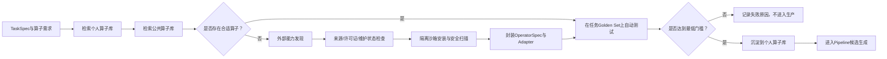

# 多模态数据智能生产平台 Agent 闭环设计方案

> 版本：v1.2
> 初版日期：2026-07-03  
> 更新日期：2026-07-06  
> 首期试点：人像摄影美学缺陷图片数据集  
> 实施约束：2–3 人，12 周，直接面向内部真实生产任务

## 1. 设计摘要

本方案建设的不是一个“能聊天的提数助手”，而是一套由训练目标驱动、能够持续迭代的数据生产控制平台。训练人员提出自然语言需求后，平台将需求转换为可验收的 `TaskSpec`，完成候选数据检索、清洗加工、数据选样、独立质检、版本冻结和训练评测；如果模型未达到目标，则根据失败样本和切片指标判断问题属于检索、数据加工、数据配比还是需求定义，并只返工受影响的环节。

平台采用以下总体原则：

1. 四个 Agent 是逻辑职责，不是四套独立服务。首期由一个 Agent Runtime 承载。
2. Agent 负责理解、判断和生成结构化 Plan，不直接执行不可控的数据操作。
3. Engine 根据 Plan 确定性执行检索、算子、采样、版本和训练任务。
4. 数据处理 Agent 负责设计清洗加工 Pipeline；独立 Evaluator 负责验收，二者分离。
5. Pipeline Optimizer 通过自动试跑、独立评测和多保真实验选择当前约束下的近似最优 Pipeline，而不是依赖大模型主观判断。
6. Loop Supervisor 只根据标准化失败原因路由反馈，不作为第五个自主 Agent。
7. 每次人工修改和自动迭代均产生新 `Revision`，不覆盖历史版本。
8. 首期深做图片闭环；文本、视频保留统一协议和基础 Pipeline，不承诺同等深度。
9. Agent 工作流采用 LangGraph 实现持久状态、条件路由和 HITL；用户权限、注册表、实验、数据任务和安全沙箱由平台控制面实现。
10. 对话、个人算子和个人 Pipeline 默认仅创建者可见；经过自动评测和单管理员审批后，才能发布到公共库。

## 2. 项目要解决的问题

### 2.1 当前流程

传统数据供应通常需要数据人员反复完成以下工作：

1. 与训练人员沟通并人工拆解模糊需求。
2. 根据经验决定到哪些库检索、使用哪些关键词和向量 Query。
3. 手工选择清洗、过滤、分类、去重算子，并决定 Pipeline 顺序。
4. 多次试跑和调阈值，人工判断各类数据是否够用。
5. 交付数据后等待训练结果，再由人分析失败样本。
6. 重新决定补什么、清洗什么、如何调整配比，然后再跑一轮。

每个项目都在重复“理解需求—拼 Pipeline—调参—分析失败—返工”的过程。数据团队主要被看作数据供应方，数据科学价值没有沉淀为可复用资产。

### 2.2 平台带来的变化

平台将人工经验沉淀为：

- 可执行、可验收的任务规格；
- 可注册、可评测、可版本化的算子；
- 可检索和受限改写的 Pipeline 模板；
- 数据集与模型切片评测集；
- 失败根因到返工节点的路由规则；
- 成功和失败实验的历史资产。

人的工作重点从反复拼接脚本，转为定义业务目标、处理语义歧义、审核高风险决策和判断最终价值。

## 3. 首期案例与口径

### 3.1 训练目标

训练人员希望训练“人像摄影美学缺陷识别模型”，识别人像照片中的构图、光线、背景、色彩和画质缺陷。

### 3.2 数据需求

四类场景各需要 5 万张：

1. 人物靠近栏杆；
2. 交通工具内部；
3. 人物佩戴眼镜；
4. 人物佩戴发饰。

共同约束包括：

- 图片短边不低于 1440px；
- 宽高比属于指定集合；
- 每张图片人物数不超过 3，优先单人；
- 人物主体面部和关键特征清晰可辨；
- 图片具有生活化、普通用户拍摄和明显美学缺陷；
- 排除专业摄影、艺术写真、证件照、明星照、广告图、自拍、美颜、滤镜和过度修图；
- 优先选择同时满足多个场景条件的图片。

### 3.3 必须先消解的歧义

需求规划 Agent 不应直接猜测以下口径，而应生成待确认项：

| 原始要求 | 问题 | 转换后的执行口径 |
|---|---|---|
| 动态模糊属于美学缺陷 | 与“主体清晰”可能冲突 | 允许背景或肢体轻度动态模糊，但脸部和关键配饰仍须可辨 |
| 人物距栏杆不超过 1 米 | 单张图片无法精确恢复物理距离 | 使用人物与栏杆接触、相邻或画面关系的视觉代理，并在 Golden Set 中校准 |
| 四类各 5 万 | 未说明多标签图片如何计数 | 同一图片可以同时计入多个类别配额，但交付 manifest 中只保留一个资产记录 |
| 仅限亚裔 | 涉及敏感属性和判定误差 | 必须合规审批；优先使用授权来源或地区元数据和人工复核，自动模型不作为唯一依据 |
| 无后期处理 | 单图难以绝对证明 | 采用编辑痕迹、滤镜/美颜检测和来源信息形成置信度，低置信度进入人工复核 |

这些口径经过训练人员和必要的合规人员确认后，才能冻结 `TaskSpec v1`。

## 4. 总体架构

```mermaid
flowchart LR
    U["训练人员"] --> WEB["个人工作台<br/>默认仅本人可见"]
    WEB --> AUTH["认证与 Owner 权限过滤"]
    AUTH --> RP["需求规划 Agent<br/>LangGraph"]
    RP --> TS["TaskSpec"]
    TS --> RA["检索 Agent"]
    RA --> RPLAN["RetrievalPlan"]
    RPLAN --> RE["检索 Engine"]
    RE --> RAW["原始候选池"]
    RAW --> CA["数据处理 Agent"]
    CA --> OR["优先检索<br/>个人/公共算子库"]
    OR -->|"能力不足"| OD["外部能力发现<br/>安全沙箱评测"]
    OD --> POR["个人算子库"]
    POR --> PC
    OR -->|"已有合适算子"| PC
    PC["3–10 个 PipelineCandidate"] --> PO["Pipeline Optimizer"]
    PO --> EXP["Experiment Manager<br/>逐级试跑与训练"]
    EXP --> PE["独立 Pipeline Evaluator"]
    PE --> PO
    PO --> CPLAN["最优 CurationPlan / PipelineRelease"]
    CPLAN --> CE["处理 Engine<br/>Data-Juicer/内部算子"]
    CE --> ENRICH["富化候选池"]
    ENRICH --> SA["数据策略 Agent"]
    SA --> SPLAN["SamplingPlan"]
    SPLAN --> SE["采样与深度加工 Engine"]
    SE --> DV["DatasetVersion"]
    DV --> QE["独立 Quality Evaluator"]
    QE --> QR["QCReport"]
    QR --> TE["训练评测 Engine"]
    TE --> MF["ModelFeedback"]
    MF --> LS["Loop Supervisor"]
    LS -->|"候选不足"| RA
    LS -->|"误过滤/漏过滤/标签问题"| CA
    LS -->|"分布/配额/难例问题"| SA
    LS -->|"目标或口径问题"| RP
    LS -->|"模型与数据均达标"| HITL["人工终验与发布"]
    HITL --> DEL["正式交付"]
    HITL --> PPR["个人 Pipeline Release"]
    PPR -->|"单管理员审批"| PUB["公共 Pipeline 库"]
```



### 4.1 分层职责

| 层级 | 主要职责 | 不负责 |
|---|---|---|
| 业务与人工层 | 提交目标、确认歧义、审批高风险修改、最终验收 | 日常拼接和重复执行 Pipeline |
| Agent 决策层 | 生成结构化 Plan、解释选择、提出返工建议 | 绕过 Schema、权限和审批直接改生产数据 |
| Engine 执行层 | 确定性执行检索、算子、采样、版本、训练和评测 | 自行修改业务目标 |
| 数据与模型资产层 | 保存引用、标签、版本、血缘、指标、反馈和交付物 | 将不可追溯的临时结果作为正式交付 |

### 4.2 为什么保留四个逻辑 Agent

单一 Agent 可以完成演示，但在长周期生产任务中会同时携带需求、检索、算子、采样和模型反馈上下文，容易出现职责混淆和不可审计修改。

四个逻辑 Agent 的必要性来自上下文和输出契约不同：

- 需求规划 Agent 面向业务语义和验收标准；
- 检索 Agent 面向数据源、Query 和召回覆盖；
- 数据处理 Agent 面向算子、阈值、顺序和加工成本；
- 数据策略 Agent 面向配额、多样性、难例和训练收益。

它们首期共享模型、进程和基础设施，只通过不同的上下文、工具权限和输出 Schema 实现逻辑隔离，因此不会引入四套服务的工程复杂度。

## 5. 核心组件设计

### 5.1 需求规划 Agent

**输入：**

- 训练人员自然语言需求；
- 模型任务类型、当前基线和目标；
- 历史同类 TaskSpec；
- 数据权限、预算和交付周期。

**输出：** `TaskSpec`

```yaml
task_id: portrait_aesthetic_defect_001
objective:
  model_task: portrait_aesthetic_defect_detection
  priority: [model_effect, data_quality, cost, latency, manual_effort]
hard_constraints:
  min_short_edge: 1440
  aspect_ratios: ["1:1", "2:3", "3:2", "3:4", "4:3", "9:16", "16:9"]
  max_person_count: 3
  face_must_be_identifiable: true
scene_quotas:
  near_railing: 50000
  vehicle_interior: 50000
  glasses: 50000
  hair_accessory: 50000
multi_label_counting: count_for_each_matched_quota
exclude:
  - professional_photography
  - art_portrait
  - id_photo
  - celebrity
  - advertisement
  - selfie
  - beauty_filter
acceptance:
  hard_rule_violation_rate: 0
  scene_precision_target: 0.95
  defect_precision_target: 0.90
human_review_required:
  - ambiguous_semantics
  - sensitive_attribute
  - target_change
```

### 5.2 检索 Agent

检索 Agent 不直接返回最终数据集，而是建立高召回候选池。

**主要工作：**

1. 将场景定义改写为多组正向 Query；
2. 生成负面排除 Query；
3. 选择关键词、标签、OCR、向量、相似图等召回路径；
4. 根据历史误检和漏检扩展或收紧 Query；
5. 估算每一路召回规模和成本；
6. 输出候选合并和初步去重规则。

**示例：**

```yaml
route: near_railing
positive_queries:
  - 游客照 人物 手扶 栏杆
  - 阳台 人像 生活照 原图
  - 天桥 护栏 行人 随手拍
  - 河边 护栏 人物
negative_queries:
  - 专业摄影
  - 艺术写真
  - 广告
  - 自拍
retrievers:
  - text_vector
  - image_vector
  - metadata_tag
  - ocr_tag
target_candidate_count: 220000
exclude_previous_failures: true
```

### 5.3 数据处理 Agent

数据处理 Agent 替代原设计中职责过窄的“质检 Agent”。它负责根据任务目标设计数据加工和清洗 Pipeline。

**输入：**

- `TaskSpec`；
- 候选池 Profiling；
- Operator Registry；
- 历史 Pipeline、参数和评测结果；
- 当前资源和预算。

**输出：** `CurationPlan`

```yaml
pre_sample:
  - decode_check
  - metadata_extract
  - resolution_filter
  - aspect_ratio_filter
  - person_count
  - face_visibility
  - face_clarity
  - image_embedding
  - scene_and_accessory_classification
  - aesthetic_defect_multilabel
  - professional_selfie_filter_detection
  - semantic_dedup
post_sample:
  - expensive_scene_verifier
  - fine_grained_glasses_classifier
  - edit_trace_verifier
  - burst_cluster_reduction
  - compliance_check
probe:
  ratio: 0.01
  compare_candidates: 3
```

处理采用两段式结构：

1. **采样前轻量富化：**在大候选池运行便宜的硬规则和基础模型，产生场景、缺陷、质量、置信度和向量标签；
2. **采样后深度加工：**只对入选数据运行昂贵分类器、精细去重、编辑痕迹检测和人工复核。

### 5.4 数据策略 Agent

数据策略 Agent 不负责图像清洗，而是决定从富化候选池中选哪些数据。

**主要约束：**

- 四类场景配额；
- 交通工具和配饰细分类别配额；
- 单人优先；
- 多场景重合优先；
- 无框和细框眼镜优先；
- 来源、背景、视觉风格和缺陷类型多样性；
- 连拍和近重复抑制；
- 模型不确定样本、失败样本近邻和困难样本优先；
- 训练集、验证集和测试集之间的相似图片隔离。

**输出：** `SamplingPlan`

```yaml
quota:
  near_railing: 50000
  vehicle_interior: 50000
  glasses: 50000
  hair_accessory: 50000
priority_weights:
  single_person: 1.3
  multi_scene_overlap: 1.2
  frameless_glasses: 1.5
  thin_metal_glasses: 1.4
diversity:
  max_per_burst_cluster: 2
  max_per_visual_cluster: 50
model_feedback:
  uncertain_sample_weight: 1.5
  failure_neighbor_weight: 1.8
```

### 5.5 独立 Quality Evaluator

Evaluator 不生成 CurationPlan，也不修改加工参数。它依据固定 TaskSpec、Golden Set 和评测规则回答“这批数据是否可以进入训练或发布”。

评测分为三层：

1. **硬规则全量检查：**分辨率、比例、文件有效性、人物数、重复等；
2. **模型和 Golden Set 评测：**场景、配饰、美学缺陷、专业图/自拍/滤镜识别的 Precision、Recall 和边界切片表现；
3. **分层人工抽检：**按场景、置信度、来源、失败类型和边界样本抽样。

Evaluator 输出：

- 是否通过；
- 各约束的统计结果；
- 失败样本 manifest；
- 失败原因码；
- 风险说明；
- 建议返工节点，但无权自行改变 TaskSpec。

### 5.6 Loop Supervisor

Loop Supervisor 是规则化路由器，不是独立自主 Agent。

```text
RETRIEVAL_GAP        -> 检索 Agent
PROCESSING_FALSE_NEG -> 数据处理 Agent
PROCESSING_FALSE_POS -> 数据处理 Agent
LABEL_QUALITY_ISSUE  -> 数据处理 Agent
DISTRIBUTION_GAP     -> 数据策略 Agent
HARD_SAMPLE_GAP      -> 数据策略 Agent，必要时级联检索 Agent
TARGET_CONFLICT      -> 需求规划 Agent + HITL
COMPLIANCE_RISK      -> HITL
TARGET_MET           -> 人工终验与发布
```

每次路由必须带上：

- 失败指标和阈值差距；
- 受影响的数据切片；
- 代表性失败样本；
- 推荐修改对象；
- 预计重跑范围和成本。

### 5.7 Pipeline Optimizer

Pipeline Optimizer 负责从数据处理 Agent 生成的多个候选 Pipeline 中自动选择当前约束下的近似最优方案。它不依赖大模型自评，而是调用 Experiment Manager 运行受控实验，再使用独立 Evaluator 的量化结果做选择。

它由四部分组成：

1. `Candidate Generator`：基于历史模板和算子白名单生成 3–10 个候选 Pipeline；
2. `Experiment Manager`：保证候选使用相同样本、随机种子、资源口径、训练模型和评测集；
3. `Independent Pipeline Evaluator`：计算模型效果、数据质量、成本、时延、失败率和人工量；
4. `Selection and Stopping Controller`：逐级淘汰候选，在继续搜索收益过小时停止。

“最优”定义为：

> 在固定任务、候选算子空间、数据规模、预算和评测集下，满足全部硬约束，并按照“模型效果、数据质量、成本、时延、人工工作量”逐级占优的 Pipeline。

平台不宣称找到数学意义上的全局最优解，而是保存搜索空间、实验记录和停止条件，使“当前近似最优”可解释、可复现。

## 6. 算子与 Pipeline 体系

### 6.1 OperatorSpec

每个算子至少包含：

```yaml
operator_id: vision.glasses_type
version: 1.0.0
modalities: [image]
input_schema: ImageAssetRef
output_schema: EnrichedImageAsset
parameters:
  confidence_threshold:
    type: number
    minimum: 0
    maximum: 1
resources:
  gpu: optional
metrics:
  - precision
  - recall
  - runtime_seconds
constraints:
  - requires_visible_face
adapter: internal_model
failure_policy: mark_unknown_and_continue
```

### 6.2 首批图片算子

| 类别 | 算子 |
|---|---|
| 文件与元数据 | `decode_check`、`metadata_extract`、`resolution_filter`、`aspect_ratio_filter` |
| 人物质量 | `person_count`、`face_visibility`、`face_clarity`、`occlusion_score` |
| 通用表征 | `image_embedding`、`semantic_dedup`、`burst_cluster` |
| 场景 | `rail_scene`、`vehicle_interior` |
| 配饰 | `glasses_type`、`hair_accessory` |
| 美学缺陷 | `aesthetic_defect_multilabel` |
| 排除项 | `professional_photo_filter`、`selfie_filter`、`beauty_filter_detect`、`ad_or_certificate_filter` |
| 评测与统计 | `distribution_profile`、`quota_check`、`slice_metrics` |

Data-Juicer 可复用的过滤、去重、统计和多模态处理能力通过 Adapter 接入；现有内部模型和脚本按同一 OperatorSpec 注册。平台不深度 Fork Data-Juicer，也不把其内部实现复制到控制面。

### 6.3 Pipeline 生命周期

```text
Template -> Candidate -> ProbeRun -> EvaluatedCandidate -> Release
```

- `Template`：已验证的流程骨架；
- `Candidate`：Agent 基于模板受限改写出的候选；
- `ProbeRun`：在 0.5%–2% 样本上试跑；
- `EvaluatedCandidate`：具有质量、成本、时延和风险指标；
- `Release`：人工批准、可被后续任务复用的正式版本。

失败候选也应保存，用于避免重复试错。

### 6.4 Pipeline 自动评测与计分

#### 6.4.1 多保真自动筛选

不需要人工逐个检查 Pipeline。系统采用逐级增加实验成本的方式筛选：

```text
数据处理 Agent 生成 10 个候选
-> Schema、权限、合规和预算检查
-> 使用 1% 数据试跑，自动淘汰到 3 个
-> Top 3 使用固定配置进行小规模训练，淘汰到 2 个
-> Top 2 进行更高保真训练和独立复验
-> Pipeline Optimizer 自动选择当前最优方案
-> 人工只审批全量执行或处理不确定情况
```

候选组合可使用历史模板检索和 Agent 受限改写；连续参数可使用网格搜索或贝叶斯优化；资源分配可使用 Successive Halving。首期只实现模板候选、有限参数搜索和逐级淘汰，不自研通用 AutoML 系统。

#### 6.4.2 第一层：硬约束

以下任一条件不满足，候选直接淘汰，不进入综合排序：

- 分辨率、宽高比、人物数和文件有效性要求；
- 场景配额具有可实现性；
- 权限、隐私和合规通过；
- 关键质量指标不低于最低门槛；
- 成本和时延不超过批准上限；
- Pipeline Schema 合法且必选算子没有被删除。

#### 6.4.3 第二层：模型效果分

所有进入模型实验的候选必须使用相同的数据量、模型、训练参数、评测集和资源预算。模型效果分建议定义为：

```text
ModelScore =
总体 F1 × 50%
+ 四类核心场景 Macro-F1 × 30%
+ 最差核心切片 F1 × 20%
```

最差切片被单独计入，避免总体指标掩盖无框眼镜、侧脸、反光或稀有交通场景的严重退化。

#### 6.4.4 第三层：数据质量分

```text
DataQualityScore =
场景准确率 × 30%
+ 美学缺陷标签准确率 × 25%
+ 有效数据率 × 15%
+ 稀有类型覆盖率 × 15%
+ 数据多样性 × 10%
+ 去重质量 × 5%
```

不能只优化 Precision。过于严格的 Pipeline 可能得到看起来很干净的数据，却错误删除大量困难样本，导致 Recall、稀有类型覆盖和最终模型效果下降。

#### 6.4.5 人像案例计分示例

候选定义：

- Pipeline A：规则过滤为主，阈值严格；
- Pipeline B：规则、专用模型和低置信度 VLM 复核结合；
- Pipeline C：大量使用 VLM 深度判断。

模型效果：

| Pipeline | 总体 F1 | 四类场景平均 F1 | 最差场景 F1 | ModelScore |
|---|---:|---:|---:|---:|
| A | 75.0 | 71.5 | 62.0 | 71.35 |
| B | 77.6 | 75.2 | 70.0 | 75.36 |
| C | 78.0 | 75.4 | 69.0 | 75.42 |

Pipeline B 的计算为：

```text
77.6 × 50% + 75.2 × 30% + 70.0 × 20% = 75.36
```

数据质量：

| 指标 | 权重 | A | B | C |
|---|---:|---:|---:|---:|
| 场景准确率 | 30% | 98 | 96 | 94 |
| 缺陷标签准确率 | 25% | 92 | 94 | 95 |
| 有效数据率 | 15% | 99 | 98.5 | 98 |
| 稀有类型覆盖率 | 15% | 65 | 88 | 92 |
| 数据多样性 | 10% | 72 | 86 | 90 |
| 去重质量 | 5% | 98 | 97 | 96 |
| `DataQualityScore` | — | 89.10 | 93.73 | 94.25 |

最终比较：

| Pipeline | ModelScore | DataQualityScore | 每 10 万张成本 | 时延 | 人工量 |
|---|---:|---:|---:|---:|---:|
| A | 71.35 | 89.10 | 800 元 | 5 小时 | 1.5 小时 |
| B | 75.36 | 93.73 | 1400 元 | 9 小时 | 2 小时 |
| C | 75.42 | 94.25 | 4200 元 | 24 小时 | 4 小时 |

自动选择过程：

1. A 的模型效果显著较差，淘汰；
2. B 与 C 的 ModelScore 只差 0.06 分；
3. 若多次训练置信区间重叠，或差异小于预先冻结的 0.5 分，则认为模型效果等价；
4. B 与 C 的 DataQualityScore 相差 0.52 分；若小于质量等价边界 1 分，则认为数据质量等价；
5. B 的成本和时延明显更低，因此自动选择 B。

如果 C 的模型效果稳定高出 B 2 分，且仍满足预算和时延硬约束，则按照“模型效果优先”选择 C。

#### 6.4.6 自动选择规则

最终选择采用逐级比较，不把所有目标粗暴混成一个加权总分：

```python
candidates = filter_by_hard_constraints(candidates)
model_best_group = group_within_best_model_margin(candidates, margin=0.5)
quality_best_group = group_within_best_quality_margin(model_best_group, margin=1.0)
selected = min(quality_best_group, key=(cost, latency, manual_effort))
```

模型实验应对 Top 2–3 候选运行多个随机种子，保存均值、方差和置信区间。用于调 Pipeline 的 `Optimization Validation Set` 与最终只使用一次的 `Final Holdout Set` 必须分离，避免 Pipeline 对评测集过拟合。

人工不需要逐个查看候选，只在以下情况介入：

- 首次冻结指标、等价边界和硬约束；
- 候选结果处于统计不确定区间；
- Evaluator 低置信度或不同指标存在业务冲突；
- 使用新算子、修改 TaskSpec 或超过预算；
- 最终全量执行和正式发布。

### 6.5 算子自动发现、测试与沉淀

数据处理 Agent 选择算子时必须遵循“内部优先、外部补充、先测后用”的顺序：



外部能力发现是数据处理 Agent 的受控子流程或工具，不新增第五个长期自治 Agent。首期只允许从配置好的可信来源检索元数据、模型卡和代码地址，不允许 Agent 将任意互联网代码直接放入生产环境。

#### 6.5.1 算子适用性评测

每个候选算子都必须在与当前任务匹配的 Golden Set 上评测：

| 类别 | 指标 |
|---|---|
| 识别质量 | Precision、Recall、F1、混淆矩阵 |
| 切片质量 | 侧脸、反光、遮挡、低光、目标过小等子集指标 |
| 工程能力 | 吞吐量、单万张成本、P95 时延、显存峰值 |
| 稳定性 | 超时率、失败率、重试后成功率 |
| 适用边界 | 支持的模态、输入尺寸、场景和已知限制 |

如果没有人工确认的 Golden Set，系统只能输出代理指标或弱标注一致性，不能声称得到了真实准确率和召回率。平台应优先从当前需求中选择少量高价值样本建立最小评测集，再决定是否继续引入该算子。

#### 6.5.2 外部算子的安全准入

外部算子进入个人库前必须完成：

1. 来源、维护状态和版本固定；
2. 开源许可证或服务使用条款检查；
3. 依赖、恶意代码和敏感网络访问扫描；
4. 在无生产凭证的隔离容器中安装；
5. 限制 CPU、GPU、内存、磁盘、网络和运行时间；
6. 使用脱敏 Golden Set 运行；
7. 生成输入输出样例、评测报告和失败样例；
8. 固化容器摘要、代码版本、模型权重版本和依赖锁文件。

Agent 自动生成代码形成的新算子也走相同流程，并额外要求人工代码审核。

### 6.6 个人算子库、公共算子库与晋升

首期采用两级算子库，不建设团队中间层：

```text
个人草稿
-> 个人测试版
-> 个人正式版
-> 申请公开
-> 单管理员审核
-> 公共正式版
-> 升级 / 废弃
```

默认规则：

- 新封装、新发现和新生成的算子均属于创建者个人；
- 个人算子的定义、代码、评测结果和样例默认仅创建者可见；
- 其他用户检索算子时，只能检索自己的个人库和公共库；
- 公共算子版本不可原地覆盖，更新必须生成新版本；
- 公共库算子用于新任务时仍需重新跑任务级 Golden Set；
- 公开申请、审批、撤回、废弃和升级均记录审计日志。

公共晋升由一名指定管理员审批。管理员检查：

- 来源和许可证；
- 安全扫描与容器摘要；
- 输入输出 Schema；
- Precision、Recall、成本、时延和稳定性；
- 成功、失败和边界样例；
- 适用范围与已知限制；
- 是否包含无权公开的数据或产物。

如果提交者本人也是唯一管理员，首期允许自审，但必须显示风险提示并保存不可删除的审批记录。

建议的算子元数据：

```yaml
operator_id: vision.glasses_classifier
owner_user_id: user_001
visibility: private
status: evaluated
source_type: external_model
source_url: https://example.org/model
license: apache-2.0
version: 1.0.0
container_digest: sha256:...
input_schema: ImageAsset
output_schema: GlassesLabel
benchmark:
  golden_set_version: glasses-v2
  precision: 0.96
  recall: 0.91
  p95_latency_ms: 42
limitations:
  - severe_occlusion
  - face_too_small
```

### 6.7 Pipeline 固化、检索与复用

经过自动实验并实际完成任务的 Pipeline 应固化为版本化资产：

```text
PipelineCandidate
-> EvaluatedPipeline
-> PersonalPipelineRelease
-> 申请公开
-> 单管理员审核
-> PublicPipelineTemplate
```

每个 Pipeline Release 保存：

- 适用任务、模态和 `TaskFingerprint`；
- 输入数据特征和适用边界；
- 算子顺序、版本、参数和条件分支；
- Golden Set、数据质量和模型效果；
- 成本、时延、失败率和人工量；
- 代表性成功、失败和边界样例；
- 数据处理前后的节点级样例；
- TaskSpec、人工修改和审批记录；
- 已知不适用场景。

`TaskFingerprint` 至少包含：

```text
任务类型
+ 模态
+ 业务场景
+ 数据规模
+ 硬约束
+ 质量目标
+ 模型目标
+ 数据画像
```

新需求到来后，需求规划 Agent 和数据处理 Agent 先执行：

```text
相似Pipeline检索
-> 硬约束过滤
-> 历史效果排序
-> Agent受限修改
-> 生成少量候选
-> 当前任务小样本复验
-> Pipeline Optimizer重新选优
```

历史成功 Pipeline 用于缩小搜索空间，不能替代当前任务评测。

### 6.8 算子与 Pipeline 能力中心

平台单独提供可检索的“能力中心”，帮助用户直观看到已经具备哪些能力以及做到什么程度。

#### 算子详情页

- 功能说明、适用任务和输入输出；
- 参数含义及建议范围；
- 处理前后样例；
- 正例、负例和边界样例；
- Precision、Recall、F1 和切片指标；
- 成本、时延、资源和稳定性；
- 来源、许可证、版本和所有者；
- 支持过的任务；
- 已知限制与失败样例。

#### Pipeline 详情页

- 适用需求和 TaskFingerprint；
- Pipeline 流程图和节点说明；
- 每个节点前后的数据样例；
- 数据质量、模型收益、成本和时延；
- 与其他 Pipeline 的对比；
- 可直接复用和允许修改的参数；
- 历史版本、成功任务和失败任务；
- 适用边界和复验要求。

个人能力页面只对所有者展示；公共页面只展示经过授权的脱敏样例。历史任务上的成功指标必须绑定具体版本、数据集和评测集，不能作为对所有新任务的能力承诺。

## 7. 完整案例：从首次提数到三轮迭代

### 7.1 第 0 步：训练人员创建工单

训练人员录入：

- 模型任务和当前基线；
- 四类数据及数量；
- 质量、排除和优先级要求；
- 预算和时间；
- 期望提升的总体和切片指标。

需求规划 Agent 生成 `TaskSpec draft`，指出歧义。训练人员确认后形成 `TaskSpec v1`。

### 7.2 第 1 步：生成检索计划

检索 Agent 为四类场景生成多路召回策略：

- 核心正面关键词；
- 场景和配饰扩展词；
- 负面排除词；
- 文本向量和图像向量 Query；
- 标签/OCR/元数据过滤；
- 历史误检样本排除；
- 召回量和成本预算。

检索 Engine 从现有百万级数据中召回约 70 万张唯一图片引用，形成 `CandidatePool v1`。

候选充分性检查回答：

- 每个一级和二级场景是否有足够候选；
- 候选是否过度集中于某些来源或视觉簇；
- 低频子类是否覆盖；
- 预计经过后续过滤后是否仍能满足配额。

候选不足时，不进入采样，而是返回检索 Agent 扩展召回。

### 7.3 第 2 步：候选加工和富化

数据处理 Agent 先检索当前用户个人算子库和公共算子库。假设已有分辨率、人数、清晰度、去重和场景分类算子，但现有眼镜细分类算子在侧脸和反光切片上的 Recall 只有 0.72，未达到 TaskSpec 最低门槛。

Agent触发受控外部能力发现：检索到若干候选模型，完成许可证和维护状态检查，在隔离沙箱中封装并使用相同 Golden Set 测试。一个候选达到 Precision 0.94、Recall 0.89，成本和时延满足上限，因此被沉淀为当前用户的个人算子 `vision.glasses_classifier:1.0.0`。其他未通过候选保留失败报告，但不进入算子库。

随后，数据处理 Agent 根据候选 Profiling 和可用算子生成 2–3 个 CurationPlan，在约 1% 样本上试跑。

独立 Evaluator 比较：

- 硬规则通过率；
- 场景和配饰识别 Precision/Recall；
- 美学缺陷判定准确率；
- 重复率；
- 单张处理成本和时延。

Experiment Manager 保证候选使用相同样本和资源口径，独立 Evaluator 自动计算指标，Pipeline Optimizer 根据模型效果、数据质量、成本、时延和人工量逐级选择候选。人工不逐个查看 Pipeline，只在统计结果不确定、使用新算子、超过预算或准备全量运行时介入。

全量轻量加工后，约 31 万张图片进入 `EnrichedCandidatePool v1`。

### 7.4 第 3 步：策略选数和数据验收

数据策略 Agent 生成 SamplingPlan：

- 四类场景各 5 万；
- 单人、多场景重合优先；
- 无框和细框眼镜提高权重；
- 控制来源、背景、缺陷和视觉簇分布；
- 限制同一连拍簇样本数。

采样与深度加工 Engine 生成预发布数据集。独立 Evaluator 全量检查硬规则，并基于 Golden Set 和分层人工抽检生成 `QCReport v1`。

假设四类配额均满足，但多标签图片跨类别计数，则冻结：

```text
Dataset v1
├─ 类别配额：4 × 50,000
├─ 唯一图片：约 172,000
├─ 数据 manifest
├─ QCReport v1
├─ TaskSpec / Plan / Operator 版本
└─ 人工审批和成本记录
```

### 7.5 第 4 步：第一次训练

训练 Engine 使用冻结的训练配置和固定模型评测集训练，输出 `ModelFeedback v1`。

假设结果为：

1. 总体指标提升；
2. 无框眼镜在侧脸、反光场景识别较差；
3. 河边护栏与普通围墙混淆；
4. 模型对专业写真误报美学缺陷。

Loop Supervisor 路由：

| 失败现象 | 根因判断 | 返回节点 |
|---|---|---|
| 无框眼镜侧脸/反光失败 | 漏标、误过滤或细粒度算子能力不足 | 数据处理 Agent |
| 河边护栏与围墙混淆 | 特定困难样本不足 | 检索 Agent |
| 专业写真误报缺陷 | 需要加入对照 Hard Negative，改变原数据边界 | 需求规划 Agent + HITL |

### 7.6 第 5 步：第二轮定向补数

训练人员批准增加 2 万张专业人像对照样本后，生成 `TaskSpec v2`。

本轮只增量执行：

1. 检索河边、天桥等栏杆困难样本；
2. 检索专业人像 Hard Negative；
3. 调整眼镜分类器阈值并增加侧脸/反光精细算子；
4. 优先选择模型高不确定和失败样本近邻；
5. 只重跑受影响的数据切片。

通过独立验收后形成 `Dataset v2`，保留与 v1 的父子关系和差异 manifest。

### 7.7 第 6 步：第二次训练

`ModelFeedback v2` 显示：

- 无框眼镜、栏杆和专业人像误报显著改善；
- 交通工具内部样本被轿车场景主导；
- 公交、地铁和飞机子场景指标仍低。

该问题首先归因为分布和配额问题，返回数据策略 Agent。数据策略 Agent 将原“车内 5 万”拆为若干子场景配额。

如果某个子场景在富化候选池中数量不足，Loop Supervisor 再级联路由至检索 Agent，而不是让数据策略 Agent承担召回职责。

### 7.8 第 7 步：第三轮与正式交付

完成交通子场景召回和再平衡后形成 `Dataset v3`。固定训练方案重新训练并评测。

当以下条件同时满足时，进入人工终验：

- 数据硬约束和类别配额达标；
- 场景、美学缺陷和排除项抽检达标；
- 模型总体指标达到 TaskSpec；
- 关键失败切片达到门槛；
- 成本和时延未违反批准范围；
- 所有数据、Plan、算子、参数和人工修改可追溯。

最终交付：

- Dataset v3 和 manifest；
- 数据卡、分布和质量报告；
- Golden Set 版本；
- Pipeline、算子和参数版本；
- 三轮训练与切片评测结果；
- 失败样本簇和迭代记录；
- 人工审批、成本和时延报告。

本次任务验证通过的 Pipeline 固化为个人 `PipelineRelease`，保存 TaskFingerprint、算子版本、参数、指标和节点样例。用户可以申请将眼镜细分类算子和该 Pipeline 加入公共库；单管理员复验并审批后，其他用户的相似需求即可优先检索和复用，但仍需在新任务 Golden Set 上重新测试。

## 8. HITL 设计

### 8.1 默认阻塞的人工节点

- 需求歧义和不可观测约束；
- 敏感属性和合规决策；
- 新增算子、模型或可执行代码；
- 大规模全量运行前的候选 Pipeline 选择；
- 预算超限；
- TaskSpec 或训练目标变更；
- Golden Set 修改；
- 模型效果下降但仍准备交付；
- 正式发布。

### 8.2 可自动继续的节点

- 已批准算子的低风险参数调整；
- 幂等失败重试；
- 已通过模板的轻量 Profiling；
- 固定规则校验；
- 受控范围内的增量重跑；
- 低置信度样本进入待审核队列。

### 8.3 人工可执行操作

```text
approve
reject
edit TaskSpec
edit Plan
edit parameters
retry node
branch Revision
rollback
terminate
```

每次操作必须记录原因、操作者、时间、父版本和受影响范围。

## 9. Golden Set 建设

### 9.1 首期规模

建议建设约 3,000 张图片：

- 四类一级场景及全部关键子类；
- 正例、相似负例和边界例；
- 分辨率、比例、人数、遮挡、清晰度等硬规则边界；
- 轻度动态模糊与严重失焦；
- 普通随手拍与专业摄影；
- 原图、滤镜、美颜和明显后期；
- 单场景与多场景重合；
- 高置信度与低置信度样本。

### 9.2 标注流程

1. 先建立图文判定手册和正反例；
2. 关键标签进行双人标注；
3. 分歧样本由第三人或业务专家仲裁；
4. 允许标注 `uncertain`，不强行二选一；
5. 统计标注一致性并修订说明；
6. 冻结 Golden Set 版本；
7. 后续新增失败样本必须经过审核，不能直接污染固定评测集。

### 9.3 指标

| 层级 | 主要指标 |
|---|---|
| 算子层 | Precision、Recall、F1、阈值稳定性、单张成本、时延 |
| 数据集层 | 硬规则通过率、类别配额、重复率、来源/场景/缺陷分布、多样性、抽检准确率 |
| Agent 层 | TaskSpec 完整率、Plan Schema 合法率、算子选择合理率、可试跑率、反馈路由准确率 |
| 模型层 | 总体指标、关键切片指标、失败簇规模、不确定性、相对人工数据基线增益 |
| 工程层 | 任务成功率、检查点恢复率、重跑范围、成本、时延、人工耗时 |

建议初始门槛：

- 硬规则违例率为 0；
- 关键场景抽检准确率不低于 95%；
- 美学缺陷标签抽检准确率不低于 90%；
- Agent 生成的合法 Plan 经校验后可试跑率不低于 90%。

最终门槛应在第 1–2 周根据真实人工基线冻结。

## 10. 工程实现

### 10.1 部署形态

首期采用模块化单体：

- 一个轻量 Web Workbench；
- 一个 Python 控制面 API；
- 一个基于 LangGraph 的 Agent Runtime；
- 一个 PostgreSQL 元数据和状态库；
- 一个 Run Orchestrator；
- 一个受限的算子评测沙箱；
- 若干 Adapter；
- 复用现有对象存储、向量库、云道和训练评测链路。

不把原始数据搬入平台数据库，只保存 URI、版本、摘要、标签、统计、权限和血缘引用。

### 10.2 主要模块

| 模块 | 职责 |
|---|---|
| `identity` | 登录用户、角色、Owner上下文和授权策略 |
| `conversations` | 私有对话、LangGraph thread映射和消息引用 |
| `projects` | 项目、工单、成员和训练目标 |
| `specs` | TaskSpec、约束和验收标准 |
| `assets` | 数据引用、候选池、数据切片和 manifest |
| `operators` | 个人/公共 Operator Registry、版本、来源、指标和样例 |
| `operator_discovery` | 内部检索、外部发现、安全检查、沙箱评测和封装 |
| `pipelines` | 模板、候选、实验、自动计分、近似最优选择、Release 和 Plan |
| `promotions` | 算子/Pipeline公开申请、单管理员审批、撤回和废弃 |
| `catalog` | 算子和Pipeline能力说明、样例、指标和适用边界 |
| `runs` | Run/NodeRun、状态机、重试和检查点 |
| `evaluations` | Golden Set、QCReport、ModelFeedback |
| `reviews` | HITL、Revision、分支和回滚 |
| `deliveries` | 数据版本、报告和发布记录 |
| `audit` | 权限、操作和血缘审计 |

### 10.3 Adapter

```python
class OperatorAdapter:
    def validate(self, operator, inputs, params): ...
    def estimate(self, operator, inputs, params): ...
    def submit(self, run_context): ...
    def poll(self, external_run_id): ...
    def cancel(self, external_run_id): ...
    def collect(self, external_run_id): ...
```

首期 Adapter：

1. `VectorStoreAdapter`：现有向量库和标签检索；
2. `CloudJobAdapter`：提交、观察和恢复云道任务；
3. `DataJuicerAdapter`：调用可复用清洗、过滤、去重和统计能力；
4. `InternalModelAdapter`：调用内部视觉模型；
5. `InternalScriptAdapter`：封装历史脚本；
6. `TrainingEvalAdapter`：提交训练并回收 ModelFeedback。

### 10.4 Run 状态机

```text
DRAFT
-> VALIDATING
-> WAITING_APPROVAL
-> QUEUED
-> RUNNING
-> PAUSED / RETRYING
-> EVALUATING
-> COMPLETED / FAILED / CANCELLED
```

### 10.5 LangGraph 使用边界

采用方案 B：LangGraph 只作为 Agent 决策编排层，平台控制面仍是系统事实来源。

LangGraph 负责：

- 需求规划、算子检索、外部能力发现、候选生成、实验触发、选优和审批之间的状态流转；
- 条件路由、循环、子图和长流程状态；
- HITL 的暂停、恢复、修改和拒绝；
- Agent 运行的 checkpoint、回放和故障恢复；
- 四个逻辑 Agent 的上下文隔离。

平台控制面负责：

- 用户认证、Owner权限、项目角色和审计；
- WorkOrder、TaskSpec、Operator、Pipeline和DatasetVersion数据库；
- 大规模图片任务调度、资源和预算；
- Golden Set、Precision/Recall和模型效果计算；
- 外部代码沙箱、安全扫描和制品管理；
- 个人/公共算子库及单管理员审批；
- 数据集、报告和正式发布。

云道、Data-Juicer和内部执行系统继续承担大规模数据任务。不得把每张图片或每个算子执行都作为 LangGraph Agent 节点；LangGraph 节点只提交、查询和收集外部 Run。

推荐映射：

```text
LangGraph thread_id  <-> ConversationThread / WorkOrder
LangGraph checkpoint <-> Agent短期运行状态
PostgreSQL业务表      <-> 平台长期事实与正式版本
Run/NodeRun           <-> 外部确定性任务状态
```

LangGraph官方持久化机制适合线程级状态、HITL和故障恢复；`interrupt`可以暂停流程并在原线程恢复。但 `thread_id` 只是状态指针，不是权限凭证。参考：

- [LangGraph Persistence](https://docs.langchain.com/oss/python/langgraph/persistence)
- [LangGraph Interrupts](https://docs.langchain.com/oss/python/langgraph/interrupts)
- [LangGraph Subgraphs](https://docs.langchain.com/oss/python/langgraph/use-subgraphs)

### 10.6 私有对话与Owner权限

所有对话默认仅创建者可见。首期不实现用户主动共享对话。

```text
ConversationThread
├─ thread_id
├─ owner_user_id
├─ project_id
├─ langgraph_thread_id
├─ visibility = private
├─ created_at
└─ deleted_at
```

授权规则：

1. 后端认证中间件从登录凭证获得 `current_user_id`；
2. 创建对话时由服务端写入 `owner_user_id`，不接受客户端指定其他Owner；
3. 对话搜索、读取、更新、删除和创建Run都必须过滤 `owner_user_id = current_user_id`；
4. 消息、运行状态、日志、附件、样例和导出文件继承对话或工单Owner；
5. 普通用户无法通过猜测 `thread_id` 读取他人状态；
6. 管理员审计接口与普通对话接口分离，并记录每次审计访问；
7. LangSmith、日志平台和对象存储也必须配置相同的数据访问边界。

如果使用 LangGraph Agent Server，可以通过认证和授权钩子在创建线程时写入Owner元数据，并在读取和搜索时按Owner过滤；自托管环境不能依赖默认安全配置。参考[LangGraph认证与访问控制](https://docs.langchain.com/langsmith/auth)。

数据库层建议增加行级安全或统一Repository守卫，避免开发人员遗漏过滤条件。以下对象都必须带Owner或可追溯到Owner：

- ConversationThread；
- WorkOrder；
- personal Operator；
- personal Pipeline；
- Run和实验；
- 私有样例和评测报告。

### 10.7 首期 MVP 收敛策略：一体化 Processing Agent，内部可拆

完整平台不要求在第一天全部实现。首期应先验证“自然语言需求能否稳定转成可执行、可比较、可复用的数据处理 Pipeline”，而不是先建设完整平台外壳。

因此首期实现一个 **DataProcessingAgent MVP / Pipeline Feasibility Agent**。它可以临时承载自然语言交互、需求草案生成、数据与算子检索、Pipeline 候选生成、小样本试跑和基础报告，但内部必须保留未来可拆分边界。

首期 MVP 流程：

```text
自然语言需求
-> TaskSpec draft
-> 数据源 / 算子 / 历史 Pipeline 模板检索
-> 2–3 个 PipelineCandidate
-> 小样本试跑
-> RunReport / BasicEvalReport
-> 人工选择或确认
-> Pipeline 草案固化
```

首期可暂缓实现完整的四 Agent 拆分、自动 Pipeline Optimizer、完整训练闭环、公共算子市场、复杂权限工作台和自动外部能力发现。但以下结构化对象必须从第一天存在，不能只保存在对话上下文中：

- `TaskSpec`；
- `RetrievalPlan`；
- `OperatorSpec`；
- `PipelineCandidate`；
- `CurationPlan`；
- `RunReport`；
- `BasicEvalReport`。

这样做的目的是先压缩工程面，快速验证 Pipeline 可行性；同时避免 MVP 变成不可拆的大黑盒。后续拆分时，`RetrievalPlan` 可迁出为检索 Agent，`BasicEvalReport` 可升级为独立 Evaluator，人工选择可升级为 Pipeline Optimizer，`CurationPlan` 可继续作为数据处理 Agent 的正式输出契约。

### 10.8 djagent 复用边界

`data-juicer-agents` 可作为首期候选 Pipeline 生成能力来源，但不能成为平台核心抽象。平台核心对象、数据库模型、API 和审计记录均使用自有 Schema。

推荐接入方式：

```text
DataProcessingAgent MVP
-> CandidateGeneratorProvider
   -> DjAgentsProvider
   -> TemplateProvider
   -> RuleProvider
-> 平台自有 PipelineCandidate
```

`DjAgentsProvider` 只负责把 TaskSpec、数据画像、可用算子和约束转换为候选 Pipeline 建议，再通过反腐层映射为平台自有 `PipelineCandidate`。不得把 djagent 的 Session、TUI、私有 Plan 对象或运行时状态直接暴露到平台数据库和控制面。

为保证复用后不受 djagent 团队影响，必须满足：

- 生产环境使用内部锁定版本或内部镜像包，不自动跟随上游；
- 所有 `data_juicer_agents` 直接依赖只允许出现在 `DjAgentsProvider` 适配层；
- 删除 `DjAgentsProvider` 后，系统仍能依靠 `TemplateProvider` 或 `RuleProvider` 生成基础候选；
- 上游升级只能通过手工触发、契约测试和回归实验；
- 正式执行仍通过平台 `DataJuicerAdapter`、内部脚本 Adapter 或云道 Adapter，不由 djagent Session 直接执行生产任务；
- Agent 不负责最终自评，候选质量由小样本试跑报告和后续独立 Evaluator 判断。

首期可以用 djagent 加速自然语言到 Data-Juicer recipe 的探索，但平台要把它当作“可替换的候选生成 Provider”，而不是“数据生产平台的大脑”。

## 11. 异常和恢复

| 异常 | 处理 |
|---|---|
| Agent Plan 不符合 Schema | 自动约束修复一次；再次失败后转人工 |
| 非法算子或参数 | Constraint Checker 拒绝，不进入执行层 |
| 候选池不足 | 标记缺失切片并返回检索 Agent |
| 节点超时 | 根据算子策略重试，超过次数后暂停 |
| 部分批次失败 | 保存成功分片，只重跑失败分片 |
| 重复提交 | 使用幂等键返回已有 Run |
| 预算或资源超限 | 自动暂停并请求人工批准 |
| 数据质检失败 | 禁止冻结正式数据版本，按原因路由 |
| 模型效果下降 | 禁止自动发布，进入人工评审 |
| 人工修改 | 创建新 Revision，不覆盖历史 |
| 外部任务状态丢失 | 通过 external_run_id 对账并恢复 |
| 外部算子许可证不明确 | 禁止下载和注册，转人工确认 |
| 外部算子安全扫描失败 | 删除隔离制品并记录来源，不进入个人库 |
| 沙箱评测超时或资源异常 | 终止容器，保留日志和失败报告 |
| 算子没有可信Golden Set | 只记录代理指标，禁止宣称真实准确率和召回率 |
| 越权读取他人对话或个人资产 | 返回拒绝并产生安全审计事件 |
| 公共库版本被请求原地修改 | 拒绝修改，要求创建新版本和新审批 |

## 12. 测试方案

### 12.1 契约测试

- 所有 Plan 的 Schema、参数范围和必填字段；
- Operator 输入输出、幂等性和失败策略；
- Adapter 的 validate、submit、poll、cancel、collect；
- TaskSpec 强制节点不能被 Agent 删除。
- 个人/公共可见性、Owner字段和晋升状态机；
- 外部算子包、容器摘要、来源和许可证字段。

### 12.2 单元和集成测试

- Run 状态机合法迁移；
- 幂等重试、检查点和局部重跑；
- Revision、分支和回滚；
- 向量库、Data-Juicer、云道和训练链路 Adapter；
- 从工单到正式交付的端到端用例。
- LangGraph checkpoint、interrupt、恢复和平台Run状态对账；
- 两个用户之间的对话、个人算子、个人Pipeline和产物隔离；
- 个人资产申请公开、单管理员审批、版本升级和废弃；
- 外部算子在断网/限权沙箱中的安装、超时和清理。

### 12.3 Agent 评测

- 需求完整性和歧义发现率；
- 算子选择合法率；
- Pipeline 可执行率；
- 必选节点保留率；
- 失败原因路由准确率；
- 请求人工介入的时机是否合理。
- 是否优先检索个人库和公共库，再触发外部发现；
- 外部算子评测不达标时是否能够拒绝并解释原因；
- 是否会把代理指标错误描述为真实Precision/Recall。

### 12.4 数据和模型对照实验

设置三组：

1. 当前人工生产数据；
2. 平台首轮 Dataset v1；
3. 平台闭环迭代后的 Dataset v3。

固定模型、训练配置和评测集，对比：

- 模型总体和切片指标；
- 数据质量；
- Pipeline 设计和调参人工时长；
- 总成本和交付周期；
- 失败后定位与补数耗时。

## 13. 12 周实施计划

### 第 1–2 周：Pipeline 可行性 MVP 骨架

- 冻结试点需求和成功指标；
- 复盘 10–20 个历史任务，记录人工 Pipeline 设计、调参和返工耗时；
- 定义核心数据对象和 Plan Schema；
- 建立 DataProcessingAgent MVP 的最小自然语言入口；
- 实现 TaskSpec draft、RetrievalPlan、PipelineCandidate、RunReport 的落盘；
- 打通向量库、基础数据源和首批 Data-Juicer / 内部脚本 Adapter；
- 接入 TemplateProvider 和 RuleProvider，保证无 djagent 时仍能生成基础候选；
- 完成 Golden Set 判定手册和首批样本。

**验收：**用户可以用自然语言创建一个最小数据处理任务，系统能生成至少一条结构化 PipelineCandidate，并可引用候选数据提交小样本试跑。

### 第 3–4 周：一体化 Processing Agent 跑通小闭环

- 建立 Operator Registry；
- 实现个人/公共两级算子库和版本模型；
- 封装首批硬规则、场景、配饰、美学缺陷和去重算子；
- 接入 Data-Juicer 和内部脚本；
- 建立 Run/NodeRun 状态机和 DatasetVersion；
- 接入 DjAgentsProvider 作为可替换候选生成来源，并通过反腐层映射为平台自有 PipelineCandidate；
- 生成 2–3 个候选 Pipeline，并支持 0.5%–2% 小样本试跑；
- 输出 RunReport / BasicEvalReport，支持人工比较和选择。

**验收：**从自然语言需求到候选检索、Pipeline 生成、小样本执行、报告比较和人工选择形成闭环；删除 DjAgentsProvider 后，TemplateProvider 或 RuleProvider 仍可生成基础候选。

### 第 5–6 周：从一体化 MVP 拆出平台边界

- 实现 TaskSpec、RetrievalPlan、CurationPlan 和 SamplingPlan；
- 将检索逻辑从 Processing Agent 内部工具整理为可迁出的 Retrieval 模块；
- 接入历史模板检索和相似 Pipeline 检索；
- 让数据处理 Agent 优先检索个人/公共算子库；
- 实现受限算子选择和参数调整；
- 建立 Constraint Checker；
- 将人工比较报告的数据结构对齐未来 Pipeline Optimizer；
- 建立登录 Owner 上下文、私有对话数据模型和 WorkOrder / Run 映射。

**验收：**MVP 内部职责已经按 TaskSpec、RetrievalPlan、CurationPlan、SamplingPlan 和 RunReport 分层；Agent 输出均通过 Schema 校验，合法候选可试跑率达到阶段目标。

### 第 7–8 周：独立评测和模型反馈

- 完成约 3,000 张 Golden Set；
- 建立 QC Evaluator；
- 建立 Experiment Manager、Pipeline Optimizer、多保真试跑和逐级淘汰；
- 建立受限外部能力发现、许可证检查和隔离评测沙箱；
- 支持外部能力封装为个人OperatorSpec；
- 实现 ModelScore、DataQualityScore、统计等价边界和自动选择规则；
- 接入训练评测链路；
- 定义 ModelFeedback、失败样本簇和原因码；
- 跑通 v1 到 v2 的增量闭环。

**验收：**系统可以自动比较候选 Pipeline、选择当前近似最优方案；模型反馈可以自动路由到正确 Agent，并只重跑受影响节点。

### 第 9–10 周：HITL 和工作台

- 实现审批、拒绝、修改参数、修改 Plan、分支、回滚和节点重跑；
- 实现个人算子/Pipeline向公共库申请和单管理员审批；
- 展示候选 Pipeline、节点样本和评测结果；
- 实现轻量能力中心：算子详情页和Pipeline详情页；
- 生成数据卡、QC、训练和审计报告。

**验收：**人可在关键节点接管，任何修改均生成可追溯 Revision；个人资产默认私有，公共晋升均有评测和审批记录。

### 第 11–12 周：真实试点和加固

- 在数十万级候选数据上运行；
- 完成至少三轮数据—模型迭代；
- 进行失败恢复、并发、成本、权限和审计测试；
- 对比人工基线和平台方案；
- 固化部署、运维和演示材料。

**验收：**完成正式数据交付和量化试点报告。

## 14. 人员分工

### 2 人配置

- A：平台/数据工程——权限隔离、控制面、LangGraph状态对接、Adapter、Registry、沙箱、部署和观测；
- B：数据科学/Agent——Agent Plan、算子评测、Golden Set、Pipeline Optimizer、Evaluator、模型反馈和轻量工作台。

训练人员、业务 Owner 和合规人员按 HITL 节点参与，不计入核心开发人数。

### 3 人配置

- 平台工程：API、私有对话、LangGraph、权限、工作台和部署；
- 数据工程：Adapter、算子库、Pipeline库、沙箱、云道和规模化执行；
- 数据科学/Agent：四类 Agent、Evaluator、Golden Set、模型实验和闭环策略。

## 15. 成功标准

| 类别 | 12 周目标 |
|---|---|
| 主链路 | 图片任务从首次需求到三轮训练迭代和正式交付完整跑通 |
| Plan 质量 | Agent 合法 Plan 经约束校验后可试跑率不低于 90% |
| Pipeline 优化 | 候选 Pipeline 可自动试跑、计分、逐级淘汰，并输出可解释的最优选择依据 |
| 对话隐私 | 普通用户只能读取自己的对话、运行和私有资产，跨用户越权测试全部被拒绝 |
| 算子发现 | 无内部合适算子时，可从受信来源发现、隔离测试并沉淀至少1个个人算子 |
| 算子治理 | 新算子默认进入个人库；公共算子均具有单管理员审批、版本和评测报告 |
| 能力展示 | 算子和Pipeline均能查看说明、指标、版本、成功/失败样例和适用边界 |
| 人工效率 | Pipeline 设计、调参和反馈定位人工耗时下降不低于 30% |
| 可追溯性 | 正式交付 100% 可追溯到数据源、TaskSpec、Plan、算子、参数和审批 |
| 可靠性 | 可恢复故障不需要整批任务从头运行 |
| 数据科学价值 | 至少一个冻结的模型或关键数据质量指标显著优于人工基线 |
| 复用能力 | 形成至少 3 个可复用 Pipeline Template 和首批 Operator Registry |

“显著优于”必须在项目开始时冻结口径。若正式训练成本过高，可以用 Golden Set 和代理模型作为阶段指标，但不能将代理指标宣称为最终模型收益。

## 16. 首期边界与风险

| 风险 | 控制措施 |
|---|---|
| 图片、文本、视频同时深做导致失控 | 图片闭环做深，文本和视频只保证统一协议和基础链路 |
| Agent 生成不可执行方案 | 模板检索、白名单算子、结构化输出和 Constraint Checker |
| 数据处理 Agent 自己给自己打分 | 独立 Evaluator，固定 TaskSpec 和 Golden Set |
| 敏感属性判断产生合规和偏差风险 | 合规审批、来源元数据优先、人工复核、允许不确定 |
| HITL 变成人工瓶颈 | 只阻塞高风险和不可逆节点，低风险动作自动继续 |
| 全候选运行昂贵模型成本过高 | 两段式加工，先便宜富化、后对入选样本深处理 |
| 模型反馈无法归因到数据 | 固定训练方案、切片评测、失败簇、数据版本差异和对照实验 |
| 团队被 UI 和调度器拖慢 | 使用现成组件，模块化单体，复用云道和 Data-Juicer |
| 把LangGraph当成整个平台 | 仅用于Agent决策编排，业务事实、权限、实验和任务仍由控制面管理 |
| 仅通过thread_id做权限 | 服务端Owner过滤、数据库守卫、产物继承权限和越权测试 |
| Agent直接执行互联网代码 | 可信来源白名单、许可证检查、无凭证沙箱、资源限制和人工代码审核 |
| 外部能力发现范围过大 | 首期只支持配置好的少量来源和统一封装流程，不做通用软件安装Agent |
| 能力中心泄露任务数据 | 个人样例仅Owner可见，公共页面只使用授权脱敏样例 |
| 公共库质量下降 | 单管理员审批、版本不可覆盖、任务级复验和废弃机制 |
| 新增范围挤压三个月主链路 | 能力中心只做详情和检索；对话不做共享；算子库只做个人/公共两级 |

## 17. 最终交付物

1. 可部署的图片数据智能生产平台 v0；
2. 需求规划、检索、数据处理、数据策略四类逻辑 Agent；
3. Pipeline Optimizer、Experiment Manager、Loop Supervisor 和独立 Evaluator；
4. 基于LangGraph的Agent决策图、checkpoint和HITL；
5. 私有对话、Owner权限、越权防护和审计；
6. TaskSpec、四类 Plan、DatasetVersion、QCReport、ModelFeedback 和 Revision Schema；
7. 个人/公共 Operator Registry、单管理员审批和首批图片算子；
8. 外部能力发现、许可证检查、隔离评测和个人算子沉淀；
9. 个人/公共 Pipeline Registry、相似模板检索和复验；
10. 算子/Pipeline能力中心及成功、失败和边界样例；
11. 向量库、云道、Data-Juicer、内部模型和训练评测 Adapter；
12. 人像摄影美学缺陷数据集 v1–v3；
13. Golden Set、数据卡、QC 和模型对照报告；
14. HITL 工作台、审计、分支和回滚能力；
15. 人工基线与平台闭环的效率、质量、成本和模型收益对比报告。

## 18. 一句话总结

平台以私有对话接收训练需求，由LangGraph编排四个逻辑Agent；数据处理Agent优先复用个人和公共算子，无合适能力时通过受控发现、沙箱评测沉淀个人算子，Pipeline Optimizer自动选择近似最优Pipeline，优秀算子和Pipeline经单管理员审批后进入公共库，独立Evaluator和模型反馈继续驱动数据闭环；训练人员只在目标、合规、不确定性和发布等关键节点保持最终控制权。
