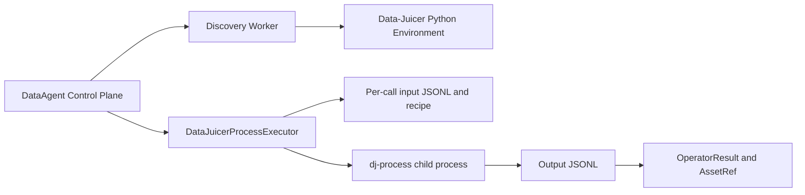

# DataAgent Data-Juicer Provider 实现说明

> 文档版本：v1.0  
> 日期：2026-07-17  
> 对应设计：`DataAgent-operator-provider-runtime-design-v1.0.md`

## 1. 当前能力

Data-Juicer Provider 已从元数据发现阶段推进到可执行阶段：

- DataAgent 控制面不直接导入 `py-data-juicer`；
- 使用指定的独立 Python 环境执行算子发现 Worker；
- 使用独立 `dj-process` 子进程执行算子；
- 支持 Provider 健康检查、目录发现、描述和严格参数校验；
- 支持 DataAgent 单图片输入到 Data-Juicer JSONL/recipe 的转换；
- 支持 Data-Juicer JSONL 输出到 DataAgent `OperatorResult`、`AssetRef` 和过滤决定的转换；
- 支持超时、取消、缺失命令、非零退出和非法输出的错误归一化；
- 支持 WorkOrder 数据源目录权限隔离；
- 当前只放行带 `cpu` 标签的 Data-Juicer Filter。

当前不放行：

- GPU、LLM 和模型 Filter；
- Mapper、Deduplicator 和其他会修改资产或依赖批数据语义的算子；
- 自动安装依赖或自动下载模型；
- 直接进入正式 Operator Registry 和生产 Pipeline。

## 2. 本机配置

本机配置保存在被 Git 忽略的 `dataagent.local.env`：

```env
DATAAGENT_DATAJUICER_ENABLED=true
DATAAGENT_DATAJUICER_PYTHON=D:\DataAgent\data-juicer-agents\.venv\python.exe
DATAAGENT_DATAJUICER_PROCESS_BIN=D:\DataAgent\data-juicer-agents\.venv\Scripts\dj-process.exe
DATAAGENT_DATAJUICER_TIMEOUT_SECONDS=300
DATAAGENT_ALLOW_MODEL_DOWNLOAD=false
```

可提交的配置模板为 `dataagent.local.env.example`。

## 3. 进程边界



发现 Worker 只输出 JSON 元数据，不把 Data-Juicer 的类、模型对象或依赖带回控制面。执行器使用参数数组启动命令，`shell=False`，recipe 路径可以包含空格。

## 4. 输入输出转换

单图片输入记录：

```json
{
  "_dataagent_asset_id": "stable execution id",
  "images": ["D:\\images\\sample.png"],
  "text": "<__dj__image>"
}
```

recipe 使用显式本地数据源，避免 Data-Juicer 1.5.x 将 Windows 绝对路径误判为 Hugging Face 数据集：

```yaml
dataset:
  configs:
    - type: local
      path: D:\runtime\input.jsonl
      weight: 1.0
export_path: D:\runtime\output.jsonl
np: 1
executor_type: default
process:
  - image_shape_filter:
      min_width: 1
```

输出 JSONL 包含对应记录时返回 `decision=continue`；输出为空时返回：

```text
decision=reject
reason_codes=[DATAJUICER_FILTERED_OUT]
```

完整输出 JSONL 作为 `application/x-ndjson` 类型的 `AssetRef` 保存，并记录 SHA256。

## 5. 离线与依赖安全

当 `DATAAGENT_ALLOW_MODEL_DOWNLOAD=false` 时，执行器设置：

- `HF_HUB_OFFLINE=1`；
- `TRANSFORMERS_OFFLINE=1`；
- `DATASETS_OFFLINE=1`；
- `UV_OFFLINE=1`；
- `PIP_NO_INDEX=1`；
- `PIP_DISABLE_PIP_VERSION_CHECK=1`。

此外，执行目录注入临时 `sitecustomize.py`，覆盖 Data-Juicer `LazyLoader._install_package`。缺少依赖时必须快速失败，不得自动调用 uv 或 pip 修改 Provider 环境。

真实联调首次暴露出 Data-Juicer CPU 图片算子会尝试自动安装 Torch；该行为现已被上述策略阻止。联调期间外部 Data-Juicer 环境已安装 CPU Torch 2.13.0，但没有下载任何模型权重。

## 6. 控制面接口

### Provider 健康状态

```http
GET /api/operator-providers
X-Owner-ID: local-user
```

### 检索算子

```http
GET /api/operator-providers/datajuicer/operators?query=shape
X-Owner-ID: local-user
```

### 执行 CPU Filter

```http
POST /api/work-orders/{work_order_id}/operator-providers/datajuicer/execute
X-Owner-ID: local-user
Content-Type: application/json

{
  "provider_operator_ref": "image_shape_filter",
  "source_path": "D:\\images\\sample.png",
  "runtime_backend": "cpu",
  "parameters": {
    "min_width": 1024,
    "min_height": 768
  }
}
```

`source_path` 必须属于该 WorkOrder 已确认 TaskSpec 的 `local_directory` 数据源，否则返回 HTTP 403。

## 7. 验证结果

本机环境：

- `py-data-juicer==1.5.3`；
- 发现 217 个算子；
- `image_shape_filter` 元数据、默认参数和 CPU 标签读取成功；
- 最小宽高为 1 时真实图片返回 `continue`；
- 最小宽度为 99999 时同一图片返回 `reject / DATAJUICER_FILTERED_OUT`；
- 输出 JSONL 和 SHA256 ArtifactRef 生成成功；
- DataAgent 完整测试：41 passed。

## 8. 下一阶段

1. 将经过准入的 Data-Juicer Filter 转换为正式、版本化的 Provider Proxy Operator；
2. 为批量语义实现 Dataset 级 Provider 调用，再接入 Deduplicator；
3. 将进度事件、取消检查和 stdout/stderr 摘要写入 RunStore；
4. 为 CPU 算子建立 Golden Set 和性能基线；
5. 在独立 GPU Worker 中评测模型算子，完成许可证、revision 和 SHA256 后再申请发布。
