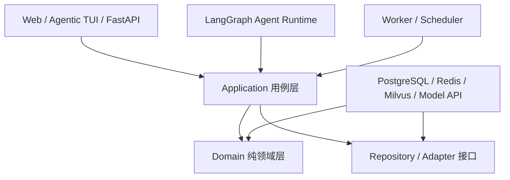
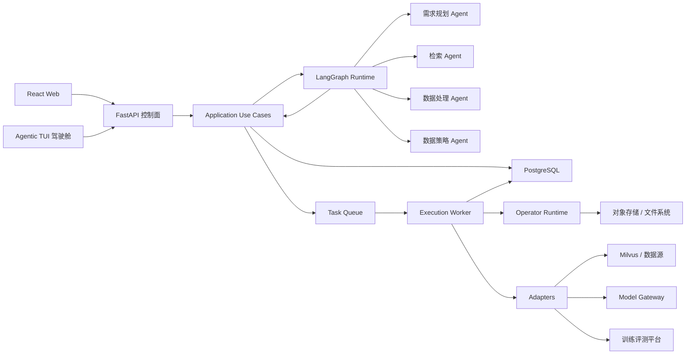
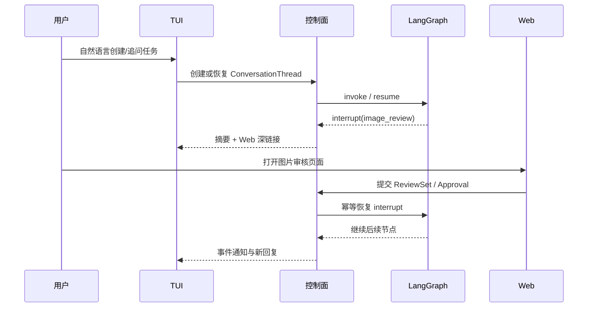

# DataAgent 代码与仓库架构设计

> 文档版本：v1.1（算子实现与模型运行策略补充稿）  
> 日期：2026-07-17  
> 对应产品文档：`DataAgent-final-PRD-v1.0.md`  
> 架构形态：模块化单体控制面 + LangGraph Agent Runtime + 独立执行 Worker

## 1. 架构目标

DataAgent 的代码架构需要同时满足：

1. 支持需求规划、检索、数据处理、数据策略四个专业 Agent；
2. 使用 LangGraph 编排四 Agent 子图、循环、HITL 和恢复；
3. Agent 只生成结构化决策，确定性 Engine 执行数据任务；
4. TaskSpec、Pipeline、算子、数据集和反馈全部版本化；
5. 算子可按类别管理、检索、组合、评测和复用；
6. Pipeline 每一版都保存，并支持节点级图片前后预览；
7. API、Agentic TUI、Web、LangGraph 和 Worker 共用同一套业务规则；
8. 模型、数据库、队列、向量库和执行平台可以替换；
9. 初期保持模块化单体，不把四个 Agent 拆成四套微服务。

## 2. “纯领域模型，不依赖 API/LangGraph”是什么意思

### 2.1 定义

纯领域模型只表达 DataAgent 业务本身，不包含具体框架代码。

例如：

- 什么是 `TaskSpec`；
- 什么是 `PipelineVersion`；
- Pipeline 由哪些节点和边组成；
- 一个版本冻结后不能被覆盖；
- 哪些任务状态允许互相转换；
- 算子的输入输出必须兼容；
- DatasetVersion 必须能追溯到 PipelineVersion；
- TaskSpec 修改后，哪些实验结果会过期。

领域模型不应该知道：

- HTTP 请求、FastAPI Router 或状态码；
- LangGraph 的 `StateGraph`、node、checkpoint 或 `interrupt`；
- SQLAlchemy、PostgreSQL、SQLite 或具体表结构；
- Celery、Redis 或消息队列；
- Milvus SDK、百炼 API 或对象存储 SDK；
- React 页面如何展示。

### 2.2 一个反例

下面的写法把业务对象和 API、数据库耦合在了一起：

```python
@router.post("/pipelines/{pipeline_id}/publish")
def publish_pipeline(pipeline_id: str, db: Session):
    row = db.query(PipelineRow).get(pipeline_id)
    if row.status != "EVALUATED":
        raise HTTPException(400, "pipeline cannot be published")
    row.status = "RELEASED"
    db.commit()
```

“只有评测通过的 Pipeline 才能发布”是业务规则，但它被写在 FastAPI Router 和 SQLAlchemy 代码里。CLI、LangGraph 或后台任务如果也要发布 Pipeline，就可能复制一遍规则，最后产生不一致。

### 2.3 推荐写法

先在领域层表达业务规则：

```python
class PipelineStatus(StrEnum):
    CANDIDATE = "CANDIDATE"
    EVALUATED = "EVALUATED"
    RELEASED = "RELEASED"


@dataclass(frozen=True)
class PipelineVersion:
    id: str
    status: PipelineStatus
    evaluation_passed: bool

    def release(self) -> "PipelineVersion":
        if self.status != PipelineStatus.EVALUATED:
            raise DomainError("Only evaluated pipelines can be released")
        if not self.evaluation_passed:
            raise DomainError("Pipeline evaluation did not pass")
        return replace(self, status=PipelineStatus.RELEASED)
```

应用层调用领域规则并负责保存：

```python
class ReleasePipeline:
    def __init__(self, repository: PipelineRepository):
        self.repository = repository

    def execute(self, pipeline_id: str) -> PipelineVersion:
        pipeline = self.repository.get(pipeline_id)
        released = pipeline.release()
        self.repository.save(released)
        return released
```

FastAPI、CLI 和 LangGraph 都调用同一个应用用例：

```python
@router.post("/pipelines/{pipeline_id}/publish")
def publish_pipeline(pipeline_id: str, use_case: ReleasePipelineDep):
    return use_case.execute(pipeline_id)
```

这样更换 API、数据库或 LangGraph 不会改变业务规则。

### 2.4 依赖方向



关键约束：

- `domain` 不导入 `fastapi`、`langgraph`、`sqlalchemy`、`celery`、`pymilvus`；
- `agents` 和 `graph` 可以导入领域 Schema，但领域层不能反向导入 Agent；
- `infrastructure` 实现领域或应用层定义的接口；
- API 只做认证、参数转换、调用用例和响应转换，不承载核心业务规则。

## 3. 总体运行架构



### 3.1 控制面

负责：

- 用户、Owner 和项目权限；
- WorkOrder 和业务状态机；
- 正式 TaskSpec、Plan、Pipeline、Run 和 DatasetVersion；
- 版本、审批、审计和血缘；
- Agent 草案转正式版本；
- 任务提交、查询、取消和恢复。

### 3.2 LangGraph Runtime

负责：

- 四个 Agent 子图；
- 结构化 Plan 生成；
- 条件路由和循环；
- checkpoint、interrupt 和恢复；
- HITL 请求；
- Loop Supervisor 反馈路由。

不负责：

- 图片逐张处理；
- 正式业务对象的唯一存储；
- 权限系统；
- 大规模任务调度；
- 最终评测指标计算。

### 3.3 Execution Worker

负责：

- 将 Run 拆成 NodeRun 和 ShardRun；
- 调用算子；
- 保存节点结果和节点预览；
- 幂等、重试、暂停、恢复和取消；
- 资源、成本和超时控制；
- 调用外部 Adapter；
- 汇总执行结果。

### 3.4 Web 与 TUI 双入口

产品采用“Web 主界面 + TUI Agent 驾驶舱”，两者统一通过 FastAPI、事件流和应用用例访问控制面。



职责分工：

| 能力 | TUI | Web |
|---|---:|---:|
| 自然语言需求与追问 | 主入口 | 支持 |
| Agent 状态、摘要和诊断 | 主入口 | 支持 |
| 暂停、恢复、重试、取消 | 支持 | 支持 |
| 单张图片辅助查看 | 调用系统查看器 | 原生支持 |
| 图片网格和批量审核 | 深链接跳转 | 主入口 |
| 同图三 Pipeline 对比 | 摘要与跳转 | 主入口 |
| 节点前后滑块对比 | 不实现 | 主入口 |
| DAG、血缘和版本可视化 | 摘要与跳转 | 主入口 |

实现约束：

- Web 与 TUI 使用同一 `ConversationThread`、`WorkOrder` 和 LangGraph `thread_id`；
- 两个入口不得分别维护任务状态或复制业务规则；
- TUI 通过 SSE、WebSocket 或轮询订阅任务和 Agent 事件；
- Web 深链接包含对象 ID 和 UI 定位参数，但不包含长期凭据；
- Web 提交后由控制面创建 ReviewSet/Approval，再恢复 LangGraph；
- interrupt 恢复使用幂等键，避免 Web 和 TUI 重复提交；
- TUI 打开单图前由 API 签发短期授权 URL 或受控临时文件；
- 不把 Kitty、iTerm、Sixel 等内嵌图片协议作为核心依赖；
- 特定终端图片协议可由插件扩展，但不承担正式批量审核。

## 4. 推荐仓库结构

```text
newDataAgent/
├─ apps/
│  ├─ api/                              # FastAPI 控制面入口
│  │  ├─ main.py
│  │  ├─ dependencies.py
│  │  ├─ exception_handlers.py
│  │  └─ routers/
│  │     ├─ auth.py
│  │     ├─ work_orders.py
│  │     ├─ agents.py
│  │     ├─ task_specs.py
│  │     ├─ pipelines.py
│  │     ├─ operators.py
│  │     ├─ experiments.py
│  │     ├─ runs.py
│  │     ├─ datasets.py
│  │     ├─ reviews.py
│  │     ├─ approvals.py
│  │     └─ audit.py
│  │
│  ├─ worker/                           # Celery/后台 Worker 入口
│  │  ├─ main.py
│  │  ├─ lifecycle.py
│  │  └─ tasks/
│  │     ├─ execute_pipeline.py
│  │     ├─ execute_operator.py
│  │     ├─ generate_previews.py
│  │     ├─ evaluate_dataset.py
│  │     └─ collect_training.py
│  │
│  ├─ tui/                              # 自然语言驱动的 Agentic TUI
│  │  ├─ main.py
│  │  ├─ app.py
│  │  ├─ session.py                     # ConversationThread/事件同步
│  │  ├─ api_client.py
│  │  ├─ event_stream.py
│  │  ├─ deep_links.py
│  │  ├─ image_opener.py                # 调用系统查看器打开授权单图
│  │  ├─ rendering/
│  │  │  ├─ conversation.py
│  │  │  ├─ status.py
│  │  │  ├─ plans.py
│  │  │  └─ diagnostics.py
│  │  └─ commands/
│  │     ├─ task.py
│  │     ├─ run.py
│  │     ├─ review.py
│  │     ├─ pipeline.py
│  │     └─ operator.py
│  │
│  ├─ cli/                              # 非交互管理、迁移和诊断 CLI
│  │  ├─ main.py
│  │  └─ commands/
│  │
│  └─ web/                              # React + TypeScript 工作台
│     ├─ src/
│     │  ├─ pages/
│     │  ├─ features/
│     │  ├─ components/
│     │  ├─ api/
│     │  └─ routes/
│     └─ package.json
│
├─ dataagent/
│  ├─ domain/                           # 纯领域模型和业务规则
│  │  ├─ common/
│  │  │  ├─ errors.py
│  │  │  ├─ ids.py
│  │  │  ├─ versioning.py
│  │  │  └─ events.py
│  │  ├─ identity/
│  │  ├─ work_orders/
│  │  ├─ specs/
│  │  ├─ assets/
│  │  ├─ operators/
│  │  ├─ pipelines/
│  │  ├─ experiments/
│  │  ├─ evaluations/
│  │  ├─ datasets/
│  │  ├─ training/
│  │  └─ revisions/
│  │
│  ├─ application/                      # 应用用例，协调领域对象和端口
│  │  ├─ ports/
│  │  │  ├─ repositories.py
│  │  │  ├─ unit_of_work.py
│  │  │  ├─ task_queue.py
│  │  │  ├─ artifact_store.py
│  │  │  └─ clock.py
│  │  ├─ work_orders/
│  │  ├─ specs/
│  │  ├─ pipelines/
│  │  ├─ operators/
│  │  ├─ experiments/
│  │  ├─ runs/
│  │  ├─ datasets/
│  │  └─ feedback/
│  │
│  ├─ agents/                           # 四个专业 Agent 子图
│  │  ├─ shared/
│  │  │  ├─ model.py
│  │  │  ├─ structured_output.py
│  │  │  ├─ context_builder.py
│  │  │  └─ tool_permissions.py
│  │  ├─ requirement/
│  │  │  ├─ state.py
│  │  │  ├─ prompts.py
│  │  │  ├─ nodes.py
│  │  │  ├─ tools.py
│  │  │  └─ graph.py
│  │  ├─ retrieval/
│  │  ├─ processing/
│  │  └─ strategy/
│  │
│  ├─ graph/                            # LangGraph 主图
│  │  ├─ state.py
│  │  ├─ context.py
│  │  ├─ main_graph.py
│  │  ├─ routing.py
│  │  ├─ interrupts.py
│  │  ├─ checkpoints.py
│  │  └─ loop_supervisor.py
│  │
│  ├─ optimizer/                        # Pipeline 内部变体优化
│  │  ├─ candidate_generator.py
│  │  ├─ experiment_manager.py
│  │  ├─ pipeline_evaluator.py
│  │  ├─ selector.py
│  │  └─ stopping.py
│  │
│  ├─ operators/                        # 算子实现和运行时
│  │  ├─ registry.py
│  │  ├─ protocol.py
│  │  ├─ runtime.py
│  │  ├─ validation.py
│  │  ├─ examples.py
│  │  ├─ categories.py
│  │  ├─ models/                       # 模型声明、缓存与后端管理
│  │  │  ├─ manifest.py                # ModelRequirement 与固定版本元数据
│  │  │  ├─ manager.py                 # 解析、许可检查、下载、校验与加载
│  │  │  ├─ cache.py                   # 缓存目录、版本共存与清理
│  │  │  ├─ locks.py                   # 并发下载和加载锁
│  │  │  └─ backends/
│  │  │     ├─ mock.py                 # 无模型、无 GPU 的开发后端
│  │  │     ├─ onnx.py                 # CPU/ONNX Runtime 后端
│  │  │     ├─ torch.py                # 本地 GPU 后端
│  │  │     └─ remote.py               # 远程推理服务 Adapter
│  │  ├─ builtin/
│  │  │  ├─ ingestion/                  # 扫描、解码、元数据
│  │  │  ├─ filtering/                  # 过滤与质量门禁
│  │  │  ├─ deduplication/              # 精确、感知、语义去重
│  │  │  ├─ understanding/              # 人像、美学、分割、水印、OCR、语义标签
│  │  │  ├─ transformation/             # 裁剪、缩放、格式转换
│  │  │  ├─ enhancement/                # 质量增强、修复、生成式编辑
│  │  │  ├─ sampling/                   # 随机、分层、聚类、难例采样
│  │  │  ├─ evaluation/                 # 质量、配额、切片和分布评测
│  │  │  └─ output/                     # Manifest、版本冻结、报告
│  │  ├─ external/                      # 外部算子封装
│  │  ├─ generated/                     # Agent 生成、待准入算子
│  │  └─ sandbox/
│  │     ├─ runner.py
│  │     ├─ policy.py
│  │     └─ scanner.py
│  │
│  ├─ execution/                        # 确定性执行层
│  │  ├─ orchestrator.py
│  │  ├─ run_state_machine.py
│  │  ├─ node_runner.py
│  │  ├─ shard_runner.py
│  │  ├─ recovery.py
│  │  ├─ idempotency.py
│  │  ├─ lineage.py
│  │  └─ preview/
│  │     ├─ builder.py
│  │     ├─ image_diff.py
│  │     └─ thumbnail.py
│  │
│  ├─ evaluation/                       # 独立评测实现
│  │  ├─ golden_sets.py
│  │  ├─ quality_evaluator.py
│  │  ├─ model_evaluator.py
│  │  ├─ slice_metrics.py
│  │  └─ reports.py
│  │
│  ├─ infrastructure/                   # 技术实现
│  │  ├─ database/
│  │  │  ├─ models.py
│  │  │  ├─ repositories.py
│  │  │  ├─ unit_of_work.py
│  │  │  └─ session.py
│  │  ├─ queue/
│  │  ├─ storage/
│  │  ├─ auth/
│  │  ├─ audit/
│  │  └─ observability/
│  │
│  └─ adapters/                         # 外部系统适配器
│     ├─ model_gateway.py
│     ├─ milvus.py
│     ├─ filesystem.py
│     ├─ object_storage.py
│     ├─ data_juicer.py
│     ├─ internal_scripts.py
│     └─ training_platform.py
│
├─ migrations/                          # Alembic 数据库迁移
├─ tests/
│  ├─ unit/
│  ├─ contract/
│  ├─ integration/
│  ├─ agent_eval/
│  ├─ security/
│  └─ e2e/
│
├─ deploy/
│  ├─ docker-compose.yml
│  ├─ Dockerfile.api
│  ├─ Dockerfile.worker
│  ├─ Dockerfile.sandbox
│  └─ env.example
│
├─ pyproject.toml
└─ README.md
```

## 5. 算子库分类设计

### 5.1 为什么需要分类

算子数量增加后，只按名称搜索会让用户难以理解和选择。算子分类需要同时服务：

- 用户浏览能力中心；
- 数据处理 Agent 检索算子；
- Pipeline 合法性校验；
- 同类算子评测和替换；
- 权限、安全、资源和成本管理。

分类不等于只能属于一个标签。每个算子有一个主类别，并可附加多个能力标签。

### 5.2 一级类别

| 代码 | 类别 | 说明 | 典型算子 |
|---|---|---|---|
| `INGESTION` | 接入与解析 | 发现资产、解码、读取元数据 | 文件扫描、解码检查、EXIF、格式识别 |
| `FILTERING` | 过滤 | 根据硬规则或质量条件保留/排除数据 | 分辨率、比例、模糊、亮度、文件损坏过滤 |
| `DEDUPLICATION` | 去重 | 识别相同、近似或语义重复数据 | SHA256、感知哈希、向量近重复、连拍簇 |
| `UNDERSTANDING` | 内容理解 | 对内容、主体、场景和语义进行检测与标注 | OCR、分类、目标检测、VLM 判定、语义打标 |
| `TRANSFORMATION` | 确定性加工 | 可复现地改变图片或数据格式 | 裁剪、缩放、旋转、格式转换、颜色调整 |
| `ENHANCEMENT` | 增强与修复 | 改善质量或生成派生产物 | 去噪、超分、修复、增强、生成式编辑 |
| `SAMPLING` | 采样与选数 | 从候选池中选择数据 | 随机、分层、聚类、配额、难例采样 |
| `EVALUATION` | 评测与统计 | 检查质量、分布和任务目标 | 配额检查、切片指标、多样性、质量报告 |
| `OUTPUT` | 输出与版本 | 生成交付物和冻结版本 | Manifest、数据卡、版本冻结、报告导出 |

### 5.3 二级类别建议

```text
INGESTION
├─ file_discovery
├─ decoding
├─ metadata_extraction
└─ source_mapping

FILTERING
├─ file_integrity
├─ resolution_and_format
├─ image_quality
├─ content_rule
├─ semantic_rule
└─ compliance_rule

DEDUPLICATION
├─ exact_duplicate
├─ perceptual_duplicate
├─ semantic_duplicate
├─ burst_cluster
└─ cross_split_leakage

UNDERSTANDING
├─ ocr
├─ classification
├─ object_detection
├─ segmentation
├─ face_and_person
├─ watermark_detection
├─ scene_understanding
├─ aesthetic_understanding
└─ vlm_judgement

TRANSFORMATION
├─ crop
├─ resize
├─ rotate
├─ color_transform
├─ format_conversion
└─ annotation_conversion

ENHANCEMENT
├─ denoise
├─ deblur
├─ super_resolution
├─ restoration
├─ augmentation
└─ generative_editing

SAMPLING
├─ random_sampling
├─ stratified_sampling
├─ cluster_sampling
├─ quota_sampling
├─ diversity_sampling
├─ uncertainty_sampling
└─ hard_example_sampling

EVALUATION
├─ hard_constraint_check
├─ semantic_quality
├─ distribution_profile
├─ diversity_metric
├─ slice_metric
├─ model_effect
└─ cost_and_latency

OUTPUT
├─ manifest
├─ data_card
├─ dataset_freeze
├─ report_export
└─ lineage_export
```

### 5.4 算子元数据

```python
class OperatorCategory(StrEnum):
    INGESTION = "INGESTION"
    FILTERING = "FILTERING"
    DEDUPLICATION = "DEDUPLICATION"
    UNDERSTANDING = "UNDERSTANDING"
    TRANSFORMATION = "TRANSFORMATION"
    ENHANCEMENT = "ENHANCEMENT"
    SAMPLING = "SAMPLING"
    EVALUATION = "EVALUATION"
    OUTPUT = "OUTPUT"


class OperatorSpec(BaseModel):
    operator_id: str
    version: str
    display_name: str
    summary: str
    description: str

    primary_category: OperatorCategory
    secondary_category: str
    capability_tags: set[str]

    input_schema: str
    output_schema: str
    parameter_schema: dict

    implementation_type: str
    model_requirement: ModelRequirement | None
    resource_requirements: dict
    failure_policy: str
    side_effects: list[str]
    limitations: list[str]

    owner_id: str
    visibility: str
    status: str
```

模型后端算子额外声明不可变的模型需求：

```python
class ModelRequirement(BaseModel):
    provider: str
    model_id: str
    revision: str
    source_uri: str
    sha256: str
    code_license: str
    checkpoint_license: str
    estimated_size_bytes: int
    supported_backends: set[Literal["mock", "cpu", "cuda", "remote"]]
    requires_explicit_license_acceptance: bool = False
```

### 5.5 分类与 Pipeline 约束

分类还可用于静态检查，例如：

- `INGESTION` 通常位于 Pipeline 前部；
- `OUTPUT` 通常位于尾部；
- `SAMPLING` 前需要已经存在可用于采样的标签或向量；
- `DEDUPLICATION.cross_split_leakage` 应在数据集拆分后运行；
- 生成式 `ENHANCEMENT` 必须写入新资产，不得覆盖原图；
- `EVALUATION` 不得修改生产数据；
- 一个过滤算子不能伪装成独立 Evaluator；
- Pipeline 的输入输出 Schema 必须沿 DAG 兼容。

### 5.6 算子实现分层与选择顺序

算子是稳定的业务能力契约，规则、传统 CV、专用模型和多模态大模型是可替换的实现后端。Planner 按以下顺序选择满足 TaskSpec、质量门槛和资源约束的最低成本实现：

```text
L0 确定性规则/编码
-> L1 传统 CV 或轻量 CPU 模型
-> L2 开源专用模型
-> L3 多模态大模型
-> L4 人工确认
```

- L0：解码、元数据、尺寸、格式、SHA256、pHash、裁剪、缩放和 Manifest 等确定性能力；
- L1：模糊度、亮度、对比度、黑边和其他 CPU 可稳定执行的视觉指标；
- L2：人脸检测与 embedding、美学评分、OCR、目标检测、分割和水印定位等成熟专用任务；
- L3：开放语义、长尾关系判断和专用模型低置信度复核；
- L4：敏感身份、关键合规、规则冲突和低置信度终验。

GitHub Star、社区评分和公开榜单只用于发现候选。正式选择还必须比较代码与权重许可证、训练数据限制、固定版本、权重哈希、真实 Golden Set 指标、维护状态、供应链风险、资源需求、吞吐、时延和置信度校准结果。

### 5.7 ModelManager 与延迟获取

模型权重不进入 Git 仓库，也不随 DataAgent 基础安装下载。`ModelManager` 只在 Execution Worker 实际执行模型算子时解析模型：

```text
OperatorRuntime.execute
-> ModelManager.resolve(ModelRequirement)
-> policy/license/resource preflight
-> cache lookup
-> optional download with progress event
-> revision and SHA256 verification
-> backend load and process-level reuse
-> inference
```

运行时支持：

```text
mock    无权重、无 GPU，返回确定性的协议级测试结果
cpu     传统 CV、轻量模型或 ONNX Runtime
cuda    本地 PyTorch/ONNX GPU Worker
remote  受控远程推理服务
```

关键约束：

- 默认开发配置为 `DATAAGENT_MODEL_MODE=mock` 和 `DATAAGENT_ALLOW_MODEL_DOWNLOAD=false`；
- 缓存根目录由 `DATAAGENT_MODEL_HOME` 配置，默认使用当前用户应用数据目录；
- 下载必须固定 revision、校验 SHA256、支持断点恢复并通过跨进程文件锁防止重复下载；
- 离线模式下缺少权重必须返回结构化错误，不允许隐式联网；
- 需要额外授权的 checkpoint 必须在控制面记录授权，不得静默接受许可；
- 下载、校验和加载进度写入 Run 事件，不占用 LangGraph State，也不阻塞 Web 或 TUI；
- 生产环境支持 `models list/pull/remove` 预拉取和清理，多个模型版本可并存；
- 模型实例按 Worker 进程和资源策略复用，不得按图片重复加载。

### 5.8 模型算子输入输出

图片、mask、embedding 和多文件产物不得直接写入 LangGraph State。算子协议使用类型化引用：

```python
class AssetRef(BaseModel):
    uri: str
    media_type: str
    sha256: str | None = None


class AnnotationRef(BaseModel):
    annotation_type: Literal["box", "mask", "keypoints", "label", "score"]
    payload_uri: str | None = None
    values: dict = Field(default_factory=dict)


class EmbeddingRef(BaseModel):
    vector_id: str
    model_version_id: str
    dimensions: int


class OperatorResult(BaseModel):
    artifacts: list[AssetRef] = Field(default_factory=list)
    annotations: list[AnnotationRef] = Field(default_factory=list)
    embeddings: list[EmbeddingRef] = Field(default_factory=list)
    metrics: dict[str, float] = Field(default_factory=dict)
    labels: dict[str, str] = Field(default_factory=dict)
    decision: str | None = None
    reason_codes: list[str] = Field(default_factory=list)
    confidence: float | None = None
    model_version_id: str | None = None
```

大对象只保存 URI、对象 ID 和校验信息，Run、NodePreviewSet 和血缘记录引用这些对象。

### 5.9 代表性能力组合

下表中的模型是首批候选后端，不是写入 TaskSpec 或 Pipeline 业务契约的固定依赖。接入前仍需完成许可证和任务级评测。

| 能力 | 候选后端 | 算子职责 |
|---|---|---|
| `face_and_person` | SCRFD/ArcFace/InsightFace 或经许可的等价实现 | 检测人脸、生成 embedding，并通过独立的授权身份库 Adapter 进行 ID 匹配；必须支持 `unknown`，记录匹配阈值、模型和身份库版本 |
| `aesthetic_understanding` | LAION Aesthetic Predictor 或业务数据微调模型 | 只生成美学分数、维度分和置信度；下游 `FILTERING.semantic_rule` 根据任务阈值做保留决定 |
| `segmentation` | SAM 2；文字指定目标时使用 Grounding DINO + SAM 2 | 生成 mask、类别、区域和置信度引用；使用 mask 改图由 `TRANSFORMATION` 或 `ENHANCEMENT` 完成 |
| `ocr` | PaddleOCR 或经任务评测的等价 OCR 后端 | 输出文字区域、内容、语言和置信度，不直接决定图片是否保留 |
| `watermark_detection` | OCR、检测/分割模型、已知隐形水印协议 detector 的组合 | 区分可见文字、Logo/半透明和已知隐形水印；识别结果与过滤决定分离 |

Processing Agent 必须根据 `TaskSpec.required_capabilities`、输入输出 Schema、Operator Registry 状态、资源和许可动态选择算子及后端，不得硬编码固定算子 ID。理解算子负责产生事实，过滤算子负责业务决策，独立 Evaluator 负责验收。

## 6. 算子描述与支持样例

### 6.1 算子详情

每个算子版本必须展示：

- 一句话说明；
- 详细能力描述；
- 主类别、二级类别和能力标签；
- 适用和不适用场景；
- 输入、输出和参数说明；
- 可能副作用；
- 资源、成本和时延；
- 质量指标和切片指标；
- 来源、许可证、安全结果和版本；
- 支持过的任务和实际采用情况。

### 6.2 OperatorExampleSet

```python
class OperatorExample(BaseModel):
    operator_version_id: str
    example_type: Literal[
        "success",
        "failure",
        "boundary",
        "before_after",
    ]
    source_asset_id: str
    input_preview_uri: str
    output_preview_uri: str | None
    labels_before: dict
    labels_after: dict
    decision: str | None
    score: float | None
    explanation: str
    task_id: str
    pipeline_version_id: str
    run_id: str
    evaluation_id: str
```

样例必须来自真实 Run，并绑定具体算子版本和评测结果。算子升级后，旧样例留在旧版本下，新版本需要重新生成或复验样例。

### 6.3 支持过的任务

算子详情应展示：

```text
任务类型
数据切片
处理规模
使用参数
成功率 / 质量指标
成本和时延
是否进入最终 Pipeline
失败或不适用原因
```

这样用户可以通过历史事实理解算子，而不是只依赖技术描述。

## 7. Pipeline 版本与图片预览

### 7.1 每一版都保存

以下事件均创建新的不可变 `PipelineVersion`：

- Agent 首次生成；
- Optimizer 生成内部变体；
- 用户保存节点或参数修改；
- 小样本试跑；
- 根据边界样本审核调整；
- 全量执行前冻结；
- 模型反馈触发返工；
- 从历史版本回滚或创建分支。

`PipelineVersion` 不保存“指向当前算子”的可变引用，而是固定到具体 `OperatorVersion`、模型、参数和代码摘要。

```python
class PipelineVersion(BaseModel):
    id: str
    pipeline_family_id: str
    parent_version_id: str | None
    version: int
    strategy: Literal[
        "retention_first",
        "balanced",
        "quality_first",
    ]
    nodes: list[PipelineNode]
    edges: list[PipelineEdge]
    created_from: str
    created_by: str
    change_reason: str
    task_spec_version_id: str
    immutable: bool = True
```

### 7.2 节点级预览

每次 Pipeline 试跑完成后生成 `NodePreviewSet`：

```text
同一张图片
├─ 原始输入
├─ 节点 1 输入 / 输出 / 判定
├─ 节点 2 输入 / 输出 / 判定
├─ 节点 3 输入 / 输出 / 判定
└─ 最终图片或筛选结论
```

每个节点预览记录：

```python
class NodePreviewItem(BaseModel):
    pipeline_version_id: str
    node_id: str
    operator_version_id: str
    source_asset_id: str

    input_preview_uri: str
    output_preview_uri: str | None
    overlay_preview_uri: str | None

    metrics_before: dict
    metrics_after: dict
    labels_before: dict
    labels_after: dict

    decision: str
    reason_codes: list[str]
    confidence: float | None
    run_id: str
```

### 7.3 预览交互

用户需要能够：

- 原图与最终结果并排或滑块对比；
- 查看上一节点与当前节点的变化；
- 固定同一图片，在三条候选 Pipeline 中同步浏览；
- 比较任意两个 PipelineVersion 对同一图片的结果；
- 查看尺寸、格式、文件大小、标签和分数变化；
- 查看图片在哪个节点被删除以及具体原因；
- 过滤成功、失败、边界和随机样例；
- 从算子样例跳转到当时的 Pipeline 上下文。

对不修改像素的分类、检测和过滤算子，应使用标签卡、检测框、热力图或规则差异展示处理结果。

## 8. 四个 Agent 的代码框架

### 8.1 统一子图结构

四个 Agent 采用相同的代码骨架：

```text
state.py       # 当前子图状态
prompts.py     # 系统提示和任务模板
nodes.py       # LangGraph 节点实现
tools.py       # 该 Agent 被允许使用的工具
graph.py       # 子图节点、边、循环和 interrupt
```

统一执行协议：

```text
load_context
-> analyze
-> generate_plan
-> validate_schema
-> validate_constraints
-> persist_draft
-> request_approval_or_submit_run
-> collect_result
-> decide_next
```

### 8.2 需求规划 Agent

```text
agents/requirement/
├─ state.py
├─ prompts.py
├─ nodes.py
├─ tools.py
└─ graph.py
```

正式输出：`TaskSpecDraft`、`AmbiguityList`、`AcceptancePlan`。

### 8.3 检索 Agent

正式输出：`RetrievalPlan`、`CandidateSufficiencyReport`。

允许工具：数据源 Schema、Milvus 查询、历史 Query、CandidatePool 画像。

### 8.4 数据处理 Agent

正式输出：三类 Pipeline 候选、内部变体、`CurationPlan`。

允许工具：Operator Registry、Pipeline Registry、Experiment Manager、独立 Pipeline Evaluator。

### 8.5 数据策略 Agent

正式输出：`SamplingPlan`、`DistributionReport`。

允许工具：候选标签和向量、配额、聚类、Golden Set、ModelFeedback。

## 9. LangGraph 主图

```python
def build_main_graph(deps: GraphDependencies):
    graph = StateGraph(WorkOrderGraphState)

    graph.add_node("requirement_agent", deps.requirement_graph)
    graph.add_node("retrieval_agent", deps.retrieval_graph)
    graph.add_node("processing_agent", deps.processing_graph)
    graph.add_node("pipeline_optimizer", deps.pipeline_optimizer)
    graph.add_node("strategy_agent", deps.strategy_graph)
    graph.add_node("submit_dataset_run", deps.submit_dataset_run)
    graph.add_node("quality_evaluation", deps.quality_evaluator)
    graph.add_node("submit_training", deps.submit_training)
    graph.add_node("collect_feedback", deps.collect_model_feedback)
    graph.add_node("loop_supervisor", deps.loop_supervisor)
    graph.add_node("final_approval", deps.final_approval)

    # 根据正式版本、Run 结果、QCReport 和 ModelFeedback 路由。
    return graph.compile(checkpointer=deps.checkpointer)
```

主图只保存决策上下文和正式对象 ID，不把整批图片、Manifest 或大模型响应全文放进 LangGraph State。

```python
class WorkOrderGraphState(TypedDict):
    work_order_id: str
    owner_id: str
    task_spec_version_id: str | None
    retrieval_plan_version_id: str | None
    candidate_pool_version_id: str | None
    pipeline_version_ids: list[str]
    selected_pipeline_version_id: str | None
    sampling_plan_version_id: str | None
    dataset_version_id: str | None
    qc_report_id: str | None
    training_run_id: str | None
    model_feedback_id: str | None
    current_revision_id: str | None
    next_action: str
```

## 10. 应用层用例

API、TUI、CLI、LangGraph 节点和 Worker 不应直接操作 Repository，而是调用应用用例：

```text
CreateWorkOrder
GenerateTaskSpecDraft
ConfirmTaskSpec
CreateRetrievalPlan
SubmitRetrievalRun
CreatePipelineCandidates
RunPipelineExperiment
SelectRepresentativePipelines
SubmitBoundaryReviews
ApproveFullRun
ExecutePipelineVersion
GenerateNodePreviewSet
FreezeDatasetVersion
SubmitTrainingRun
ImportModelFeedback
CreateRevision
PromoteOperator
PromotePipeline
CreateWebDeepLink
CompleteHumanReview
ResumeAgentInterrupt
```

应用用例负责：

- 权限和当前状态检查；
- 加载领域对象；
- 调用领域规则；
- 通过端口提交外部任务；
- 在事务中保存正式版本和领域事件；
- 返回适合 API、Agent 或 Worker 使用的结果。

## 11. Repository 与 Adapter

### 11.1 Repository

Repository 面向领域对象：

```python
class PipelineRepository(Protocol):
    def get_version(self, version_id: str) -> PipelineVersion: ...
    def list_versions(self, family_id: str) -> list[PipelineVersion]: ...
    def save_version(self, version: PipelineVersion) -> None: ...
```

PostgreSQL 实现位于 `infrastructure/database/repositories.py`。测试可以使用内存实现，不需要启动数据库。

### 11.2 Adapter

Adapter 隔离外部系统差异：

```python
class ExecutionAdapter(Protocol):
    def validate(self, request: RunRequest) -> ValidationResult: ...
    def estimate(self, request: RunRequest) -> CostEstimate: ...
    def submit(self, request: RunRequest) -> ExternalRunRef: ...
    def poll(self, external_run_id: str) -> RunStatus: ...
    def cancel(self, external_run_id: str) -> None: ...
    def collect(self, external_run_id: str) -> RunResult: ...
```

具体实现包括 Milvus、文件系统、对象存储、内部脚本、Data-Juicer、模型服务和训练平台。

## 12. 数据库模块建议

主要表按领域拆分：

```text
identity
├─ users
├─ project_members
└─ sessions

work_orders
├─ work_orders
├─ conversation_threads
└─ approvals

specs_and_plans
├─ task_spec_versions
├─ retrieval_plan_versions
├─ curation_plan_versions
└─ sampling_plan_versions

operators
├─ operator_families
├─ operator_versions
├─ operator_categories
├─ operator_tags
├─ operator_example_sets
└─ operator_examples

pipelines
├─ pipeline_families
├─ pipeline_versions
├─ pipeline_nodes
├─ pipeline_edges
├─ pipeline_version_diffs
├─ node_preview_sets
└─ node_preview_items

execution
├─ runs
├─ node_runs
├─ shard_runs
└─ run_events

data_and_evaluation
├─ asset_refs
├─ candidate_pool_versions
├─ dataset_versions
├─ manifests
├─ golden_set_versions
├─ review_set_versions
├─ qc_reports
├─ training_runs
└─ model_feedback

governance
├─ revisions
├─ promotion_requests
└─ audit_events
```

## 13. 测试结构

```text
tests/
├─ unit/              # 纯领域规则、状态机、算子和选择规则
├─ contract/          # Agent Schema、Operator、Adapter 契约
├─ integration/       # PostgreSQL、Redis、Milvus、模型和存储
├─ agent_eval/        # 四 Agent 输出质量和路由正确性
├─ security/          # Owner、路径、Secret、沙箱和越权
└─ e2e/               # 从需求到模型反馈的完整闭环
```

重点测试：

- 领域层测试不启动 FastAPI、LangGraph 和数据库；
- 四 Agent 输出必须通过 Pydantic Schema；
- LangGraph checkpoint、interrupt、恢复和控制面状态对账；
- PipelineVersion 不可覆盖；
- 同一图片的节点预览和跨版本对比；
- 算子分类、输入输出兼容与 Pipeline 顺序约束；
- 算子样例必须绑定真实版本、Run 和评测；
- Mock 模式在无 GPU、无权重和禁止联网时完成模型算子端到端测试；
- 模型缓存命中、固定 revision、SHA256 失败、离线缺失和许可拒绝测试；
- 多 Worker 首次调用同一模型时只下载一次，并正确发布进度事件；
- 同一能力切换 Mock、CPU、CUDA 和远程后端时保持 Operator Schema 兼容；
- 生成算子沙箱与权限测试；
- 全链路 Owner 隔离。

## 14. 当前代码迁移建议

当前仓库是 CLI 原型，已有模块可按以下方式迁移：

| 当前文件 | 目标位置 |
|---|---|
| `dataagent/models.py` | 拆入 `domain/specs`、`domain/pipelines`、`domain/datasets` |
| `dataagent/service.py` | 拆为多个 `application` 用例，不保留巨型 Service |
| `dataagent/pipelines.py` | 拆入 `domain/pipelines`、`optimizer` 和内置算子 |
| `dataagent/imaging.py` | 拆为 `operators/builtin` 各类别算子 |
| `dataagent/gateway.py` | 迁入 `adapters/model_gateway.py` |
| `dataagent/milvus.py` | 迁入 `adapters/milvus.py` |
| `dataagent/store.py` | 替换为 Repository 接口与 PostgreSQL 实现 |
| `dataagent/cli.py` | 保留为调用应用用例的管理 CLI |

现有 CLI 不直接扩写成图片审核工具。应新建 `apps/tui` 作为 Agentic 交互入口；当前 Typer CLI 可保留为脚本化、运维和兼容入口。TUI 与 Web 均调用 FastAPI，不直接访问 SQLite/PostgreSQL。

推荐迁移顺序：

1. 建立 `domain`，迁移 TaskSpec、PipelineVersion、状态机和版本规则；
2. 建立 `application` 用例和 Repository 接口；
3. 将图片函数拆成分类算子并建立 Operator Registry；
4. 建立 ModelRequirement、ModelManager、MockBackend 和类型化产物引用；
5. 让 Processing Agent 按能力、Schema、资源和许可动态选择算子，不再硬编码固定算子 ID；
6. 建立 PipelineVersion、OperatorExampleSet 和 NodePreviewSet；
7. 接入 FastAPI 和 PostgreSQL；
8. 建立四 Agent 子图和 LangGraph 主图；
9. 将任务执行迁入 Worker；
10. 接入独立 Evaluator、训练反馈和闭环路由；
11. 完成 Web 工作台、图片版本预览和批量审核；
10. 完成 Agentic TUI、事件同步、Web 深链接与 interrupt 恢复。

## 15. 架构约束总结

1. 领域层不依赖 FastAPI、LangGraph、SQLAlchemy、Celery 和外部 SDK。
2. 四 Agent 是四个 LangGraph 子图，不是四个微服务。
3. LangGraph 只编排决策，不执行图片级任务。
4. API、Agent、TUI、CLI 和 Worker 必须调用统一应用用例。
5. 算子按主类别、二级类别和能力标签组织。
6. 每个算子版本必须有真实支持样例和历史任务证据。
7. Pipeline 每次生成、保存、试跑、修改和执行都产生不可变版本。
8. 每个试跑 PipelineVersion 必须生成节点级图片预览。
9. 正式状态和版本以控制面数据库为准，LangGraph checkpoint 不是业务事实。
10. 外部系统通过 Adapter 接入，平台核心不依赖单一供应商或执行框架。
11. Web 与 TUI 共用同一 WorkOrder、ConversationThread、LangGraph thread 和权限上下文。
12. TUI 负责对话、诊断和控制；图片对比与批量审核通过 Web 深链接完成。
13. TUI 单图查看仅为辅助，不将终端内嵌图片协议作为核心产品依赖。
