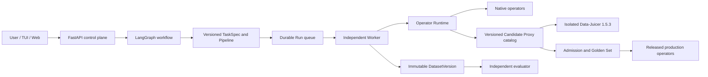

# DataAgent 开发交接文档 v2

> 交接日期：2026-07-18
> 仓库：`D:\newDataAgent`
> 当前分支：`agent/core-architecture`
> 已提交基线：`dc5bbe8 feat: add versioned Data-Juicer batch proxies and operator governance`
> 当前状态：分支相对远端 `ahead 2`，本轮完整目录、Candidate Proxy 和模型路由代码尚未提交
> 文档用途：不依赖聊天记录即可判断项目现状、继续开发、验证并安全发布。

## 1. 我们在做什么

DataAgent 是一个面向图片数据生产的本地 Agent 平台。用户用自然语言描述数据目标，系统把需求
转换为版本化 `TaskSpec`，生成并比较 Pipeline，经人工确认后由独立 Worker 执行，最终产出
不可变 `DatasetVersion`、质量报告和可复用 Pipeline。

项目当前不是在堆积图片脚本，也不是让大模型直接生成代码后无约束执行。我们正在建设一条可治理的
图片数据生产链：

1. Requirement、Retrieval、Processing、Strategy 四个 Agent 负责结构化决策；
2. LangGraph 负责决策流程、interrupt 和 checkpoint，不承载逐图片计算；
3. FastAPI 是 TUI、Web、CLI 和 Worker 共用的控制面；
4. Operator Runtime 统一承载原生代码、专业模型和外部 Provider 算子；
5. Data-Juicer 作为隔离的外部 Provider 使用，不进入控制面依赖；
6. Worker 执行批准后的 Pipeline，保存进度、取消状态和运行证据；
7. Evaluator 独立评测结果，生产 Agent 不能自己宣布质量达标；
8. TaskSpec、Operator、Pipeline、Dataset、Golden Set 和报告都采用不可变版本。

当前阶段的重点已经从“搭好算子协议”推进到：

- 将 Data-Juicer 完整目录转换为可治理的 Candidate Catalog；
- 把可发现、可评测和可生产三种状态彻底分开；
- 降低 CPU 图片算子的进程冷启动成本；
- 用少量稳定的模型能力槽替代按 Agent 随意指定模型；
- 为后续 CPU 准入和独立 GPU Worker 评测建立证据链。



## 2. 必须坚持的原则

- 原始图片只读，所有转换写入新目录，运行前后校验源文件 SHA256。
- LangGraph checkpoint 不是业务事实来源，正式状态以控制面数据库为准。
- `discoverable != executable != released`，三种状态不能混用。
- 简单、稳定、可确定的处理优先使用代码；复杂语义使用大模型或专业模型。
- 通用 VLM 可用于理解、复核和解释，不能冒充像素级分割、人脸身份或固定美学分数模型。
- 当前开发机没有 GPU，不提前下载模型权重，不在控制面加载模型框架。
- 模型算子没有许可证、固定 revision、SHA256 和真实 Golden Set 时只能保持 Draft。
- 外部 Provider 必须在独立环境或独立 Worker 中运行，不能污染 DataAgent 主环境。
- 已发布对象不可原地覆盖；行为、依赖或 Provider 版本变化必须生成新版本。
- 模型按任务能力路由，不按 Agent 名称或厂商名称机械分配。
- Agent 之间共享经过 Schema 校验的状态和证据，不共享隐藏思维链。

## 3. 已经完成了什么

### 3.1 设计与文档基线

接手时建议按以下顺序阅读：

1. `DataAgent-final-PRD-v1.1.md`：产品需求基线；
2. `DataAgent-code-architecture-v1.1.md`：代码架构和模块边界；
3. `DataAgent-operator-provider-runtime-design-v1.0.md`：算子和 Provider 总体设计；
4. `DataAgent-DataJuicer-Provider-implementation-v1.2.md`：完整目录与批处理现状；
5. `DataAgent-model-routing-policy-v1.0.md`：模型分工和上下文原则；
6. 本文档：仓库实时状态、剩余工作和避坑记录。

旧版 PRD、架构、Provider v1.0/v1.1 和交接文档保留用于追溯，不要用旧状态覆盖新结论。

### 3.2 四 Agent、控制面和 TUI

- 已建立 Requirement、Retrieval、Processing、Strategy 四个 LangGraph 子图；
- 已支持 TaskSpec 确认和 Pipeline 选择两类 HITL interrupt；
- 已支持 SQLite checkpoint、Owner 隔离和持久化 ConversationThread；
- FastAPI 已提供 Agent、WorkOrder、Operator、Provider、Run、Dataset 和 QCReport 接口；
- TUI 只调用 FastAPI，不直接访问数据库；
- TUI 支持自然语言问答、任务创建、审批、Run 查看和控制；
- “你好”“怎么使用”“你是什么模型”等输入走快速路径，不再误创建工单；
- 普通聊天和任务意图已经分离，只有明确的数据需求才推进状态机。

切换前的线上烟测中，“你是什么模型”约 45 ms 返回，并记录 `qwen3.6-flash`，没有进入完整 Agent 流程。2026-07-19 已将正式默认对话模型改为 `glm-5.2`。

### 3.3 Durable Worker 与数据生产

- Run 使用 SQLite 持久队列和幂等键；
- Worker 只接受已确认 TaskSpec 和已批准 Pipeline；
- 支持逐资产 checkpoint、暂停、恢复、取消和异常恢复；
- 支持多个本地目录、冻结输入计划和源文件 SHA256 校验；
- 输出发布为不可变 DatasetVersion 和 manifest；
- 空数据集、源图片变化或不合格生产 Pipeline 会阻止发布；
- 独立 QualityEvaluator 生成 QCReport；
- 没有语义 Golden Set 时明确标记语义质量未验证。

### 3.4 原生与模型算子

当前基础算子仍包括：

| 类型 | 数量 | 状态 |
|---|---:|---|
| 原生确定性 CPU 算子 | 8 | `PUBLIC_RELEASE` |
| 原生模型契约算子 | 4 | `DRAFT`，Mock 后端 |
| Data-Juicer Proxy | 217 | 214 Draft，3 Personal Release |

九个主类别均有参考实现。四个模型 Draft 覆盖美学评分、图像分割、水印识别和人像 ID；Mock 仅用于
参数、编排、Schema 和预览验证，不能证明模型效果，也不能进入生产 Run。

Operator Runtime 已支持分类校验、参数 JSON Schema、CPU/CUDA/Mock/Remote profile、Provider
元数据、模型要求，以及 `asset`/`dataset` 两种执行范围。

### 3.5 Data-Juicer 完整发现目录

本机隔离环境为 `py-data-juicer==1.5.3`。真实发现结果：

| 类型 | 数量 |
|---|---:|
| Mapper | 132 |
| Filter | 57 |
| Deduplicator | 13 |
| Selector | 5 |
| Aggregator | 4 |
| Grouper | 3 |
| Pipeline | 3 |
| 合计 | 217 |

媒体与运行标签统计：

| 集合 | 数量 |
|---|---:|
| 图片算子 | 21 |
| CPU 图片算子 | 11 |
| GPU 图片算子 | 10 |

完整发现目录已恢复，不再只暴露 3 个静态算子。目录按 Provider 版本写入磁盘缓存，首次动态发现约
数秒，后续启动直接读取缓存。

### 3.6 三层算子目录已经分离

当前有三个不同视图：

```text
Provider Discovery Catalog     217 个外部元数据项
Versioned Proxy Catalog        217 个 OperatorSpecVersion
Production Catalog             默认只显示已正式准入项
```

每个发现项都会自动生成 `datajuicer.<operator_ref>:1` Candidate Proxy。当前状态：

```text
DRAFT             214
PERSONAL_RELEASE    3
```

已正式准入的 3 个是：

- `datajuicer.image_shape_filter:1`；
- `datajuicer.image_aspect_ratio_filter:1`；
- `datajuicer.image_deduplicator:1`。

非图片算子仍可在 Provider Catalog 中检索，但不进入当前图片 Agent 的生产候选。GPU 和模型算子
也只生成 Draft，不会因“Data-Juicer 中存在”而自动发布。

相关接口：

```http
GET /api/operator-providers/datajuicer/operators?limit=500
GET /api/operator-providers/datajuicer/operators?tag=image&limit=500
GET /api/operators?provider_id=datajuicer
GET /api/operators?provider_id=datajuicer&include_drafts=true
```

真实 API 烟测结果为：

```text
Catalog:       217
Image Catalog: 21
Released:        3
All Proxies:   217
```

### 3.7 自动类型、执行范围和 Runtime Profile

动态描述符现在保存 Data-Juicer 原始类型，并生成建议分类：

| Data-Juicer 类型 | 默认范围 | DataAgent 建议类别 |
|---|---|---|
| Filter | asset，可批处理 | FILTERING |
| Mapper | asset | TRANSFORMATION 或名称推断 UNDERSTANDING |
| Deduplicator | dataset | DEDUPLICATION |
| Selector | dataset | SAMPLING |
| Aggregator / Grouper | dataset | EVALUATION |
| Pipeline | dataset | TRANSFORMATION |

`cpu`、`gpu` 标签会转换为 CPU、CUDA Runtime Profile。这个映射只是 Candidate 建议，正式准入时
仍须人工确认输入输出语义、参数边界和资源要求。

### 3.8 CPU 图片批处理

Deduplicator 和 CPU 图片 Filter 都支持 Dataset 级 Provider 调用。Dataset Worker 在逐资产循环前
为批量节点准备结果，因此一批数据对每个批量节点只启动一次 `dj-process`，不再每张图冷启动一次。

批次语义包括：

- 每个输入写入稳定内部资产 ID；
- Provider 输出必须保留 ID；
- 保留行映射为 `continue`，缺失行映射为 `reject`；
- Provider 丢失全部 ID 时整批失败，禁止按行号猜身份；
- 进度、取消检查、返回码和 stdout/stderr 摘要写入 RunStore。

新增自动化测试使用两张图片并记录伪进程启动次数，已证明两个资产只启动一次 Provider 进程。

当前只预批处理 Pipeline 前缀中的 Filter 和 Dataset 节点。依赖上游衍生文件的 Mapper、增强和转换
不能直接使用原始输入预计算，后续必须增加分阶段物化批次。

### 3.9 CPU Golden Set 与发布闸门

已提交基线覆盖 Shape、Aspect Ratio 和 Deduplicator：

- 3/3 cases 通过；
- 6/6 assets 符合预期；
- 报告：`benchmarks/datajuicer-cpu-baseline-v1.json`；
- 脚本：`scripts/run_datajuicer_cpu_golden.py`。

GPU 模型发布校验也已实现代码闸门：独立 CUDA Worker 身份、model ID、固定 revision、64 位
SHA256、代码许可证、checkpoint 许可证、Golden Set SHA256 和性能结果必须全部匹配。当前没有 GPU
实证，因此没有模型算子获得正式状态。

### 3.10 模型能力路由

当前核心配置为：

```env
FAST_TEXT_MODEL=glm-5.2
REASONING_MODEL=glm-5.2
VISION_MODEL=qwen3.7-plus
IMAGE_GENERATION_MODEL=wan2.7-image
IMAGE_GENERATION_PRO_MODEL=wan2.7-image-pro
TEXT_IMAGE_MODEL=qwen-image-2.0-pro
```

已新增 `ModelRoutingPolicy`，按 `task_kind` 路由：

- 普通对话、意图分类和简单检索文本使用 Fast Text；
- Requirement、Processing、Strategy 和代码类任务映射到 Reasoning；
- 图片语义评估使用 Vision；
- 图片生成预留独立 Operator 路由，不进入普通对话 Gateway。

需要准确理解当前完成度：Gateway 已实际把普通对话切到 Fast Text、`plan_task` 切到 Reasoning、
图片评估切到 Vision；四个 LangGraph 子图中仍有确定性代码节点，并不是每个节点都已调用大模型。
图片生成目前只有独立路由配置，尚无可执行的生图 Operator。

当前继续发送 `thinking=disabled`。GLM-5.2 的 thinking 能力必须先完成百炼 API 探测和角色级回归，
不能仅根据模型宣传打开。

### 3.11 测试和运行状态

最后一次完整回归：

```text
54 passed, 1 warning
```

唯一 warning 是 FastAPI TestClient 依赖中的 Starlette/httpx 弃用提醒，不是业务测试失败。

交接时已确认：

- API：`http://127.0.0.1:8000`；
- API health：`ok`；
- Data-Juicer Provider：`available / 1.5.3`；
- Worker 正在运行；
- API 和 Worker 已在本轮代码后精确重启；
- TUI 可使用 `dataagent-tui.exe --owner local-user` 连接。

不要记录或复用固定 PID；Windows 启动脚本会形成多层进程树，PID 每次都会变化。

## 4. 当前进展到哪里

### 4.1 Git 状态

当前分支：

```text
agent/core-architecture...origin/agent/core-architecture [ahead 2]
```

已提交基线：

```text
dc5bbe8 feat: add versioned Data-Juicer batch proxies and operator governance
3f80269 feat: enable isolated Data-Juicer CPU provider execution
ee12844 feat: build operator provider and runtime library
```

`dc5bbe8` 已详细记录正式 Proxy、Dataset Dedup、Run Events、CPU Golden Set 和 GPU 发布闸门。

以下本轮成果仍在工作区，尚未 commit：

- 完整 217 项发现目录和磁盘缓存；
- 发现目录与准入目录分离；
- 217 个自动 Candidate Proxy；
- CPU 图片 Filter 批处理；
- Provider/API 类型、标签和 Draft 查询；
- 三槽模型路由和图片生成配置；
- Requirement 到 Data-Juicer Catalog 的自动检索、Pipeline 编译和 Candidate 执行闸门；
- Provider v1.2、README 和模型路由实施状态；
- 新增目录、批处理和模型路由测试。

不要 reset 或覆盖这些改动。下一次提交应先审查 diff，并在提交信息中逐项说明上述能力。

### 4.2 当前真正完成的阶段

可以认为以下基础设施已经成立：

- 控制面、TUI、LangGraph、持久 Run 和独立 Worker；
- Native/Model/Provider 统一 Operator 协议；
- Data-Juicer 隔离发现和执行；
- 完整 Candidate Catalog；
- 发现、准入和生产目录分层；
- Dataset 批处理、稳定身份映射和运行事件；
- 首批 3 个 CPU 图片算子的真实基线；
- 模型能力槽和 Gateway 基础路由。
- CPU 图片 Candidate 的需求匹配和真实自动调用闭环。

### 4.3 尚未完成，不能误报为完成

- 217 个 Proxy 不等于 217 个正式发布算子；正式发布仍只有 3 个，但匹配的 CPU 图片 Draft 可在受控策略下自动调用；
- 剩余 8 个 CPU 图片 Candidate 尚无逐算子 Golden Set 和正式准入；
- GPU 图片算子有 10 个，但当前没有 GPU Worker 评测；
- Data-Juicer 的文本、音频和视频算子不属于当前图片 Agent 生产范围；
- Mapper 的衍生图片、标注和 mask 输出尚未完成通用 Dataset 归一化；
- Catalog `refresh=true` 只刷新 Provider 元数据，不会热替换当前内存中的 Proxy Registry；
- Provider 升级时自动生成新 Proxy 版本的持久化版本分配机制尚未完成；
- 模型路由尚未写入 WorkOrder 级冻结版本和逐次运行证据；
- Fast Text 低置信度自动升级到 Reasoning 尚未实现；
- GLM-5.2 thinking 尚未启用；
- 图片生成 Operator 尚未实现；
- Web 图片审核工作台、SSE/WebSocket 和多 Worker 生产部署尚未完成。

### 4.4 本地配置边界

Git 忽略的 `dataagent.local.env` 当前指向隔离环境：

```text
DATAAGENT_DATAJUICER_ENABLED=true
DATAAGENT_DATAJUICER_PYTHON=D:\DataAgent\data-juicer-agents\.venv\python.exe
DATAAGENT_DATAJUICER_PROCESS_BIN=D:\DataAgent\data-juicer-agents\.venv\Scripts\dj-process.exe
DATAAGENT_DATAJUICER_TIMEOUT_SECONDS=300
DATAAGENT_ALLOW_MODEL_DOWNLOAD=false
DATAAGENT_ALLOW_DATAJUICER_CANDIDATES=true
```

外部环境已确认包含 `py-data-juicer==1.5.3`、CPU Torch 和
`imagededup==0.3.3.post2`。没有为 DataAgent 下载模型权重。

`dataagent.local.env`、`model.env`、API Key、`.dataagent`、缓存、数据库和外部虚拟环境都不能提交。

## 5. 下一步计划

### P0：固化本轮成果

1. 审查当前 diff，确认 217 个 Proxy 的分类、状态和输入 Schema 没有异常；
2. 再运行 `git diff --check`、`compileall` 和完整 `pytest`；
3. 提交本轮完整目录、CPU Filter batch、模型路由、测试和文档；
4. push `agent/core-architecture`；
5. 保存提交后的真实 API 计数和测试结果，不把工作区状态写成已提交状态。

### P0：真实 WorkOrder 端到端回归

1. 构造同时包含 Shape/Aspect Filter 和 Deduplicator 的正式 Pipeline；
2. 通过 WorkOrder、审批、Run、Worker、DatasetVersion、QCReport 走完整链路；
3. 验证一批每个 Filter 只启动一个 `dj-process`；
4. 验证重复图片只保留一份且源文件 SHA256 不变；
5. 验证 Run Events 包含批次开始、完成、进度和日志摘要；
6. 在真实长任务中取消，确认 Windows 整棵 Provider 进程树退出；
7. 把以上流程固化为集成测试。

### P1：准入剩余 CPU 图片算子

1. 为剩余 8 个 CPU 图片 Candidate 建立矩阵：输入、输出、依赖、参数、失败模式和许可证；
2. 为每个算子准备 Success、Failure、Boundary Golden Cases；
3. 记录冷启动、稳态吞吐、峰值内存、取消和超时；
4. 只有通过独立准入的算子才提升到 `PERSONAL_RELEASE`；
5. 每次提升生成新的冻结描述符和不可变 Operator 版本。

### P1：完善批处理协议

1. 增加 chunk 大小、内存和超时策略；
2. 区分冷启动耗时和稳态吞吐；
3. 为 Mapper 输出的衍生图片、标注、mask 和 embedding 定义统一映射；
4. 支持阶段物化后的 Dataset 批处理，不能永远只读取原始路径；
5. 增加 Provider Catalog diff，报告新增、删除、Schema 和标签变化；
6. 完成 Provider 版本升级到 Proxy 新版本的持久化分配机制。

### P1：完善模型路由

1. 为 Conversation、Requirement、Processing、Strategy、Vision 建立角色级 Golden Set；
2. 记录模型 ID、prompt 版本、token、耗时、request ID 和 routing reason；
3. 在 WorkOrder 中冻结 routing policy 版本；
4. 设计低置信度、Schema 失败和高风险任务的显式升级规则；
5. 探测百炼对 GLM-5.2 thinking 参数的真实支持，再决定是否启用；
6. 新模型必须在角色级评测中证明收益，不能按厂商推荐页直接加入。

### P2：独立 GPU Worker

1. 准备独立 CUDA Worker，不在控制面加载 GPU 模型；
2. 先评测 10 个 Data-Juicer GPU 图片 Candidate；
3. 同时为美学、分割、水印、人像 ID 评测专业开源模型；
4. 审核代码许可证和 checkpoint 许可证；
5. 固定 revision，计算权重 SHA256；
6. 记录准确率、切片、失败样本、显存、吞吐和延迟；
7. 证据完整后才申请 `PERSONAL_RELEASE`。

### P2：图片生成 Operator

1. 定义 Prompt/InputRef，而不是强行复用现有图片资产输入；
2. 为普通、Pro 和文字密集生图定义三个能力档；
3. 记录 prompt、negative prompt、参考图 SHA256、输出 SHA256、模型快照和 Provider request ID；
4. 增加内容安全、成本、超时、重试和人工审核；
5. 将生图结果作为新资产发布，禁止覆盖输入；
6. Golden Set 和成本基线完成前保持 Draft。

### P2：交互与生产化

- Run Events 增加 SSE/WebSocket；
- TUI 增加流式状态、附件、历史任务恢复和错误诊断；
- Web 增加图片对比、边界样本和批量审核工作台；
- 将 SQLite/单 Worker 抽象替换为生产 Repository 和队列；
- 增加认证、角色、审计、Secret 和部署配置；
- 完成旧 CLI 到新应用层的迁移。

## 6. 经验与不要重复踩的坑

### 6.1 发现成功绝不等于可执行或可发布

OPSearcher 返回 217 项只说明元数据可读。它不证明依赖齐全、输入输出适配正确、许可证合格或性能
可接受。Catalog 必须完整，Production Catalog 必须保守，两者不能互相替代。

### 6.2 动态目录和正式准入必须分开存储

动态发现可以刷新，正式 Proxy 必须冻结 Provider 版本、ref、参数 Schema、source digest 和依赖摘要。
不要用一次 `discover()` 的结果直接覆盖已发布描述符，也不要让刷新操作静默改变正在运行的 Pipeline。

### 6.3 Draft Proxy 可以受控执行，但不等于正式发布

启用 Candidate 执行策略后，匹配的 CPU 图片 Draft 可以进入 Pipeline，但提交时必须再次校验 Provider
版本、CPU/image 标签、Runtime 和参数。它的运行结果应作为准入证据积累，不会自动改变发布状态。
不要因为 Candidate 成功跑过一个任务，就直接把状态改成 `PERSONAL_RELEASE`。

### 6.4 CPU/GPU 标签只是元数据，不是运行证据

Data-Juicer 标签可以生成建议 Runtime Profile，但缺失依赖、隐式模型下载、显存不足或输出契约变化
仍会让执行失败。每个正式算子必须跑真实最小样本和 Golden Set。

### 6.5 不要让 Data-Juicer 自动安装依赖

Data-Juicer LazyLoader 会调用 uv/pip。当前通过 `sitecustomize.py` 和 Hugging Face、datasets、uv、pip
离线变量阻止运行时安装。正确流程是暴露缺失依赖、人工判断、固定版本、更新摘要并重跑基线。

### 6.6 普通 CPU 包和模型权重不是一回事

`imagededup` 是 CPU Python 依赖，可以在确认算子需要后固定版本安装；美学、分割、人脸等 checkpoint
必须等待 GPU Worker、许可证、revision 和 SHA256 治理。不要为了“先跑通”打开模型自动下载。

### 6.7 Windows recipe 必须显式声明 local 数据源

```yaml
dataset:
  configs:
    - type: local
      path: D:\...\input.jsonl
      weight: 1.0
```

直接传 Windows 绝对路径可能被 Data-Juicer 误判为 Hugging Face 数据集名。

### 6.8 Dataset 语义不能伪装成逐资产调用

去重、聚类、选择和全局统计必须看到整批数据。稳定资产 ID 是 Provider 和 DataAgent 之间的身份契约；
ID 丢失时应失败，不能按输出顺序猜测。

### 6.9 批处理必须尊重数据阶段

当前 Filter 和前置 Dataset 节点可用原始批次预计算。转换后的去重、基于 mask 的过滤或依赖 Mapper
输出的处理必须先物化阶段结果。不要为了减少进程数而让下游算子偷偷读取错误的原始输入。

### 6.10 Catalog 缓存不是永久事实

缓存按 Provider 版本隔离，可以降低启动耗时，但 Provider 包未升级时源码或自定义算子也可能变化。
需要显式 refresh 和 Catalog diff。刷新目录后 Registry 仍是启动快照，当前必须重启服务才能生成新 Proxy。

### 6.11 同一个 Proxy ID 不能静默指向新版行为

当前 Candidate 使用 `datajuicer.<ref>:1`，Provider 版本和 source digest 存在 ProviderRef 中。升级
Data-Juicer 前必须先实现或人工执行新版本分配，不能让旧 Pipeline 在重启后解析到新行为。

### 6.12 Provider 日志必须进入 RunStore

用户看不到 Worker 终端。返回码、耗时、输入数和截断后的 stdout/stderr 必须持久化，同时过滤密钥、
限制长度，避免数据库无限增长。

### 6.13 Windows 取消必须终止整棵进程树

只 kill Python 父进程可能留下 `dj-process` 子进程。当前实现使用进程树终止；修改执行器时必须保留
真实 cancel 集成测试。

### 6.14 模型按任务路由，不按 Agent 名称路由

Requirement、Processing 和 Strategy 可以共享 GLM-5.2，不需要每个 Agent 单独一个模型。模型切换
不会天然丢上下文；真正的上下文来自 DataAgent 重新发送的结构化状态。不要跨 Agent 传播隐藏思维链。

### 6.15 不要把通用 VLM 当成专业模型

Qwen3.7-Plus 适合语义理解、初筛、解释和复核；稳定分割、人脸 ID、固定美学分数和水印定位仍需要
版本固定的专业模型及任务级评测。

### 6.16 图片生成不是普通对话调用

生图需要独立 Operator、输入契约、成本、安全和资产审计。配置了模型 ID 不等于生图功能已完成，
不要从 Conversation Gateway 直接返回未治理的生成图片。

### 6.17 Mock 只验证工程契约

Mock 能证明参数、编排和输出 Schema 可运行，不能证明准确率。没有真实模型证据时，模型算子必须
保持 Draft，生产 Runtime 必须继续拒绝 Mock。

### 6.18 普通对话要优先走快速路径

“你好”和帮助问题不应触发 LangGraph、Provider 发现或复杂推理模型。排查延迟时分别测 TUI、API、
ConversationService、Gateway 和 Agent 流程，不要只盯终端渲染。

### 6.19 PowerShell 中文乱码不一定是文件损坏

先使用 `Get-Content -Encoding UTF8` 检查。不要因为控制台编码不一致就批量重写 Markdown 或源码。

### 6.20 重启进程时不要宽泛匹配 CommandLine

宽泛搜索 `dataagent-api.exe` 可能匹配正在执行搜索命令的 PowerShell。应先核对准确根 PID 和命令行，
再按树终止；启动后台进程使用隐藏窗口，并重新请求 `/health` 验证。

### 6.21 脏工作区禁止破坏性 Git 操作

当前未提交改动组成一个完整阶段。禁止 `git reset --hard`、`git checkout --` 或批量覆盖。先读 diff、
运行测试、确认没有密钥和缓存，再提交。提交信息必须写实际功能，不要只写 update 或 fix。

## 7. 常用命令

### 安装和验证

```powershell
cd D:\newDataAgent
.\.venv\Scripts\python.exe -m pip install -e ".[dev]"
.\.venv\Scripts\python.exe -m compileall -q dataagent apps tests
.\.venv\Scripts\python.exe -m pytest
git diff --check
```

### 启动

```powershell
.\.venv\Scripts\dataagent-api.exe
.\.venv\Scripts\dataagent-worker.exe
.\.venv\Scripts\dataagent-tui.exe --owner local-user
```

### Provider 和目录检查

```powershell
$headers = @{"X-Owner-ID" = "local-user"}
Invoke-RestMethod http://127.0.0.1:8000/api/operator-providers -Headers $headers
Invoke-RestMethod "http://127.0.0.1:8000/api/operator-providers/datajuicer/operators?limit=500" -Headers $headers
Invoke-RestMethod "http://127.0.0.1:8000/api/operators?provider_id=datajuicer" -Headers $headers
Invoke-RestMethod "http://127.0.0.1:8000/api/operators?provider_id=datajuicer&include_drafts=true" -Headers $headers
```

### CPU Golden Set

```powershell
.\.venv\Scripts\python.exe scripts\run_datajuicer_cpu_golden.py
```

### 提交前

```powershell
git status --short --branch
git diff --check
.\.venv\Scripts\python.exe -m pytest
git diff --stat
git diff --cached --stat
```

## 8. 接手后的第一小时

1. 阅读本文、Provider v1.2 和模型路由文档；
2. 运行 `git status`，确认当前未提交文件仍完整；
3. 运行 54 项测试和 `git diff --check`；
4. 请求 API，确认 Provider 为 `available / 1.5.3`；
5. 确认 Catalog 217、图片 21、Released 3、All Proxies 217；
6. 审查本轮 diff，提交并 push；
7. 从“真实 WorkOrder 批量 Filter + Deduplicator 端到端回归”继续；
8. 不要重新手写 214 个 Proxy，也不要把 214 个 Draft 批量发布。

## 9. 一句话交接结论

DataAgent 的控制面、Worker、统一算子协议、Data-Juicer 隔离执行、完整 Candidate Catalog、CPU 图片
批处理和基础模型路由已经成立；下一阶段应集中完成真实端到端回归、剩余 CPU 图片算子逐项准入、
Provider 版本治理和路由证据，而不是继续增加未经评测的算子数量或在无 GPU 环境提前下载模型。
