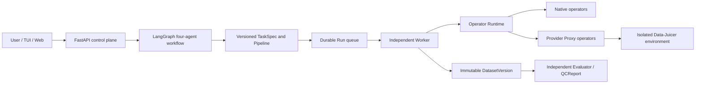

# DataAgent 开发交接文档

> 交接日期：2026-07-18  
> 仓库：`D:\newDataAgent`  
> 当前分支：`agent/core-architecture`  
> 当前基线提交：`3f80269 feat: enable isolated Data-Juicer CPU provider execution`  
> 文档用途：让下一位开发者不依赖聊天记录即可继续开发、验证和发布。

## 1. 我们在做什么

DataAgent 是一个面向图片数据生产的本地 Agent 平台。用户用自然语言描述数据目标，系统将
需求转成版本化 `TaskSpec`，生成和比较 Pipeline，经人工确认后由独立 Worker 执行，最终
产出不可变 `DatasetVersion`、质量报告和可复用 Pipeline。

它不是单纯的图片脚本集合，也不是让大模型直接运行任意代码。核心目标是建立一条可控、
可恢复、可解释、可评测的数据生产链：

1. Requirement、Retrieval、Processing、Strategy 四个专业 Agent 负责决策；
2. LangGraph 只编排决策、interrupt 和 checkpoint，不承载逐图片计算；
3. FastAPI 是 Web、TUI、CLI 和 Worker 共用的控制面；
4. Operator Runtime 统一管理原生代码算子、模型算子和外部 Provider 算子；
5. Worker 执行正式 Pipeline，保留断点、进度、取消和运行证据；
6. Evaluator 独立于生产 Agent，不允许 Agent 自己宣布质量达标；
7. TaskSpec、Operator、Pipeline、Dataset、Golden Set 和报告均采用不可变版本。

当前重点是把“能演示的本地原型”继续推进为“能长期扩展算子、外部框架和模型的工程骨架”。



## 2. 必须坚持的产品与工程原则

- 原始图片只读，所有转换写入新目录；运行前后校验源文件 SHA256。
- LangGraph checkpoint 不是业务事实来源，正式状态以控制面数据库为准。
- “可发现的算子”不等于“可发布的算子”；正式 Pipeline 只能使用已准入版本。
- 简单能力优先使用确定性代码；复杂语义能力使用大模型或专业开源模型。
- 专业开源模型先完成 Operator 契约和 Mock 后端，真正调用时再按需下载。
- 当前开发机没有 GPU，禁止为了开发流程提前下载大量模型权重。
- 模型算子没有真实 Golden Set、许可证、固定 revision 和 SHA256 时只能保持 Draft。
- 外部 Provider 放在独立环境或独立 Worker，不让重依赖污染 DataAgent 控制面。
- 所有模型输出、质量分数和代理指标都必须说明证据边界，不能冒充真实准确率。
- 已发布对象不可原地覆盖；变化必须生成新版本。

## 3. 已经完成了什么

### 3.1 文档与总体设计

当前应优先阅读以下文档：

1. `DataAgent-final-PRD-v1.1.md`：当前产品需求基线；
2. `DataAgent-code-architecture-v1.1.md`：目标代码架构和边界；
3. `DataAgent-operator-provider-runtime-design-v1.0.md`：算子与 Provider 设计；
4. `DataAgent-DataJuicer-Provider-implementation-v1.1.md`：Data-Juicer 当前实现；
5. `DataAgent-model-routing-policy-v1.0.md`：模型分工、多 Agent 上下文和路由策略；
6. 本文档：实际仓库状态、未完成项和踩坑记录。

旧版 `v1.0` 文档保留用于追溯，不应覆盖新版结论。

### 3.2 四 Agent 与控制面

- 已建立 Requirement、Retrieval、Processing、Strategy 四个 LangGraph 子图；
- 已支持 TaskSpec 确认和 Pipeline 选择两类 HITL interrupt；
- 已支持 SQLite checkpoint、Owner 隔离和持久化 ConversationThread；
- FastAPI 已提供 Agent、WorkOrder、Operator、Provider、Run、Dataset 和 QCReport 接口；
- TUI 只调用 FastAPI，不直接访问数据库；
- TUI 已支持自然语言普通问答、任务创建、审批、Run 查看和控制；
- 针对“你好”“你是什么模型”“怎么使用”等普通输入增加了快速响应，避免误建工单；
- 普通闲聊不会立即进入图片目录追问，只有识别到明确任务后才推进工作流。

### 3.3 Durable Worker 与数据生产

- Run 使用 SQLite 持久队列和幂等键；
- Worker 只接受已确认 TaskSpec 和已批准 Pipeline；
- 支持逐资产 checkpoint、暂停、恢复、取消和异常恢复；
- 支持多个本地目录数据源、冻结输入计划和源文件 SHA256 校验；
- 输出发布为不可变 DatasetVersion 和 manifest；
- 空数据集、源图片被修改或不合格生产 Pipeline 会阻止发布；
- 独立 QualityEvaluator 对正式数据集执行硬规则检查并生成 QCReport；
- 没有语义 Golden Set 时会明确标记语义质量未验证。

### 3.4 算子库

当前注册表共有 15 个 Operator 版本，九个主类均有覆盖：

| 类型 | 数量 | 状态 |
|---|---:|---|
| 原生确定性 CPU 算子 | 8 | `PUBLIC_RELEASE` |
| Data-Juicer Provider Proxy | 3 | `PERSONAL_RELEASE` |
| 模型算子 | 4 | `DRAFT`，当前使用 Mock 后端 |

八个正式原生 CPU 算子覆盖解码、质量过滤、感知去重、坐标转换、增强、采样、硬规则评估和
manifest 输出。四个模型 Draft 分别覆盖美学评分、图像分割、水印识别和人像 ID；它们目前
只用于契约、编排和预览测试，不能进入正式生产 Run。

Operator Runtime 已支持：

- 分类与二级分类校验；
- 参数 JSON Schema 校验和默认值；
- CPU、CUDA、Mock、Remote 后端声明；
- Provider 元数据、模型需求和资源 profile；
- 生产环境拒绝 Draft 和 Mock；
- `asset` 与 `dataset` 两种执行范围。

### 3.5 Data-Juicer Provider

Data-Juicer 作为外部 Provider 使用，代码位置在
`D:\DataAgent\data-juicer-agents`，DataAgent 不复制其算子实现，也忽略其中
`dataplatform` 部分。

已完成：

- 独立 Python 环境中的健康检查和 217 个算子元数据发现；
- 控制面不导入 Data-Juicer 重依赖；
- WorkOrder 数据源范围内的 CPU Filter 真实调用；
- JSONL 输入、recipe 和 `OperatorResult`/ArtifactRef 转换；
- 离线策略、超时、取消检查和 Windows 进程树终止；
- 首批三个正式、版本化 Provider Proxy：
  - `datajuicer.image_shape_filter:1`；
  - `datajuicer.image_aspect_ratio_filter:1`；
  - `datajuicer.image_deduplicator:1`；
- Proxy 冻结 Provider 版本、ref、参数 schema、source digest 和依赖 digest；
- 当前准入只对实测的 `py-data-juicer==1.5.3` 生效；
- Deduplicator 已实现 Dataset 级批量调用，一批数据只启动一次 `dj-process`；
- 批次使用内部稳定资产 ID 回填结果，禁止按行号猜测身份。

### 3.6 Run 事件与可观测性

数据库新增 `run_events`，API 新增：

```http
GET /api/runs/{run_id}/events
```

当前会记录 Run 计划、Dataset 节点、逐资产进度、评测、成功/失败/暂停/取消，以及 Provider
进程返回码、耗时和截断后的 stdout/stderr。外部进程中的取消会收敛为 `CANCELLED` 或
`PAUSED`，不会误记成普通 Operator 错误。

### 3.7 CPU Golden Set 与发布治理

Data-Juicer CPU Golden Set 已真实运行，不是 Mock：

- 3/3 cases 通过；
- 6/6 assets 符合预期；
- 开发机整体基线约 `0.0767 assets/s`；
- Shape Filter 冷启动约 28.72 秒；
- Aspect Ratio Filter 冷启动约 28.62 秒；
- Dataset Deduplicator 两张图片约 20.90 秒。

报告位于 `benchmarks/datajuicer-cpu-baseline-v1.json`，运行脚本是：

```powershell
.\.venv\Scripts\python.exe scripts\run_datajuicer_cpu_golden.py
```

模型发布治理已经有代码闸门：必须来自明确身份的独立 CUDA Worker，且 model ID、固定
revision、checkpoint SHA256、代码许可证、权重许可证、Golden Set SHA256 和性能结果全部
匹配。当前没有 GPU 实证，所以没有任何模型算子被提升为正式发布。

### 3.8 测试状态

最后一次完整测试：

```text
43 passed
```

覆盖领域模型、Agent 流程、API、TUI session、Node Preview、Worker、QC、Provider 隔离执行、
Run 事件和模型发布闸门。CPU Golden Set 是测试套件之外的真实外部环境验证。

## 4. 当前进展到哪里

### 4.1 Git 状态

当前分支：

```text
agent/core-architecture...origin/agent/core-architecture [ahead 1]
```

本地最新提交 `3f80269` 尚未 push。此后的“Provider Proxy、Dataset Dedup、Run Events、
Golden Set、GPU 发布闸门”整阶段代码仍在工作区，**尚未 commit**。

接手后不要 reset、checkout 或覆盖这些改动。先运行 `git status`、完整测试和 Golden Set
报告核对，再做一次有明确功能描述的提交。

### 4.2 当前运行进程

交接时本机 API、Worker、TUI 都在运行：

- API：`http://127.0.0.1:8000`；
- OpenAPI：`http://127.0.0.1:8000/docs`；
- Worker：`dataagent-worker.exe`；
- TUI：`dataagent-tui.exe --owner local-user`。

这些进程可能在机器重启或后续开发时变化，不能把 PID 写入脚本或文档作为固定值。

### 4.3 本地配置与外部环境

Git 忽略的 `dataagent.local.env` 当前指向：

```text
DATAAGENT_DATAJUICER_ENABLED=true
DATAAGENT_DATAJUICER_PYTHON=D:\DataAgent\data-juicer-agents\.venv\python.exe
DATAAGENT_DATAJUICER_PROCESS_BIN=D:\DataAgent\data-juicer-agents\.venv\Scripts\dj-process.exe
DATAAGENT_DATAJUICER_TIMEOUT_SECONDS=300
DATAAGENT_ALLOW_MODEL_DOWNLOAD=false
```

外部 Data-Juicer 环境当前已明确安装：

- `py-data-juicer==1.5.3`；
- CPU `torch==2.13.0`；
- `imagededup==0.3.3.post2` 及其 CPU 依赖；
- 没有为 DataAgent 下载模型权重。

注意：`dataagent.local.env`、API Key、缓存和数据库都不应提交。

### 4.4 已知边界和技术欠账

- 三个 Data-Juicer Proxy 已准入，不代表其余 214 个发现结果已准入；
- 资产级 Data-Juicer Filter 仍是每张图片启动一次进程，冷启动成本很高；
- Dataset Operator 当前必须位于资产过滤和转换之前，复杂跨阶段批处理还未实现；
- Provider 环境依赖目前不是完整可重建 lock，`imagededup` 是手工显式安装；
- Run Events 当前通过 REST 查询，没有 SSE/WebSocket 实时订阅；
- 模型发布闸门已实现，但还没有独立 GPU Worker 和真实评测报告；
- 模型发布闸门尚未接入完整的“申请发布/审批”应用用例；
- TUI 没有流式 token、附件和服务端事件订阅；
- Web 图片审核工作台尚未完成；
- 当前是 SQLite + 单本地 Worker，不是多 Worker/生产数据库部署；
- 旧 CLI 模块仍保留，迁移到新领域层和应用层尚未完全结束；
- README 在某些 PowerShell 读取方式下显示乱码，需要单独处理编码和内容更新。

## 5. 下一步计划

### P0：先固化当前成果

1. 运行 `git diff --check` 和完整 `pytest`；
2. 检查未提交文件，确认没有 `.dataagent`、密钥、缓存或外部环境文件；
3. 提交当前阶段，提交信息应明确包含 Provider Proxy、Dataset batch、Run Events 和 Golden Set；
4. push `agent/core-architecture`；
5. 更新 README 中仍写着“只支持 CPU Filter”的旧描述。

### P0：补真实端到端回归

1. 构造包含 `datajuicer.image_deduplicator:1` 的正式 Pipeline；
2. 通过 WorkOrder、审批、Run、Worker、DatasetVersion 和 QCReport 走完整链路；
3. 验证重复图片只保留一张，源文件哈希不变；
4. 验证 `/api/runs/{id}/events` 包含 Provider 日志摘要；
5. 在长时间 Data-Juicer 进程中请求 cancel，确认 Windows 整个子进程树退出；
6. 增加自动化集成测试，避免只依赖手工 Golden Set。

### P1：降低 Data-Juicer 执行成本

1. 让资产级 Filter 也使用 Dataset 批量请求，而不是每图启动进程；
2. 按批次大小、内存和超时拆分 chunk；
3. RunStore 记录每批吞吐、冷启动和处理耗时；
4. 重新运行 CPU 基线，区分冷启动、稳态吞吐和峰值内存；
5. 为 Provider 环境生成完整、可重建、带哈希的依赖 lock。

### P1：扩充正式算子准入

1. 从 Data-Juicer 目录发现结果中建立候选矩阵；
2. 按 CPU/模型、asset/dataset、依赖、许可证和输出契约分组；
3. 每个算子单独冻结 schema 和兼容 Provider 版本；
4. 每个正式 Proxy 必须有成功、失败、边界 Golden Cases 和性能阈值；
5. “能 import”或“有高星”不能作为发布依据。

### P1：继续完善交互体验

1. TUI 增加流式响应和耗时状态；
2. Run Events 增加 SSE/WebSocket 订阅；
3. TUI 只展示简洁状态，图片对比和批量审核通过 Web 深链完成；
4. 补齐附件、历史任务恢复和错误诊断；
5. 对普通聊天继续走低延迟路径，不要误触发 Agent 工单流程。

### P2：独立 GPU Worker

1. 准备独立 CUDA Worker，不在当前控制面进程中加载 GPU 模型；
2. 为美学评分、分割、水印和人像 ID 分别选择候选开源模型；
3. 审核代码和 checkpoint 许可证；
4. 固定 commit/revision，下载后计算 SHA256；
5. 构建任务级 Golden Set 和切片评测；
6. 记录显存、吞吐、延迟、失败样本和模型版本；
7. 证据全部通过后再申请 `PERSONAL_RELEASE`，不得提前改状态。

### P2：Web 与生产化

- 建设图片对比、边界样本、批量审核和 Pipeline 节点预览工作台；
- 将本地 SQLite/单 Worker 抽象替换为生产 Repository 和队列实现；
- 增加认证、角色、审计、Secret 管理和部署配置；
- 完成旧 CLI 到新应用用例的迁移和兼容策略。

## 6. 值得记住的经验与不要重复踩的坑

### 6.1 Data-Juicer 发现成功不等于运行成功

OPSearcher 能发现算子，只证明元数据可读，不证明可执行依赖齐全。`image_deduplicator` 在真实
Golden Set 中才暴露缺少 `imagededup`。今后必须执行最小真实样本，不能用 discover/import
结果宣布可用。

### 6.2 不要让 Data-Juicer 自动安装依赖

Data-Juicer `LazyLoader` 会在第一次调用时尝试调用 uv/pip。早期真实联调曾触发 CPU Torch、
networkx、sympy 等安装。现在执行目录注入 `sitecustomize.py` 阻止自动安装，并设置
Hugging Face、datasets、uv、pip 离线变量。

正确流程是：Golden Set 暴露缺失依赖 -> 人工确认它是普通包还是模型 -> 固定版本显式安装
-> 更新依赖摘要 -> 重跑基线。不要关闭离线策略来“先跑通”。

### 6.3 普通 CPU 包和模型权重不是一回事

`imagededup` 是 Deduplicator 的 CPU Python 依赖，不是模型权重。可以在明确调用该算子后
显式安装；美学、分割、人脸等模型 checkpoint 则必须等 GPU Worker、许可证和 SHA256
治理完成后再下载。不要把两类依赖混为一谈。

### 6.4 Windows Data-Juicer 数据源必须使用显式 local config

recipe 必须写成：

```yaml
dataset:
  configs:
    - type: local
      path: D:\...\input.jsonl
      weight: 1.0
```

直接传 Windows 绝对路径可能被 Data-Juicer 误判为 Hugging Face 数据集名。

### 6.5 Dataset 算子不能伪装成逐资产算子

去重、聚类和全局采样依赖整批数据语义。逐图片调用 Deduplicator 永远得不到正确结果。
必须在逐资产循环前调用 Provider Dataset API，并用稳定资产 ID 映射结果。Provider 丢失 ID
时应失败，不能按输出顺序猜。

### 6.6 Dataset 预计算必须约束 Pipeline 顺序

当前批处理使用原始输入预计算，因此 Dataset 节点必须位于资产过滤和转换之前。若以后允许
在转换后做 Dataset 算子，必须提供阶段物化数据集，不能继续复用原始路径偷偷预计算。

### 6.7 取消外部任务要终止进程树

在 Windows 上只 kill Python 父进程可能留下 `dj-process` 或其子进程。当前实现使用进程树
终止，并由 Run 状态决定最终是 CANCELLED、PAUSED 还是 FAILED。后续修改必须保留真实
cancel 集成测试。

### 6.8 Provider 日志不能只留在终端

用户看不到 Worker 终端。外部进程的返回码、耗时和 stdout/stderr 尾部必须进入 RunStore。
同时要截断日志、避免写入密钥和无限膨胀数据库。

### 6.9 正式 Proxy 必须绑定兼容版本

动态搜索结果用于候选发现，正式 Proxy 使用静态准入。当前 schema 只验证过 Data-Juicer
`1.5.3`，升级 Provider 后必须重新 discover、跑 Golden Set、更新 digest 和发布新 Proxy
版本。不要让同一个 Proxy ID 静默指向新版行为。

### 6.10 Golden Set 报告本身也是不可变版本

第一次失败的基线报告已经写入 DomainVersionStore 后，再用相同 ID 保存不同结果会触发
“immutable payload changed”。每次真实评测使用新的 report ID；Golden Set ID 可以保持不变，
报告不可覆盖。

### 6.11 不要把模型 Mock 当成真实模型效果

Mock 的目的只是验证参数、编排、输出 schema、预览和错误处理。它不证明准确率，也不能
进入生产 Run。没有独立 GPU 证据时，不要修改模型 Operator 的 Draft 状态。

### 6.12 TUI 普通对话不要触发工单状态机

早期 TUI 会把“叫我怎么使用”“你是什么模型”识别成需求并追问图片目录，体验很生硬。
现在闲聊、帮助和模型身份有快速路径。新增 intent 时必须先区分普通对话和任务意图，避免
每句话都启动 LangGraph 和模型调用。

### 6.13 “你好”很慢通常不是 TUI 渲染问题

延迟可能来自 API 启动、模型网络调用、Provider 健康检查或错误进入完整 Agent 流程。排查时
分别测 TUI -> API、ConversationService、模型 Gateway 和 LangGraph，不要只盯终端界面。

### 6.14 PowerShell 中文乱码不一定是文件损坏

仓库 Markdown 使用 UTF-8，但 PowerShell 默认编码可能把中文显示成乱码。先使用
`Get-Content -Encoding utf8` 或 UTF-8 编辑器确认，不能因为终端显示异常就批量重写文档。

### 6.15 重启 Windows 进程时不要宽泛匹配命令行

曾使用包含 `dataagent-api.exe` 的宽泛 CommandLine 过滤，结果匹配到正在执行过滤命令的
PowerShell 自身并提前终止。应先找到准确根 PID，再按 ParentProcessId 处理进程树；不要把
当前命令文本也纳入通配匹配。

### 6.16 不要在脏工作区执行破坏性 Git 操作

当前未提交改动很多，且与最新提交共同组成完整阶段。禁止 `git reset --hard`、`git checkout --`
或批量覆盖。提交前先阅读 diff，保留用户和前序开发者的改动，并在提交信息中写清实际功能。

## 7. 常用命令

安装与测试：

```powershell
cd D:\newDataAgent
.\.venv\Scripts\python.exe -m pip install -e ".[dev]"
.\.venv\Scripts\python.exe -m pytest
git diff --check
```

启动：

```powershell
.\.venv\Scripts\dataagent-api.exe
.\.venv\Scripts\dataagent-worker.exe
.\.venv\Scripts\dataagent-tui.exe --owner local-user
```

Provider 与算子检查：

```powershell
$headers = @{"X-Owner-ID" = "local-user"}
Invoke-RestMethod http://127.0.0.1:8000/api/operator-providers -Headers $headers
Invoke-RestMethod http://127.0.0.1:8000/api/operators -Headers $headers
```

CPU Golden Set：

```powershell
.\.venv\Scripts\python.exe scripts\run_datajuicer_cpu_golden.py
```

提交前：

```powershell
git status --short --branch
git diff --check
.\.venv\Scripts\python.exe -m pytest
git diff --stat
```

## 8. 接手后的第一小时建议

1. 阅读本文和四份核心设计文档；
2. 运行 `git status`，确认未提交阶段仍完整；
3. 调用 `/api/operator-providers`，确认 Data-Juicer 为 `available / 1.5.3`；
4. 运行 43 项测试，不必立即重复耗时的 CPU Golden Set；
5. 查看基线 JSON 和 Provider v1.1 实现说明；
6. 审查当前 diff 后 commit 并 push；
7. 从“真实 WorkOrder + Dataset Deduplicator 端到端回归”继续，而不是重新设计 Provider。

交接的核心判断是：基础控制面、Worker、算子协议和首批 Data-Juicer 真执行已经成立；下一阶段
应把这些能力变成稳定、批量、高可观测、可发布的端到端产品链，而不是继续增加未经评测的
算子数量。
