# DataAgent 开发接手文档 v3

> 交接日期：2026-07-19
> 仓库：`D:\newDataAgent`
> 当前分支：`agent/core-architecture`
> 文档编写时已提交基线：`dc5bbe8 feat: add versioned Data-Juicer batch proxies and operator governance`
> 文档编写时 Git 状态：分支相对远端 `ahead 2`，v2 以后讨论和实现的成果仍有一批未提交改动
> 文档定位：v2 的增量接手文档；重点记录最近的模型默认值、自然语言任务创建、真实猫狗任务暴露的问题，以及下一阶段的交互和 Pipeline 计划

## 1. 我们在做什么

DataAgent 是一个面向图片数据生产的本地 Agent 平台。用户用自然语言描述数据目标，系统把需求转换为版本化 `TaskSpec`，拆成能力需求，检索 Native、Model 和外部 Provider 算子，生成并比较 Pipeline，经用户确认后由独立 Worker 执行，最终发布不可变 `DatasetVersion`、manifest 和质量报告。

当前目标不是做一个“会聊天的图片脚本”，也不是把 Data-Juicer 的算子名称全部展示出来就算完成。真正要形成的是一条可治理、可追溯、可中断、可复现的数据生产闭环：

```mermaid
flowchart LR
    U["用户自然语言和数据源"] --> C["Conversation 控制层"]
    C --> T["Requirement / TaskSpec"]
    T --> D["多目标能力拆解"]
    D --> R["Operator Retrieval"]
    R --> G["Capability Gap Resolution"]
    G --> P["真实 Pipeline 候选"]
    P --> H["用户确认策略和参数"]
    H --> Q["Durable Run Queue"]
    Q --> W["Independent Worker"]
    W --> O["Native / Model / Provider Runtime"]
    O --> V["DatasetVersion and Evidence"]
    V --> E["Independent Evaluation"]
```



架构边界继续保持：

1. Requirement、Retrieval、Processing、Strategy 四个 Agent 负责结构化决策；
2. LangGraph 管理状态流、interrupt 和 checkpoint，不承担逐图片计算；
3. FastAPI 是 TUI、未来 Web、CLI 和 Worker 共用的控制面；
4. Worker 执行已经批准且运行时可用的 Pipeline；
5. Data-Juicer 是隔离的外部 Operator Provider，不是 DataAgent 主环境的一部分；
6. 简单、稳定、确定性的能力优先用原生代码；复杂语义使用远程大模型或经过准入的专业开源模型；
7. Discoverable、Executable 和 Released 是三种不同状态，不能混为一谈；
8. 大模型只能解释和提出建议，不能虚构 TaskSpec、Pipeline、Runtime 或 Run 状态。

## 2. 截至当前已经完成了什么

本节合并保留 v2 已确认的工程基线，并补充 v2 以后完成的模型默认切换、路径解析和阻塞提示，保证接手者只读 v3 也能获得完整现状。

### 2.1 Data-Juicer 完整目录和 Candidate Proxy

Data-Juicer 1.5.3 的动态发现目录已经恢复为完整 217 项，而不是早期只有 3 个静态 Proxy：

| 类型 | 数量 |
|---|---:|
| Mapper | 132 |
| Filter | 57 |
| Deduplicator | 13 |
| Selector | 5 |
| Aggregator | 4 |
| Grouper | 3 |
| Pipeline | 3 |
| 合计 | 217 |

目录已经分为三层：

```text
Provider Discovery Catalog  217 个外部元数据项
Versioned Proxy Catalog     217 个 datajuicer.<operator_ref>:1
Production Catalog          默认只暴露通过正式准入的版本
```

当前版本化 Proxy 状态仍是：

```text
DRAFT             214
PERSONAL_RELEASE    3
```

已正式准入：

- `datajuicer.image_shape_filter:1`
- `datajuicer.image_aspect_ratio_filter:1`
- `datajuicer.image_deduplicator:1`

CPU 图片 Candidate 可以在明确开启受控策略后进入候选 Pipeline，但这不等于正式发布。GPU、模型、非图片算子可以保留在 Provider Catalog 中，当前图片 Agent 不应因为“目录里存在”就自动选择或执行。

### 2.2 Dataset 级 Provider 批处理

CPU 图片 Filter 和 Deduplicator 已支持 Dataset 级 Provider 调用。一批数据对一个批量节点只启动一次 `dj-process`，不再每张图片启动一次进程。

现有实现已经处理：

- 稳定资产 ID 写入和回读；
- 保留行映射为 `continue`，缺失行映射为 `reject`；
- Provider 丢失全部资产 ID 时整批失败；
- 进度、取消检查、返回码和截断后的 stdout/stderr 摘要写入 RunStore；
- Windows 取消时终止 Provider 进程树；
- Shape、Aspect Ratio 和 Deduplicator 的 CPU Golden Set 与性能基线。

当前批处理仍主要覆盖前置 Filter 和 Dataset 节点。依赖 Mapper 衍生图片、mask、标签或中间数据集的下游节点，还需要阶段物化协议。

### 2.3 模型能力槽和正式默认值

项目不按 Agent 名称机械分配模型，而是按任务能力路由。当前正式默认配置已经调整为：

```env
FAST_TEXT_MODEL=glm-5.2
REASONING_MODEL=glm-5.2
VISION_MODEL=qwen3.7-plus

IMAGE_GENERATION_MODEL=wan2.7-image
IMAGE_GENERATION_PRO_MODEL=wan2.7-image-pro
TEXT_IMAGE_MODEL=qwen-image-2.0-pro
```

最近完成的 GLM 默认切换涉及：

- `dataagent/config.py` 的 dataclass 默认值和环境变量 fallback；
- `.env.example`；
- `README.md` 的模型配置说明；
- `DataAgent-model-routing-policy-v1.0.md`；
- `tests/unit/test_model_routing.py` 的默认值和路由断言；
- 本地忽略的 `model.env`。

`ModelRoutingPolicy` 当前按任务类型提供少量能力槽：普通对话和意图识别走 Fast Text，复杂规划和代码类任务走 Reasoning，图片语义评估走 Vision，生图保持独立 Operator 配置。

模型实测结论：同一套 Base URL、API Key 和协议下，`qwen3.6-flash` 及其快照返回 HTTP 403 `AccessDenied`，而 `qwen3.6-plus`、`qwen3.7-plus` 和 `glm-5.2` 可调用。因此问题不是三套配置不一致，而是当前密钥或工作空间对具体模型的访问权限不同。正式默认已切到 GLM-5.2，但仍应保留角色级 Golden Set，不能仅依据厂商推荐页决定模型优劣。

### 2.4 自然语言中的路径和任务创建

Conversation 层已经补充确定性路径解析：

- 支持带引号的 Windows 路径；
- 支持一条消息同时包含路径和需求；
- 支持先记录需求、下一轮只提供带引号路径；
- 支持用户说“创建数据处理任务”时继续已有 pending requirement；
- 这些明确输入优先走本地确定性解析，不依赖大模型猜测。

以下输入现在可以直接创建 WorkOrder：

```text
"D:\data\cats_dogs_mixed\images"去掉里面不真实、不清晰的图片，把猫和狗的图片分开
```

集成测试已经覆盖路径与需求同轮提交、带引号路径续接，以及阻塞算子确认后的解释。

### 2.5 阻塞候选的基础提示

TaskSpec 确认后，如果 Retrieval 进入 `expand_retrieval` 且匹配算子不可执行，Conversation 层现在会把真实 `provider_operator_ref` 和 `blocked_reason` 返回给用户，而不是只说“已确认，流程继续”。

这只解决了“至少告诉用户为什么停住”，还没有解决能力缺口选择、CPU/Remote 替代方案和恢复执行。

### 2.6 当前验证结果

最近一次完整回归结果：

```text
58 passed, 1 warning
```

唯一 warning 是 Starlette/httpx TestClient 的依赖弃用提示，不是业务测试失败。`git diff --check` 已通过。

## 3. 当前进展到哪，真正卡在哪里

### 3.1 基础设施已经成立，产品闭环仍未成立

已经成立的部分：

- FastAPI 控制面、TUI、LangGraph 和持久化 Conversation；
- 版本化 TaskSpec、Pipeline、Run、DatasetVersion 和 QCReport 的领域骨架；
- Durable Worker、暂停、恢复、取消和运行证据；
- Native、Model、Provider 的统一 Operator 契约；
- Data-Juicer 隔离发现、217 项 Candidate Catalog 和首批 CPU 准入；
- Dataset 级批处理；
- 三个核心模型能力槽；
- 明确路径加需求的一轮 WorkOrder 创建。

尚未成立的部分：

- Requirement Agent 的结构化澄清和 TaskSpec 修订循环；
- 多目标需求的完整能力拆解；
- 每个能力的候选、缺口和后端替代矩阵；
- 从能力缺口返回用户选择后重新进入 Retrieval；
- 基于真实 OperatorSpec 生成三条可执行 Pipeline；
- CPU 不可用时的 Remote Vision 或其他 Provider 替代链；
- 猫、狗、混合、未知的稳定分类和目录分区；
- TUI 中可验证的 TaskSpec、Pipeline DAG、参数、成本和运行时展示；
- 防止模型虚构控制面事实的 Grounding 边界。

所以当前系统已经能创建工单、检索 Catalog、发现阻塞，但还不能完成这次“去除不真实和不清晰图片，并把猫狗分开”的真实端到端任务。

### 3.2 真实猫狗任务暴露出的状态

最近一次任务：

```text
WorkOrder  work_order_feabcae968ea42fe
Thread     thread_d19110ee9e414405
Requirement
  去掉里面不真实、不清晰的图片，把猫和狗的图片分开
Source
  D:\data\cats_dogs_mixed\images
```

真实持久化状态是：

- TaskSpec 已确认，但内容仍很薄；
- `output_actions` 只有 `filter` 和 `manifest`；
- `required_capabilities`、硬规则、语义规则和排除规则为空；
- Retrieval 只匹配到 `datajuicer.image_tagging_mapper:1`；
- 该 Candidate 需要 CUDA，当前不可执行；
- `candidate_sufficient=false`；
- `next_action=expand_retrieval`；
- `representative_pipelines` 为空；
- 当前没有真正生成三条 Pipeline，也没有待用户选择的 CPU 回退操作。

这说明当前最大问题不再只是“某个对话模型是否能调用”，而是系统允许大模型在没有真实控制面产物时自由叙述状态。

### 3.3 最近对话中的系统事实与模型幻觉

对话里模型展示了一个看起来合理的 TaskSpec 和三条 Pipeline，并声称可以切换 CPU。需要明确：这些内容并没有全部写入 WorkOrder，也没有对应的 `PipelineVersion`。

| 对话内容 | 真实状态 |
|---|---|
| 展示了详细 TaskSpec | 持久化 TaskSpec 仍缺少规则和能力拆解 |
| 展示了三条 Pipeline | `representative_pipelines` 实际为空 |
| 说三条 Pipeline 都依赖 `image_tagging_mapper` | 没有真实编译出的三条 Pipeline 可证明该关系 |
| 承诺可切换 CPU | 当前 Runtime Profile 和执行器均不支持该路径 |
| 用户回复“1” | 没有持久化 pending choice，数字被误判为提交 Run |
| 返回原始 422 | WorkOrder 尚未具备提交 Dataset Run 的条件 |

原始错误：

```text
422: Work order is not ready to submit a dataset run
```

这不是一个偶发提示文案问题，而是控制权边界问题：模型现在既在做意图理解，又在替系统“编造”不存在的状态和动作。

### 3.4 `image_tagging_mapper` 到底是什么

当前 Candidate Proxy：

```text
Operator ID:       datajuicer.image_tagging_mapper:1
Provider:          Data-Juicer 1.5.3
Provider ref:      image_tagging_mapper
Execution scope:   asset
Lifecycle:         DRAFT
Visibility:        private
Runtime backend:   cuda
Tags:              image, gpu
Parameter:         tag_field_name, default image_tags
```

Data-Juicer 原始实现使用 Recognize Anything Model：

```text
Dependency: ram @ git+https://github.com/datajuicer/recognize-anything.git
Model type: recognizeAnything
Checkpoint: ram_plus_swin_large_14m.pth
Input size: 384
Declared accelerator: cuda
Estimated memory: about 9 GB
Output field: image_tags
```

它是通用图片标签 Mapper，不是专门的猫狗二分类器，也不是“不真实图片”检测器。即使 GPU 可用，仍需要：

- 将标签归一为 cat、dog、mixed、unknown 的 Class Resolver；
- 低置信度和多标签冲突策略；
- 输出目录分区算子；
- 独立的清晰度和真实性能力。

可查看位置：

```text
D:\newDataAgent\.dataagent\platform\providers\datajuicer\catalog-1.5.3.json
D:\newDataAgent\.dataagent\providers\datajuicer\catalog-1.5.3.json
D:\DataAgent\data-juicer-agents\.venv\Lib\site-packages\data_juicer\ops\mapper\image_tagging_mapper.py
D:\DataAgent\data-juicer-agents\interactive_recipe\configs\all_op_info.yaml
```

API 查询：

```http
GET /api/operator-providers/datajuicer/operators?query=image_tagging_mapper&limit=20
GET /api/operators?provider_id=datajuicer&include_drafts=true&limit=500
```

### 3.5 为什么当前不能承诺 CPU 回退

当前不能把 `image_tagging_mapper` 切到 CPU，证据有三层：

1. Provider Catalog 为它声明的 backend 只有 `cuda`；
2. Data-Juicer 原始类显式声明 `_accelerator = "cuda"`；
3. DataAgent 当前受控 Candidate 执行器只放行 CPU 图片算子，且关闭模型自动下载。

底层 RAM 模型理论上是否能通过改造跑 CPU，是另一个需要实验的问题。没有经过依赖固定、CPU Runtime Profile、性能基线和 Golden Set 前，产品不能把“理论上可能”说成“现在可选”。

### 3.6 当前可用能力与这次任务缺口

现有基础原生 Pipeline 节点包括：

```text
builtin.decode_check:1
builtin.quality_filter:1
builtin.perceptual_dedup:1
builtin.manifest:1
```

Data-Juicer Catalog 还包含若干 CPU 图片形状、尺寸、宽高比、人脸和去重算子，以及 CUDA 美学、NSFW、相似度和水印算子。但当前目录中没有一个已经确认可执行的“AI 生成真实性检测 + 猫狗分类 + 目录分区”完整组合。

这次任务至少应拆成以下能力 DAG：


当前只有 Decode、基础 Quality 和 Manifest 有较明确的本地路径；真实性、稳定分类、冲突消解和分区仍有缺口。

## 4. 已讨论并确认的产品方案，但尚未修改代码

本节非常重要。以下是已形成共识的设计方向，不是已实现功能。

### 4.1 三条 Pipeline 可以保留，但必须变成真实策略

之前对话给出的三种结构可以作为产品上的候选思路：

1. 保留优先：先做低成本清洗，再做真实性和分类；不确定样本保留或送审；
2. 均衡：先获得类别信息，再按类别应用中等强度质量和真实性规则；
3. 质量优先：多证据评估、较严格阈值和更高人工复核比例。

但不能只交换算子顺序。每条 Pipeline 必须同时体现：

- 真实 Operator ID、版本和 Runtime Profile；
- DAG 拓扑和中间产物；
- 清晰度、真实性、分类置信度阈值；
- mixed、unknown、低置信度的处置；
- retention target、quality target 和允许误删率；
- 延迟、成本、吞吐和人工复核比例；
- 不可用后端的替代路径；
- 输出目录、manifest 和拒绝原因。

“保留优先”不天然等于“清洗优先”，“均衡”也不天然等于“分类优先”。策略名称必须由参数和目标函数定义，拓扑只是一部分。

### 4.2 多目标拆解是什么意思

用户一句话包含多个独立目标：

```text
不清晰图片        -> clarity / quality filtering
不真实图片        -> authenticity / AIGC assessment
猫和狗分开        -> classification
真正落到文件系统  -> partition / manifest
```

Requirement Agent 不能只把整句话作为 `objective` 保存，也不能因为命中“猫狗”就只检索 Tagging。它需要生成结构化子目标、依赖关系、验收标准和未决问题。Retrieval 应针对每个能力分别检索，然后汇总能力覆盖矩阵，而不是任意一个候选不可执行就整体停在 `expand_retrieval`。

### 4.3 TaskSpec 需要澄清和版本修订循环

当前 `generate_task_spec` 主要复制 requirement，并使用关键词推断少量能力；这不足以支撑真实任务。下一版应增加：

- source inventory：目录是否存在、图片数量、格式和损坏情况；
- objective decomposition：过滤、分类、分区、报告；
- acceptance rules：清晰度、真实性、分类和保留率；
- ambiguity list：怎样定义“不真实”、混合猫狗图如何处理；
- output contract：复制还是移动、目录结构、是否保留 rejected；
- constraints：无 GPU、允许远程 API、成本和隐私限制；
- TaskSpec revision：用户修改后生成 v2/v3，不能覆盖原版本；
- completeness gate：关键问题未解决时不能假装已经可执行。

领域模型已有 `TaskSpecVersion.confirm()` 的歧义校验思路，但当前图流程存在直接 `model_copy` 的路径，尚未把完整领域校验落实到确认动作。

### 4.4 Conversation Intent 和状态展示要补齐

当前 `ConversationIntent` 对状态查询和交互动作覆盖不足。至少需要：

```text
SHOW_TASK_SPEC
EDIT_TASK_SPEC
SHOW_CAPABILITY_GAPS
SHOW_PIPELINES
SELECT_PIPELINE
SELECT_BACKEND
RESOLVE_GAP
SUBMIT_RUN
```

TaskSpec、候选、Pipeline、Runtime 和 Run 状态必须由应用层从 Store 确定性渲染。LLM 可以解释这些事实，但不能替 Store 创建一个只存在于回复文本中的版本。

如果真实 Pipeline 尚未生成，可以展示标注为“假设方案”的 `PipelinePlanDraft`，同时列出 unresolved gaps；不能把它说成已经可以批准和执行的 `PipelineVersion`。

### 4.5 数字选择必须绑定持久化 pending choice

当系统给出“1. CPU、2. GPU、3. Remote”或三条 Pipeline 时，需要在 Conversation context 中持久化：

```text
pending_choice.kind
pending_choice.work_order_id
pending_choice.revision
pending_choice.options
pending_choice.valid_actions
```

用户回复“1”时应先匹配这个结构，不再交给大模型自由分类。选择成功后，应用层执行明确 action，并从 Retrieval 或 Processing 的指定节点恢复。

### 4.6 能力缺口需要可恢复的 Resolution Loop

建议按每个能力生成矩阵：

| Capability | 首选 | 替代 | 当前状态 |
|---|---|---|---|
| decode | Native CPU | Data-Juicer CPU | 可用 |
| clarity | Native CPU | DJ CPU / Remote Vision | 部分可用 |
| authenticity | 专业模型或 Remote Vision | 人工复核 | 缺口 |
| cat/dog classify | Remote Vision / 专业模型 | GPU Tagger + Resolver | 缺口 |
| partition | Native deterministic | 无 | 待实现 |
| manifest | Native CPU | 无 | 可用 |

默认 fallback 顺序可以是：

```text
Released local -> admitted Candidate -> Remote Operator -> user-approved manual review -> unresolved
```

任何替代都必须满足 TaskSpec 的隐私、成本和运行时约束。用户选择后，系统要修改冻结的执行约束或生成新的 TaskSpec/Pipeline revision，再重新检索和编译，不能停在一句“你想怎么处理”。

### 4.7 无 GPU 开发机上的推荐完整路径

近期最可行的猫狗任务 Pipeline 是：

```text
Native CPU decode_check
-> Native CPU clarity/quality
-> Remote Vision authenticity assessment
-> Remote Vision cat/dog classification
-> Native class resolver for cat/dog/mixed/unknown
-> Native deterministic partition
-> Native manifest and QC sampling
```

其中 Remote Vision 可由 `qwen3.7-plus` 作为受治理的 Model Operator 承担近期语义能力，但它不是专业分割、人脸识别或固定美学模型的永久替代。每次调用都需要冻结 prompt 版本、模型 ID、请求参数、输入 SHA256、输出 Schema、成本和重试策略。

这条完整路径目前尚未实现；尤其缺少 Remote Vision 分类/真实性 Operator、Class Resolver 和 Partition Operator。

## 5. 下一步计划

### P0：先解决状态 Grounding，禁止系统幻觉

1. 为 TaskSpec、Capability Gap、Pipeline、Runtime 和 Run 分别建立确定性 presenter；
2. LLM 回复只能引用 presenter 输出的结构化事实；
3. 没有 `representative_pipelines` 时禁止回复“三条 Pipeline 已生成”；
4. 没有 CPU Runtime Profile 时禁止回复“可以切换 CPU”；
5. Domain/Application 错误转换为用户可理解的会话消息，不把原始 422 直接抛给 TUI；
6. 增加回归测试：模型即使返回虚构状态，最终回复也只能显示 Store 中的事实。

### P1：补完整 Requirement 澄清和 TaskSpec 修订

1. 将一句多目标需求拆成 capability DAG；
2. 增加必要澄清问题：真实性定义、mixed/unknown、输出目录、复制或移动、远程 API 许可；
3. 展示真实 TaskSpec 草案和未决项；
4. 支持 `SHOW_TASK_SPEC`、`EDIT_TASK_SPEC` 和不可变 revision；
5. 统一使用领域确认方法，禁止绕过歧义和完整性校验；
6. 为猫狗任务建立 Requirement Golden Set。

### P2：补能力矩阵、后端选择和恢复执行

1. Retrieval 按 capability 分组返回候选和缺口；
2. 为每个候选展示生命周期、执行范围、backend、依赖、参数和 blocked reason；
3. 增加 `pending_choice`；
4. 实现 Released、Candidate、Remote、Manual 的 fallback policy；
5. 用户解决缺口后，从 Retrieval 节点恢复而不是误提交 Run；
6. 对 `expand_retrieval` 增加明确 interrupt 和 re-entry 测试。

### P3：实现无 GPU 可用的语义 Operator

1. 把 `qwen3.7-plus` 封装为 Remote Vision Operator，而不是在 Conversation 中直接处理图片任务；
2. 定义真实性评估和猫狗分类的结构化输出；
3. 记录模型 ID、prompt revision、usage、latency、request ID 和输入输出摘要；
4. 增加 Class Resolver，输出 cat、dog、mixed、unknown；
5. 增加 Partition Operator，复制到版本化输出目录，不修改原图；
6. 准备小型 Golden Set，评估误删、分类准确率和低置信度策略。

### P4：生成和展示真实三条 Pipeline

1. 只有能力覆盖完整后才生成 `PipelineVersion`；
2. 为 retention_first、balanced、quality_first 固化真实参数和目标；
3. 在 TUI 展示 DAG、算子版本、运行时、阈值、成本和能力缺口；
4. 用户批准时冻结 Pipeline revision 和模型路由；
5. 用真实猫狗目录走完 WorkOrder、确认、Run、Worker、DatasetVersion、QCReport；
6. 增加完整端到端集成测试。

### P5：继续算子准入和生产治理

1. 为剩余 8 个 CPU 图片 Candidate 建 Success、Failure、Boundary Golden Cases；
2. 完成 Mapper 中间产物和分阶段物化；
3. 实现 Provider Catalog diff 和升级后的 Proxy 新版本分配；
4. 在独立 GPU Worker 评测 Data-Juicer GPU 算子；
5. 对美学、分割、水印、人像 ID 等专业模型审核许可证、revision 和 SHA256；
6. 证据齐全后才申请 `PERSONAL_RELEASE`；
7. 图片生成继续作为独立 Operator 开发，不混入普通 Conversation Gateway。

### 提交前检查：固化当前工作区

当前仍有大量未提交文件。下一次提交前：

```powershell
cd D:\newDataAgent
git status --short --branch
git diff --check
.\.venv\Scripts\python.exe -m compileall -q dataagent apps tests
.\.venv\Scripts\python.exe -m pytest
git diff --stat
```

然后审查是否包含密钥、`model.env`、`dataagent.local.env`、`.dataagent`、数据库、缓存或外部虚拟环境。提交信息应明确记录动态目录、Candidate Proxy、批处理、模型路由、会话路径解析和测试，不要只写 `update`。

## 6. 经验与不要重复踩的坑

### 6.1 不要把模型回复当作业务事实

LLM 可以解析意图、解释状态和提出候选方案，但 TaskSpec、Pipeline、Operator 可执行性和 Run 状态必须来自 Store 和 Runtime 校验。只存在于回复文本中的 Pipeline 等于不存在。

### 6.2 合理的方案也必须标注它是什么

“清洗优先、分类优先、质量优先”作为假设方案可以讨论，但必须标成 Draft，并列出尚未满足的能力。不要因为文案听起来专业就把它展示为已经编译和批准的 Pipeline。

### 6.3 不要做未经验证的 CPU/GPU 承诺

Provider 标签、底层框架的理论能力和 DataAgent 当前 Runtime Profile 是三回事。只有声明、依赖、真实样本和性能基线都通过，才可以对用户说“可用”。

### 6.4 一个匹配算子不能代表完整需求

多目标任务必须先拆能力，再逐项检索。`image_tagging_mapper` 最多覆盖通用标签，不覆盖清晰度、真实性、冲突消解和目录分区。

### 6.5 数字回复必须有上下文契约

没有 `pending_choice` 时，“1”没有可靠语义。不要把它交给 LLM 猜，也不要默认映射为提交 Run。

### 6.6 TaskSpec 展示必须读取同一个版本化对象

用户看到、确认和 Worker 使用的必须是同一个 TaskSpec revision。禁止模型展示一份丰富草案，而控制面保存另一份空壳。

### 6.7 Discoverable、Executable、Released 永远分开

217 个算子可发现，不等于 217 个可调用；可受控调用也不等于正式发布。Catalog 完整性和 Production Catalog 保守性要同时保持。

### 6.8 通用 VLM 和专业模型各有位置

无 GPU 阶段可以用 Remote Vision 补足语义闭环，但分割、人像 ID、固定美学评分和水印定位仍需要专业模型、许可证和任务级评测。不要把临时替代写成永久架构。

### 6.9 模型切换不等于上下文自动丢失或自动共享

Agent 间不共享隐藏思维链，也不依赖供应商会话。上下文来自 DataAgent 每次发送的版本化 TaskSpec、候选、Pipeline 和证据。模型槽可以共享同一模型，也可以替换，只要结构化上下文契约稳定。

### 6.10 同一 API 配置下也可能有模型级权限差异

一个模型 403、另一个模型成功，不应直接判断 Base URL 或 Key 全部错误。先对每个 Model ID 做最小探测，并记录状态码和 request ID，再调整默认路由。

### 6.11 快速路径只处理确定性输入

问候、帮助、模型名称和明确本地路径可以走快速路径。涉及 TaskSpec 修订、Pipeline 选择和后端切换的输入必须绑定真实 WorkOrder 状态，不能为了低延迟跳过领域校验。

### 6.12 Data-Juicer 目录不是能力本体

Data-Juicer Proxy 需要 DataAgent 适配输入、输出、批量语义、运行时和错误。不要手写 217 个 Proxy，也不要把原包直接装进主控制面环境。

### 6.13 Provider 不应运行时自动下载和安装

开发机无 GPU且 `DATAAGENT_ALLOW_MODEL_DOWNLOAD=false` 是有意约束。缺依赖时应报告、固定版本并重新评测，而不是让 LazyLoader、pip 或 Hugging Face 在任务中静默下载。

### 6.14 原图只读，分类结果必须版本化发布

“把猫和狗分开”应解释为复制或链接到新的 DatasetVersion 目录，并保留 manifest、来源 SHA256 和拒绝原因；默认不能移动、覆盖或删除原图。

### 6.15 不要把工作区成果写成已提交成果

当前分支仍有大量未提交修改和新文件。交接、发布说明和 PR 描述必须区分 Commit 中已有内容与 Working Tree 内容，禁止 reset 或覆盖用户改动。

### 6.16 Windows 和中文排查要保持克制

PowerShell 显示乱码时先指定 `Get-Content -Encoding UTF8`；进程管理要核对准确命令行和进程树；不要因终端显示问题批量重写文件或宽泛终止进程。

## 7. 关键代码和文档入口

建议按以下顺序阅读：

1. `DataAgent-final-PRD-v1.1.md`
2. `DataAgent-code-architecture-v1.1.md`
3. `DataAgent-operator-provider-runtime-design-v1.0.md`
4. `DataAgent-DataJuicer-Provider-implementation-v1.2.md`
5. `DataAgent-model-routing-policy-v1.0.md`
6. 本文

本轮问题相关代码：

```text
dataagent/application/conversation.py        Conversation intent、快速路径和状态回复
dataagent/gateway.py                         模型调用和路由接入
dataagent/model_routing.py                   三个核心模型能力槽
dataagent/config.py                          正式默认值和环境变量
dataagent/agents/requirement/nodes.py        当前 TaskSpec 生成逻辑
dataagent/agents/retrieval/nodes.py          Candidate 检索和充分性判断
dataagent/agents/processing/nodes.py         Pipeline 变体与代表方案
dataagent/graph/interrupts.py                 TaskSpec/Pipeline HITL
dataagent/operators/catalog_matching.py      需求与 Data-Juicer 目录匹配
dataagent/operators/providers/proxy.py       Candidate Proxy 生成
dataagent/operators/providers/datajuicer.py  隔离执行、批处理和日志
dataagent/execution/dataset_runner.py         Dataset 节点执行
tests/integration/test_conversation_flow.py  Conversation 回归
tests/unit/test_model_routing.py              模型默认值和路由回归
```

## 8. 接手后的第一小时

1. 先读本文第 3、4、5 节，不要把讨论方案误当成已实现；
2. 运行 `git status`，确认未提交工作区仍完整；
3. 运行完整测试，基线应为 `58 passed, 1 warning`；
4. 查询 Data-Juicer Catalog，确认 217、图片 21、Released 3、All Proxies 217；
5. 打开猫狗 WorkOrder，核对真实 TaskSpec、Candidate 和空 Pipeline 状态；
6. 从 P0 Grounding 开始，不要先调整聊天提示词粉饰问题；
7. Grounding 完成后补 Requirement 澄清和 capability matrix；
8. 再实现 Remote Vision、Class Resolver、Partition 和真实三条 Pipeline；
9. 最后走一遍真实目录的 DatasetVersion 和 QCReport；
10. 不要重新手写 Data-Juicer Proxy，不要批量发布 Draft，不要承诺未经评测的 CPU 回退。

## 9. 一句话交接结论

DataAgent 的控制面、Worker、统一算子协议、Data-Juicer 完整 Candidate Catalog、CPU 批处理和模型能力槽已经建立，明确路径加需求也能创建工单；当前最紧迫的问题是把大模型从“业务事实作者”收回到“受 Grounding 约束的意图解析与解释者”，随后补齐多目标 TaskSpec、能力缺口恢复、无 GPU Remote Vision 路径和真实可执行的猫狗分类 Pipeline。
