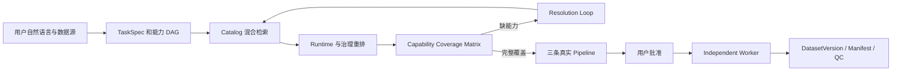

# DataAgent 开发接手文档 v4

> 交接日期：2026-07-20  
> 仓库：`D:\newDataAgent`  
> 当前分支：`codex/hybrid-operator-retrieval`  
> 代码基线：`4097505 feat: compile capability-complete pipeline strategies`  
> 基线状态：v3 之后的十个功能提交均已提交；完整测试为 `76 passed, 1 warning`  
> 文档定位：v3 的增量接手文档，重点记录 Catalog Overlay、VLM Variant、能力拆解、混合检索、候选重排、Coverage Matrix、Resolution Loop 和真实三策略 Pipeline

## 1. 我们在做什么

DataAgent 是面向图片数据生产的本地 Agent 平台。用户用自然语言描述数据源和目标，系统将需求固化为版本化 `TaskSpec`，拆成能力 DAG，从 Native、Model 和外部 Provider Catalog 中检索算子，校验能力覆盖和运行条件，生成三条可解释、可批准、可执行的 Pipeline，最后由独立 Worker 发布不可变 `DatasetVersion`、manifest 和评估证据。

目标不是“让大模型讲出一个听起来合理的处理方案”，而是让每一步都有真实领域对象、算子版本、运行后端、参数、生命周期、输入输出契约和可恢复状态。



持续有效的架构边界：

1. Requirement、Retrieval、Processing、Strategy Agent 负责结构化决策，不逐图片执行计算。
2. LangGraph 管理状态流、interrupt、checkpoint 和恢复入口。
3. Worker 只执行已经批准且运行时可用的版本化 Pipeline。
4. Data-Juicer 是隔离的外部 Operator Provider，不直接并入 DataAgent 主环境。
5. 简单、稳定、确定性的能力优先使用 Native CPU 代码。
6. 复杂语义近期可调用受治理的 Remote Model Operator；专业任务长期使用经过评测的专门模型。
7. Discoverable、Matched、Executable、Released 是不同状态，不能混写成“可用”。
8. 没有完整能力覆盖时不得生成可批准的 `PipelineVersion`，更不能用 Mock 节点假装补齐。

## 2. v3 之后讨论并确认的关键结论

### 2.1 Catalog 元数据和 Matcher 必须同时改

只恢复 217 个 Data-Juicer 动态目录项，不足以让图片 Agent 准确找到和编排算子。原始发现元数据面向 Data-Juicer 自身，缺少 DataAgent 需要的能力标签、I/O、执行范围和运行 Profile。

确定方案：

- 保留原始发现缓存，不直接修改；
- 建立版本化 Catalog Normalization/Overlay；
- 将发现目录和正式准入目录分开；
- Matcher 使用规则、关键词、语义概念三路混合召回；
- 召回后按 Runtime、生命周期、I/O、成本重新排序；
- 最终按 Task Capability 生成覆盖矩阵，而不是看“是否找到一个相似名称”。

### 2.2 VLM Mapper 必须有两个明确 Variant

`image_tagging_vlm_mapper` 不能只有一个含糊的“模型算子”身份。当前拆成同一 Operator Family 下的两个版本化运行 Variant：

```text
datajuicer.image_tagging_vlm_mapper.remote_api:1
datajuicer.image_tagging_vlm_mapper.local_cuda:1
```

近期无 GPU 开发环境优先选择 Remote API Variant；Local CUDA Variant 保留在 Catalog 中，等待独立 GPU Worker 验证。

Remote Variant 当前绑定：

```text
model: qwen3.7-plus
endpoint: https://dashscope.aliyuncs.com/compatible-mode/v1
runtime: remote
```

它用于受治理的视觉语义判断，不取代专业分割、人脸身份、水印定位或固定美学模型。

### 2.3 多目标任务必须先拆成能力，而不是直接找一个算子

“去掉不真实、不清晰的图片，把猫和狗分开”不是一个 `image_tagging` 能力，而是至少包括：

```text
image_decode
-> image_quality
-> authenticity_assessment
-> image_classification
-> class_resolution
-> dataset_partition
-> manifest
```

每项能力必须分别有候选、运行后端和覆盖状态。一个 VLM 可以为真实性和分类提供语义证据，但过滤决策、冲突消解、目录发布仍应由确定性算子完成。

### 2.4 能力缺口必须进入可恢复 Resolution Loop

“Resolution Loop”不是多输出一句提示，而是一个真实控制流：

1. Retrieval 生成能力覆盖矩阵；
2. 必需能力为 `blocked` 或 `missing` 时产生 interrupt；
3. 用户可以启用新的 Runtime、修改 TaskSpec 或终止；
4. 选择重试后生成新 RetrievalPlan revision；
5. 从 Retrieval 重新进入，而不是误提交 Dataset Run；
6. 覆盖完整后才能进入 Processing。

### 2.5 三条 Pipeline 应体现策略，不应伪造三套能力

三条 Pipeline 可以共享同一个可靠拓扑，但通过真实参数表达不同取舍：

| 策略 | 质量阈值 | 不确定真实性 | mixed/unknown 类别 |
|---|---:|---|---|
| `retention_first` | 0.35 | keep | keep |
| `balanced` | 0.55 | review | review |
| `quality_first` | 0.75 | reject | reject |

旧实现每个策略生成两个内部阈值变体，共六条；当前已经改为每个策略一条正式候选，共三条。

### 2.6 Remote VLM 与 Native 决策算子的职责边界

当前推荐链路：

```text
Native decode
-> Native quality filter
-> Remote VLM authenticity tagging
-> Native authenticity decision
-> Remote VLM cat/dog tagging
-> Native class resolution
-> Native deterministic partition
-> Native manifest
```

Remote VLM 负责生成语义证据；Native 算子负责应用策略、产生稳定类别、决定保留或拒绝，以及生成安全输出路径。这样可以固定策略并降低模型输出直接控制文件系统的风险。

## 3. 已经完成了什么

### 3.1 Catalog Normalization/Overlay

新增：

```text
dataagent/operators/providers/catalog_normalization.py
```

已实现：

- Overlay 不修改原始 Provider Discovery Descriptor；
- Overlay 按 Provider、算子引用和兼容版本应用；
- 为 `image_tagging_vlm_mapper` 补充 `image`、`image_classification`、`image_tagging`、`visual_understanding` 标签；
- 标准化为 `UNDERSTANDING / classification / asset`；
- 保存 overlay ID、原始 digest 和 normalization digest；
- Provider 原始缓存仍可独立刷新和比对。

当前 Overlay 只声明兼容 Data-Juicer `1.5.3`。升级 Provider 版本时不能无条件沿用，必须重新验证后扩大兼容范围或产生新 Overlay 版本。

提交：

```text
c011a78 feat: add provider catalog normalization overlays
```

### 3.2 VLM Remote API 与 Local CUDA Variant

一个原始 VLM Descriptor 会自动扩展为两个 Proxy Operator。两者共享 family，但具有独立 ID、Runtime Profile、标签、参数绑定和输出 Schema。

Remote Variant：

- `RuntimeBackend.REMOTE`；
- `is_api_model=true`；
- `api_or_hf_model=qwen3.7-plus`；
- 使用百炼 OpenAI 兼容端点；
- 标签包含 `remote`、`api`、`commercial_model`；
- 不再错误标记为本地 GPU/VLLM。

Local Variant：

- `RuntimeBackend.CUDA`；
- `is_api_model=false`；
- 当前固定 `Qwen/Qwen2.5-VL-7B-Instruct`；
- 标签包含 `local_model`；
- 当前开发机无 GPU，不自动下载模型，也不承诺 CPU 回退。

提交：

```text
c8c7d48 feat: version Data-Juicer VLM runtime variants
```

### 3.3 Requirement 能力级拆解

新增 `TaskCapabilitySpec`，支持：

- capability ID；
- capability 名称；
- 描述；
- `depends_on`；
- required 标志；
- DAG 环检测和依赖引用校验。

`TaskSpecVersion` 现在可以保存 `capability_requirements`。猫狗清洗分类需求会拆出解码、清晰度、真实性、分类、类别消解、目录分区和 manifest，而不是只留下宽泛的 `filter`。

当前拆解仍以本地规则和关键词为主，还不是完整的澄清式 Requirement Agent。它建立了正确领域结构，但真实性定义、mixed/unknown 政策、隐私、远程 API 许可等仍需要进一步向用户确认。

提交：

```text
e7464e0 feat: decompose task requirements into capability DAGs
```

### 3.4 可解释混合检索

`DataJuicerCatalogMatcher` 已从单一关键词匹配改成三路召回：

```text
Rule Recall
Keyword Recall
Semantic Concept Recall
```

每个候选保存各通道得分和命中证据。语义召回目前是可审计的概念标签匹配，不是外部向量数据库，也不会偷偷调用模型。

现有 Matcher 还保留 Data-Juicer Provider Scope，避免把 Native 算子重复伪装成 Provider Candidate。Native 能力由 Coverage 阶段单独纳入。

提交：

```text
dcffe13 feat: add explainable hybrid operator recall
```

### 3.5 Runtime、生命周期、I/O 和成本重排

新增：

```text
dataagent/operators/catalog_ranking.py
```

候选排序不再只看文本相似度，而会综合：

- Runtime 是否在当前可用后端中；
- Operator 生命周期是否允许作为候选；
- 当前图片 Agent 的输入输出是否兼容；
- 资产级或 Dataset 级执行范围；
- CPU、Remote、CUDA 的成本偏好；
- Provider 校验返回的阻塞原因。

Remote Data-Juicer 执行时，`BAILIAN_API_KEY` 或 `DASHSCOPE_API_KEY` 会只注入子进程环境中的 `OPENAI_API_KEY`，不会写入 recipe 或 Catalog。

提交：

```text
d4587ad feat: rank operator candidates by execution fitness
```

### 3.6 Capability Coverage Matrix

RetrievalPlan 现在保存逐能力覆盖矩阵。每项包括：

```text
capability_id
capability
description
required
status: covered | blocked | missing
selected_operator_version_id
candidates[]
```

每个候选证据包含 Provider、Runtime、生命周期、可执行性、分数和 blocked reason。

Native 能力也进入矩阵。目前已明确映射：

- `image_decode`；
- `image_quality`；
- `authenticity_assessment`；
- `class_resolution`；
- `dataset_partition`；
- `perceptual_deduplication`；
- `manifest`。

Native 算子的上游能力要求也会校验。例如真实性决策算子虽然是 CPU 可执行，但如果没有可执行的 `visual_understanding` 上游，它仍会显示为 blocked，不能靠本地规则算子单独假装覆盖真实性判断。

提交：

```text
169e316 feat: publish capability coverage matrices
```

### 3.7 可恢复 Resolution Loop

已经新增真实 LangGraph `capability_resolution` interrupt，支持：

- 启用额外 Runtime 后重试；
- 返回 TaskSpec 修订；
- 终止任务；
- 生成新的 RetrievalPlan version 和 parent revision；
- 从 Retrieval 重入；
- 只在 pending resolution 存在时解释数字选择，避免把“1”误提交为 Run。

当前 Conversation 数字选项绑定的是 Resolution Loop 的明确状态，不应扩展成“任何时候输入数字都猜动作”。Pipeline 选择等其他 pending choice 仍应分别建模。

提交：

```text
0add938 feat: add recoverable capability resolution loop
```

### 3.8 三个 Native CPU 语义后处理算子

新增：

```text
dataagent/operators/builtin/semantic.py
```

包含：

1. `builtin.authenticity_decision:1`
   - 消费 VLM 真实性标签；
   - 输出 `authentic`、`synthetic`、`uncertain`；
   - 按策略 keep、review 或 reject；
   - 不执行模型、不下载权重。

2. `builtin.class_resolution:1`
   - 消费 VLM 图片标签；
   - 归一化为 `cat`、`dog`、`mixed`、`unknown`；
   - mixed/unknown 可按策略保留、送审或拒绝。

3. `builtin.dataset_partition:1`
   - 产生安全、确定性的相对输出路径；
   - 当前目录格式为 `classes/<class>/<stem>-<sha12>.<suffix>`；
   - 拒绝绝对路径和 `..` 路径穿越；
   - Worker 发布新 Dataset 文件，不移动、覆盖或删除原图。

`DatasetRunExecutor` 已支持读取算子生成的 `output_relative_path`，最终按类别目录发布。

提交：

```text
54c4482 feat: add CPU semantic decision operators
```

### 3.9 Remote Data-Juicer Candidate 的受治理执行准入

`AgentRuntime` 的生产 Pipeline 校验现在允许符合以下条件的 Draft Remote Candidate：

- 明确启用了 Candidate 执行策略；
- Provider 为 `datajuicer`；
- Runtime 为 `remote`；
- 标签同时具备 `remote`、`api`、`image`；
- Provider 版本一致；
- Provider 参数和 Runtime 校验通过。

这表示“可以在显式受控条件下执行 Candidate”，不表示已经提升为 `PERSONAL_RELEASE`。真实效果、成本、稳定性和外部服务契约还没有完成生产准入。

提交：

```text
2baa087 feat: admit governed remote Data-Juicer candidates
```

### 3.10 只在能力完整时编译三条真实 Pipeline

Processing 已完成重写：

- 读取 Coverage Matrix 选中的真实 OperatorVersion；
- 必需能力存在缺口时拒绝编译；
- 不再用 `RuntimeBackend.MOCK` 补齐专业能力；
- 猫狗任务会为真实性和分类分别插入 Remote VLM 节点；
- 每个策略只生成一条 `PipelineVersion`；
- 三条 Pipeline 具有真实节点、参数、Runtime 和线性 DAG 边；
- `build_main_graph()` 即使调用方未显式传入 OperatorLibrary，也会构建 Native Library，避免 Retrieval 和 Processing 使用不同能力视图。

当前猫狗任务的编译拓扑：

```text
ingest
-> quality_filter
-> authenticity_tagging
-> authenticity_decision
-> image_classification
-> class_resolution
-> dataset_partition
-> manifest
```

所有节点均为 CPU 或 Remote，不含 Mock Runtime。

提交：

```text
4097505 feat: compile capability-complete pipeline strategies
```

## 4. 当前进行到哪

### 4.1 规划和编译闭环已经成立

从 v3 到现在，以下原有阻塞已经从“讨论方案”变成代码：

| v3 时的缺口 | 当前状态 |
|---|---|
| 多目标能力拆解 | 已实现能力 DAG |
| Catalog 元数据不足 | 已实现 Overlay 和标准化摘要 |
| 单路关键词匹配 | 已实现规则、关键词、语义混合召回 |
| 不考虑 Runtime 和治理 | 已实现多维重排 |
| 只显示单个 blocked candidate | 已实现 Coverage Matrix |
| 缺口后流程停死 | 已实现可恢复 Resolution Loop |
| Remote/Local VLM 混在一个算子 | 已拆成两个版本化 Variant |
| 缺 Class Resolver | 已实现 Native CPU 算子 |
| 缺 Partition Operator | 已实现确定性目录分区 |
| 三条 Pipeline 只是模型描述 | 已生成真实 `PipelineVersion` |
| 六条重复内部变体 | 已收敛为三条策略候选 |
| Mock 能力兜底 | 已禁止能力缺口下编译 |

### 4.2 当前可以诚实宣称的能力

在 OperatorLibrary 包含 Data-Juicer VLM Descriptor、Remote Runtime 可用并开启 Candidate 执行时，猫狗清洗分类任务可以：

1. 解析需求和本地目录；
2. 生成能力级 TaskSpec；
3. 混合检索 Remote VLM Candidate；
4. 生成逐能力 Coverage Matrix；
5. 覆盖完整后生成三条真实 Pipeline；
6. 批准其中一条；
7. 由 Worker 执行 Native 节点和 Provider 节点；
8. 将保留图片发布到 `classes/cat`、`classes/dog`、`classes/mixed` 或 `classes/unknown`；
9. 保留来源 SHA256、标签、决策和 manifest；
10. 保证原图只读。

### 4.3 尚不能过度宣称的部分

以下事项还没有完成真实生产验收：

1. 尚未使用真实百炼 Key、真实 Data-Juicer `image_tagging_vlm_mapper` 和真实猫狗目录跑通完整端到端 Dataset Run。
2. 尚未确认真实 Data-Juicer 1.5.3 Descriptor 是否稳定暴露 `system_prompt`、`tag_field_name` 及预期输出字段；编译器只在参数 Schema 声明这些字段时注入用途 Prompt。
3. Native 真实性和类别解析目前采用容错标签解析，不等于已定义严格、版本化的 VLM 输出 JSON Schema。
4. 尚未记录 Remote VLM 的 token usage、请求 ID、延迟、单图成本、重试细节和 Prompt revision。
5. 尚未建立真实性、猫狗分类、mixed/unknown 和误删率 Golden Set。
6. Remote VLM Candidate 仍是 `DRAFT`；受治理执行不等于正式发布。
7. TUI 还没有完整展示 TaskSpec、Coverage Matrix、Pipeline DAG、成本和每节点 Runtime。
8. Requirement 澄清、TaskSpec 编辑和不可变 revision 循环仍不完整。
9. 专业分割、人像 ID、美学、水印等模型算子还没有在 GPU Worker 完成许可证、revision、SHA256 和效果评测。
10. Data-Juicer 217 项目录仍然只是完整发现目录；除正式准入项和显式 Candidate 路径外，不能统一宣称“全部能用于当前图片 Agent”。

### 4.4 当前验证基线

最后一次完整回归：

```text
76 passed, 1 warning
```

同时通过：

```powershell
.\.venv\Scripts\python.exe -m compileall -q dataagent tests
.\.venv\Scripts\python.exe -m pytest -q
git diff --check
```

唯一 warning 为 Starlette/httpx TestClient 弃用提示，不是业务失败。当前虚拟环境未安装 `ruff`，不要把“未运行 Ruff”误写成“Ruff 已通过”。

### 4.5 当前阶段决策：功能优先，跨平台打包延后

当前仍处于功能开发和单机闭环验证阶段，主要开发、Data-Juicer Provider 环境、测试数据和运行证据都在这台电脑上。现阶段可以继续优先完成 Requirement、Retrieval、Pipeline、Worker、Operator、TUI 和真实任务闭环，不需要立即开发 Windows/Linux 安装器。

这个顺序是合理的，原因是：

1. Operator 契约、输入输出 Schema 和 Pipeline 语义仍在演进，过早制作安装器会反复修改依赖锁、Smoke Test 和 Provider Manifest；
2. 当前 Provider 隔离边界已经建立，未来打包主要增加安装、注册、依赖归档和平台适配，不需要把 Data-Juicer 内化进 Agent 核心；
3. 先在一台机器上验证真实功能，可以更早发现算子参数、Provider 输出、Runtime 和产品交互问题；
4. 等 CPU、Remote 和 GPU 能力边界稳定后，再制作不同平台的 Provider Pack，成本更低；
5. 现在不需要为尚未通过 Golden Set 的 217 个算子提前承担完整跨平台发布成本。

但“打包延后”不等于“完全不考虑可迁移性”。当前开发必须持续满足以下最小约束：

- DataAgent 源码中不得写死 `D:\DataAgent\data-juicer-agents`；
- 本机路径只能存在于被忽略的 `dataagent.local.env` 或本地 Provider Registry；
- Data-Juicer 继续通过 Provider Proxy 和外部进程调用，不允许业务代码直接依赖其内部 Python 类；
- 当前基准固定为 `py-data-juicer==1.5.3`，升级必须产生 Catalog Diff 和新验证证据；
- 记录当前 Provider Python、`dj-process`、Catalog 数量和关键依赖版本；
- 新增算子必须声明 Runtime、生命周期、I/O、依赖和 blocked reason；
- 不在用户任务执行过程中静默下载模型或安装包；
- Contract Test 和 Golden Set 应跟随功能开发持续增加，不能全部留到打包阶段；
- Native、Remote、Windows CPU、Linux CPU、Linux GPU 的能力边界必须保持清楚；
- 文档始终区分“已发现、可执行、已评测、已发布”。

只要保持这些约束，后续跨平台交付属于新增 Distribution/Provider Installer 层，而不是重新设计现有 Agent 架构。

## 5. 下一步计划

### P0：用真实 Provider 跑通猫狗端到端闭环

1. 在安全环境配置 `BAILIAN_API_KEY` 或 `DASHSCOPE_API_KEY`，禁止写入仓库、recipe、日志和错误摘要。
2. 使用真实 Data-Juicer 1.5.3 Catalog 检查 Remote VLM 参数 Schema。
3. 用 5 到 20 张可人工核验的猫、狗、mixed、unknown、合成图和模糊图构建小型 Golden Set。
4. 从 TUI 创建 WorkOrder，确认 TaskSpec、Coverage Matrix 和三条 Pipeline。
5. 批准 `balanced` Pipeline，提交 Worker Run。
6. 检查 Provider stdout/stderr 摘要、请求失败、重试、取消和断点恢复。
7. 验证最终 `DatasetVersion` 目录、manifest、源 SHA256 和原图未改变。
8. 将真实失败转化为回归测试，不能只手工修复环境。

### P1：冻结 Remote VLM Operator 契约

1. 为真实性和猫狗分类定义两个版本化 Prompt Profile。
2. 定义严格结构化输出，例如 `label`、`confidence`、`reason_codes` 和 `review_required`。
3. 不要长期依赖任意自然语言标签扫描。
4. 记录模型 ID、Prompt revision、输入 SHA256、request ID、usage、latency 和 cost。
5. 明确超时、限流、重试、幂等和局部失败政策。
6. 建立 Provider Contract Test，确保 Data-Juicer 升级后输出字段变化会阻止发布。

### P2：补齐 Requirement 澄清和 TaskSpec 修订

需要明确询问：

- “不真实”是仅指 AI 生成，还是还包括插画、3D、截图和过度修图；
- 模糊阈值和可接受分辨率；
- 同时出现猫狗时进入 mixed、复制两份还是拒绝；
- 非猫狗图片保留、送审还是拒绝；
- 是否允许图片发送到 Remote API；
- 预算、隐私和吞吐限制；
- 输出是否需要 rejected/review 目录；
- 用户修改后如何生成 TaskSpec v2/v3，而不是覆盖 v1。

同时补齐：

```text
SHOW_TASK_SPEC
EDIT_TASK_SPEC
SHOW_CAPABILITY_GAPS
SHOW_PIPELINES
SELECT_PIPELINE
SELECT_BACKEND
RESOLVE_GAP
SUBMIT_RUN
```

### P3：把真实状态完整展示到 TUI

1. “草案内容”必须读取持久化 TaskSpec revision。
2. 显示每项 capability 的 covered/blocked/missing。
3. 显示候选 Operator ID、版本、Provider、Lifecycle、Runtime 和 blocked reason。
4. 显示三条 Pipeline 的真实 DAG 和策略参数。
5. 显示 Remote API 成本预估和隐私提示。
6. 数字选择必须绑定持久化 pending choice，不能交给 LLM 猜。
7. Domain/Application 错误转换为用户可理解的状态说明，不直接抛原始 422。

### P4：继续 Data-Juicer 准入和 Catalog 治理

1. 为其余 CPU 图片 Candidate 建 Success、Failure、Boundary Golden Cases。
2. 按算子类型完善 asset 和 dataset 执行适配器。
3. 校验 Mapper 中间产物和下游标签传播协议。
4. 增加 Provider Catalog diff，Provider 升级时自动标记 Overlay 和 Proxy 待复核。
5. 只有评测证据齐全后才从 `DRAFT` 提升到 `PERSONAL_RELEASE`。
6. 非图片算子可保留在 Provider Catalog，但不进入当前图片 Pipeline 候选。

### P5：建立独立 GPU Worker 和专业模型路线

优先评测：

- 图像分割；
- 人像检测和身份匹配；
- 美学评分；
- 水印检测与定位；
- 更可靠的 AIGC/真实性检测；
- 目标检测和姿态估计。

每个模型必须固定：

```text
model_id
revision
sha256
code_license
checkpoint_license
dependency lock
GPU memory baseline
Golden Set metrics
known limitations
```

开发机继续保持 `DATAAGENT_ALLOW_MODEL_DOWNLOAD=false`。模型下载和评测应在独立 GPU Worker 完成，不在用户任务运行时静默发生。

### P6：功能稳定后实施跨平台 Provider 打包

该阶段目前明确延后，不作为近期功能开发阻塞项。建议在以下条件基本成立后启动：

- 猫狗任务已经使用真实 Data-Juicer 和百炼 API 跑通完整 Dataset Run；
- CPU 已准入算子具备 Golden Set 和性能基线；
- Remote VLM 输入输出 Contract 已冻结；
- Requirement、Coverage、Pipeline 和 Run 的 TUI 展示基本稳定；
- 第一批 GPU/专业模型算子的运行边界已经确定；
- Provider 版本升级和回滚语义已经明确。

届时实现统一目标命令：

```text
dataagent setup --with-provider datajuicer@1.5.3 --profile auto
```

安装器应完成：

1. 探测 Windows/Linux、架构、Python、CPU、GPU、CUDA 和系统工具；
2. 创建独立 Data-Juicer Runtime，不复用 DataAgent 主环境；
3. 按平台安装冻结的 Catalog、CPU、Remote 或 Linux GPU Provider Pack；
4. 校验源码、Wheel、依赖锁、License、NOTICE 和 SHA256；
5. 验证 `dj-process` 和 Provider Health；
6. 对 Data-Juicer 1.5.3 动态发现并校验 217 项 Catalog；
7. 为每个算子记录 executable、blocked reason 和所需 Worker Profile；
8. 运行 CPU、Remote 和 GPU 分层 Smoke Test；
9. 写入统一 Provider Registry，使 API 和 Worker 不再要求用户手写路径变量；
10. 支持在线安装、离线 Bundle、并行版本、升级、回滚和安全卸载。

发布形态建议拆分为：

```text
DataAgent Core
Data-Juicer Catalog Pack
Windows CPU Provider Pack
Linux CPU Provider Pack
Remote API Provider Pack
Linux GPU Provider Image
Offline Wheelhouse / Runtime Bundle
```

Windows 和 Linux 都应能发现冻结版本的完整 217 项 Catalog，但不能承诺所有算子都在任意单机本地执行。Windows 不支持的 Linux/CUDA 算子应调度到 Linux GPU Worker。最终验收应在完全没有现有 `D:\DataAgent\data-juicer-agents` 的干净 Windows/Linux 虚拟机中完成。

## 6. 经验和不要重复踩的坑

### 6.1 Catalog Overlay 不得污染原始发现缓存

Provider Discovery 是外部事实，Overlay 是 DataAgent 的解释和适配。两者必须分别保存 digest，才能审计升级差异和撤销错误映射。

### 6.2 目录完整不等于全部可执行

217 是 Discoverable Catalog 的数量，不是当前图片 Agent 的生产能力数量。每次说“可用”必须补全是在 Discovery、Candidate Execution 还是 Released Catalog 层面。

### 6.3 标签匹配必须足够严格

本轮曾发现 `DecodeCheckOperator` 也带 `quality` 标签，若只判断标签交集，会被错误选成质量过滤器。现在 `image_quality` Profile 要求同时具备 `quality + filter`。以后增加 Profile 时应使用能力所需的完整标签集合，并写负例测试。

### 6.4 一个可执行后处理算子不能单独覆盖上游语义能力

真实性决策算子是 CPU Released，并不代表真实性判断已覆盖。Coverage 必须继续检查它依赖的 `visual_understanding` 上游是否可执行。

### 6.5 Remote Candidate 可执行不等于已发布

允许受治理执行 Draft，是为了开发和验证，不是绕过准入。最终发布仍需真实数据、效果、成本、许可证和稳定性证据。

### 6.6 不要再用 Mock 节点掩盖能力缺口

Mock 适合单元测试和接口开发，不应进入可批准的生产 Pipeline。缺能力必须进入 Resolution Loop。

### 6.7 三条策略应比较同一能力链的真实取舍

不要为了凑三条方案随意改变不相关节点顺序。当前通过质量阈值、uncertain policy 和 mixed/unknown policy 表达策略，便于解释和实验比较。

### 6.8 VLM 输出不能永久依赖自由文本

当前容错标签解析只是近期桥接。生产前必须定义结构化 Schema、Prompt revision 和 Contract Test，否则模型或 Provider 小改动会静默改变过滤结果。

### 6.9 原图只读，分类是新 DatasetVersion

“把猫和狗分开”默认意味着复制或发布到版本化输出目录，不是移动、覆盖或删除源文件。输出路径必须防止路径穿越和同名覆盖。

### 6.10 Provider Secret 只进子进程环境

Key 不得进入 Catalog、Pipeline 参数、recipe、manifest、RunStore 或错误摘要。测试时也要检查文件内容中不含密钥。

### 6.11 Runtime 切换必须重新检索和生成 revision

启用 Remote 或 CUDA 后不能在原 Pipeline 上偷偷换后端。应生成新的 RetrievalPlan 和 Pipeline revision，保留 parent 和 change reason。

### 6.12 Matcher 命中不是最终选择

文本召回只说明“可能相关”。最终选择必须经过能力归属、I/O、Runtime、生命周期、成本和 Provider Validation。

### 6.13 Requirement 拆解不是澄清的替代品

关键词可以识别“分类、真实性、分区”，但无法决定用户对插画、mixed、unknown、隐私和误删率的真实偏好。必须保留澄清和 TaskSpec revision。

### 6.14 不要把真实 API 未验证写成已跑通

当前自动化验证覆盖了编译、Runtime 契约、Provider 隔离、Worker 和领域状态，但真实百炼 VLM 全链路仍需单独验证。交接、README 和 TUI 必须保留这个边界。

### 6.15 Data-Juicer Dataset 节点要尊重执行顺序

Dataset 级节点通常需要在资产过滤和变换前准备批量结果。新增 Dataset Operator 时必须检查执行器的拓扑约束，不能只让 DAG 在类型层面通过。

### 6.16 工作区、提交和远端状态必须分别说明

v3 到当前的代码改动已经分十次提交；本 v4 文档是新增工作区文件，除非另行提交，不应写成已在远端。Push 也必须以真实网络结果为准。

### 6.17 Windows 中文显示乱码时不要批量重写源码

先使用 `Get-Content -Encoding UTF8` 或在 Python 中指定 UTF-8。终端显示编码和文件真实编码不是一回事。新增英文源码模块可以避免扩大历史乱码，但不要未经审查机械替换已有文本。

### 6.18 打包可以延后，但不能积累本机耦合

当前集中在一台电脑开发没有问题，打包也不需要成为近期主线。但如果功能代码开始读取固定盘符、直接 import 外部 Provider 内部类、依赖未记录的手工环境，后续就不再只是“补安装器”，而会变成架构返工。每次新增外部能力时，都应确认它仍通过 ProviderRef、版本化 Catalog、Runtime Profile 和配置路径接入。

### 6.19 不要以“217 全部本地可执行”作为跨平台承诺

跨平台交付的合理目标是：Windows 和 Linux 均能一条命令安装 Provider、发现冻结版本的完整 Catalog，并准确报告每个算子的执行后端和阻塞原因。部分 CUDA、VLLM、分布式、音视频和原生扩展算子只能在特定 Linux/GPU/System Pack 中执行。系统级可调度覆盖可以达到 217，但不等于任意 Windows 单机能够本地运行 217 个算子。

## 7. v3 之后的提交记录

```text
c011a78 feat: add provider catalog normalization overlays
c8c7d48 feat: version Data-Juicer VLM runtime variants
e7464e0 feat: decompose task requirements into capability DAGs
dcffe13 feat: add explainable hybrid operator recall
d4587ad feat: rank operator candidates by execution fitness
169e316 feat: publish capability coverage matrices
0add938 feat: add recoverable capability resolution loop
54c4482 feat: add CPU semantic decision operators
2baa087 feat: admit governed remote Data-Juicer candidates
4097505 feat: compile capability-complete pipeline strategies
```

分支关系：

```text
agent/core-architecture
└── codex/hybrid-operator-retrieval
```

当前功能分支尚未在本文中声明已经 Push 或合并。接手时先执行 `git status --short --branch` 和 `git log --oneline --decorate -15`，不要仅依赖本段文字。

## 8. 关键代码入口

建议按以下顺序阅读：

```text
dataagent/operators/providers/catalog_normalization.py  Catalog Overlay
dataagent/operators/providers/proxy.py                  VLM Variant 与 Proxy 生成
dataagent/operators/catalog_matching.py                 三路混合召回
dataagent/operators/catalog_ranking.py                  Runtime/治理/成本重排
dataagent/operators/planning.py                         能力拆解和需求映射
dataagent/agents/requirement/nodes.py                   TaskSpec 生成
dataagent/agents/retrieval/nodes.py                     Coverage Matrix
dataagent/graph/interrupts.py                            Resolution Loop interrupt
dataagent/graph/routing.py                               缺口恢复路由
dataagent/agents/processing/nodes.py                    三策略 Pipeline 编译
dataagent/operators/builtin/semantic.py                 CPU 真实性/类别/分区算子
dataagent/application/agent_runtime.py                  Candidate 生产校验
dataagent/execution/dataset_runner.py                   Worker 和输出路径发布
dataagent/application/conversation.py                   Resolution 会话交互
```

重点测试：

```text
tests/unit/test_catalog_normalization.py
tests/unit/test_requirement_decomposition.py
tests/unit/test_semantic_operators.py
tests/integration/test_capability_resolution.py
tests/integration/test_langgraph_flow.py
tests/integration/test_dataset_worker.py
tests/integration/test_conversation_flow.py
```

相关设计文档：

1. `DataAgent-final-PRD-v1.1.md`
2. `DataAgent-code-architecture-v1.1.md`
3. `DataAgent-operator-provider-runtime-design-v1.0.md`
4. `DataAgent-DataJuicer-Provider-implementation-v1.2.md`
5. `DataAgent-model-routing-policy-v1.0.md`
6. `DataAgent-development-handoff-2026-07-19-v3.md`
7. 本文

## 9. 接手后的第一小时

1. 确认当前分支和工作区，不要 reset 用户改动。
2. 阅读本文第 4、5、6 节，先区分“已编译”与“真实 API 已验收”。
3. 运行完整测试，基线应为 `76 passed, 1 warning`。
4. 打印猫狗 TaskSpec 的 capability DAG。
5. 打印 RetrievalPlan 的 Coverage Matrix，确认 Remote 开关前后的 blocked/covered 变化。
6. 检查三条 Pipeline 是否均为八个真实节点且无 Mock Runtime。
7. 检查 Remote VLM 的真实 Descriptor 参数 Schema。
8. 建立小型 Golden Set，跑第一次真实百炼 Provider 调用。
9. 验证输出目录和原图 SHA256。
10. 再开始补 TUI 展示、TaskSpec 修订和 Provider Contract，不要先继续堆更多 Catalog 名称。

建议命令：

```powershell
cd D:\newDataAgent
git status --short --branch
git log --oneline --decorate -15
.\.venv\Scripts\python.exe -m compileall -q dataagent tests
.\.venv\Scripts\python.exe -m pytest -q
git diff --check
```

## 10. 一句话交接结论

DataAgent 已从“能发现 Data-Juicer 算子但无法解释完整任务缺口”推进到“能把多目标图片任务拆成能力 DAG，经过混合检索、运行治理、覆盖矩阵和可恢复缺口处理后，编译三条不含 Mock 的真实 Pipeline”；下一阶段最重要的不是继续增加算子名称，而是用真实百炼 VLM 和真实猫狗 Golden Set 跑通 Worker 到 DatasetVersion 的端到端闭环，冻结 Remote Operator 契约，并把 TaskSpec、Coverage 和 Pipeline 事实完整展示到 TUI。
