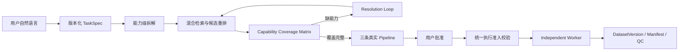

# DataAgent 开发接手文档 v5

> 交接日期：2026-07-20  
> 仓库：`D:\newDataAgent`  
> 当前分支：`codex/hybrid-operator-retrieval`  
> 代码基线：`1903362 fix: translate control plane errors in TUI`  
> 上一版文档：`DataAgent-development-handoff-2026-07-20-v4.md`  
> 当前回归基线：`82 passed, 1 warning`  
> 文档定位：记录 v4 之后围绕真实 Pipeline 展示、TaskSpec 修订、对话降级、Candidate 执行准入和 Remote VLM 运行配置所做的修改与结论

## 1. 我们在做什么

DataAgent 是一个面向图片数据生产的本地 Agent 控制平面。用户用自然语言描述图片目录和目标，系统将需求固化为版本化 `TaskSpec`，拆成能力 DAG，从 Native、Model 和 Data-Juicer Provider Catalog 中检索真实算子，生成三条可解释、可批准、可执行的 Pipeline，最后由独立 Worker 产出不可变的 `DatasetVersion`、manifest 和运行证据。

当前重点不是让对话模型“描述一个看起来合理的处理流程”，而是确保用户看到的每个任务、算子、参数、运行状态和错误都来自真实持久化对象，并能继续驱动控制平面执行。



持续有效的架构边界：

1. Requirement、Retrieval、Processing、Strategy Agent 负责结构化决策，不直接逐图片执行计算。
2. LangGraph 管理状态、interrupt、checkpoint 和恢复入口。
3. Worker 只执行用户批准且通过统一运行准入校验的版本化 Pipeline。
4. Data-Juicer 继续作为隔离的外部 Operator Provider，不把其源码和依赖直接内化到 DataAgent 主环境。
5. 简单、稳定、确定性的能力优先使用 Native CPU 算子。
6. 复杂语义近期可使用受治理的 Remote Model Operator；专业分割、人脸、美学、水印等长期使用经过评测的专门模型。
7. `Discoverable`、`Matched`、`Executable`、`Candidate`、`Released` 是不同状态，文档和 UI 不得统称为“可用”。
8. 对话文本不能代替领域动作。修改 TaskSpec、批准 Pipeline、提交 Run 都必须对应明确 Intent、状态变更和结果。

## 2. v4 之后讨论和确认的问题

### 2.1 Pipeline 必须展示真实算子流水线

用户之前看到的三条 Pipeline 只有策略名、版本号和 Pipeline ID。对话模型拿不到节点详情后，曾自行生成以下并不存在于当前正式算子库中的名字：

```text
data_loader
format_validator
ai_generated_detector
clarity_assessor
pet_classifier
category_writer
```

这不是 Catalog 检索结果，而是模型根据任务描述补写的自然语言方案。产品上会造成两个严重问题：

1. 用户无法判断 Pipeline 到底能否执行；
2. UI 说使用某个算子，Worker 实际执行另一个算子，破坏可审计性。

现在 Pipeline 审批上下文必须包含真实节点，并在 TUI 中展示：

- 节点顺序；
- 完整 `operator_version_id`；
- Runtime backend；
- 生命周期状态；
- 是否可执行；
- 关键绑定参数；
- 三条策略之间真实存在的阈值和处置差异。

### 2.2 TaskSpec 补充信息必须真正写入 revision

此前用户回答：

```text
1. AI 生成痕迹、明显合成痕迹，不是实拍图
2. 按照常规清晰度
3. 分别输出
```

系统可能把整段回答误判为 `APPROVE`。结果是界面说“已确认”，但持久化 TaskSpec 的 `semantic_requirements` 和 `exclusion_requirements` 仍然为空。

确认的产品原则是：

1. 只有明确的“确认”“同意当前草案”等表达才能批准；
2. 任何包含新约束、新标准、输出要求或修改意见的回答都应进入 `EDIT_TASK_SPEC`；
3. 修改必须生成新的不可变 TaskSpec revision；
4. revision 后重新计算能力需求和后续规划；
5. 系统要再次展示草案并等待明确确认。

### 2.3 “我已经帮你改了”必须对应真实控制动作

此前 Agent 曾回答“我来帮你优先使用 `image_tagging_vlm_mapper` 并重新提交”，但实际没有 TaskSpec 编辑、Operator override 或重新检索动作。用户回复“好”后，系统错误地尝试提交 Run，最终报 `422`。

问题不在措辞，而在控制面没有建立“自然语言承诺 -> 领域命令 -> 状态结果”的闭环。现在必须遵守：

- Agent 不得声称执行了没有落地的修改；
- TaskSpec 修改走 `EDIT_TASK_SPEC`；
- Pipeline 选择走批准 Intent；
- Run 提交前必须已经存在 approved Pipeline；
- 每个动作失败时返回准确阶段和原因，不能继续假装成功。

### 2.4 硬回答来自对话模型失败后的静默降级

用户第一次问“草案内容”或“用了什么算子”时，偶尔得到：

```text
我可以继续回答，也可以帮你创建图片数据生产任务。
```

这段话来自本地 `_fallback_decision`，通常表示模型网关调用失败，或模型没有返回符合 Schema 的结构化结果。旧实现存在三个误导点：

1. 降级原因被吞掉；
2. 消息仍可能标记为 GLM-5.2，无法区分真实模型回答和本地 fallback；
3. 用户不知道控制动作有没有执行。

现在 fallback 必须显式说明：模型未返回有效结果，本轮没有执行控制动作；同时将原因、次数和消息来源写入 Conversation Context 与诊断字段。

### 2.5 关闭 TUI 不等于关闭 API 和 Worker

这轮定位到一个关键运行问题：TUI 只是客户端。用户关闭 TUI 窗口后，旧 API/Worker 进程可能继续运行，因此新打开的 TUI 仍连接旧进程、旧 Catalog 和旧代码。

当时的直接证据是：

- 旧 API 的 Operator Catalog 只有 11 项；
- 新代码在干净构建后应有 233 项；
- 旧 API 中不存在 Remote VLM Variant；
- 因此新 TUI 仍会选中依赖 CUDA 的 `image_tagging_mapper`。

结论：修改 API、Catalog、Runtime 或 Worker 代码后，必须重启对应服务。只退出并重开 TUI 不会完成服务热更新。

### 2.6 Remote VLM 的 Base URL、Endpoint 和 Accelerator 必须分开

Data-Juicer `ChatAPIModel` 将 API Base URL 和请求路径视为两个不同参数：

```text
base_url = https://dashscope.aliyuncs.com/compatible-mode/v1
api_endpoint = /chat/completions
```

此前把完整 URL 填进 `api_endpoint`，会破坏 Provider 的请求拼装。同时 Data-Juicer 的 VLM Mapper 类级别声明了 CUDA accelerator；Remote API 模式若不显式覆盖 `accelerator=cpu`，Catalog Runtime 检查仍会错误报告需要 CUDA。

Remote Variant 当前固定默认值为：

```text
is_api_model = true
api_or_hf_model = qwen3.7-plus
api_endpoint = /chat/completions
model_params.base_url = https://dashscope.aliyuncs.com/compatible-mode/v1
accelerator = cpu
```

### 2.7 DRAFT Candidate 的可执行判断必须全流程一致

此前 Planning 阶段认为 Remote VLM 可执行，但提交 Dataset Run 时又因为 `DRAFT` 被拒绝。根因不是简单的“DRAFT 一律不能执行”，而是多个阶段使用了不同校验逻辑，而且编译后的节点没有物化 Parameter Schema 默认值。

统一后的原则：

1. 默认参数必须在 Pipeline 编译时物化；
2. Retrieval、Planning、Approval 和 Submit 使用同一个 eligibility 入口；
3. Candidate 只有在显式开启受治理执行、Provider 可用、Runtime 满足、I/O 合法且参数校验通过时才可试运行；
4. `DRAFT` 受治理执行不等于 `PERSONAL_RELEASE`；
5. 错误要保留真实 Provider Validation 原因，并对重复节点的相同错误去重。

## 3. 已经完成了什么

### 3.1 真实 Pipeline 节点已进入审批和对话上下文

提交：

```text
783d07d feat: show grounded pipeline operator details
```

已完成：

- Pipeline approval interrupt 携带完整节点；
- TUI 展示真实算子版本、执行顺序、backend、状态和参数；
- Conversation Context 包含真实 Pipeline choices 和节点；
- “用了什么算子”“什么顺序”“三条有什么区别”优先走确定性、可追溯回答；
- 不再让 LLM 根据抽象策略名猜测算子名称；
- 增加 LangGraph、TUI 和 Conversation 集成测试。

对猫狗清洗分类任务，当前 `balanced` Pipeline 的真实能力链为：

```text
1. builtin.decode_check:1
2. builtin.quality_filter:1
3. datajuicer.image_tagging_vlm_mapper.remote_api:1
4. builtin.authenticity_decision:1
5. datajuicer.image_tagging_vlm_mapper.remote_api:1
6. builtin.class_resolution:1
7. builtin.dataset_partition:1
8. builtin.manifest:1
```

两个 Remote VLM 节点用途不同：

1. 第一次判断实拍、AI 生成、合成或不确定；
2. 第二次判断 cat、dog、mixed 或 unknown。

三条策略使用同一条真实能力链，通过参数体现取舍：

| 策略 | 清晰度阈值 | 真实性 uncertain | mixed/unknown |
|---|---:|---|---|
| `retention_first` | 0.35 | keep | keep |
| `balanced` | 0.55 | review | review |
| `quality_first` | 0.75 | reject | reject |

### 3.2 TaskSpec 对话修订闭环已建立

提交：

```text
76146f2 feat: persist conversational TaskSpec revisions
```

已完成：

- 新增 `EDIT_TASK_SPEC` Conversation Intent；
- 用户补充的排除标准、语义要求、硬约束和输出动作可形成结构化 patch；
- patch 生成新的版本化 TaskSpec；
- revision 后重新计算 capability requirements；
- 流程回到 TaskSpec confirmation，而不是误批准或误提交；
- “草案内容”直接读取持久化 TaskSpec，使用确定性展示；
- 对“带修改内容的确认句”增加保护，优先保存修改而不是只执行 approve。

需要注意：闭环机制已经存在，但自然语言 patch 的识别质量仍依赖角色级 Golden Set，不能认为所有表达都已覆盖。

### 3.3 对话 Fallback 已显式并可审计

提交：

```text
04db3c0 fix: make conversation fallbacks explicit and auditable
```

已完成：

- 删除误导性的通用硬回答；
- fallback 明确告知模型未返回有效结构化结果；
- 明确说明本轮没有执行控制动作；
- 消息来源使用真实模型名、`deterministic` 或 `local-fallback`；
- 将 `fallback_count` 和最近失败原因持久化到 Conversation Context；
- API 返回 diagnostics；
- 增加服务端日志和覆盖测试。

没有在 Conversation Service 外层再增加一次整轮重试，因为 Model Gateway 的 HTTP 层已经重试三次。重复叠加重试只会继续放大“问一句等很久”的问题。

### 3.4 Candidate 执行准入校验已统一

提交：

```text
ad70832 fix: unify candidate execution eligibility checks
```

已完成：

- Pipeline 编译时物化 Operator Parameter Schema 默认值；
- Retrieval、规划、批准和提交共享执行 eligibility 逻辑；
- TUI 展示生命周期和 `Runnable` 状态；
- Conversation/API 在批准前做 preflight；
- Provider Validation 返回具体缺失参数和 Runtime 原因；
- 相同算子重复出现时错误去重；
- Remote VLM Candidate 在满足治理开关和 Provider 条件时可以进行受控开发验证。

这修复了“规划时可选、提交时才突然报 DRAFT”的阶段不一致，但没有把该算子提升为正式发布状态。

### 3.5 Remote VLM Provider Runtime 已正确配置

提交：

```text
f680638 fix: configure remote VLM provider runtime
```

已完成：

- 新增 `VISION_API_BASE_URL` 配置；
- API 启动时将 Vision model 和 base URL 注入 Operator Library；
- `image_tagging_vlm_mapper.remote_api` 使用 `/chat/completions` 请求路径；
- Base URL 放入 `model_params.base_url`；
- Remote API Variant 显式使用 `accelerator=cpu`；
- 本地 CUDA Variant 继续保持独立 Runtime Profile；
- `.env.example` 和 `dataagent.local.env.example` 已补配置示例；
- 参数默认值、Provider Validation 和 Pipeline 物化均有测试。

### 3.6 TUI 已翻译控制平面错误

提交：

```text
1903362 fix: translate control plane errors in TUI
```

已完成：

- 不再直接向用户显示裸 `422: ...`；
- 422、连接失败和常见 API 错误转换为清晰中文说明；
- 保留服务端真实 detail，便于定位失败阶段；
- 增加 TUI API Client 测试。

### 3.7 服务和 Catalog 已用新代码重启验证

本轮已重启 API 和 Worker，并确认：

```text
GET /health -> ok
datajuicer provider -> 1.5.3 / available
native provider -> 0.1.0 / available
GET /api/operators?include_drafts=true -> 233 operators
```

当前 233 项由完整 Data-Juicer 发现目录、DataAgent Native Operators 和版本化 Variant 共同组成，因此不要把 233 解释为“233 个正式发布算子”。

Remote VLM 当前可在 Catalog 中看到：

```text
datajuicer.image_tagging_vlm_mapper.remote_api:1
status = DRAFT
runtime = remote
gpu_count = 0
model = qwen3.7-plus
```

旧 TUI 进程不会自动加载新的本地 TUI 代码。使用者应退出旧会话后重新启动 TUI，并创建新 Conversation 和 WorkOrder。

### 3.8 自动化验证已扩展

最后一次完整回归：

```text
82 passed, 1 warning
```

唯一 warning 为 Starlette TestClient 的上游弃用提示，不是业务失败。当前代码变更均已提交，工作区中仍有尚未提交的交接文档文件。

## 4. 当前进行到哪

### 4.1 已经从“会编译”推进到“可解释、可编辑、可统一预检”

v4 时已经具备 Catalog Overlay、VLM Variant、能力拆解、混合检索、候选重排、Coverage Matrix、Resolution Loop 和三条真实 Pipeline 编译。

v5 进一步完成：

| v4 后暴露的问题 | 当前状态 |
|---|---|
| Pipeline 只显示 ID，看不到算子 | 已展示真实节点和策略参数 |
| LLM 编造并不存在的算子名 | 关键查询改为持久化状态驱动 |
| 用户补充条件未写入 TaskSpec | 已支持版本化 `EDIT_TASK_SPEC` |
| Agent 口头说修改但没有领域动作 | 已建立 TaskSpec edit 路径，禁止静默动作 |
| 第一次提问偶发通用硬回答 | 已显式 fallback、来源和诊断 |
| Planning 和 Submit 准入不一致 | 已统一 eligibility |
| Pipeline 缺 Provider 默认参数 | 已在编译时物化 |
| Remote VLM 错判需要 CUDA | 已显式 `accelerator=cpu` |
| Base URL 和 endpoint 混用 | 已拆分配置 |
| TUI 暴露裸 422 | 已翻译为产品化错误 |
| 旧 API 一直加载旧 Catalog | 已重启并验证 233 项 Catalog |

### 4.2 当前可以诚实宣称的能力

在当前配置和服务状态下，系统已经可以：

1. 从自然语言和 Windows 本地路径创建 WorkOrder；
2. 持久化、展示和修订版本化 TaskSpec；
3. 将猫狗清洗分类任务拆成清晰度、真实性、类别识别、分区和 manifest 等能力；
4. 从完整 Provider Catalog 中找到 Remote VLM Variant；
5. 在无 GPU 环境将 `qwen3.7-plus` API 作为远程视觉能力候选；
6. 生成 capability coverage matrix；
7. 覆盖完整后编译三条包含真实算子和真实参数差异的 Pipeline；
8. 在 TUI 中展示完整 Operator 流水线和 Runnable 状态；
9. 在批准和提交前使用一致的执行 eligibility；
10. 对模型降级和控制平面错误给出可审计说明；
11. 保持源图片只读，通过 `DatasetVersion`、分类目录和 manifest 发布结果。

### 4.3 尚未完成的生产验收

以下事项仍不能写成“已经跑通”：

1. 尚未实际消耗百炼额度，对真实 `qwen3.7-plus` 执行一张图片的端到端 Remote VLM 冒烟测试。
2. 尚未用用户的完整猫狗目录跑通真实 Dataset Run，并人工检查 `cats/dogs/review` 或当前 `classes/*` 输出及 manifest。
3. 尚未验证真实 API 返回在 Data-Juicer 1.5.3 中能稳定写入约定的 tag field。
4. 当前一个资产需要两次 VLM 调用，真实性和猫狗分类的成本、延迟和是否可合并仍未评估。
5. Remote VLM 仍为 `DRAFT` Candidate，没有基于 Golden Set 晋升为 `PERSONAL_RELEASE`。
6. 通用 VLM 判断“实拍/AI 生成”只是近期方案，效果不等于专业真实性检测模型。
7. TaskSpec patch 和对话 Intent 尚缺真实用户表达 Golden Set，仍可能出现边界误判。
8. TUI 尚未显示 API/Worker 启动时间、Git SHA、Catalog digest 和配置来源，用户仍不容易判断自己连的是不是新进程。
9. 专业分割、人脸 ID、美学评分、水印识别等算子尚未在独立 GPU Worker 完成模型、许可证、revision、SHA256 和性能评测。
10. Windows/Linux 一条命令安装 Data-Juicer Provider 的 Distribution 层仍按既定计划延后。

### 4.4 当前运行状态

本次交接时确认：

```text
API health: ok
API port: 8000
Provider: datajuicer 1.5.3 available
Provider: native 0.1.0 available
Operator catalog with drafts: 233
```

进程 PID 只代表本次启动实例，不应写进长期配置。接手后应重新使用健康检查和端口检查确认实际进程，而不是依赖本文记录的旧 PID。

### 4.5 新旧 WorkOrder 不会自动迁移

旧 Conversation、WorkOrder 和 LangGraph checkpoint 保留创建时的 TaskSpec、Pipeline 和上下文。升级代码、Catalog 或参数默认值后，旧工单不会自动重编译为新 Pipeline。

验证新功能时必须：

1. 重启被修改的 API/Worker；
2. 退出并重新打开 TUI；
3. 创建新 Conversation；
4. 创建新 WorkOrder；
5. 从 TaskSpec 确认开始重新走流程。

不要拿旧工单继续测试新 Schema，然后把旧状态报错误认为新代码仍未生效。

## 5. 下一步计划

### P0：做一次受控的真实 Remote VLM 冒烟测试

1. 确认百炼 API Key 仅来自本地环境变量，不进入仓库、Pipeline、RunStore 或日志。
2. 准备 1 张尺寸适中的公开或自有测试图片，避免直接对完整数据集产生费用。
3. 创建新 Conversation 和 WorkOrder。
4. 确认检索结果为 `datajuicer.image_tagging_vlm_mapper.remote_api:1`。
5. 检查 Pipeline 中的 `base_url`、`api_endpoint`、model、tag field 和 `accelerator=cpu`。
6. 只运行一张图，确认没有 CUDA 依赖错误。
7. 检查 Data-Juicer 输出字段、RunStore 事件、stderr 摘要、请求耗时和失败重试。
8. 记录真实结果，失败时保留 Provider 原始错误摘要但脱敏 Secret。

这是当前最高优先级，因为自动化测试只能证明契约一致，不能证明真实付费 API、Data-Juicer 和模型响应三者已经联通。

### P1：跑通小型猫狗 Golden Set 的完整 Dataset Run

构建 5 到 20 张人工标注样本，至少包括：

- 清晰猫图；
- 清晰狗图；
- 猫狗同图；
- 无猫无狗；
- 模糊图；
- 插画或明显合成图；
- 难判断图。

验收内容：

1. 三条 Pipeline 显示的算子和 Worker 实际执行一致；
2. retention、balanced、quality 的保留率和 review/reject 行为符合参数；
3. 原目录不被移动、覆盖或删除；
4. 输出目录、manifest、SHA256、标签和决策可追溯；
5. 取消、失败和恢复事件进入 RunStore；
6. 用户可以从 TUI 查看 Run 和结果。

### P2：补运行身份和服务生命周期可见性

TUI 启动时建议显示：

```text
API URL
API started_at
Git commit / build version
Catalog digest / operator count
Provider health
Worker heartbeat
```

同时提供统一 launcher 或 supervisor，避免用户需要分别管理 API、Worker 和 TUI，也避免旧后台进程长期占用端口。开发模式仍可保留三个独立入口，但默认体验应是一条命令启动完整系统。

### P3：建立对话和 TaskSpec Golden Set

至少覆盖：

- “草案内容”“用了什么算子”“为什么不用某算子”等信息查询；
- 明确批准、带补充条件的批准、拒绝和修改；
- “好”“1”“继续”等依赖上文的短回答；
- 模型超时、非 JSON、Schema 不合法和空响应；
- 修改后的重新确认和 Pipeline revision；
- 不允许 Agent 声称执行未发生的动作。

Golden Set 应分别评估 Intent accuracy、TaskSpec patch accuracy、错误动作率和响应延迟。只有角色级评测证明收益后才调整模型路由。

### P4：评估 Remote VLM 的成本和调用结构

当前真实性与类别识别各调用一次 VLM。需要比较：

1. 两次专用 Prompt；
2. 一次结构化 Prompt 同时返回 authenticity 和 class；
3. 先用 Native CPU 筛除明显坏图，再调用 VLM；
4. 低置信度才进入第二次调用或人工 review。

Pipeline 审批前应显示预计资产数、每资产 API 调用次数、预估成本区间和预计耗时。不能在用户不知情时对大目录直接发起付费调用。

### P5：完成 Remote VLM Candidate 准入

满足以下条件后再从 `DRAFT` 晋升：

- Provider Contract Test 通过；
- 小型和扩展 Golden Set 指标达标；
- Prompt revision 固定；
- 输出 JSON Schema 固定；
- 模型和 Provider 版本可追溯；
- 成本、延迟、限流和重试策略已记录；
- Secret 脱敏检查通过；
- 失败和降级行为可恢复；
- 发布证据写入 Operator Registry。

### P6：继续专业模型和 Data-Juicer 准入路线

按照既定边界继续：

1. CPU 图片算子优先批量接入和基线测试；
2. GPU/模型算子先保持 Draft；
3. 在独立 GPU Worker 评测人脸 ID、分割、美学、水印等专业模型；
4. 记录许可证、仓库 revision、权重 SHA256、硬件和性能；
5. 非图片算子保留在 Provider Catalog，但不进入当前图片 Agent 的候选 Pipeline；
6. 通过准入测试后再提升为 `PERSONAL_RELEASE`。

### P7：功能稳定后完成跨平台 Provider Distribution

目标保持不变：另一台没有 `D:\DataAgent\data-juicer-agents` 的 Windows 或 Linux 机器，可通过一条命令安装冻结版本的 Provider，发现完整目录，并准确报告每个算子的 Runtime 和 blocked reason。

不要承诺任意 Windows CPU 单机能本地执行全部 217 个 Data-Juicer 算子。正确目标是完整发现、可治理、可调度，以及在匹配的 Worker 上执行。

## 6. 经验和不要重复踩的坑

### 6.1 TUI 是客户端，不是整个 DataAgent

关闭 TUI 不会保证 API 和 Worker 停止。出现“代码已经改了但行为完全没变”时，先检查端口、进程启动时间、健康状态和 Catalog 数量。

### 6.2 重启时不要用过宽的 PowerShell 命令行匹配

本轮曾用只匹配 CommandLine 的进程过滤，结果命中了正在执行过滤命令的 PowerShell 自身。虽然没有影响源码，但这种方式不可靠。

应先限制 `ProcessName`，再检查 CommandLine；更稳妥的是记录精确 wrapper PID，并用进程树方式停止。任何 kill 前先输出目标 PID、进程名和命令行确认。

### 6.3 新代码必须用新 WorkOrder 验证

LangGraph checkpoint 和持久化 Pipeline 不会因代码升级自动迁移。旧 WorkOrder 继续报旧错误并不能证明新实现无效。

### 6.4 语义检索找不到未加载的 Catalog

Matcher 再准确，也只能在当前 API 已加载的 Catalog 中检索。先验证 Catalog 项数和目标 Operator ID，再分析召回算法。

### 6.5 UI 和 LLM 都必须以持久化领域对象为准

Pipeline 详情来自 `PipelineVersion.nodes`，TaskSpec 来自持久化 revision，Run 状态来自 RunStore。不得让模型根据名称或节点数补写事实。

### 6.6 文本承诺不是控制动作

“我帮你修改”“我替你切换”“现在重新提交”只有在领域命令成功后才能说。每个动作必须有 Intent、输入 Schema、状态迁移、审计事件和失败结果。

### 6.7 TaskSpec 修改和批准必须分开

带新条件的“确认”首先是修改，不是批准。保存 revision 后必须再次让用户确认，避免在用户尚未看到最终规格时进入检索或执行。

### 6.8 不要静默吞掉模型失败

Fallback 必须标记真实来源、失败原因和是否执行动作。模型回答和本地 deterministic/fallback 回答不能使用同一个 model label。

### 6.9 不要在多层叠加重试

Model Gateway 已负责 HTTP 重试。Conversation 层再重跑完整调用会放大延迟、费用和重复动作风险。重试职责必须只有一层负责，并记录次数。

### 6.10 执行准入必须只有一个事实来源

Retrieval、Planning、Approval、Submit 和 Worker 不能分别维护不同的“可执行”规则。共享 eligibility 后，任何阶段展示的 Runnable 都应与提交结果一致。

### 6.11 Provider 默认参数必须在编译时物化

Schema 中存在默认值，不代表 Pipeline 节点已经携带它。正式校验和执行前必须生成完整 normalized parameters，否则会出现前一阶段通过、后一阶段缺参的假冲突。

### 6.12 Base URL 和 API Endpoint 不是一个字段

兼容 OpenAI 的 Provider 通常将 host/base URL 与 request path 分离。完整 URL 填错字段可能直到真实请求时才暴露，必须写 Contract Test。

### 6.13 Remote API 模式也要显式声明 Runtime

同一个上游类可能默认 `_accelerator=cuda`。Remote Variant 必须覆盖 `accelerator=cpu`、`gpu_count=0` 和 remote backend，不能沿用 Local CUDA 元数据。

### 6.14 DRAFT 可试运行不等于正式发布

受治理 Candidate Execution 是开发验证通道。UI 必须同时展示 lifecycle 和 Runnable，不能因为 Runnable=true 就把 DRAFT 描述成已发布。

### 6.15 同一 Pipeline 重复使用同一算子时错误要去重

Remote VLM 在当前链路出现两次。参数或 Provider 故障若相同，应告诉用户它影响两个节点，但错误摘要不要机械重复两遍。

### 6.16 三条 Pipeline 的差异必须是真实参数差异

三条策略可以共享算子顺序，但必须明确显示质量阈值、uncertain、mixed/unknown 等处置差异。不要为了显得不同而编造节点或随意调换无关顺序。

### 6.17 通用 VLM 不等于专业视觉模型

`qwen3.7-plus` 可承担近期受治理的视觉理解和标签生成，但不能因此替代分割、人脸识别、水印检测或经过评测的真实性模型。

### 6.18 不要把自动化测试通过写成真实 API 已跑通

82 个测试证明代码契约和状态流回归通过；没有发生真实付费 API 请求，就不能写“Remote VLM 端到端已验证”。

### 6.19 Secret 只进入执行环境

百炼 Key 不得进入 Catalog、TaskSpec、Pipeline、recipe、manifest、RunStore、日志或交接文档。Provider Executor 只在子进程环境中映射密钥。

### 6.20 原图只读，分类产出新 DatasetVersion

“把猫和狗分开”默认不是移动或删除用户源文件。输出目录必须版本化，处理同名文件、路径穿越、重复运行和 manifest 追踪。

### 6.21 工作区、Commit、Push 和运行进程是四种状态

代码已 commit 不代表文档已 commit；commit 不代表已 push；push 也不代表本地运行进程已加载新代码。每次交接必须分别说明。

### 6.22 不要覆盖历史交接文档

本次用户口头提到“v3 版”，但仓库已经存在 v3 和 v4。为保留版本链，本轮新增 v5，而不是覆盖旧文档。版本号应以仓库现有最高版本继续递增。

## 7. v4 之后的提交记录

```text
783d07d feat: show grounded pipeline operator details
76146f2 feat: persist conversational TaskSpec revisions
04db3c0 fix: make conversation fallbacks explicit and auditable
ad70832 fix: unify candidate execution eligibility checks
f680638 fix: configure remote VLM provider runtime
1903362 fix: translate control plane errors in TUI
```

完整功能分支最近提交：

```text
1903362 fix: translate control plane errors in TUI
f680638 fix: configure remote VLM provider runtime
ad70832 fix: unify candidate execution eligibility checks
04db3c0 fix: make conversation fallbacks explicit and auditable
76146f2 feat: persist conversational TaskSpec revisions
783d07d feat: show grounded pipeline operator details
4097505 feat: compile capability-complete pipeline strategies
2baa087 feat: admit governed remote Data-Juicer candidates
```

本 v5 文档创建时尚未提交。提交和 Push 状态应以接手时的 `git status`、`git log` 和远端查询为准。

## 8. 关键代码入口

按本轮问题阅读：

```text
apps/tui/app.py
  Pipeline 真实节点、Runnable、生命周期和策略差异展示

apps/tui/api_client.py
  HTTP 和控制平面错误翻译

dataagent/application/conversation.py
  Conversation Intent、确定性回答、TaskSpec edit、fallback diagnostics

dataagent/gateway.py
  对话模型结构化输出 Schema 与 Prompt

dataagent/graph/interrupts.py
  TaskSpec confirmation/edit 和 Pipeline approval payload

dataagent/graph/main_graph.py
dataagent/graph/routing.py
  LangGraph 修订和恢复路由

dataagent/application/agent_runtime.py
  Pipeline execution eligibility、Provider validation 和提交前校验

dataagent/agents/processing/nodes.py
  Pipeline 编译和 Operator 默认参数物化

dataagent/operators/providers/proxy.py
  Data-Juicer VLM Remote API / Local CUDA Variant 参数

dataagent/operators/providers/datajuicer.py
  Provider 参数和 Runtime Validation

dataagent/operators/library.py
  Provider Catalog 构建和 Vision 配置注入

dataagent/config.py
apps/api/main.py
  `VISION_API_BASE_URL`、Vision model 和 Runtime 组装
```

关键测试：

```text
tests/unit/test_tui_session.py
tests/integration/test_conversation_flow.py
tests/integration/test_langgraph_flow.py
tests/integration/test_agent_api.py
tests/unit/test_catalog_normalization.py
```

## 9. 接手后的第一小时

### 9.1 确认 Git 和工作区

```powershell
cd D:\newDataAgent
git status --short --branch
git log --oneline --decorate -15
```

不要清理或覆盖未提交的 v4/v5 文档。

### 9.2 确认 API 不是旧进程

```powershell
Get-NetTCPConnection -LocalPort 8000 -State Listen
Get-CimInstance Win32_Process | Where-Object {
    $_.ProcessId -in (Get-NetTCPConnection -LocalPort 8000 -State Listen).OwningProcess
} | Select-Object ProcessId, Name, CreationDate, CommandLine
```

### 9.3 检查服务和 Catalog

```powershell
Invoke-RestMethod http://127.0.0.1:8000/health

$headers = @{ 'x-owner-id' = 'local-user' }
Invoke-RestMethod -Headers $headers `
  http://127.0.0.1:8000/api/operator-providers

$operators = Invoke-RestMethod -Headers $headers `
  'http://127.0.0.1:8000/api/operators?include_drafts=true'
$operators.Count
```

预期基线是两个 Provider available，包含 Draft 的 Catalog 数量为 233。数量不同先检查是否连接旧 API，不要先改 Matcher。

### 9.4 跑回归

```powershell
.\.venv\Scripts\python.exe -m compileall -q dataagent tests
.\.venv\Scripts\python.exe -m pytest -q
git diff --check
```

预期：`82 passed, 1 warning`。

### 9.5 用新会话观察真实 Pipeline

```powershell
.\.venv\Scripts\dataagent-tui.exe --owner local-user
```

使用新 Conversation 创建新 WorkOrder，检查：

1. “草案内容”是否稳定显示持久化 TaskSpec；
2. 补充条件后是否生成 revision 并再次确认；
3. 三条 Pipeline 是否显示 8 个真实节点；
4. 是否命中 `datajuicer.image_tagging_vlm_mapper.remote_api:1`；
5. Remote 节点是否显示 CPU/remote 且 Runnable；
6. 不要直接对大目录开始付费执行，先做一图冒烟。

## 10. 一句话交接结论

DataAgent 已经从“能检索和编译真实算子”推进到“能基于持久化状态修订 TaskSpec、展示真实 Pipeline、审计对话降级并在全流程统一校验 Remote VLM Candidate”；当前最重要的剩余工作不是继续补一层描述，而是用一张图片和一个小型 Golden Set 完成真实百炼 API、Data-Juicer Provider、Worker 和 Dataset 输出的端到端验收，再用证据决定是否晋升该 Operator。
