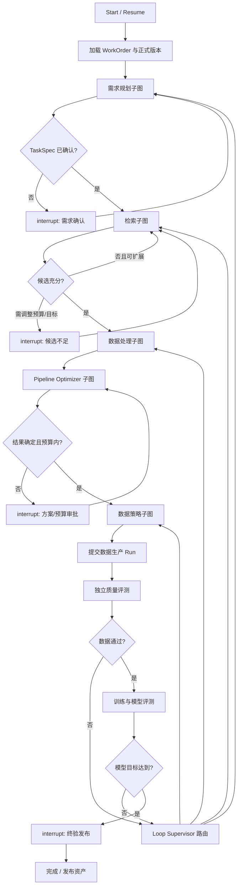

# DataAgent 多模态数据智能生产平台产品需求文档

> 文档版本：v1.1（算子实现与模型运行策略补充稿）  
> 日期：2026-07-17  
> 产品定位：由四个专业 Agent 协作、基于 LangGraph 编排的数据生产闭环平台  
> 主参考：《多模态数据智能生产平台 Agent 闭环设计方案 v1.2》

## 0. 产品结论

DataAgent 是面向模型训练与评测的数据智能生产平台。用户用自然语言描述训练目标、数据要求与验收标准后，平台通过需求规划 Agent、检索 Agent、数据处理 Agent、数据策略 Agent 四个专业 Agent，将需求逐步转换为可执行、可评估、可追溯的数据生产计划；确定性 Engine 负责执行检索、加工、采样、训练与评测；独立 Evaluator 负责验收；Loop Supervisor 根据标准化失败原因将模型反馈路由回正确环节，持续生成新的数据与 Pipeline 版本，直至达到目标或由人工终止。

Agent 工作流统一由 LangGraph 编排。LangGraph 承载多 Agent 子图、持久状态、条件路由、循环、checkpoint、interrupt、恢复与 HITL；平台控制面仍是用户、权限、业务对象、正式版本、任务执行与审计的唯一事实来源。

最终产品必须形成以下完整闭环：

```text
训练目标
-> TaskSpec
-> RetrievalPlan
-> CandidatePool
-> CurationPlan / Pipeline 优化
-> EnrichedCandidatePool
-> SamplingPlan
-> DatasetVersion
-> 独立质量验收
-> 训练与模型评测
-> ModelFeedback
-> 失败归因与定向返工
-> 新 Revision / DatasetVersion
-> 目标达成与正式发布
```

## 1. 产品背景

### 1.1 当前问题

传统数据生产依赖训练人员、数据人员和算法人员多轮人工协作：

1. 反复沟通并拆解模糊需求；
2. 根据个人经验选择数据源、关键词、向量 Query 和召回方式；
3. 手工组合清洗、过滤、分类、去重、加工和采样脚本；
4. 多轮试跑、调阈值和人工检查；
5. 数据交付后等待训练，再人工分析失败样本；
6. 重新决定补数、清洗、配比或需求口径并重跑。

这些过程存在五个结构性问题：

- 需求没有形成可执行、可验收的正式规格；
- 数据生产决策与脚本绑定，经验无法稳定复用；
- Pipeline 生成者往往同时评价自身结果，缺少独立验收；
- 数据结果与模型反馈脱节，返工依赖人工猜测；
- 数据、算子、参数、模型、实验与人工修改缺乏统一版本和血缘。

### 1.2 产品机会

DataAgent 将人工经验沉淀为长期资产：

- 可版本化的 `TaskSpec` 与业务判定口径；
- 可注册、可评测、可组合的 `OperatorSpec`；
- 可检索、可受限修改、可复验的 Pipeline；
- Golden Set、切片评测集和用户审核集；
- 数据版本、训练结果、失败样本簇与模型反馈；
- 失败原因到返工节点的标准路由规则；
- 成功与失败实验的完整历史。

人的工作重点由日常拼脚本和盯任务，转向定义训练目标、处理语义歧义、审核高风险决策和判断最终业务价值。

## 2. 产品愿景、目标与非目标

### 2.1 产品愿景

让训练人员能够以模型目标驱动数据生产，让数据团队的经验被持续沉淀为可复用、可验证、可迭代的智能生产能力。

### 2.2 产品目标

1. 将自然语言训练需求转换为完整、无歧义、可验收的 TaskSpec。
2. 在多个数据源中自动规划召回策略并建立高召回候选池。
3. 根据任务、数据画像与历史资产自动生成并优化数据处理 Pipeline。
4. 根据配额、多样性、难例与模型反馈自动制定数据采样策略。
5. 通过独立 Evaluator 对数据、Pipeline 和模型效果进行量化验收。
6. 通过训练反馈识别检索、处理、分布、难例或目标定义问题，并只返工受影响部分。
7. 使每次人工修改和自动迭代都生成不可覆盖的 Revision。
8. 建设个人与公共算子、Pipeline 能力库，使已验证能力能够安全复用。
9. 保证任何正式交付均可追溯、可复现、可回滚、可审计。

### 2.3 非目标

- 不建设一个无边界、可任意操作生产数据的通用自主 Agent。
- 不允许大模型绕过 Schema、权限、预算、审批和安全检查直接执行。
- 不把 LangGraph 作为图片级计算引擎、权限系统或业务数据库。
- 不宣称 Pipeline Optimizer 能找到数学意义上的全局最优解。
- 不在缺少可信 Golden Set 时宣称真实 Precision、Recall 或模型收益。
- 不允许从互联网发现的代码未经许可检查、隔离测试和人工审批直接进入生产。
- 不以覆盖历史版本的方式“修复”算子、Pipeline、数据集或评测集。

## 3. 用户与角色

| 角色 | 主要目标 | 核心权限 |
|---|---|---|
| 训练人员/需求提出者 | 基于模型目标生产合格数据，控制关键业务口径 | 创建任务、确认 TaskSpec、审核样本、批准预算与全量运行、验收发布 |
| 数据科学人员 | 设计和优化检索、处理与采样策略，分析模型反馈 | 查看实验、调整 Plan、注册个人算子、发布个人 Pipeline、发起公共晋升 |
| 数据工程人员 | 保障数据执行、Adapter、资产血缘与恢复 | 管理受控执行能力、诊断 Run、维护数据源与算子运行环境 |
| 评测人员 | 建设 Golden Set 并独立验收数据与 Pipeline | 管理评测集、审核分歧样本、冻结评测版本、发布 QCReport |
| 管理员 | 管理平台配置、公共资产和审计 | 用户管理、公共算子/Pipeline 审批、审计访问、系统配置 |
| 合规审核人 | 审核数据来源、敏感属性和使用范围 | 对合规风险批准、拒绝或附加约束 |

所有对话、任务、个人算子、个人 Pipeline、实验、报告和产物默认仅 Owner 可见。管理员的系统权限不等同于默认业务内容读取权。

## 4. 产品核心原则

1. **四个 Agent 是专业职责，不是四套独立服务。**它们共享 Runtime 和基础设施，但拥有独立上下文、工具权限和输出 Schema。
2. **Agent 决策，Engine 执行。**Agent 负责理解、规划、解释和建议，Engine 确定性执行数据任务。
3. **生成与评估分离。**数据处理 Agent 不得修改独立 Evaluator 的规则或自行宣布通过。
4. **训练目标驱动。**数据质量不能只看“干净”，还要结合模型总体指标、关键切片和难例收益。
5. **先召回、后加工、再策略选数。**检索、清洗加工和采样配比必须保持职责边界。
6. **先低成本试验，再逐步提高保真度。**Pipeline 优化通过小样本试跑、小规模训练和高保真复验逐级淘汰。
7. **所有正式对象版本化。**TaskSpec、Plan、算子、Pipeline、Golden Set、Dataset 和 ModelFeedback 均不可原地覆盖。
8. **高风险决策由人控制。**目标、语义、合规、新代码、预算超限与正式发布默认需要人工批准。
9. **代理指标必须显式标注。**系统应区分规则结果、模型代理判断、弱标注一致性和人工金标准。
10. **局部返工优先。**失败后只重跑受影响数据切片和节点，不默认全链路重跑。

### 4.1 默认用户闭环

四个 Agent、LangGraph、Pipeline Optimizer 和独立 Evaluator 是系统内部实现。对普通用户，默认主流程必须保持简单、稳定且可预测：

1. 用户登录 DataAgent，创建数据任务并输入自然语言需求。
2. 用户选择本地目录、Milvus Collection 或两者组合。
3. 需求规划 Agent 将需求转换为 `TaskSpec`，明确硬约束、语义约束、输出要求、验收方法及待确认歧义。
4. 用户确认 `TaskSpec` 后，系统优先检索相似历史 Pipeline，再使用已有算子组合候选方案。
5. 系统固定向用户提供三类候选 Pipeline：
   - **保留优先：**降低误删和过度处理风险，保留低置信度样本；
   - **均衡方案：**综合质量、保留量、成本和速度，作为默认推荐；
   - **质量优先：**执行更严格的筛选、检测或加工。
6. 三条 Pipeline 使用同一批 100～300 张代表性图片试跑。
7. 平台展示处理前后图片、保留率、规则通过率、模型评价、失败样例、置信度、耗时和预计 API 成本。
8. 系统选择约 20～50 张边界样本。普通用户只需判断“合格/不合格”，不要求修改 Pipeline、参数或标签。
9. 用户选择一条 Pipeline 并批准全量执行。
10. 全量结果保存为不可变 `DatasetVersion`，选中的 Pipeline 和验收样本进入用户个人资产库。
11. 后续相似需求优先复用历史 Pipeline，但仍需在当前任务的代表性样本上回归试跑。

系统内部可以为每个策略类别生成多个结构或参数变体，并通过小样本实验自动淘汰；但在进入用户对比页面前，必须为每类选出一个代表 Pipeline。用户始终比较三条语义稳定的方案，不需要面对内部搜索产生的大量候选。

## 5. 总体产品架构

```mermaid
flowchart LR
    U["训练人员"] --> WEB["Web 主界面"]
    U --> TUI["Agentic TUI 驾驶舱"]
    WEB --> CTRL["统一控制面"]
    TUI --> CTRL
    CTRL --> LG["LangGraph Agent Runtime"]

    subgraph AG["四 Agent 决策层"]
        RP["需求规划 Agent"]
        RA["检索 Agent"]
        PA["数据处理 Agent"]
        SA["数据策略 Agent"]
    end

    LG --> RP
    RP --> TS["TaskSpec"]
    TS --> RA
    RA --> RPLAN["RetrievalPlan"]
    RPLAN --> RE["Retrieval Engine"]
    RE --> CP["CandidatePool"]
    CP --> PA
    PA --> PC["PipelineCandidates"]
    PC --> PO["Pipeline Optimizer"]
    PO --> EXP["Experiment Manager"]
    EXP --> PE["Independent Pipeline Evaluator"]
    PE --> PO
    PO --> CPLAN["CurationPlan / PipelineRelease"]
    CPLAN --> CE["Curation Engine"]
    CE --> ECP["EnrichedCandidatePool"]
    ECP --> SA
    SA --> SPLAN["SamplingPlan"]
    SPLAN --> SE["Sampling & Processing Engine"]
    SE --> DV["DatasetVersion"]
    DV --> QE["Independent Quality Evaluator"]
    QE --> QR["QCReport"]
    QR --> TE["Training & Evaluation Engine"]
    TE --> MF["ModelFeedback"]
    MF --> LS["Loop Supervisor"]
    LS --> LG
    LS --> HITL["HITL / 终验发布"]
```



### 5.1 分层职责

| 层级 | 负责 | 不负责 |
|---|---|---|
| 用户与人工层 | 训练目标、歧义、敏感决策、预算、终验 | 日常拼接和重复执行 Pipeline |
| 四 Agent 决策层 | 生成结构化 Plan、解释、建议和路由 | 绕过控制面直接修改生产数据 |
| LangGraph 编排层 | 子图、循环、状态、HITL、checkpoint、恢复 | 业务主数据、权限和图片级执行 |
| Pipeline 优化与评测层 | 受控实验、独立评估、候选选择 | 修改业务目标或越权发布 |
| Engine 执行层 | 检索、算子、采样、训练、评测和任务恢复 | 自行改变 TaskSpec |
| 资产与控制面 | 权限、版本、血缘、Registry、审计和正式发布 | 将临时状态作为正式事实 |

## 6. 四个 Agent 产品定义

### 6.1 需求规划 Agent

#### 使命

把训练目标和自然语言数据需求转换为可观测、可执行、可验收的 TaskSpec，并在目标或口径冲突时主动暂停流程请求人工确认。

#### 输入

- 用户自然语言需求与附件；
- 模型任务、当前基线、目标指标与关键失败切片；
- 历史同类 TaskSpec 和已验证判定手册；
- 数据权限、预算、时限和合规约束；
- 后续迭代中的 ModelFeedback 与失败证据。

#### 输出

- `TaskSpecDraft`；
- `AmbiguityList`；
- `AcceptancePlan`；
- 用户确认后的不可变 `TaskSpecVersion`；
- 目标变更时的 `TaskSpecRevisionProposal`。

#### 核心能力

1. 区分训练目标、数据目标、硬约束、语义约束、偏好与验收标准。
2. 识别互相冲突、不可观测、缺少阈值或涉及敏感属性的要求。
3. 将模糊要求转换为视觉代理、元数据证据、人工审核或“不确定”策略。
4. 生成数据规模、类别配额、切片指标和交付标准。
5. 对 ModelFeedback 中的 `TARGET_CONFLICT` 创建规格修改建议。
6. 未经用户确认不得冻结或修改 TaskSpec。

#### 功能验收

- 输出 100% 通过 TaskSpec Schema 校验；
- 必填字段完整率达到冻结门槛；
- 硬约束与偏好不会混淆；
- 不可观测条件不会被描述为可精确判定；
- 敏感属性和合规问题必定进入 HITL；
- 规格修改产生新版本并使受影响的旧实验标记为过期。

### 6.2 检索 Agent

#### 使命

面向高召回候选池规划多路数据检索，保证目标场景、稀有切片和困难样本具有足够覆盖，而不是直接返回最终数据集。

#### 输入

- 已冻结 TaskSpec；
- 数据源目录、向量库、标签库、元数据与权限；
- 历史成功 Query、误检、漏检和失败样本；
- CandidatePool Profiling；
- 预算、时延与候选规模限制。

#### 输出

- `RetrievalPlan`；
- 多路正向、负向和扩展 Query；
- 数据源与召回器选择；
- 合并、去重与来源记录规则；
- 预计召回量、覆盖度、成本与风险；
- `CandidateSufficiencyReport`。

#### 核心能力

1. 将每个目标场景改写为多组关键词、文本向量、图像向量、标签、OCR 和元数据查询。
2. 使用负面 Query 和历史误检降低明显噪声，但不承担最终严格过滤。
3. 对稀有子场景和失败样本近邻扩展召回。
4. 合并多源结果并保留来源血缘。
5. 评估候选是否足以在后续过滤后满足配额和多样性。
6. 候选不足时自动扩展 RetrievalPlan；超过预算或仍不足时进入 HITL。

#### 功能验收

- 每一路召回都有来源、Query、规模、成本和版本；
- CandidatePool 中同一资产可追溯到全部召回路径；
- 无法定位原始资产的检索结果不得进入加工；
- 候选不足时不会直接进入采样；
- `RETRIEVAL_GAP` 能创建定向增量检索，而非整库重复召回。

### 6.3 数据处理 Agent

#### 使命

根据 TaskSpec、候选池画像和算子能力设计清洗、过滤、分类、去重、标注与加工 Pipeline，并通过受控实验寻找当前约束下的近似最优方案。

#### 输入

- TaskSpec；
- CandidatePool Profiling；
- 个人和公共 Operator Registry；
- 历史 Pipeline、参数、成功与失败实验；
- Golden Set、资源、成本与时延限制；
- ModelFeedback 中的处理与标签问题。

#### 输出

- `OperatorRequirement`；
- 三类用户候选及其内部 `PipelineVariant[]`；
- `CurationPlan`；
- 失败时的参数或结构 Revision；
- 通过评测后可发布的 `PipelineRelease`。

#### 核心能力

1. 优先检索历史 Pipeline、个人算子库和公共算子库。
2. 固定生成保留优先、均衡、质量优先三类候选；每类可在内部生成多个合法结构或参数变体。
3. 将处理分为采样前轻量富化与采样后深度加工。
4. 为候选定义算子顺序、参数、条件分支、失败策略和预算。
5. 调用 Experiment Manager 和独立 Evaluator，而不自行打分。
6. 根据误过滤、漏过滤和标签问题只修改相关节点或参数。
7. 能力不足时触发受控算子发现流程，但新代码需安全准入和人工审核。

#### 功能验收

- 所有候选均通过 Pipeline Schema、Operator 契约与权限校验；
- 必选节点不能被 Agent 删除；
- 候选差异可解释且使用相同试验口径；
- 失败候选和失败原因被保留；
- Agent 不得修改 Evaluator 的 Golden Set、门槛或结果；
- 新算子未完成准入前不能进入生产 Pipeline。

### 6.4 数据策略 Agent

#### 使命

从富化候选池中选择哪些数据进入训练、验证和测试集，在配额、质量、多样性、难例、成本和模型收益之间进行受约束优化。

#### 输入

- TaskSpec 与目标配额；
- EnrichedCandidatePool；
- 质量、场景、标签、向量、置信度和来源信息；
- Golden Set 与 ReviewSet；
- ModelFeedback、失败样本、不确定样本与困难样本近邻；
- 训练/验证/测试隔离要求。

#### 输出

- `SamplingPlan`；
- 数据配额和优先级权重；
- 多样性、去重与簇上限；
- 训练/验证/测试拆分计划；
- `DistributionReport`；
- 分布问题的 Revision。

#### 核心能力

1. 满足一级和二级场景配额。
2. 控制来源、主体、背景、风格、质量、标签和视觉簇多样性。
3. 优先模型不确定样本、失败样本近邻和关键困难样本。
4. 抑制连拍、近重复和单一来源主导。
5. 隔离训练、验证和测试集之间的相似资产与同源簇。
6. 候选不足时将具体缺失切片级联回检索 Agent。
7. 根据 `DISTRIBUTION_GAP` 只调整配比与受影响切片。

#### 功能验收

- 配额、权重和多样性约束均可解释；
- 同一资产的多标签计数规则与唯一资产记录分离；
- 数据拆分不存在超过阈值的近重复泄漏；
- 分布调整不擅自扩大召回范围或改变 TaskSpec；
- 每次采样均可使用固定随机种子复现。

## 7. LangGraph Agent 工作流

### 7.1 LangGraph 的产品职责

LangGraph 是四 Agent 协作的统一决策编排层，负责：

- 每个 WorkOrder 的持久 Agent thread；
- 四个 Agent 的独立子图与上下文隔离；
- Plan 生成、验证、执行提交、结果收集与下一步决策；
- 条件分支、循环、重试、局部返工和停止条件；
- `interrupt` 触发的 HITL 暂停与原线程恢复；
- checkpoint、回放、分支 Revision 和故障恢复；
- Agent 调用、工具调用、输入输出和决策依据的审计引用。

LangGraph 不负责：

- 用户认证、Owner 权限和公共资产审批；
- TaskSpec、Pipeline、DatasetVersion 等正式业务对象的最终存储；
- 大规模图片逐张执行；
- 资源调度、预算扣减和外部任务的事实状态；
- Golden Set 指标计算和正式发布。

### 7.2 主图与子图



### 7.3 子图统一节点协议

每个 Agent 子图至少包含：

```text
load_context
-> analyze
-> generate_plan
-> validate_schema
-> validate_constraints
-> persist_draft
-> request_approval_or_submit_run
-> collect_result
-> decide_next
```

子图不得直接修改正式对象。`persist_draft` 仅保存草案；由控制面完成权限检查、版本创建和合法状态迁移。

### 7.4 状态映射

```text
LangGraph thread_id   <-> ConversationThread / WorkOrder
LangGraph checkpoint  <-> Agent 短期决策状态
PostgreSQL 业务对象    <-> TaskSpec / Plan / Pipeline / Dataset 正式事实
Run / NodeRun          <-> Engine 与外部任务状态
Revision               <-> 人工或自动分支产生的正式版本关系
```

`thread_id` 只是状态指针，不是权限凭证。每次读取、恢复和工具调用均由控制面根据当前用户和 WorkOrder 权限授权。

### 7.5 循环与停止条件

每个循环必须具有明确上限和退出条件：

- Schema 自动修复默认 1 次，仍失败则转人工；
- 同一节点幂等重试具有配置上限；
- RetrievalPlan 扩展达到预算、规模或次数上限后暂停；
- Pipeline 搜索在继续实验收益低于阈值或预算耗尽时停止；
- 同一轮自动返工达到上限后转人工；
- 目标达到、用户终止、合规拒绝或不可恢复失败时结束主图。

### 7.6 HITL 与恢复

LangGraph 在以下节点触发 `interrupt`：

- TaskSpec 歧义、敏感属性与不可观测要求；
- 候选不足且需要扩大数据权限、预算或目标范围；
- 引入新算子、外部模型或可执行代码；
- Pipeline 结果统计不确定或指标冲突；
- 全量运行、预算超限和训练任务提交；
- Golden Set 修改、模型效果下降但拟继续；
- TaskSpec 或训练目标变更；
- 正式数据、算子和 Pipeline 发布。

用户可执行：`approve`、`reject`、`edit_spec`、`edit_plan`、`edit_parameters`、`retry_node`、`branch_revision`、`rollback`、`terminate`。恢复时必须使用原 thread 和 checkpoint，同时写入操作者、原因、差异和受影响范围。

## 8. Pipeline Optimizer 与独立评测

### 8.1 Pipeline Optimizer

Pipeline Optimizer 由四部分组成：

1. `Candidate Generator`：固定围绕保留优先、均衡、质量优先三类策略生成候选；每类可从历史模板、个人/公共 Pipeline 和白名单算子生成多个内部变体；
2. `Experiment Manager`：冻结样本、随机种子、模型、训练配置、资源和评测集；
3. `Independent Pipeline Evaluator`：计算模型效果、数据质量、成本、时延、失败率和人工量；
4. `Selection and Stopping Controller`：逐级淘汰、比较统计等价组并执行停止规则。

“当前最优”定义为：在固定任务、候选算子空间、数据规模、预算和评测集下，满足所有硬约束，并按模型效果、数据质量、成本、时延和人工量逐级占优的可复现 Pipeline。

### 8.2 多保真优化流程

```text
生成三类候选及各类内部变体
-> Schema / 权限 / 合规 / 预算预检
-> 在同一批 100–300 张代表性图片上试跑内部变体
-> 每类选出一个代表 Pipeline
-> 三条代表 Pipeline 进入小规模训练或代理模型评测
-> 统计等价性比较并推荐均衡或当前占优方案
-> 用户审核 20–50 张边界样本并最终选择
-> 发布 PipelineRelease
```

### 8.3 硬约束

任一项不满足则候选淘汰：

- 数据格式、分辨率、配额可实现性与文件有效性；
- 必选算子、Pipeline Schema 和输入输出契约；
- 数据权限、隐私、许可证和合规；
- 关键质量最低门槛；
- 已批准的成本、时延和资源上限。

### 8.4 模型效果评估

模型实验候选必须使用相同数据量、模型、训练参数、评测集和资源。默认比较：

```text
ModelScore =
总体核心指标 × 50%
+ 核心场景 Macro 指标 × 30%
+ 最差关键切片指标 × 20%
```

具体模型指标由 TaskSpec 定义，可为 F1、mAP、Recall、准确率、生成质量或业务指标。最差切片必须单独进入选择规则，防止总体指标掩盖严重退化。

### 8.5 数据质量评估

默认维度包括：

- 语义与标签准确性；
- 有效数据率和硬规则通过率；
- 稀有类型覆盖；
- 来源、场景和视觉簇多样性；
- 去重质量与拆分泄漏；
- 难例和不确定样本覆盖；
- 数据量、成本、时延和人工量。

系统不得只优化 Precision 或“干净度”。过严 Pipeline 导致困难样本和稀有类型大量丢失时应受到惩罚。

### 8.6 评测集隔离

- Golden Set 用于算子与数据语义评测；
- Optimization Validation Set 用于 Pipeline 调优；
- Final Holdout Set 只用于最终高保真验证；
- 模型最终测试集不得被 Agent 用于 Query、阈值或 Pipeline 搜索；
- 所有评测集版本和使用记录必须可审计。

## 9. 数据生产与模型闭环

### 9.1 首轮生产

1. 需求规划 Agent 冻结 TaskSpec v1。
2. 检索 Agent 生成 RetrievalPlan v1 并构建 CandidatePool v1。
3. 候选充分性评估通过后进入数据处理 Agent。
4. 数据处理 Agent 生成 PipelineCandidates，Optimizer 选出 CurationPlan。
5. Engine 进行轻量富化，形成 EnrichedCandidatePool。
6. 数据策略 Agent 生成 SamplingPlan。
7. Engine 完成深度加工、采样与数据拆分。
8. 独立 Quality Evaluator 输出 QCReport。
9. 通过后冻结 DatasetVersion v1 并进入训练。

### 9.2 ModelFeedback

训练评测 Engine 必须输出结构化 `ModelFeedback`：

- 模型、训练配置、数据版本和代码版本；
- 总体指标与相对基线变化；
- 关键场景和切片指标；
- 失败样本清单与失败簇；
- 模型不确定样本；
- 与上一数据版本的差异；
- 训练成本、时延和异常；
- 是否达到 TaskSpec 中的目标。

### 9.3 Loop Supervisor

Loop Supervisor 是规则化路由器，不是第五个自主 Agent：

| 原因码 | 路由 |
|---|---|
| `RETRIEVAL_GAP` | 检索 Agent |
| `PROCESSING_FALSE_NEG` | 数据处理 Agent |
| `PROCESSING_FALSE_POS` | 数据处理 Agent |
| `LABEL_QUALITY_ISSUE` | 数据处理 Agent |
| `DISTRIBUTION_GAP` | 数据策略 Agent |
| `HARD_SAMPLE_GAP` | 数据策略 Agent，必要时级联检索 Agent |
| `TARGET_CONFLICT` | 需求规划 Agent + HITL |
| `COMPLIANCE_RISK` | HITL |
| `TARGET_MET` | 人工终验与发布 |

每次路由必须带上失败指标、阈值差距、受影响切片、代表样本、证据置信度、推荐修改对象、预计重跑节点、成本和停止条件。

### 9.4 增量返工

- 检索问题：只追加或替换相关 Query 与候选切片；
- 处理问题：只调整相关算子、阈值或标签节点；
- 分布问题：只修改 SamplingPlan 与受影响配额；
- 目标问题：创建 TaskSpec 新版本，重新确认所有受影响实验；
- 每轮产生新的 CandidatePool、Pipeline、Dataset 与 ModelFeedback 版本；
- DatasetVersion 之间保存父子关系和差异 Manifest；
- 旧版本仍可复现、查看和回滚。

## 10. 算子体系与能力发现

### 10.1 OperatorSpec

每个算子至少包含：

- 唯一 ID、语义版本和 Owner；
- 模态、输入输出 Schema 与参数 Schema；
- 实现类型、代码/模型/容器摘要与依赖锁；
- 模型家族、权重版本、权重哈希、权重许可证和下载策略；
- CPU、GPU、内存、时延和并发要求；
- 适用场景、已知限制和失败策略；
- Golden Set、Precision、Recall、F1 与切片结果；
- 吞吐量、成本、P95 时延与稳定性；
- 来源、许可证、安全扫描和审批记录；
- 成功、失败、边界和输入输出样例。

#### 10.1.1 算子描述与支持样例

算子不能只用名称、参数和指标描述。为了让不熟悉算法的用户理解“这个算子能做什么、在什么情况下可信”，每个可被选择或复用的算子必须提供可视化支持样例。

每个算子详情至少包含：

- 一句话能力说明和面向业务的详细描述；
- 适合解决的问题、不适用条件和可能副作用；
- 输入要求、输出含义和各参数对结果的直观影响；
- 至少一组经过验证的成功样例；
- 正例、负例、边界例和典型失败例；
- 对修改图片的算子展示原图与处理后图片；
- 对筛选、分类或打标算子展示原图、输出标签/分数、保留或删除结论及原因；
- 样例对应的算子版本、参数、任务、数据权限和评测结论；
- “支持过的任务”列表，包括任务类型、数据切片、处理规模、质量指标和是否最终被采用；
- 已知失败场景以及用户在这些场景下应选择的替代算子或人工检查方式。

样例不是静态宣传图，而是绑定真实 `OperatorVersion`、Run 和评测结果的 `OperatorExampleSet`。算子升级后不得沿用未经新版本复验的旧样例；旧样例仍保留在旧版本下。

### 10.2 算子实现与模型选型策略

DataAgent 将“算子业务契约”与“算法或模型后端”分离。Pipeline 依赖稳定的能力、输入输出 Schema 和算子版本，不直接依赖某个模型名称；同一算子可以在不改变上层任务协议的前提下切换 Mock、CPU、本地 GPU 或远程模型后端。

#### 10.2.1 能力实现分层

系统按以下顺序选择成本最低、结果最稳定且满足质量要求的实现：

```text
L0 确定性规则与编码
-> L1 传统 CV 或轻量 CPU 模型
-> L2 开源专用模型
-> L3 多模态大模型
-> L4 人工确认
```

| 层级 | 使用条件 | 典型能力 |
|---|---|---|
| L0 规则/代码 | 结果可由确定性逻辑表达 | 解码、元数据、尺寸、格式、SHA256、pHash、裁剪、缩放、Manifest |
| L1 传统 CV/轻量模型 | 简单视觉统计或 CPU 可稳定完成 | 模糊度、亮度、对比度、黑边、基础 OCR 前处理 |
| L2 开源专用模型 | 任务边界明确且存在成熟专用模型 | 人脸检测与 embedding、美学评分、OCR、目标检测、图像分割、水印定位 |
| L3 多模态大模型 | 开放语义、长尾场景或专用模型低置信度复核 | 复杂业务语义、关系判断、长尾标签、解释与复核 |
| L4 人工确认 | 高风险、规则冲突或置信度不足 | 生物特征身份确认、关键合规判断、边界样本终验 |

能用确定性代码完成的任务不得默认调用模型；存在成熟专用模型时，优先使用专用模型而非通用多模态大模型。多模态大模型主要作为开放语义能力和低置信度回退路径，不承担所有图片的默认批处理。

#### 10.2.2 开源模型选择与准入

GitHub Star、社区评分和公开榜单仅作为候选发现信号，不是自动准入依据。接入前必须同时检查：

- 代码许可证、模型权重许可证和训练数据限制；
- 固定版本、权重来源、SHA256 和可复现评测；
- 在当前任务 Golden Set 和关键数据切片上的实际效果；
- 维护活跃度、已知漏洞、依赖风险和供应链风险；
- CPU/GPU、显存、内存、磁盘、吞吐量和 P95 时延；
- 批量推理、ONNX 或远程服务适配能力；
- 置信度校准、失败模式、隐私和合规风险。

“代码开源”不等于“预训练权重可商用”。模型算子必须分别记录代码与权重的来源和许可证；许可证不兼容、需要单独授权或授权状态不明确的权重不得静默下载或进入生产 Pipeline。

#### 10.2.3 模型按需获取与开发模式

模型算子代码、Schema、注册信息和 Mock 后端可在不下载权重、不安装 CUDA 的环境中完成开发和测试。基础安装不得捆绑大模型权重，真实权重由 Execution Worker 在算子首次实际调用时按需获取。

```text
调用模型算子
-> 检查任务权限、许可证和资源
-> 检查本地模型缓存
-> 缺失时按策略下载并展示进度
-> 校验固定版本和 SHA256
-> 加载后端并复用模型实例
-> 执行推理并记录模型血缘
```

平台至少支持以下运行模式：

- `mock`：默认开发模式，不下载模型，返回结构稳定的模拟结果；
- `cpu`：按需运行轻量模型或 ONNX 后端；
- `cuda`：由具备 GPU 的 Worker 运行本地模型；
- `remote`：通过受控 Adapter 调用远程推理服务。

模型管理必须支持禁止自动下载、离线模式、可配置缓存目录、下载锁、断点恢复、完整性校验、预拉取、清理和版本共存。下载和模型加载只能发生在 Worker，不得阻塞 Web、TUI 或 LangGraph 控制面；运行事件必须展示准备模型、下载进度、缓存命中、加载耗时和失败原因。

#### 10.2.4 代表性模型算子与职责边界

- 人脸检测、特征提取和授权身份库匹配归入 `UNDERSTANDING.face_and_person`；身份匹配必须允许输出 `unknown`，并记录模型版本、阈值和身份库版本。
- 美学评分归入 `UNDERSTANDING.aesthetic_understanding`，只输出分数、维度和置信度；是否保留由后续 `FILTERING.semantic_rule` 决定。
- 图像分割归入 `UNDERSTANDING.segmentation`，输出 mask、类别、区域和置信度引用；使用 mask 抠图或换背景属于下游 `TRANSFORMATION` 或 `ENHANCEMENT`。
- 水印识别归入 `UNDERSTANDING.watermark_detection`。可见文字水印采用 OCR，可见 Logo 或半透明水印采用检测/分割模型，隐形水印使用与嵌入协议匹配的专用 detector；是否剔除由过滤算子决定。
- 理解算子负责产生事实，过滤算子负责业务决策，独立 Evaluator 负责验收，三者不得合并为不可审计的单一判断。

人像 ID 属于敏感生物特征能力。除通用算子准入要求外，还必须具备明确授权、项目级隔离、可审计访问、身份库版本化、数据保留策略和人工复核路径，默认不得发布包含真实身份样例的公共 OperatorExampleSet。

### 10.3 发现优先级

```text
个人算子库
-> 公共算子库
-> 内部模型与历史脚本
-> 配置好的受信外部来源
-> Agent 生成候选代码
```

发现是数据处理 Agent 的受控子流程，不新增长期自治 Agent。任何外部或生成算子都必须先评测后使用。

### 10.4 安全准入

1. 固定来源、版本、许可证和维护状态；
2. 依赖、恶意代码和敏感网络访问扫描；
3. 封装 OperatorSpec 和统一 Adapter；
4. 在无生产凭证、默认断网的非 root 沙箱运行；
5. 限制 CPU、GPU、内存、磁盘、进程和时间；
6. 原始数据只读，输出独立，禁止访问 Docker Socket；
7. 使用脱敏 Golden Set 进行质量、稳定性和资源评测；
8. Agent 生成代码额外执行人工代码审核；
9. 全部通过后先进入个人算子库。

### 10.5 个人与公共算子库

```text
个人草稿
-> 个人测试版
-> 个人正式版
-> 申请公开
-> 管理员复验与审批
-> 公共正式版
-> 升级 / 废弃
```

新算子默认私有。公共版本不可覆盖，升级产生新版本；公共算子用于新任务时仍须在当前任务 Golden Set 上复验。

## 11. Pipeline 资产体系

### 11.1 生命周期

```text
Template
-> Candidate
-> ProbeRun
-> EvaluatedPipeline
-> PersonalPipelineRelease
-> 申请公开
-> PublicPipelineTemplate
```

Pipeline 在以上每个阶段都必须生成并保存独立版本。Agent 重新生成、用户修改节点或参数、试跑、基于审核调整、全量执行、模型反馈返工和回滚，均不得覆盖此前处理流程。

每个 `PipelineVersion` 必须冻结：

- 完整 DAG、节点顺序、条件分支和必选节点；
- 算子、模型、代码、参数和依赖版本；
- 创建来源：模板、Agent、人工修改、自动优化、模型反馈或回滚；
- 父版本、版本差异、修改原因和操作者；
- 绑定的 TaskSpec、样本集、随机种子和数据画像；
- 对应的试跑、全量 Run、指标、成本、失败样例和审批状态；
- 每个节点的代表性输入、输出和处理说明。

用户可以查看完整版本时间线、从任意历史版本创建分支、比较任意两个版本，并明确知道当前全量任务使用的是哪一个不可变 PipelineVersion。

### 11.2 PipelineRelease 内容

- 适用任务、模态、TaskFingerprint 和数据画像；
- DAG、条件分支、算子版本、参数和失败策略；
- Golden Set、模型效果、数据质量与统计区间；
- 成本、时延、失败率、人工量和资源要求；
- 节点级处理前后样例；
- 代表性成功、失败和边界样例；
- 历史任务、人工修改、审批和已知不适用场景。

### 11.3 节点级图片预览

每个 PipelineVersion 在试跑完成后必须生成 `NodePreviewSet`。用户可选择同一张图片，沿 Pipeline 节点逐步查看：

```text
原始图片
-> 节点 1 输入 / 输出
-> 节点 2 输入 / 输出
-> ...
-> 最终图片或最终筛选结论
```

预览要求：

- 原图、上一节点结果、当前节点结果可并排或使用滑块对比；
- 显示尺寸、格式、文件大小等可量化变化；
- 显示标签、分数、置信度、保留/删除结论及原因；
- 对未修改像素的检测、分类、筛选算子，用覆盖层、标签卡或区域框展示变化；
- 对被删除或阻断的图片，展示停止节点和具体规则，不只显示“未通过”；
- 支持在不同 PipelineVersion 间对比同一张图片；
- 支持查看代表性成功、失败、边界和随机样例；
- 预览必须绑定真实试跑产物，不允许只用 Agent 生成的文字模拟结果。

正式 DatasetVersion 必须保留可回溯到节点产物或节点判定的血缘。考虑存储成本，中间图片可按保留策略归档，但其哈希、参数、判定、缩略图和重建信息不得丢失。

### 11.4 相似检索与复用

新需求到来时：

```text
相似 Pipeline 检索
-> 硬约束与权限过滤
-> 历史效果排序
-> Agent 受限修改
-> 少量新候选
-> 当前任务小样本复验
-> Pipeline Optimizer 重新选优
```

历史成功只用于缩小搜索空间，不能替代当前任务评测。

## 12. Golden Set 与人工评测

### 12.1 Golden Set 建设

每类任务的 Golden Set 应覆盖：

- 核心正例、相似负例、边界例和不确定例；
- 所有重要一级和二级切片；
- 硬规则边界、数据损坏与异常输入；
- 模型常见失败、低置信度和评估器分歧样本；
- 历史闭环中的新增失败簇。

### 12.2 标注流程

1. 建立图文判定手册；
2. 关键标签双人独立标注；
3. 分歧由第三人或业务专家仲裁；
4. 允许 `uncertain`；
5. 统计一致性并修订说明；
6. 冻结 Golden Set 版本；
7. 新增失败样本经审核后进入新版本，不污染旧版本。

### 12.3 无 Golden Set 场景

系统只能展示规则检查、模型代理指标、弱标注一致性和用户审核样本，不得声称真实准确率。系统应通过主动选择低置信度、评估器分歧、关键切片和随机对照样本，逐步建立最小验收集。

## 13. 产品功能需求

### 13.1 双入口、工作台与任务

| 编号 | 需求 |
|---|---|
| FR-WO-01 | 用户可用自然语言创建 WorkOrder，并绑定训练目标、数据范围、预算和交付要求 |
| FR-WO-02 | 工作台展示 LangGraph 当前节点、四 Agent 进度、等待人工事项、Run 状态和版本链 |
| FR-WO-03 | 用户可查看每个 Agent 的输入摘要、结构化输出、验证结果和决策依据 |
| FR-WO-04 | 对话、消息、附件、样例和运行默认仅 Owner 可见 |
| FR-WO-05 | 任何计划修改、审批、拒绝、回滚和终止均生成审计事件 |
| FR-WO-06 | Web 与 TUI 共享同一 WorkOrder、ConversationThread、LangGraph thread、权限、正式版本和 Run 状态 |
| FR-WO-07 | 用户可在 TUI 中持续提需求、追问、查看摘要、诊断异常和控制任务，不需要为普通文本交互切换页面 |
| FR-WO-08 | 进入图片理解、Pipeline 同图对比或批量审核时，TUI 返回摘要和带上下文的 Web 深链接 |
| FR-WO-09 | Web 完成审核或审批后恢复对应 LangGraph interrupt，TUI 在原对话中收到结果并继续流程 |
| FR-WO-10 | TUI 可调用系统默认图片查看器打开单张授权图片，但不承担跨终端批量内嵌图片审核 |

### 13.2 规格与计划

| 编号 | 需求 |
|---|---|
| FR-PLAN-01 | 支持 TaskSpec、RetrievalPlan、CurationPlan、SamplingPlan 的创建、Schema 校验和版本化 |
| FR-PLAN-02 | 草案与正式版本分离，Agent 不能直接覆盖正式版本 |
| FR-PLAN-03 | 页面支持版本差异、父子关系、受影响对象和过期实验提示 |
| FR-PLAN-04 | 所有 Plan 均可查看预计规模、成本、时延、风险与执行节点 |
| FR-PLAN-05 | 用户修改 Plan 后必须创建 Revision，并选择局部重跑或从指定节点分支 |

### 13.3 数据源与候选池

| 编号 | 需求 |
|---|---|
| FR-DATA-01 | 支持通过 Adapter 接入向量库、对象存储、文件系统、标签库和业务数据库 |
| FR-DATA-02 | 数据源首次接入时探测 Schema、权限和资产映射 |
| FR-DATA-03 | 原始数据只读，平台只保存 URI、哈希、标签、版本、权限和血缘引用 |
| FR-DATA-04 | CandidatePool 支持多路召回合并、去重、画像和切片充分性评估 |
| FR-DATA-05 | 无法定位或无权读取原始资产时禁止进入生产 Run |

### 13.4 实验与 Pipeline 优化

| 编号 | 需求 |
|---|---|
| FR-EXP-01 | 固定向用户提供保留优先、均衡、质量优先三类 Pipeline；每类内部变体使用同口径受控实验 |
| FR-EXP-02 | Experiment Manager 固定样本、种子、模型、评测集、资源和训练配置 |
| FR-EXP-03 | 候选详情展示 DAG、参数差异、节点样例、质量、模型效果、成本和风险 |
| FR-EXP-04 | 支持逐级淘汰、统计等价组和停止条件 |
| FR-EXP-05 | 统计不确定、新算子、预算超限或业务指标冲突时进入 HITL |
| FR-EXP-06 | 保存成功与失败实验，后续生成时可检索并避免重复试错 |
| FR-EXP-07 | Agent 生成、人工保存、试跑、参数修改、全量执行和返工均创建不可变 PipelineVersion，不得覆盖前一版 |
| FR-EXP-08 | 每个完成试跑的 PipelineVersion 生成节点级 NodePreviewSet，支持同图逐节点和跨版本对比 |

### 13.5 执行与恢复

| 编号 | 需求 |
|---|---|
| FR-RUN-01 | Engine 根据已批准 Plan 确定性执行，不接受自由文本执行指令 |
| FR-RUN-02 | 支持分片、排队、并发、暂停、恢复、取消、幂等重试和局部重跑 |
| FR-RUN-03 | 显示处理进度、成功/失败/跳过数量、资源、成本和预计剩余时间 |
| FR-RUN-04 | 空输出、异常删除率、损坏产物、模型漂移、预算或资源超限触发熔断 |
| FR-RUN-05 | 外部任务通过 external_run_id 对账，控制面状态是唯一事实来源 |
| FR-RUN-06 | 节点失败时保留成功分片，只重跑失败或受影响分片 |

### 13.6 评测、训练与闭环

| 编号 | 需求 |
|---|---|
| FR-QC-01 | 独立 Evaluator 全量检查硬规则，并基于 Golden Set 与人工抽检评价语义质量 |
| FR-QC-02 | QCReport 包含是否通过、指标、切片、失败 Manifest、原因码、风险和建议返工节点 |
| FR-QC-03 | 训练 Engine 使用冻结的 Dataset、模型、代码、配置和评测集版本 |
| FR-QC-04 | ModelFeedback 包含总体、切片、失败簇、不确定样本、成本和目标达成情况 |
| FR-QC-05 | Loop Supervisor 按标准原因码路由，不作为第五个自主 Agent |
| FR-QC-06 | 每轮闭环产生新 Revision 和版本，不覆盖历史 |
| FR-QC-07 | 目标达到后仍需人工终验才能正式发布 |

### 13.7 能力中心与治理

| 编号 | 需求 |
|---|---|
| FR-CAT-01 | 算子详情展示业务描述、参数、指标、来源、许可证、资源、适用边界和可能副作用 |
| FR-CAT-02 | Pipeline 详情展示流程、节点样例、效果、成本、版本、历史任务和限制 |
| FR-CAT-03 | 个人资产仅 Owner 可见，公共页面只使用授权脱敏样例 |
| FR-CAT-04 | 个人资产可申请公开，管理员检查安全、质量、许可证和数据授权后审批 |
| FR-CAT-05 | 公共版本不可覆盖，支持升级、撤回和废弃并保留审计 |
| FR-CAT-06 | 每个算子版本提供绑定真实 Run 的 OperatorExampleSet，覆盖成功、失败、边界及处理前后结果 |
| FR-CAT-07 | 算子详情展示其支持过的任务、数据切片、使用参数、质量结果和最终采用情况 |
| FR-CAT-08 | 系统按规则、轻量 CPU、开源专用模型、多模态大模型、人工确认的顺序选择满足质量要求的最低成本实现 |
| FR-CAT-09 | 模型算子记录代码与权重的独立许可证、固定版本、SHA256、资源要求和真实任务评测结果 |
| FR-CAT-10 | 开发环境支持 Mock 模型后端和禁止下载模式，无 GPU、无模型权重时仍可完成端到端流程测试 |
| FR-CAT-11 | Worker 支持模型按需下载、缓存、进度事件、并发下载锁、离线模式、预拉取和版本共存 |
| FR-CAT-12 | Pipeline 按能力与 Schema 动态选择算子后端，不将具体模型名称硬编码为业务协议 |

## 14. 页面与交互

### 14.1 双入口产品策略

DataAgent 采用“Web 主界面 + TUI Agent 驾驶舱”双入口。两者不是两套产品，也不分别保存对话和任务状态，而是同一控制面的不同交互界面。

#### Web 主界面负责

- 图片网格、放大、缩放、并排和滑块对比；
- 三条 Pipeline 对同一图片的同步预览；
- 节点级处理前后查看；
- 20～50 张边界样本批量审核；
- 算子样例库与支持过的任务；
- Pipeline DAG、版本差异、血缘图和指标可视化；
- Golden Set、评测报告、审批与正式发布。

#### TUI Agent 驾驶舱负责

- 用自然语言创建、补充和追问需求；
- 与四个 Agent 持续对话并查看结构化摘要；
- 查看 LangGraph 当前节点、运行进度、成本、风险和异常；
- 执行批准、拒绝、暂停、恢复、重试、取消、分支和回滚；
- 诊断失败、查看日志摘要和 ModelFeedback；
- 搜索算子、Pipeline 和历史任务；
- 在需要视觉操作时打开 Web 深链接；
- 必要时调用操作系统图片查看器辅助查看单张图片。

#### 跳转与恢复规则

1. TUI 检测到任务进入图片对比、图片审核或可视化配置节点时，不尝试在终端中复刻完整 Web 体验。
2. TUI 展示任务摘要、待完成动作、样本数量、风险和一个带上下文的 Web 深链接。
3. 深链接至少包含 WorkOrder、当前 Revision、PipelineVersion、目标页面和待处理批次标识；权限仍由服务端校验，链接本身不是授权凭证。
4. Web 操作完成后，由控制面保存 ReviewSet 或 Approval，并恢复相应 LangGraph `interrupt`。
5. TUI 通过事件订阅或状态同步在原 ConversationThread 中显示 Web 操作结果，继续后续对话。
6. 同一动作只允许控制面处理一次，Web 与 TUI 同时提交时使用幂等键避免重复恢复。

#### TUI 图片能力边界

- 不投入大量工程实现跨终端协议兼容的图片网格、滑块和批量审核；
- Kitty、iTerm、Sixel 等终端图片协议可作为可插拔增强，不作为产品依赖和验收门槛；
- 单图查看通过临时授权文件或受控 URL 调用系统默认图片查看器；
- TUI 必须先校验 Owner 和资产权限，不把原始内部路径或长期有效凭证直接暴露给终端；
- 单图外部查看仅为辅助，正式审核结果仍写入 Web/控制面的 ReviewSet。

### 14.2 Web 全局导航

- 工作台；
- 项目与工单；
- 实验；
- 数据版本；
- 算子库；
- Pipeline 库；
- Golden Set；
- 训练反馈；
- 审批中心；
- 管理与审计。

### 14.3 Web 工作台

工作台是主入口，展示：

- 训练目标、当前 TaskSpec 与目标达成情况；
- LangGraph 主图及当前节点；
- 四 Agent 的进度、最近输出和待办；
- CandidatePool、Pipeline、Dataset 与模型版本链；
- 当前运行、资源、成本和异常；
- HITL 审批卡片；
- 最新 QCReport、ModelFeedback 和失败切片；
- 可从指定 checkpoint 分支或局部重跑的操作。

### 14.4 Agent 详情

每个 Agent 页面必须展示：

- 本轮任务和职责边界；
- 使用的上下文版本与工具权限；
- 结构化 Plan 和 Schema 校验；
- 关键判断、证据和置信度；
- 与上一版本的差异；
- 预计执行范围、成本和风险；
- 进入下一节点或请求人工的原因。

不默认展示冗长思维过程，只展示可审计的决策依据和结构化结果。

### 14.5 Pipeline 对比

固定展示保留优先、均衡、质量优先三条代表 Pipeline，支持表格、流程图和样例三种视图，对比：处理前后图片、保留率、规则通过率、模型评价、失败样例、置信度、成本、时延、失败率、人工量、节点差异和统计区间。用户可固定同一张图片，在三条候选中同步逐节点查看结果。内部变体默认折叠，仅供数据科学人员诊断。

### 14.6 图片/数据审核器

- 显示原始资产、派生产物、判定、标签、置信度和节点证据；
- 默认从三条 Pipeline 的分歧、低置信度、关键切片和随机对照中选择 20～50 张边界样本；
- 普通用户默认只执行“合格/不合格”二元判断，可跳过无法判断的样本，不要求修改 Pipeline、参数或标签；
- 数据科学或评测角色可在专家模式中标记 `uncertain`、修订标签并添加原因；
- 支持按切片、来源、置信度、评估器分歧和失败原因分层审核；
- 键盘快捷操作、自动保存和断点恢复；
- 审核结果自动形成版本化 ReviewSet。

### 14.7 版本与血缘

以时间线和有向图展示 TaskSpec、Plan、Operator、Pipeline、CandidatePool、Dataset、训练与 ModelFeedback 的父子关系、差异和审批。Pipeline 的每次 Agent 生成、人工保存、试跑、参数调整、全量执行和反馈返工均显示为独立版本节点。用户可从任何版本查看来源、完整流程、节点参数、处理前后图片、下游影响，并可选择两个版本进行流程差异和同图结果对比。

### 14.8 算子详情与样例库

算子详情页必须优先帮助用户理解能力，而不是只展示技术元数据：

- 顶部展示一句话描述、适用任务、输入输出和风险提示；
- 样例区按成功、失败、边界、处理前后和支持过的任务分类；
- 用户可切换不同参数查看对应的真实历史样例，不生成未经验证的模拟结果；
- 每个样例可追溯到算子版本、PipelineVersion、Run 和评测结论；
- 支持从样例直接打开当时的 Pipeline 节点和上下游处理结果；
- 无可信样例的算子应显示“尚未验证”，不能以正式能力推荐给普通用户。

## 15. 核心数据对象

| 对象 | 核心内容 |
|---|---|
| `ConversationThread` | Owner、项目、LangGraph thread、可见性和消息引用 |
| `WorkOrder` | 训练目标、当前阶段、当前正式版本和 Owner |
| `TaskSpecVersion` | 目标、约束、配额、预算、验收、歧义与确认记录 |
| `RetrievalPlan` | 数据源、Query、召回器、目标规模、合并去重和预算 |
| `CandidatePoolVersion` | 资产引用、召回血缘、画像、切片和充分性报告 |
| `OperatorSpec` | 算子契约、版本、实现、指标、资源、安全与限制 |
| `OperatorExampleSet` | 算子版本的成功、失败、边界、处理前后样例及历史支持任务 |
| `PipelineVersion` | DAG、算子版本、参数、条件、任务指纹、实验和发布状态 |
| `NodePreviewSet` | PipelineVersion 中同一资产的节点级输入、输出、标签、判定与缩略图 |
| `CurationPlan` | 轻量富化、深度加工、失败策略和资源计划 |
| `SamplingPlan` | 配额、权重、多样性、难例、拆分和随机种子 |
| `Experiment` | 冻结配置、候选、样本、种子、Run 和比较结论 |
| `Run/NodeRun/ShardRun` | 状态、输入、输出、进度、成本、错误、检查点与外部任务 ID |
| `GoldenSetVersion` | 样本、标签、手册、一致性、分歧和用途 |
| `ReviewSetVersion` | 用户审核、理由、版本和审核者 |
| `QCReport` | 数据指标、切片、失败样本、原因码、风险和通过结论 |
| `DatasetVersion` | Manifest、产物、血缘、报告、拆分和确认记录 |
| `TrainingRun` | Dataset、模型、代码、配置、资源和运行结果 |
| `ModelFeedback` | 总体/切片指标、失败簇、不确定样本和目标状态 |
| `Revision` | 父版本、原因、差异、操作者、影响范围和审批 |
| `PromotionRequest` | 个人资产公开申请、评测、安全与审批 |
| `AuditEvent` | 操作者、动作、对象、原因、结果、时间和请求来源 |

## 16. 状态机

### 16.1 WorkOrder 状态

```text
DRAFT
-> SPEC_PLANNING
-> WAITING_SPEC_APPROVAL
-> RETRIEVING
-> CURATION_PLANNING
-> PIPELINE_EXPERIMENTING
-> WAITING_PIPELINE_APPROVAL
-> DATASET_RUNNING
-> QUALITY_EVALUATING
-> TRAINING
-> MODEL_EVALUATING
-> LOOP_ROUTING
-> WAITING_FINAL_APPROVAL
-> COMPLETED
```

任一执行阶段可进入 `PAUSED`、`RETRYING`、`FAILED` 或 `CANCELLED`。只有控制面能执行合法状态迁移；LangGraph 产生的是迁移请求和决策上下文。

### 16.2 Pipeline 状态

```text
TEMPLATE -> CANDIDATE -> PROBE_RUNNING -> EVALUATED -> PERSONAL_RELEASE
-> PENDING_PUBLIC_REVIEW -> PUBLIC_RELEASE -> DEPRECATED
```

### 16.3 Operator 状态

```text
DRAFT -> SCANNING -> SANDBOX_TESTING -> EVALUATED -> PERSONAL_RELEASE
-> PENDING_PUBLIC_REVIEW -> PUBLIC_RELEASE -> DEPRECATED
```

## 17. 权限、安全与合规

### 17.1 Owner 权限

- Owner 由服务端写入，客户端不能指定他人；
- 所有读取、搜索、更新、Run 和导出均按 Owner 或项目角色过滤；
- 消息、日志、附件、样例和产物继承 WorkOrder 权限；
- 管理员审计接口与普通业务接口分离；
- 数据库使用统一 Repository 守卫或行级安全；
- LangGraph thread 的创建、读取、恢复和搜索必须执行相同授权。

### 17.2 数据安全

- 原始数据只读，不原地删除、修改或覆盖；
- 平台数据库不存储大规模原始数据，只保存引用、摘要、标签、权限和血缘；
- 派生产物写入独立版本目录或对象存储前缀；
- Secret 只从环境或 Secret Manager 加载，不进入日志、数据库和前端；
- 导出、公共样例和跨项目使用均需数据授权检查。

### 17.3 合规

- 数据来源、许可证、用途和保留期限可记录并校验；
- 涉及敏感属性的自动判定必须获得合规批准，优先使用授权元数据与人工复核；
- 低置信度和争议性判断允许标记不确定；
- 公共能力展示只使用授权且脱敏的样例；
- 合规拒绝为主图终止条件，不能由 Agent 自动绕过。

## 18. 非功能需求

### 18.1 可靠性

- LangGraph checkpoint、业务版本和外部 Run 可对账恢复；
- Agent Runtime、控制面或 Worker 重启不丢失正式状态；
- Run、NodeRun 和 ShardRun 具有幂等键；
- 部分失败只重跑失败分片；
- 自动重试、自动修复和循环均有上限；
- 已冻结版本不可覆盖；
- 外部任务状态丢失时可用 external_run_id 恢复。

### 18.2 性能与扩展性

- 控制面支持多个并发 WorkOrder；
- 大规模数据通过外部 Engine、云任务或 Worker 执行；
- 图片级任务不得占用 LangGraph 节点；
- CandidatePool、Manifest 和评测结果支持分页与分区；
- GPU Worker、向量库、对象存储、训练平台和新模型通过 Adapter 横向扩展；
- 工作台常规查询 P95 小于 2 秒，长任务异步执行。

### 18.3 可观测性

- WorkOrder、LangGraph Run、业务 Run、节点、分片和模型调用具有统一 Trace 关联；
- 记录 Agent 输入版本、输出、Schema 结果、工具调用与决策原因；
- 展示队列、资源、成本、成功率、恢复率、失败原因与循环次数；
- 日志脱敏且不输出完整数据凭据；
- 正式指标绑定具体数据、Pipeline、模型和评测集版本。

### 18.4 可替换性

- 模型通过 `ModelGateway` 接入；
- 数据源、执行系统、训练平台与算子通过 Adapter 接入；
- 候选生成可由历史模板、规则或第三方 Provider 提供，但必须映射为平台自有 Schema；
- 任一 Provider 移除后，正式业务对象、版本和历史记录仍可读取。

## 19. 指标体系

| 层级 | 核心指标 |
|---|---|
| 需求规划 Agent | 歧义发现率、TaskSpec 完整率、Schema 合法率、人工修改率 |
| 检索 Agent | 目标切片覆盖、候选充分率、增量召回有效率、单位候选成本 |
| 数据处理 Agent | 合法 Pipeline 率、可试跑率、误删/漏删、候选改善率 |
| 数据策略 Agent | 配额达成率、多样性、难例覆盖、拆分泄漏率 |
| LangGraph | checkpoint 恢复率、正确路由率、无效循环率、HITL 命中合理率 |
| Pipeline | ModelScore、DataQuality、成本、时延、失败率、人工量 |
| 数据集 | 硬规则、语义抽检、重复率、分布、血缘完整率 |
| 模型 | 总体指标、关键切片、最差切片、相对基线增益 |
| 闭环 | 归因准确率、局部重跑比例、迭代次数、目标达成率 |
| 平台 | 任务成功率、恢复率、并发、审计完整率、越权拦截率 |
| 复用 | 算子/Pipeline 复用率、回归通过率、节省时间与成本 |

所有质量门槛、统计等价边界和模型目标必须在任务开始时由 TaskSpec 或评测配置冻结。

## 20. 产品验收标准

### 20.1 四 Agent

1. 四个 Agent 具有独立输入上下文、工具权限、输出 Schema 和明确职责边界。
2. 自然语言需求可完整生成并确认 TaskSpec。
3. RetrievalPlan 能构建可解释、可追溯的多路 CandidatePool。
4. 数据处理 Agent 能生成多个合法候选并由独立 Optimizer/Evaluator 选优。
5. 数据策略 Agent 能依据配额、多样性、难例和模型反馈生成可复现 SamplingPlan。
6. Agent 不直接修改生产数据、正式版本、权限或评测结果。

### 20.2 LangGraph

1. 四个 Agent 以子图形式运行在同一 WorkOrder 主图中。
2. 主图支持条件路由、循环、interrupt、checkpoint、恢复、分支与终止。
3. 页面可查看当前节点、等待人工事项、版本引用和下一步原因。
4. Agent Runtime 重启后能从 checkpoint 与控制面正式状态对账恢复。
5. `thread_id` 越权读取、恢复和搜索全部被拒绝。
6. 图片级执行不进入 LangGraph 状态负载。
7. 同一 LangGraph interrupt 可由 Web 完成后在原 TUI ConversationThread 中继续，不创建重复任务或新线程。

### 20.3 Web 与 TUI 双入口

1. 用户可在 TUI 中创建任务、追问、查看状态、诊断失败和控制 Run。
2. Web 与 TUI 展示同一 WorkOrder、正式版本、审批、ReviewSet 和 Run 状态。
3. 图片对比或批量审核时，TUI 能生成带任务上下文的 Web 深链接。
4. Web 完成操作后，LangGraph interrupt 被幂等恢复，TUI 能在原对话继续。
5. TUI 可安全调用系统图片查看器打开单张授权图片。
6. 产品验收不依赖任何特定终端的内嵌图片协议。

### 20.4 数据闭环

1. 能从 TaskSpec 完整运行至 DatasetVersion、QCReport、TrainingRun 和 ModelFeedback。
2. 质量或模型不达标时，Loop Supervisor 使用标准原因码路由至正确 Agent。
3. 返工带有证据、切片、影响范围、成本和停止条件。
4. 增量迭代只重跑受影响部分，并生成新 Revision 和差异 Manifest。
5. 数据与模型均达标后必须经过人工终验才可发布。

### 20.5 Pipeline 与资产治理

1. Pipeline 候选在同样本、同模型、同资源口径下比较。
2. Pipeline Optimizer 保存搜索空间、实验、统计区间和停止条件。
3. 算子和 Pipeline 可发布到个人库、申请公共晋升并版本化升级。
4. 外部或生成算子未经许可证、安全、沙箱、Golden Set 和人工审核不得生产使用。
5. 历史 Pipeline 在新任务复用前必须重新评测。
6. 每个算子版本都能查看真实支持样例、失败样例、边界样例和支持过的任务，且样例可追溯到 Run 与评测结果。
7. Pipeline 每次生成、保存、试跑、修改、全量执行和返工均形成独立不可变版本。
8. 用户能对任意 PipelineVersion 选择图片，逐节点预览处理前后结果，并在两个版本间对比同一图片。
9. 无 GPU 且禁止模型下载时，所有模型算子可通过 Mock 后端完成契约、编排、状态、预览和 QC 流程测试。
10. 首次实际调用模型算子时，Worker 能完成许可检查、按需下载、版本与哈希校验、缓存复用和进度上报。
11. 对同一能力可替换 Mock、CPU、本地 GPU 和远程后端，而不修改 TaskSpec 与 Pipeline 的业务输入输出契约。

### 20.6 安全、追溯与可靠性

1. 正式交付 100% 可追溯到数据源、TaskSpec、四类 Plan、算子、Pipeline、模型、参数、Run、评测和审批。
2. 原始数据在任何成功、失败、恢复、取消和回滚场景下不被修改。
3. 已冻结版本不可覆盖，所有修改形成新版本。
4. 可恢复故障不要求整批任务从头运行。
5. 跨用户与跨项目越权测试全部被拒绝。
6. 无 Golden Set 时不会把代理指标描述为真实准确率。

## 21. 风险与控制措施

| 风险 | 控制措施 |
|---|---|
| 四 Agent 上下文互相污染 | 独立子图、输入裁剪、工具权限和输出 Schema |
| LangGraph 成为业务事实来源 | 正式对象和状态由控制面持久化，checkpoint 只保存决策状态 |
| Agent 生成不可执行 Plan | 模板优先、白名单算子、Schema 与 Constraint Checker |
| 数据处理 Agent 自评 | 独立 Pipeline Evaluator 和 Quality Evaluator |
| Pipeline 对评测集过拟合 | 优化验证集与最终留出集分离，记录所有使用历史 |
| 模型反馈无法归因到数据 | 固定训练配置、切片指标、失败簇、版本差异和对照实验 |
| 闭环无限循环 | 每个循环设置次数、预算、收益和人工升级条件 |
| 大候选池成本过高 | 两段式加工、多保真实验、分层采样和局部重跑 |
| 敏感属性产生偏差和合规风险 | 合规门禁、授权元数据优先、人工复核和不确定标签 |
| Agent 执行互联网代码 | 可信来源、许可证、安全扫描、断网沙箱和人工代码审核 |
| 公共库质量退化 | 管理员审批、版本不可覆盖、任务级复验和废弃机制 |
| 能力中心泄露数据 | Owner 权限、授权脱敏样例和导出审计 |
| 历史 Pipeline 被盲目复用 | TaskFingerprint 过滤与当前任务强制复验 |

## 22. 最终交付形态

1. 基于 LangGraph 的四 Agent 主图和独立子图；
2. 需求规划、检索、数据处理、数据策略四个专业 Agent；
3. Pipeline Optimizer、Experiment Manager、Loop Supervisor 和独立 Evaluator；
4. 数据检索、清洗、富化、采样、版本、训练和评测 Engine；
5. TaskSpec、RetrievalPlan、CurationPlan、SamplingPlan、DatasetVersion、QCReport、ModelFeedback 和 Revision；
6. Golden Set、Optimization Validation Set 与 Final Holdout 管理；
7. 个人/公共 Operator Registry、Pipeline Registry 和晋升治理；
8. 受控能力发现、许可证检查、安全扫描、沙箱评测和人工准入；
9. HITL 审批、LangGraph interrupt、checkpoint、恢复、分支和回滚；
10. Web 主界面、Agentic TUI 驾驶舱、Agent 详情、Pipeline 对比、数据审核、版本血缘和能力中心；
11. Owner 权限、项目角色、审计、Secret、数据授权与合规机制；
12. 向量库、对象存储、数据执行系统、模型服务和训练评测 Adapter；
13. 全链路观测、成本、可靠性和产品效果仪表盘。

## 23. 一句话产品定义

DataAgent 是由 LangGraph 编排四个专业 Agent、以训练目标驱动检索、加工、采样、评测和定向返工，并将每轮决策与结果沉淀为可追溯数据、算子和 Pipeline 资产的智能数据生产闭环平台。
