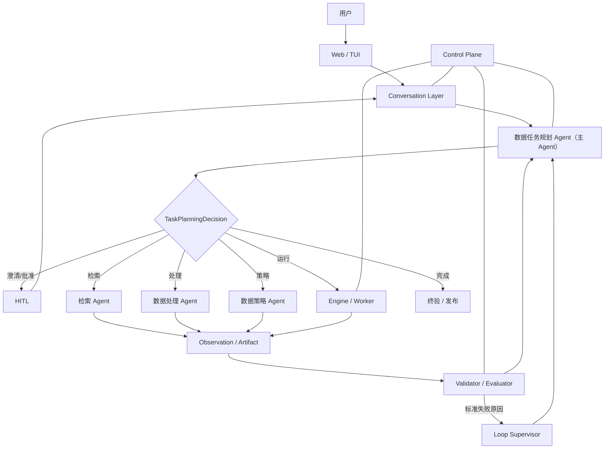
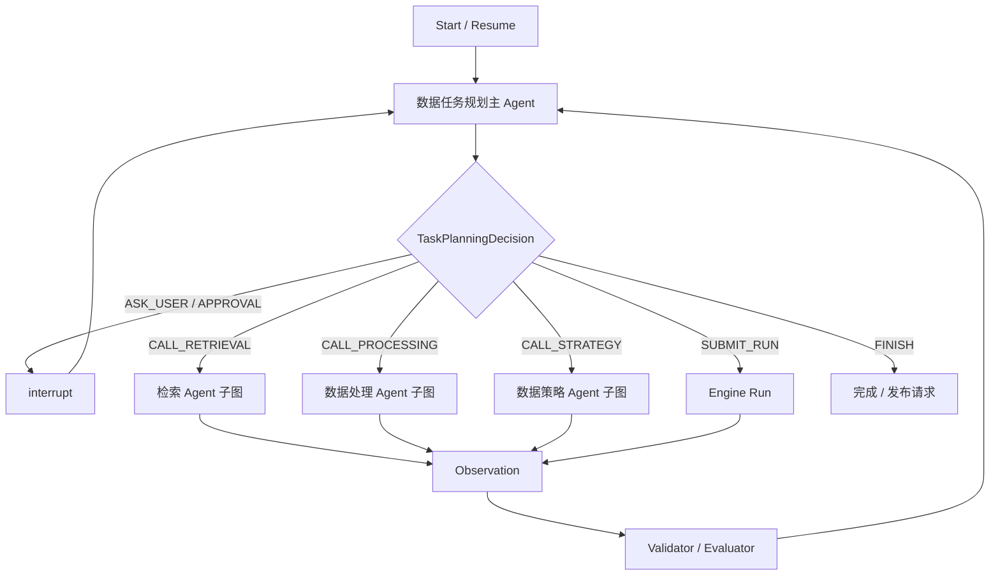

# DataAgent 多模态数据智能生产平台产品需求文档

> 文档版本：v1.2（主 Agent Runtime、Constraint Contract 与可信闭环修订稿）  
> 日期：2026-07-27  
> 上一版本：`DataAgent-final-PRD-v1.1.md`  
> 产品定位：由数据任务规划主 Agent 驱动三个专业 Agent、基于 LangGraph 编排的可信数据生产闭环平台

## 0. 版本结论

### 0.1 v1.2 核心决策

DataAgent 采用“四 Agent、一个主导、三个专业”的结构：

```text
数据任务规划 Agent（主 Agent）
├── 检索 Agent
├── 数据处理 Agent
└── 数据策略 Agent
```

Conversation 不再承担业务智能，而是纯交互运行层：

```text
Conversation Layer
- history
- session
- HITL
- events
```

主 Agent 持续持有用户目标、TaskSpec 和 TaskPlan，根据专业 Agent、Tool、Engine、Validator 与 Evaluator 返回的 Observation 决定下一步。三个专业 Agent 分别负责检索、处理和数据策略领域内的具体决策。

LangGraph 是有状态 Agent Runtime：

- 执行主 Agent 的受控任务级动作；
- 承载四个 Agent 子图；
- 管理条件路由、循环、checkpoint、interrupt、恢复和 HITL；
- 不保存正式业务事实；
- 不执行图片级计算。

Engine 确定性执行已批准 Plan，独立 Evaluator 决定质量门禁，Loop Supervisor 按标准原因码强制路由返工。它们都不是第五个自主 Agent。

### 0.2 v1.2 相对 v1.1 的主要变化

1. 原“需求规划 Agent”升级为“数据任务规划 Agent（主 Agent）”。
2. 主 Agent 在 TaskSpec 确认后继续负责 TaskPlan、专业 Agent 调度、结果汇总、重新规划和完成判断。
3. Conversation 降为会话、HITL 和事件运行层，业务理解迁入主 Agent。
4. 检索 Agent 统一检索：
   - 数据候选；
   - 算子候选；
   - 历史 Pipeline、参数和成功/失败实验。
5. 数据处理 Agent 不直接读取 Operator Registry 或 Pipeline 历史，只消费检索 Agent 输出的候选。
6. 每个自主 Agent 拥有独立、受限、可审计的 Tools。
7. 引入原子化 `ConstraintContract`，作为 TaskSpec、检索、Pipeline、Evidence 和 QC 的共同根对象。
8. Pipeline 可执行性必须通过逐约束 Coverage，不允许“结构合法但语义残缺”的 Pipeline 进入生产。
9. 所有 Agent、Tool 和 Engine 使用统一实时事件协议，计划、活动和正式输出分层展示。
10. `D:\data\yifu` 多约束图片任务作为 P0 Golden Task。

### 0.3 产品完整闭环

```text
用户目标
-> ConstraintContract
-> TaskSpecVersion
-> TaskPlanArtifact
-> RetrievalCandidateBundle
-> RetrievalPlan / CandidatePool
-> OperatorCandidateSet / PipelineExperienceMatches
-> PipelineCandidates
-> CurationPlan / PipelineRelease
-> EnrichedCandidatePool
-> SamplingPlan
-> DatasetVersion
-> QCReport
-> TrainingRun
-> ModelFeedback
-> 定向返工
-> 人工终验与发布
```

每个箭头都必须通过正式 Artifact、版本引用和 Evidence 连接。任何 required Constraint 不得只存在于聊天文本或 Prompt 中。

---

## 1. 产品背景

### 1.1 当前问题

多模态训练数据生产通常存在：

- 需求散落在聊天、文档和脚本中，不能逐条验收；
- 数据、算子和历史 Pipeline 分散，检索与使用职责混乱；
- Pipeline 由固定规则或模板生成，遇到新组合无法自主探索；
- 生成者同时评价自身结果，容易出现假成功；
- 约束在 TaskSpec、能力拆解、算子选择、Pipeline 和 QC 间丢失；
- 长任务只有最终结果，没有实时计划、进度和风险；
- 数据结果与模型反馈脱节，返工依赖人工猜测；
- 数据、算子、参数、模型、实验和人工修改缺乏统一版本和血缘。

### 1.2 已有基础

当前系统已经具备：

- Conversation 与结构化控制动作；
- TaskSpec、Pipeline、Run、DatasetVersion 和 QCReport；
- LangGraph checkpoint 与 interrupt；
- Operator Catalog、Provider 和多种 runtime；
- Worker、逐资产结果、失败隔离、Repair 和 Export；
- 三类 Pipeline 的确定性生成基础；
- Tool Trace 和 Run 终态通知；
- Prompt、模型、参数和 Evidence 的版本引用。

v1.2 不推翻这些基础，而是补齐 Agent Runtime、Constraint Contract 和可信验收链。

### 1.3 产品机会

DataAgent 将人工经验沉淀为长期资产：

- 可版本化的 TaskSpec、Constraint 和判定口径；
- 可检索、可评测、可组合的 Operator；
- 可检索、受限修改、可复验的 Pipeline；
- 成功与失败实验；
- Golden Set、ReviewSet 和失败样本簇；
- Dataset、TrainingRun 和 ModelFeedback；
- 原因码到返工对象的标准路由；
- 可复现的 TaskPlan、Tool Observation 和决策依据。

---

## 2. 产品愿景、目标与非目标

### 2.1 产品愿景

让用户用自然语言提出数据生产目标，系统能够主动澄清、形成正式规格、检索数据与能力、生成和试验三种 Pipeline、执行生产、逐约束验收，并根据数据和模型反馈持续定向改进。

### 2.2 产品目标

1. 完整理解并确认用户目标，不丢失任何 required Constraint。
2. 让用户在后台任务运行前和运行中看到真实计划、进度、风险和待决事项。
3. 让 Agent 根据 Observation 自主选择下一步，而不是依赖固定函数链。
4. 统一检索数据、算子、Pipeline 和实验经验。
5. 固定提供保留优先、均衡、质量优先三类可执行 Pipeline。
6. 使用同样本、同模型、同资源口径试跑和比较方案。
7. 通过独立 Evaluator 逐约束验收数据、Pipeline 和模型效果。
8. 根据标准失败原因只返工受影响环节和数据切片。
9. 使所有正式对象可追溯、可复现、可回滚、可审计。
10. 建设个人和公共 Operator/Pipeline 能力中心。

### 2.3 非目标

- 不建设可任意操作生产环境的通用自主 Agent。
- 不允许大模型绕过 Schema、权限、预算、审批和安全检查。
- 不把 Conversation 作为业务大脑。
- 不把 LangGraph 作为业务数据库、权限系统或图片级计算引擎。
- 不让主 Agent 直接选择具体算子、编排 Pipeline 或决定 Sampling 参数。
- 不让检索 Agent 决定最终 Pipeline。
- 不让数据处理 Agent 直接读取 Registry 或修改 Evaluator。
- 不宣称 Optimizer 能找到数学意义上的全局最优解。
- 不在缺少 Golden Set 时宣称真实 Precision、Recall 或模型收益。
- 不允许互联网代码未经许可、安全和人工审批进入生产。
- 不覆盖历史版本来修复算子、Pipeline、数据集或评测集。

---

## 3. 用户与角色

| 角色 | 主要目标 | 主要权限 |
|---|---|---|
| 训练人员 | 获得满足训练目标的数据版本 | 创建任务、确认规格、选择 Pipeline、提交训练、终验 |
| 数据科学人员 | 调整数据、Pipeline 和实验 | 专家参数、实验分析、版本分支、失败诊断 |
| 数据工程人员 | 维护数据源与执行链 | Adapter、Worker、资源和运行诊断 |
| 算子开发者 | 开发和验证算子 | 个人算子、沙箱测试、晋升申请 |
| 评测人员 | 建设 Golden Set 并独立验收 | 评测集、审核、QCReport |
| 合规审核人 | 审核来源、敏感属性和使用范围 | 批准、拒绝或附加约束 |
| 管理员 | 管理公共资产和系统配置 | 公共晋升、审计和配置，不默认读取业务内容 |

所有对话、任务、个人资产、实验、报告和产物默认仅 Owner 或项目授权角色可见。

---

## 4. 产品核心原则

1. **四 Agent 是专业职责，不是四套独立服务。**
2. **一个主 Agent 持有目标，三个专业 Agent 做领域决策。**
3. **Conversation 只做交互管理，不做业务规划。**
4. **Agent 决策，Engine 执行。**
5. **生成与评估分离。**
6. **Constraint 是全链路根对象。**
7. **检索与使用分离。**检索 Agent 找候选，专业 Agent 使用候选。
8. **先召回、后加工、再策略选数。**
9. **先低成本试验，再提高保真度。**
10. **所有正式对象不可变且版本化。**
11. **高风险决策由人批准。**
12. **代理指标必须显式标注。**
13. **局部返工优先。**
14. **实时活动来自真实事件，不伪造思维过程。**
15. **能由确定性规则完成的任务不得默认交给模型。**

### 4.1 默认用户闭环

1. 用户在 Chat/TUI/Web 输入自然语言需求。
2. Conversation 创建或恢复 ConversationThread，将消息交给主 Agent。
3. 主 Agent 原子化需求并提出必要澄清。
4. 系统展示完整 TaskSpec 和 Constraint 清单，用户确认。
5. 主 Agent 建立 TaskPlan，并调用检索 Agent。
6. 检索 Agent 查询数据、算子和历史 Pipeline/实验。
7. 若缺少能力，系统展示候选外部能力、成本和风险，等待用户批准。
8. 主 Agent 将候选交给数据处理 Agent。
9. 数据处理 Agent 生成三类 Pipeline，并通过受控实验选出每类代表方案。
10. 用户比较三条 Pipeline 并选择。
11. 数据策略 Agent 生成 SamplingPlan。
12. 用户批准运行后，Engine 异步执行。
13. 独立 Evaluator 逐约束验收。
14. 失败时，Loop Supervisor 强制路由到正确专业 Agent，主 Agent 更新计划。
15. 达标后由用户终验和发布。

---

## 5. 总体产品架构



### 5.1 分层职责

| 层级 | 负责 | 不负责 |
|---|---|---|
| UI | 输入、可视化、审核和控制 | 保存正式事实 |
| Conversation Layer | history、session、HITL、events | 业务语义决策 |
| 数据任务规划主 Agent | 目标、TaskSpec、TaskPlan、委派和重新规划 | 专业领域细节和确定性执行 |
| 专业 Agent | 检索、处理、策略领域决策 | 越权修改正式对象 |
| LangGraph Runtime | 子图、状态、循环、interrupt、checkpoint、恢复 | 权限、业务主数据和图片级执行 |
| Validator/Evaluator | Schema、Coverage、质量和发布门禁 | 修改任务目标 |
| Engine/Worker | 检索、处理、采样、训练和评测执行 | 自行改变 Plan |
| Control Plane | 权限、版本、状态、Registry、审计 | 用临时推理替代正式事实 |

---

## 6. Conversation Layer

### 6.1 使命

为用户和 Agent Runtime 提供稳定的会话、事件和人工交互通道。

### 6.2 职责

- 保存 ConversationThread 和消息历史；
- 关联 WorkOrder、LangGraph thread、Run 和用户；
- 关联 HITL 请求与用户回复；
- 转发 Agent、Tool、Engine 和 Evaluator 事件；
- 支持断线重连、幂等恢复和多任务隔离；
- 执行 owner 权限检查；
- 渲染正式事实和最终回复。

### 6.3 不负责

- 解析业务需求并生成 TaskSpec；
- 决定调用哪个 Agent；
- 检索算子或数据；
- 编排 Pipeline；
- 判断任务是否完成。

### 6.4 Interface

```text
receive_message(thread_id, message)
stream_events(thread_id)
resume_interrupt(thread_id, response)
read_thread(thread_id)
```

Conversation 中不得继续增加 `parse_requirement`、`select_operator`、`compile_pipeline` 等业务方法。

---

## 7. 四个 Agent 产品定义

### 7.1 数据任务规划 Agent（主 Agent）

### 使命

持续持有用户目标：先形成完整 TaskSpec，再根据当前正式状态决定调用哪个专业 Agent、是否需要用户、是否重新规划以及任务是否可以结束。

### 输入

- 用户消息、附件和确认记录；
- 模型任务、基线、目标指标和失败切片；
- 权限、预算、时限和合规约束；
- 当前 Constraint、TaskSpec、Plan、Pipeline、Run、QC 和 ModelFeedback 摘要；
- 专业 Agent 的 Artifact、Validator 结论和缺口；
- 当前 TaskPlan、循环次数和待处理 HITL。

### 输出

- `ConstraintContract[]`；
- `TaskSpecDraft`、`AmbiguityList`、`AcceptancePlan`；
- `TaskSpecVersion` 创建请求；
- `TaskPlanArtifact`；
- `TaskPlanningDecision`；
- 专业 Agent 调用请求；
- 用户澄清、选择、批准和完成请求；
- `TaskSpecRevisionProposal`。

### 核心能力

1. 区分目标、硬约束、语义约束、偏好和验收标准。
2. 将自然语言拆成原子 Constraint。
3. 识别冲突、不可观测条件、缺少阈值和合规风险。
4. 维护清晰、可恢复、可展示的 TaskPlan。
5. 根据 Observation 选择下一个专业 Agent。
6. 根据 Validator/Evaluator 结果重新规划。
7. 管理用户确认、能力批准、Pipeline 选择和运行批准。
8. 使用确定性完成门禁，不根据模型文字宣布完成。

### 允许的任务级 Action

```text
ASK_USER
PROPOSE_TASK_SPEC
CALL_RETRIEVAL_AGENT
CALL_PROCESSING_AGENT
CALL_STRATEGY_AGENT
REQUEST_CAPABILITY_APPROVAL
REQUEST_PIPELINE_SELECTION
REQUEST_RUN_APPROVAL
SUBMIT_RUN
WAIT_FOR_RUN
REPLAN
FINISH
FAIL_WITH_ACTIONABLE_GAP
```

### 主要 Tools

```text
read_work_order_facts
read_version_summary
inspect_constraint_status
validate_task_spec_draft
inspect_retrieval_result
inspect_processing_result
inspect_strategy_result
inspect_run_and_qc
persist_task_plan_draft
```

### 不负责

- 生成具体数据 Query；
- 直接检索 Registry；
- 选择具体算子；
- 编排 Pipeline；
- 决定 Sampling 参数；
- 修改 Evaluator；
- 图片级执行。

### 功能验收

- TaskSpec 确认前所有 required Constraint 100% 结构化；
- 用户修改需求后，受影响的下游 Artifact 自动失效；
- 专业 Agent 返回缺口后，主 Agent 能正确重新规划；
- 不合法 TaskPlanningDecision 被 Action Policy 拒绝；
- 相同错误不会无限循环；
- 任务完成必须通过正式完成门禁。

### 7.2 检索 Agent

### 使命

根据主 Agent 的 RetrievalRequest，从数据源、Operator Registry 和 Pipeline/Experiment 历史中高召回查找候选，执行权限过滤、排序、证据整理和充分性判断。

### 检索范围

```text
DATA_CANDIDATES
OPERATOR_CANDIDATES
PIPELINE_EXPERIENCES
HISTORICAL_FAILURES
EXTERNAL_CAPABILITIES
```

### 输入

- TaskSpec、Constraint Contract 和 RetrievalRequest；
- 数据源目录、数据库、向量库、标签库和元数据；
- 个人和公共 Operator Registry；
- 历史 Pipeline、参数、成功/失败实验和发布状态；
- 历史 Query、误检、漏检、失败样本和 ModelFeedback；
- runtime、许可证、权限、预算和时限。

### 输出

- `RetrievalCandidateBundle`；
- `RetrievalPlan`、`CandidatePoolVersion` 和 `CandidateSufficiencyReport`；
- `OperatorCandidateSet` 和逐约束候选 Coverage；
- `PipelineExperienceMatches`；
- `FailureExperienceMatches`；
- `ExternalCapabilityProposal`；
- `RetrievalGapReport`。

### 核心能力

1. 为不同 scope 生成多路检索 Query。
2. 查询本地目录、数据库、向量库、Registry 和历史资产。
3. 合并、去重、权限过滤和保留来源血缘。
4. 按硬约束、任务相似度、历史效果、成本和风险排序。
5. 判断候选是否足以支持后续处理和配额。
6. 候选不足时扩展 Query 或检索源。
7. 达到预算、规模或次数上限时返回 Gap。
8. 外部能力只生成候选和风险报告，不自行安装。

### 主要 Tools

```text
search_operator_registry
inspect_operator_version
search_pipeline_experiences
inspect_pipeline_experiment
search_historical_failures
check_candidate_permissions
check_runtime_and_license
rank_retrieval_candidates
assess_candidate_sufficiency
search_data_sources
submit_retrieval_plan
profile_candidate_pool
search_external_capability
```

### 不负责

- 决定最终 Pipeline；
- 修改算子参数；
- 宣布历史 Pipeline 可直接复用；
- 下载或发布未经批准的代码；
- 修改 TaskSpec；
- 加工生产数据。

### 功能验收

- 每个候选具有来源、版本、权限、成本、风险和证据；
- 数据候选可追溯到全部召回路径；
- 算子候选能映射到 Constraint；
- 历史 Pipeline 的成功和失败证据同时返回；
- Candidate 不充分时不得伪造充分性；
- 数据处理 Agent 不直接访问 Registry 或历史库。

### 7.3 数据处理 Agent

### 使命

使用检索 Agent 返回的数据画像、算子候选和历史 Pipeline 经验，设计清洗、过滤、分类、去重、标注与加工 Pipeline，并通过受控实验寻找当前约束下的近似最优方案。

### 输入

- TaskSpec 和 Constraint Contract；
- CandidatePool Profiling；
- `OperatorCandidateSet`；
- `PipelineExperienceMatches`；
- 候选参数、成功/失败实验摘要和 Evidence；
- Golden Set；
- 资源、成本和时限；
- ModelFeedback 中的处理和标签问题。

数据处理 Agent 不直接读取个人/公共 Operator Registry、Pipeline Registry 或历史实验库。

### 输出

- `OperatorRequirement`；
- `RetrievalGapRequest`；
- 保留优先、均衡、质量优先三类候选；
- 每类内部 `PipelineVariant[]`；
- `CurationPlan`；
- 参数或结构 Revision；
- `PipelineRelease`。

### 核心能力

1. 检查候选是否覆盖全部 required Constraint。
2. 候选不足时返回 RetrievalGapRequest，由主 Agent 再调用检索 Agent。
3. 生成三类语义稳定、实质不同的 Pipeline。
4. 为 Pipeline 定义算子顺序、参数、分支、失败策略和预算。
5. 区分采样前轻量富化和采样后深度加工。
6. 调用 Experiment Manager 和独立 Evaluator。
7. 根据误删、漏删、标签和成本问题局部修复。
8. 能力不足时提出外部能力检索请求。

### 主要 Tools

```text
inspect_retrieval_candidate_bundle
derive_operator_requirements
compile_pipeline_artifact
validate_pipeline_schema
validate_constraint_node_coverage
validate_parameter_bindings
estimate_pipeline_cost
submit_sample_trial
inspect_trial_result
compare_pipeline_variants
propose_pipeline_repair
persist_pipeline_draft
```

### 禁止 Tools

```text
search_operator_registry
search_pipeline_history
query_database
modify_evaluator_threshold
publish_unapproved_operator
```

### 功能验收

- 每条 required Constraint 映射到 Pipeline Node 和参数；
- 所有候选通过 Schema、Operator、权限和 runtime 校验；
- 三类候选具有真实结构或参数差异；
- 同样本、同模型、同资源口径试跑；
- 失败候选和原因被保存；
- Agent 不得修改 Golden Set、门槛或评测结果。

### 7.4 数据策略 Agent

### 使命

从 EnrichedCandidatePool 中选择进入训练、验证和测试集的数据，在配额、质量、多样性、难例、成本和模型收益间进行受约束优化。

### 输入

- TaskSpec 和配额；
- EnrichedCandidatePool；
- 质量、场景、标签、向量、置信度和来源；
- Golden Set 和 ReviewSet；
- ModelFeedback、失败样本、不确定样本和困难样本近邻；
- 数据拆分隔离要求。

### 输出

- `SamplingPlan`；
- 配额和优先级权重；
- 多样性、去重和簇上限；
- 训练/验证/测试拆分；
- `DistributionReport`；
- `RetrievalGapRequest`；
- 分布问题 Revision。

### 核心能力

1. 满足一级和二级场景配额。
2. 控制来源、主体、背景、风格、标签和视觉簇多样性。
3. 优先模型不确定样本和困难样本。
4. 抑制连拍、近重复和单一来源主导。
5. 隔离训练、验证和测试集的相似资产与同源簇。
6. 候选不足时返回具体缺失切片。
7. 使用固定随机种子复现。

### 主要 Tools

```text
inspect_enriched_candidate_profile
inspect_quota_and_slice_targets
simulate_sampling_plan
validate_quota_coverage
validate_diversity
validate_near_duplicate_leakage
validate_train_eval_isolation
estimate_sampling_yield_and_cost
persist_sampling_plan_draft
```

### 功能验收

- 配额、权重和多样性约束可解释；
- 近重复泄漏低于冻结阈值；
- 不擅自扩大召回范围或改变 TaskSpec；
- 候选不足时返回准确的缺失切片；
- SamplingPlan 可重复生成相同结果。

---

## 8. Agent Runtime 与 Tool Governance

### 8.1 Agent Loop

每个自主 Agent 使用统一运行机制：

```text
Goal
-> Plan
-> Choose Tool / Action
-> Execute
-> Observation
-> Deterministic Validation
-> Re-plan or Finish
```

Agent 必须能根据 Observation 改变下一步；只有固定函数顺序的子图不能被验收为完整 Agent Loop。

### 8.2 统一子图协议

```text
load_context
-> analyze
-> decide
-> call_tool
-> observe
-> validate_schema
-> validate_constraints
-> persist_draft
-> request_approval_or_submit
-> collect_result
-> decide_next
```

子图只保存草案或迁移请求，正式版本由控制面创建。

### 8.3 Tool Contract

每个 Tool 必须声明：

```text
name
version
description
input_schema
output_schema
allowed_agents
required_permissions
side_effect_class
idempotency_key
timeout
retry_policy
cost_policy
preconditions
postconditions
evidence_schema
event_schema
```

`side_effect_class` 至少包括：

```text
READ
DRAFT_WRITE
APPROVAL_REQUIRED
RUN_SUBMISSION
EXTERNAL_INSTALL
```

### 8.4 Tool Runtime

- 调用前检查 Agent、Owner、项目、当前状态和审批；
- 输入和输出必须通过 Schema；
- Secret 和敏感数据必须脱敏；
- 产生 ToolTrace 和 Evidence；
- 有副作用调用必须幂等；
- 重试、超时和预算具有上限；
- 支持安全工具批次并行；
- 外部安装必须经过人工批准。

### 8.5 非 Agent 模块

以下模块保持确定性，不拥有 LLM Tool Loop：

- Conversation Layer；
- Loop Supervisor；
- Validator；
- Evaluator；
- Engine/Worker；
- Control Plane。

Agent 可读取它们的结果或提交受控请求，但不能修改其判定逻辑。

---

## 9. LangGraph 主图

### 9.1 产品职责

LangGraph 负责：

- 每个 WorkOrder 的持久 thread；
- 主 Agent 和三个专业 Agent 子图；
- TaskPlanningDecision 条件路由；
- 循环、重试、局部返工和停止条件；
- interrupt、HITL 和原线程恢复；
- checkpoint、回放、Revision 分支和故障恢复；
- Agent/Tool 输入输出和 Evidence 引用。

LangGraph 不负责：

- 用户认证和 Owner 权限；
- 正式对象最终存储；
- 图片级执行；
- 预算扣减和外部任务事实；
- Golden Set 指标和正式发布。

### 9.2 主图



### 9.3 状态映射

```text
ConversationThread       <-> 用户消息和交互
LangGraph thread         <-> Agent 短期决策状态
TaskPlanArtifact         <-> 可展示、可恢复的工作计划
控制面正式对象             <-> TaskSpec / Plan / Pipeline / Dataset
Run / NodeRun / ShardRun <-> Engine 事实
Revision                 <-> 人工或自动分支
```

### 9.4 循环与停止条件

- Schema 自动修复默认一次；
- 同一 Tool 幂等重试有上限；
- 相同错误指纹重复时触发无进展检测；
- Retrieval 扩展受预算、规模和次数限制；
- Pipeline 搜索受收益阈值和预算限制；
- 自动返工达到上限后转 HITL；
- 合规拒绝、用户终止、不可恢复失败或目标达到时结束。

### 9.5 全局完成门禁

```text
TaskSpec 已确认
AND required Constraint 全部结构化
AND 所需检索候选充分
AND 所选 Pipeline 覆盖全部 required Constraint
AND SamplingPlan 通过校验
AND Run 达到允许终态
AND 每条 required Constraint 有 Evidence
AND 独立 Evaluator 通过
AND 所需人工审批完成
```

---

## 10. Constraint、Coverage 与 Evidence

### 10.1 ConstraintContract

每条原子约束至少包含：

```text
id
source_message_id
source_text_span
kind
subject
operator
value
unit
hard_or_soft
evaluator_type
evidence_requirement
ambiguity
status
```

`evaluator_type` 至少区分：

- deterministic_metadata；
- deterministic_dataset；
- dedicated_model；
- semantic_model；
- human_review。

### 10.2 全链路映射

```text
Constraint ID
-> Retrieval Query / Candidate
-> Capability
-> OperatorCandidate
-> OperatorVersion
-> Pipeline Node
-> Parameter Binding
-> Asset Evidence
-> QC Assertion
```

### 10.3 Coverage Matrix

系统必须生成：

- Constraint-to-Retrieval Coverage；
- Constraint-to-Operator Coverage；
- Constraint-to-Pipeline-Node Coverage；
- Constraint-to-Parameter Coverage；
- Constraint-to-Evidence Coverage；
- Constraint-to-QC Coverage。

Coverage 的根对象是 Constraint，不是贫化后的 capability 字符串。

### 10.4 发布门禁

任一 required Constraint：

- 未进入 TaskSpec；
- 无 evaluator；
- 无候选能力；
- 无 Pipeline Node；
- 参数未绑定；
- 无运行 Evidence；
- 无 QC Assertion；

均必须阻止对应阶段进入 production eligible。

### 10.5 Prompt 职责

- metadata、文件大小、尺寸、宽高比等确定性事实不得交给 VLM；
- dataset 去重不得只写入单图 VLM Prompt；
- semantic_model 只接收其可观察的视觉语义；
- PromptBinding 必须引用 Constraint ID、模型和版本；
- 模型结果必须允许 unknown/uncertain。

---

## 11. 检索体系与 CandidatePool

### 11.1 统一 RetrievalRequest

```text
retrieve(RetrievalRequest) -> RetrievalCandidateBundle
```

主 Agent 指定 scope、目标 Constraint、预算、权限和数量；检索 Agent 隐藏目录、数据库、向量库和 Registry 的实现差异。

### 11.2 数据候选检索

- 多路关键词、文本向量、图像向量、标签、OCR 和元数据 Query；
- 正向、负向和失败样本近邻扩展；
- 合并、去重和来源血缘；
- CandidatePool Profiling；
- 预计过滤后配额和切片充分性；
- 候选不足时定向扩展。

### 11.3 能力和经验检索

- 个人 Operator Registry；
- 公共 Operator Registry；
- 历史 Pipeline；
- 历史参数；
- 成功和失败实验；
- 已知失败切片；
- runtime、许可证和安全状态。

检索结果交给数据处理 Agent，不允许数据处理 Agent 直接读取这些底层资产库。

### 11.4 数据检索 Adapter

支持：

- 本地文件系统；
- Milvus 或其他向量库；
- 业务数据库；
- 标签库；
- 对象存储；
- 外部授权数据系统。

数据库检索由独立实现团队开发时，必须接入相同 RetrievalRequest、RetrievalPlan、CandidatePool 和充分性接口，不得形成平行工作流。

---

## 12. Pipeline Optimizer 与独立评测

### 12.1 组成

1. Candidate Generator；
2. Experiment Manager；
3. Independent Pipeline Evaluator；
4. Selection and Stopping Controller。

### 12.2 三类方案

- 保留优先：降低误删，保留低置信度样本；
- 均衡：综合质量、保留量、速度和成本；
- 质量优先：更严格筛选和加工。

每类可以有多个内部变体，但用户只比较每类一个代表 Pipeline。

### 12.3 多保真实验

```text
生成内部变体
-> Schema/权限/合规/预算预检
-> 同一批 100–300 张代表样本试跑
-> 每类选一个代表 Pipeline
-> 小规模训练或代理评测
-> 统计比较
-> 用户审核 20–50 张边界样本
-> 发布 PipelineRelease
```

### 12.4 硬约束

任一不满足即淘汰：

- required Constraint Coverage；
- 数据格式、分辨率、配额和文件有效性；
- Pipeline Schema、必选节点和 Operator 契约；
- 权限、隐私、许可证和合规；
- 质量最低门槛；
- 成本、时限和资源上限。

### 12.5 评测隔离

- Golden Set：算子和语义评测；
- Optimization Validation Set：Pipeline 调优；
- Final Holdout Set：最终高保真验证；
- 最终测试集不得用于 Query、阈值或 Pipeline 搜索。

---

## 13. 数据生产与模型闭环

### 13.1 首轮生产

1. 主 Agent 冻结 TaskSpec v1。
2. 检索 Agent 检索数据、算子和历史 Pipeline。
3. 候选充分后，数据处理 Agent 生成 PipelineCandidates。
4. Optimizer 选出三类代表方案。
5. 用户选择 Pipeline。
6. Engine 轻量富化形成 EnrichedCandidatePool。
7. 数据策略 Agent 生成 SamplingPlan。
8. Engine 完成深度加工、采样和拆分。
9. Quality Evaluator 输出逐约束 QCReport。
10. 通过后冻结 DatasetVersion 并进入训练。

### 13.2 ModelFeedback

必须包含：

- Dataset、模型、代码和训练配置版本；
- 总体指标与相对基线；
- 关键切片和最差切片；
- 失败样本与失败簇；
- 模型不确定样本；
- 与上一版本差异；
- 成本、时延和异常；
- 是否达到 TaskSpec 目标。

### 13.3 Loop Supervisor

Loop Supervisor 是确定性路由模块：

| 原因码 | RequiredRoute |
|---|---|
| `RETRIEVAL_GAP` | 检索 Agent |
| `PROCESSING_FALSE_NEG` | 数据处理 Agent |
| `PROCESSING_FALSE_POS` | 数据处理 Agent |
| `LABEL_QUALITY_ISSUE` | 数据处理 Agent |
| `DISTRIBUTION_GAP` | 数据策略 Agent |
| `HARD_SAMPLE_GAP` | 数据策略 Agent，必要时级联检索 |
| `TARGET_CONFLICT` | 主 Agent + HITL |
| `COMPLIANCE_RISK` | HITL |
| `TARGET_MET` | 人工终验 |

主 Agent 解释失败并更新 TaskPlan，Loop Supervisor 强制保证路由合法。

### 13.4 增量返工

- 检索问题只修改相关 Query 或候选切片；
- 处理问题只修改相关节点和参数；
- 分布问题只修改 SamplingPlan 和配额；
- 目标问题创建 TaskSpec 新版本；
- 每轮生成新 CandidatePool、Pipeline、Dataset 和 ModelFeedback；
- 旧版本可复现、查看和回滚。

---

## 14. 算子体系与能力发现

### 14.1 OperatorSpec

至少包含：

- ID、版本和 Owner；
- 输入输出及参数 Schema；
- 实现、代码、模型、容器和依赖摘要；
- 模型/权重版本、哈希、许可证和下载策略；
- CPU/GPU/内存/时延/并发；
- 适用场景、限制和失败策略；
- Golden Set 和切片指标；
- 吞吐、成本、P95 和稳定性；
- 来源、安全扫描和审批；
- 成功、失败、边界和处理前后样例。

### 14.2 实现分层

```text
L0 确定性规则
-> L1 传统 CV / 轻量 CPU
-> L2 开源专用模型
-> L3 多模态大模型
-> L4 人工确认
```

优先选择满足质量要求的最低成本实现。

### 14.3 受控能力发现

```text
处理 Agent 发现能力缺口
-> 返回 RetrievalGapRequest
-> 主 Agent 调用检索 Agent
-> 检索外部候选
-> 许可证、资源和风险报告
-> 用户批准
-> 隔离下载和安全扫描
-> Golden Set 评测
-> OperatorSpecVersion
-> 发布到个人 Registry
-> 重新检索和编排
```

### 14.4 模型按需获取

- 基础安装不捆绑大权重；
- 支持 mock、cpu、cuda 和 remote；
- Worker 首次使用时按策略下载；
- 固定版本和 SHA256；
- 下载锁、断点恢复、缓存、离线、预拉取和版本共存；
- Web/TUI/LangGraph 不阻塞等待下载；
- 进度通过统一事件展示。

### 14.5 个人与公共库

```text
个人草稿
-> 个人测试版
-> 个人正式版
-> 申请公开
-> 管理员复验
-> 公共正式版
-> 升级 / 废弃
```

公共版本不可覆盖，当前任务复用前仍需复验。

---

## 15. Pipeline 资产体系

### 15.1 生命周期

```text
Template
-> Candidate
-> ProbeRun
-> EvaluatedPipeline
-> PersonalPipelineRelease
-> PublicPipelineTemplate
```

Agent 生成、人工修改、试跑、全量执行、反馈返工和回滚均创建新版本。

### 15.2 PipelineArtifact

Pipeline 文件至少包含：

- Pipeline ID、版本和策略；
- 绑定 TaskSpec 和 Constraint 版本；
- 完整 DAG、依赖、分支和必选节点；
- OperatorVersion、参数和 runtime；
- Constraint-to-Node-to-Parameter Coverage；
- PromptBinding；
- 成本、资源和失败策略；
- 生成来源、父版本和修改原因；
- Schema 与语义校验结论。

### 15.3 节点级预览

试跑后生成 NodePreviewSet：

- 同图逐节点输入输出；
- 标签、分数、置信度和保留/删除原因；
- 停止节点和具体规则；
- 跨 PipelineVersion 同图对比；
- 真实成功、失败、边界和随机样例；
- 不允许用 Agent 文字模拟预览。

### 15.4 相似检索与复用

```text
检索 Agent 查找相似 Pipeline
-> 权限和硬约束过滤
-> 历史效果与失败排序
-> 数据处理 Agent 受限修改
-> 当前任务小样本复验
-> Optimizer 重新选优
```

---

## 16. Golden Set 与人工评测

### 16.1 Golden Set

覆盖：

- 核心正例、相似负例、边界和不确定样本；
- 重要切片；
- 硬规则边界和损坏输入；
- 模型常见失败和评估器分歧；
- 闭环新增失败簇。

### 16.2 标注

1. 建立图文判定手册；
2. 关键标签双人独立标注；
3. 分歧仲裁；
4. 允许 uncertain；
5. 统计一致性；
6. 冻结版本；
7. 新失败样本进入新版本。

### 16.3 无 Golden Set

只能展示规则结果、模型代理指标、弱标注一致性和用户审核，不得声称真实准确率。

### 16.4 P0 Golden Task：yifu

自然语言要求必须拆为：

```text
C1 width >= 64 px
C2 height >= 64 px
C3 0.3 <= aspect_ratio <= 3.5
C4 1 KB <= file_size <= 20 MB
C5 0 <= face_count <= 2
C6 main_subject_clothing_color == black
C7 deduplicate
C8 publish manifest with evidence
```

验收要求：

- 八条 Constraint 全部进入 TaskSpec；
- metadata 不进入 VLM Prompt；
- face count 有专用能力；
- 黑衣口径经用户确认；
- dedup 策略明确；
- 三条 Pipeline 全覆盖；
- 每图具有逐约束 Evidence；
- 任一缺项不能 production eligible；
- 输出结果通过人工 Golden Label 和确定性复算。

---

## 17. 产品功能需求

### 17.1 WorkOrder 与主 Agent

| 编号 | 需求 |
|---|---|
| FR-WO-01 | 用户可用自然语言创建 WorkOrder |
| FR-WO-02 | Conversation 只管理会话、HITL 和事件 |
| FR-WO-03 | 主 Agent 保存并展示 TaskPlanArtifact |
| FR-WO-04 | 用户可查看已完成、进行中、待处理和阻塞项 |
| FR-WO-05 | 用户补充需求后主 Agent 可重新规划 |
| FR-WO-06 | 每个任务级动作通过 TaskPlanningDecision Schema |
| FR-WO-07 | 非法状态迁移被 Action Policy 拒绝 |
| FR-WO-08 | Web/TUI 共用 WorkOrder、thread、版本、Run 和权限 |
| FR-WO-09 | 所有修改、审批、拒绝和终止生成 AuditEvent |
| FR-WO-10 | 终态主动通知用户 |

### 17.2 Agent 与 Tools

| 编号 | 需求 |
|---|---|
| FR-AGT-01 | 四 Agent 具有独立上下文、Tools、输出 Schema 和停止条件 |
| FR-AGT-02 | Agent 能根据 Observation 改变下一步 |
| FR-AGT-03 | 每个 Tool 声明 allowed_agents 和 side_effect_class |
| FR-AGT-04 | Tool 调用前执行权限、状态和审批检查 |
| FR-AGT-05 | Tool 产生 started/progress/completed/failed 事件 |
| FR-AGT-06 | Agent 不能直接修改正式对象 |
| FR-AGT-07 | 检索 Agent 统一查询数据、算子和历史 Pipeline |
| FR-AGT-08 | 数据处理 Agent 不直接访问 Registry 和历史库 |
| FR-AGT-09 | Specialist 发现缺口时返回请求，由主 Agent 调度 |
| FR-AGT-10 | 相同错误和无进展循环自动转 HITL |

### 17.3 规格、Constraint 与 Plan

| 编号 | 需求 |
|---|---|
| FR-PLAN-01 | 支持 Constraint、TaskSpec、TaskPlan、RetrievalPlan、CurationPlan、SamplingPlan 版本化 |
| FR-PLAN-02 | 每条 Constraint 可追溯到原始用户消息 |
| FR-PLAN-03 | TaskSpec 确认前执行完整性和可观测性校验 |
| FR-PLAN-04 | 所有 Plan 展示规模、成本、时限、风险和执行节点 |
| FR-PLAN-05 | 草案与正式版本分离 |
| FR-PLAN-06 | 修改产生 Revision 并标记受影响对象过期 |
| FR-PLAN-07 | required Constraint 无 Coverage 时禁止进入下一阶段 |

### 17.4 检索与 CandidatePool

| 编号 | 需求 |
|---|---|
| FR-RET-01 | 支持 DATA/OPERATOR/PIPELINE/FAILURE/EXTERNAL scopes |
| FR-RET-02 | 检索结果统一为 RetrievalCandidateBundle |
| FR-RET-03 | 数据源通过 Adapter 接入 |
| FR-RET-04 | CandidatePool 支持多路召回、合并、去重和画像 |
| FR-RET-05 | 所有候选保留来源、权限和版本 |
| FR-RET-06 | 检索 Agent 输出充分性和 Gap |
| FR-RET-07 | 数据处理 Agent 只消费候选 Bundle |
| FR-RET-08 | 无法定位或无权读取的资产禁止进入生产 |

### 17.5 Pipeline 与实验

| 编号 | 需求 |
|---|---|
| FR-EXP-01 | 固定提供保留优先、均衡和质量优先 |
| FR-EXP-02 | 每类允许多个内部变体 |
| FR-EXP-03 | 同样本、种子、模型、评测集和资源试跑 |
| FR-EXP-04 | 逐约束 Coverage、Schema、权限和 runtime 门禁 |
| FR-EXP-05 | 支持逐级淘汰、统计等价组和停止条件 |
| FR-EXP-06 | 保存成功和失败实验 |
| FR-EXP-07 | 每次生成、保存、试跑、修改和运行创建不可变版本 |
| FR-EXP-08 | 试跑后生成 NodePreviewSet |
| FR-EXP-09 | 用户选择的是三条真实 PipelineArtifact |

### 17.6 执行与恢复

| 编号 | 需求 |
|---|---|
| FR-RUN-01 | Engine 只执行已批准 Artifact |
| FR-RUN-02 | 支持分片、排队、并发、暂停、恢复、取消和局部重跑 |
| FR-RUN-03 | stage-aware 并行，不因单个 dataset 节点关闭全链路并行 |
| FR-RUN-04 | 展示进度、计数、资源、成本和 ETA |
| FR-RUN-05 | 空输出、异常删除率、损坏、漂移和预算超限熔断 |
| FR-RUN-06 | 外部任务通过 external_run_id 对账 |
| FR-RUN-07 | 成功分片保留，只重跑失败或受影响分片 |

### 17.7 Evidence、QC 与闭环

| 编号 | 需求 |
|---|---|
| FR-QC-01 | 每条 required Constraint 具有 Evidence |
| FR-QC-02 | Evaluator 全量检查硬规则 |
| FR-QC-03 | 语义质量基于 Golden Set 和人工抽检 |
| FR-QC-04 | QCReport 包含逐约束结论、失败 Manifest 和原因码 |
| FR-QC-05 | Loop Supervisor 规则化路由 |
| FR-QC-06 | 每轮闭环创建新 Revision |
| FR-QC-07 | 目标达到仍需人工终验 |
| FR-QC-08 | 无 Evidence 或 QC 映射时不得显示成功 |

### 17.8 能力中心

| 编号 | 需求 |
|---|---|
| FR-CAT-01 | 算子展示描述、参数、指标、许可证、资源和限制 |
| FR-CAT-02 | Pipeline 展示 DAG、样例、效果、成本和历史任务 |
| FR-CAT-03 | 个人资产仅 Owner 可见 |
| FR-CAT-04 | 公共晋升需安全、质量、许可证和数据授权审批 |
| FR-CAT-05 | 公共版本不可覆盖 |
| FR-CAT-06 | 模型代码与权重许可证独立记录 |
| FR-CAT-07 | 支持 mock/cpu/cuda/remote |
| FR-CAT-08 | Worker 支持按需下载、缓存和进度 |
| FR-CAT-09 | 外部能力批准后才可安装和准入 |

---

## 18. 页面与交互

### 18.1 双入口

Web 与 TUI 是同一控制面的不同界面。

Web 负责：

- 图片网格、同图对比和节点预览；
- Pipeline DAG 和版本差异；
- 边界样本批量审核；
- Golden Set、报告、审批和发布。

TUI 负责：

- 自然语言交互；
- TaskPlan 和四 Agent 进度；
- 工具活动、成本、风险和异常；
- 批准、暂停、恢复、重试、取消和回滚；
- Web 深链接和单图系统查看器。

### 18.2 计划、活动与正式输出分层

1. **Plan**：任务分解、状态和待办；
2. **Activity**：Agent、Tool、Engine 正在执行的真实动作；
3. **Result**：正式 Artifact、结论和下一步。

不展示模型私有 token-by-token 思维链。

### 18.3 统一事件

事件至少包含：

```text
event_id
thread_id
work_order_id
source_type
source_id
stage
status
summary
progress
started_at
ended_at
duration_ms
evidence_ids
error
```

状态：

```text
planned
started
progress
completed
failed
waiting_human
cancelled
```

### 18.4 工作台

展示：

- 当前 TaskPlan；
- Constraint 完整度和 Coverage；
- 四 Agent 状态、最近 Observation 和待办；
- 当前 Tool 和 Run；
- CandidatePool、Pipeline、Dataset 和模型版本链；
- 资源、成本、ETA 和异常；
- HITL 卡片；
- QC、ModelFeedback 和失败切片；
- 从 checkpoint 分支和局部重跑。

### 18.5 Agent 详情

- 本轮目标和职责；
- 输入 Artifact 版本；
- 可用 Tools 和实际调用；
- 结构化输出和 Validator；
- 关键证据和置信度；
- 与上一版本差异；
- 下一步或请求人工的原因。

### 18.6 Pipeline 对比与审核

- 固定展示三条代表 Pipeline；
- 同图、同节点和跨版本对比；
- 保留率、规则、语义质量、失败样例、成本和时延；
- 选择 20～50 张边界、分歧和随机样本；
- 普通用户执行合格/不合格/跳过；
- 专家可标记 uncertain 和原因；
- 审核结果形成 ReviewSetVersion。

---

## 19. 核心数据对象

| 对象 | 核心内容 |
|---|---|
| `ConversationThread` | Owner、项目、thread、消息和 HITL 引用 |
| `WorkOrder` | 目标、当前阶段、正式版本和 Owner |
| `ConstraintContract` | 原始文本映射、原子条件、evaluator 和 Evidence 要求 |
| `TaskSpecVersion` | 目标、Constraint、配额、预算、验收和确认 |
| `TaskPlanArtifact` | 任务分解、状态、依赖、下一步和版本引用 |
| `TaskPlanningDecision` | 主 Agent 的受控下一步动作 |
| `RetrievalRequest` | scope、目标、Constraint、预算和权限 |
| `RetrievalCandidateBundle` | 数据、算子、Pipeline 和失败经验候选 |
| `RetrievalPlan` | 数据源、Query、召回器、规模和预算 |
| `CandidatePoolVersion` | 资产、召回血缘、画像和充分性 |
| `OperatorCandidateSet` | Constraint 对应的算子候选和证据 |
| `PipelineExperienceMatches` | 历史 Pipeline、参数和成功/失败实验 |
| `RetrievalGapRequest/Report` | 缺少能力、数据或经验的结构化请求/结果 |
| `OperatorSpec` | 契约、实现、模型、指标、资源和安全 |
| `OperatorExampleSet` | 成功、失败、边界和处理前后样例 |
| `PipelineVersion` | DAG、算子、参数、Coverage、实验和发布状态 |
| `NodePreviewSet` | 节点输入、输出、标签、判定和缩略图 |
| `CurationPlan` | 富化、加工、失败策略和资源计划 |
| `SamplingPlan` | 配额、多样性、难例、拆分和随机种子 |
| `Experiment` | 冻结配置、候选、样本、Run 和比较结论 |
| `Evidence` | Constraint、资产、节点、判断、版本和置信度 |
| `Run/NodeRun/ShardRun` | 状态、输入输出、进度、成本和错误 |
| `GoldenSetVersion` | 样本、标签、手册、一致性和用途 |
| `ReviewSetVersion` | 用户审核、理由和审核者 |
| `QCReport` | 逐约束结果、切片、失败 Manifest、原因码和结论 |
| `DatasetVersion` | Manifest、产物、血缘、报告和拆分 |
| `TrainingRun` | Dataset、模型、代码、配置和结果 |
| `ModelFeedback` | 总体/切片指标、失败簇和目标状态 |
| `Revision` | 父版本、原因、差异、影响和审批 |
| `ToolTrace` | Agent、Tool、参数摘要、状态、耗时和 Evidence |
| `AuditEvent` | 操作者、动作、对象、原因、结果和时间 |

---

## 20. 状态机

### 20.1 WorkOrder

```text
DRAFT
-> SPEC_PLANNING
-> WAITING_SPEC_APPROVAL
-> RETRIEVING
-> CURATION_PLANNING
-> PIPELINE_EXPERIMENTING
-> WAITING_PIPELINE_APPROVAL
-> STRATEGY_PLANNING
-> WAITING_RUN_APPROVAL
-> DATASET_RUNNING
-> QUALITY_EVALUATING
-> TRAINING
-> MODEL_EVALUATING
-> LOOP_ROUTING
-> WAITING_FINAL_APPROVAL
-> COMPLETED
```

任一阶段可进入 `PAUSED`、`RETRYING`、`FAILED` 或 `CANCELLED`。只有控制面执行状态迁移。

### 20.2 Pipeline

```text
TEMPLATE
-> CANDIDATE
-> PROBE_RUNNING
-> EVALUATED
-> PERSONAL_RELEASE
-> PENDING_PUBLIC_REVIEW
-> PUBLIC_RELEASE
-> DEPRECATED
```

### 20.3 Operator

```text
DRAFT
-> SCANNING
-> SANDBOX_TESTING
-> EVALUATED
-> PERSONAL_RELEASE
-> PENDING_PUBLIC_REVIEW
-> PUBLIC_RELEASE
-> DEPRECATED
```

---

## 21. 权限、安全与合规

### 21.1 权限

- Owner 由服务端写入；
- 所有读取、检索、Tool、Run 和导出按 Owner/项目角色过滤；
- 消息、日志、附件、样例和产物继承 WorkOrder 权限；
- 管理审计接口与业务接口分离；
- LangGraph thread 的创建、读取、恢复和搜索执行同样授权；
- Tool Contract 声明 required_permissions。

### 21.2 数据安全

- 原始数据只读；
- 数据库不保存大规模原始内容，只保存引用和血缘；
- 派生产物写入独立版本目录；
- Secret 只来自环境或 Secret Manager；
- ToolTrace 和事件脱敏；
- 导出、公共样例和跨项目使用需要授权。

### 21.3 合规

- 数据来源、许可证、用途和保留期限可校验；
- 敏感属性需要合规批准；
- 优先授权元数据和人工复核；
- 低置信度允许 uncertain；
- 公共样例必须授权和脱敏；
- 合规拒绝不能被 Agent 绕过。

---

## 22. 非功能需求

### 22.1 可靠性

- checkpoint、业务版本和外部 Run 可对账恢复；
- Runtime、控制面或 Worker 重启不丢正式状态；
- Run 和有副作用 Tool 具有幂等键；
- 自动循环有次数、预算和无进展上限；
- 已冻结版本不可覆盖；
- 外部状态可通过 external_run_id 恢复。

### 22.2 性能

- 多 WorkOrder 并发；
- 长任务异步；
- 图片级任务不进入 LangGraph 状态；
- CandidatePool、Manifest 和评测分页分区；
- Tool 批次在安全时并行；
- Engine 使用 stage-aware 并行；
- metadata、decode、face、VLM 等阶段按依赖分别并行；
- 模型复用连接、缓存和实例；
- 工作台常规查询 P95 小于 2 秒。

### 22.3 可观测性

- Conversation、Agent、Tool、LangGraph、Run、Node 和模型统一 Trace；
- 记录 Agent 输入版本、动作、Observation、Validator 和 Evidence；
- 展示队列、进度、成本、循环次数和失败原因；
- started 事件必须在执行前发出；
- 正式指标绑定具体版本。

### 22.4 可替换性

- 模型通过 ModelGateway；
- 数据源、执行系统、训练平台和算子通过 Adapter；
- 检索 Provider 必须映射为 RetrievalCandidateBundle；
- 任一 Provider 移除后，正式对象仍可读取。

---

## 23. 指标体系

| 层级 | 核心指标 |
|---|---|
| 主 Agent | TaskSpec 完整率、正确委派率、重规划有效率、无效循环率、人工修改率 |
| 检索 Agent | 数据/算子/Pipeline 候选充分率、Coverage、增量检索有效率、单位候选成本 |
| 数据处理 Agent | 合法 Pipeline 率、Constraint Coverage、可试跑率、误删/漏删、修复成功率 |
| 数据策略 Agent | 配额达成率、多样性、难例覆盖和拆分泄漏率 |
| Conversation | 首事件延迟、断线恢复率、HITL 关联正确率、重复事件率 |
| Tools | 成功率、P50/P95、重试率、成本、Evidence 完整率 |
| LangGraph | checkpoint 恢复率、正确路由率和中断恢复率 |
| Pipeline | ModelScore、DataQuality、成本、时延和失败率 |
| Dataset | 硬规则、语义抽检、重复率、分布和血缘完整率 |
| 模型 | 总体、关键切片、最差切片和相对基线 |
| 闭环 | 归因准确率、局部重跑比例、迭代次数和目标达成率 |
| 平台 | 成功率、恢复率、并发、审计和越权拦截率 |
| 复用 | Operator/Pipeline 复用率、复验通过率和节省成本 |

所有质量门槛、统计边界和模型目标在任务开始时冻结。

---

## 24. 产品验收标准

### 24.1 主 Agent 与 Conversation

1. Conversation 不承担 TaskSpec、检索或 Pipeline 业务决策。
2. 主 Agent 能从自然语言形成完整 Constraint 和 TaskSpec。
3. 主 Agent 能生成并持续更新 TaskPlan。
4. 主 Agent 根据 Observation 调用正确专业 Agent。
5. 非法动作被 Action Policy 拒绝。
6. 所有完成结论通过确定性门禁。
7. 重启和断线后原任务、计划和 HITL 可恢复。

### 24.2 四 Agent 与 Tools

1. 四 Agent 具有独立上下文、Tools、输出 Schema 和停止条件。
2. 每个 Agent 至少存在一个“Observation 改变下一步”的验收案例。
3. Tool 权限、输入输出、Evidence、幂等和事件完整。
4. 检索 Agent 统一检索数据、算子和历史 Pipeline/实验。
5. 数据处理 Agent 不直接读取 Registry 或历史库。
6. Specialist 缺口经主 Agent 重新调度。
7. Agent 不修改生产数据、正式版本、权限和评测结果。

### 24.3 Constraint 与可信执行

1. 原始 required Constraint 100% 进入 TaskSpec。
2. Constraint 到 Candidate、Operator、Node、Parameter、Evidence 和 QC 可追踪。
3. 不完整 Pipeline 无法 production eligible。
4. 不可观察条件不会被交给错误 evaluator。
5. QCReport 能逐约束说明通过、失败或不确定。
6. `yifu` Golden Task 通过真实结果验收。

### 24.4 LangGraph

1. 主 Agent 和三个专业 Agent 以子图运行在同一 WorkOrder。
2. 支持条件路由、循环、interrupt、checkpoint、恢复和分支。
3. 图片级执行不进入 LangGraph。
4. thread 越权访问被拒绝。
5. Web HITL 完成后原 TUI ConversationThread 幂等恢复。

### 24.5 Pipeline 与资产

1. 三类 Pipeline 在同口径下比较。
2. 每个候选具有完整 PipelineArtifact 和 Coverage。
3. Optimizer 保存搜索空间、实验和停止条件。
4. 历史 Pipeline 复用前重新评测。
5. 每次生成、试跑、修改、运行和返工形成新版本。
6. 节点预览绑定真实产物。
7. 外部能力未经准入不能生产使用。
8. mock/cpu/cuda/remote 不改变业务契约。

### 24.6 数据闭环

1. 从 TaskSpec 运行至 DatasetVersion、QCReport、TrainingRun 和 ModelFeedback。
2. 失败原因被 Loop Supervisor 路由到正确 Agent。
3. 返工具有 Evidence、切片、影响、成本和停止条件。
4. 只重跑受影响部分。
5. 达标后仍需人工终验。

### 24.7 体验与性能

1. 用户在模型思考或 Tool 执行前看到计划或 started 事件。
2. Plan、Activity 和 Result 分层。
3. 进度、成本、ETA 和待决事项可见。
4. stage-aware 并行通过性能测试。
5. TUI/Web 重连不重复消息、审批或 Run。

### 24.8 安全与追溯

1. 正式交付可追溯到数据源、Constraint、TaskSpec、Plan、Operator、Pipeline、模型、Run、Evidence、QC 和审批。
2. 原始数据不被修改。
3. 已冻结版本不可覆盖。
4. 可恢复故障不要求整批重跑。
5. 越权测试全部拒绝。
6. 无 Golden Set 时不声称真实准确率。

---

## 25. 风险与控制措施

| 风险 | 控制措施 |
|---|---|
| 主 Agent 成为全能 Agent | 任务级 Action 白名单，专业决策委派 |
| 主 Agent 与 Loop Supervisor 冲突 | 主 Agent 开放规划，Supervisor 强制原因码路由 |
| Conversation 再次膨胀 | 固定小 Interface，业务逻辑迁出 |
| Agent 上下文污染 | 独立子图、输入裁剪、Artifact 引用 |
| Agent 只有名字没有 Loop | Observation 改变下一步的验收测试 |
| Tools 变成任意执行入口 | allowed_agents、权限、副作用类别和审批 |
| Constraint 丢失 | 原始文本映射和全链路 Coverage |
| 假 production eligible | 独立语义完整性 Validator |
| VLM 越权判断 metadata | evaluator_type 和 Prompt Binding |
| 数据处理 Agent 绕过检索 | 禁止 Registry/历史搜索 Tools |
| 历史 Pipeline 盲目复用 | 当前任务强制复验 |
| 数据处理 Agent 自评 | 独立 Pipeline/Quality Evaluator |
| 闭环无限循环 | 次数、预算、收益和无进展检测 |
| 实时进度是事后文案 | 执行前 started 和执行中 progress |
| 大候选池成本高 | 两段式加工、分层样本和局部重跑 |
| Agent 执行互联网代码 | 许可证、安全扫描、沙箱和人工审核 |
| 敏感属性风险 | 合规门禁、授权元数据、人工复核 |
| Provider 锁定 | 平台自有 Schema 和 Adapter |

---

## 26. 交付优先级

### P0：可信多约束任务

1. `yifu` Golden Failure；
2. Constraint Contract；
3. TaskSpec 完整性；
4. Constraint Coverage Matrix；
5. Pipeline 语义完整性门禁；
6. Prompt evaluator 责任校验；
7. 逐约束 Evidence 和 QC。

### P1：主 Agent Runtime

1. Conversation 职责收缩；
2. TaskPlanArtifact 和 TaskPlanningDecision；
3. 主 Agent 中心 LangGraph；
4. 四 Agent Tool Loop；
5. RetrievalCandidateBundle；
6. 三类 Pipeline 生成、校验、修复和试跑；
7. 统一实时事件。

P0 和 P1 属于同一改造项目。实现顺序上先阻止假成功，再迁移业务大脑和 Agent Loop。

### P2：完整平台闭环

1. 数据库检索和 CandidatePool；
2. 数据策略优化；
3. Pipeline Optimizer；
4. Golden/Review/Final Holdout；
5. Training Feedback；
6. Loop Supervisor；
7. Web 工作台和能力中心；
8. 外部能力发现与准入。

---

## 27. 最终交付形态

1. Conversation Layer；
2. 数据任务规划主 Agent；
3. 检索、数据处理、数据策略三个专业 Agent；
4. LangGraph 主 Agent Loop 和专业子图；
5. 受治理 Tool Runtime；
6. Constraint Contract、Coverage Matrix 和 Evidence；
7. RetrievalPlan、CandidatePool 和 RetrievalCandidateBundle；
8. Pipeline Optimizer、Experiment Manager 和独立 Evaluator；
9. 数据检索、加工、采样、训练和评测 Engine；
10. TaskSpec、TaskPlan、CurationPlan、SamplingPlan、Dataset、QC 和 ModelFeedback；
11. Operator/Pipeline Registry 和晋升治理；
12. Golden Set、ReviewSet 和 Final Holdout；
13. HITL、checkpoint、恢复、分支和回滚；
14. Web 主界面和 TUI Agent 驾驶舱；
15. Owner 权限、安全、审计和合规；
16. 数据源、模型、执行和训练 Adapter；
17. 全链路计划、进度、成本、质量和产品效果仪表盘。

---

## 28. 一句话产品定义

DataAgent 是一个由数据任务规划主 Agent 持续驱动检索、数据处理和数据策略三个专业 Agent，通过 LangGraph、受治理 Tools、确定性 Engine 与独立 Evaluator，将自然语言数据目标转换为可执行、可自证、可复现数据资产的智能生产闭环平台。
