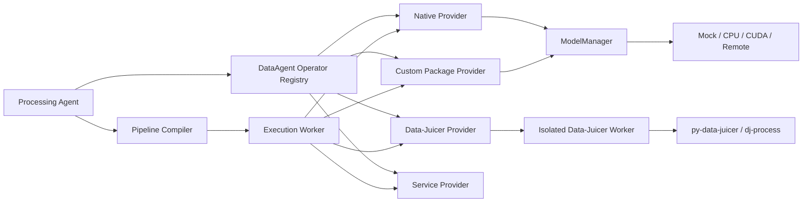

# DataAgent 算子 Provider 与运行后端设计

> 文档版本：v1.0  
> 日期：2026-07-17  
> 状态：开发决策稿  
> 关联文档：`DataAgent-final-PRD-v1.1.md`、`DataAgent-code-architecture-v1.1.md`

## 1. 结论

DataAgent 的算子体系采用五个正交维度描述，不再把“开源模型”“外部服务”“算子来源”和“运行位置”混为同一分类：

1. 业务能力：算子解决什么问题；
2. Provider：算子定义和执行能力由谁提供；
3. 实现类型：核心逻辑以代码、模型、服务还是容器实现；
4. 运行后端：本次执行使用 Mock、CPU、CUDA 还是远程环境；
5. 模型来源：模型来自开源、内部、商业授权还是不涉及模型。

核心原则：

- 能由确定性代码完成的能力不调用模型；
- 存在成熟专用模型时优先使用专用模型，不默认调用通用多模态大模型；
- Provider 和运行后端可替换，但算子的业务输入输出契约保持稳定；
- Data-Juicer 作为可选外部算子 Provider 接入，不成为 DataAgent 的领域模型和控制面；
- 开发阶段默认不安装 GPU 依赖、不下载权重，模型算子通过 Mock 后端完成流程开发；
- DataAgent 内部标识和协议使用英文，用户展示支持中文本地化。

## 2. 术语澄清

### 2.1 专用开源模型算子

描述算子的算法来源和能力，例如使用 SAM 2 做图像分割、使用开源美学模型生成评分。它既可以在本地运行，也可以部署到远程 GPU 服务。

### 2.2 外部服务算子

描述算子的调用和部署方式。DataAgent 通过 HTTP、RPC 或受控任务协议调用另一个进程或服务。外部服务背后可以是开源模型、内部模型、商业 API，也可以是非模型规则引擎。

### 2.3 外部算子 Provider

描述算子目录、参数、实现和执行能力的来源。Provider 负责把外部系统翻译成 DataAgent 的统一协议。例如 Data-Juicer Provider 将 Data-Juicer 算子目录和 `dj-process` 执行结果转换为 DataAgent 对象。

因此，同一个 SAM 2 算子可以同时满足：

```text
业务能力：UNDERSTANDING.segmentation
Provider：dataagent-native
实现类型：model
运行后端：remote
模型来源：open_source
```

它是专用开源模型算子，同时通过外部服务运行；二者并不冲突。

## 3. 五维算子模型

| 维度 | 字段 | 典型值 | 用途 |
|---|---|---|---|
| 业务能力 | `category`、`secondary_category`、`capability_tags` | `UNDERSTANDING`、`segmentation` | 检索、编排和业务解释 |
| Provider | `provider_id`、`provider_operator_ref` | `native`、`datajuicer` | 定位目录和执行适配器 |
| 实现类型 | `implementation_type` | `code`、`model`、`external_service`、`container` | 安全、依赖和部署决策 |
| 运行后端 | `runtime_backend` | `mock`、`cpu`、`cuda`、`remote` | 本次 Run 的资源选择 |
| 模型来源 | `model_source` | `open_source`、`internal`、`commercial`、`none` | 许可证、下载和审计 |

`runtime_backend` 是 Run 级选择，不应固定为算子业务身份的一部分。同一 `OperatorVersion` 可以声明多个兼容后端，具体 PipelineVersion 必须冻结本次选择。

## 4. 核心领域模型

```python
class ProviderRef(BaseModel):
    provider_id: str
    provider_version: str
    provider_operator_ref: str
    source_digest: str


class ImplementationSpec(BaseModel):
    implementation_type: Literal[
        "code",
        "model",
        "external_service",
        "container",
    ]
    entrypoint: str
    dependency_lock_digest: str | None = None


class RuntimeProfile(BaseModel):
    backend: Literal["mock", "cpu", "cuda", "remote"]
    cpu: float = 0
    memory_mb: int = 0
    gpu_count: int = 0
    gpu_memory_mb: int = 0
    timeout_seconds: int = 300
    concurrency: int = 1


class ModelRequirement(BaseModel):
    model_source: Literal[
        "open_source",
        "internal",
        "commercial",
    ]
    model_id: str
    revision: str
    sha256: str
    code_license: str
    checkpoint_license: str
    estimated_size_bytes: int
    requires_explicit_license_acceptance: bool = False


class OperatorSpecVersion(BaseModel):
    operator_version_id: str
    category: OperatorCategory
    secondary_category: str
    capability_tags: set[str]
    input_schema_ref: str
    output_schema_ref: str
    parameter_schema: dict
    provider: ProviderRef
    implementation: ImplementationSpec
    supported_runtime_profiles: list[RuntimeProfile]
    model_requirement: ModelRequirement | None = None
```

正式 Run 还必须记录：

```text
operator_version_id
provider_version
runtime_backend
model revision 与 checkpoint SHA256
参数快照
代码与依赖摘要
输入输出资产摘要
资源、耗时和成本
```

## 5. 总体架构



控制面、TUI 和 LangGraph 不直接 import 模型框架或 Data-Juicer。重依赖只存在于对应 Worker 环境。

## 6. Provider 协议

```python
class OperatorProvider(Protocol):
    provider_id: str
    provider_version: str

    def discover(self) -> list[ProviderOperatorDescriptor]: ...

    def describe(self, provider_operator_ref: str) -> ProviderOperatorDescriptor: ...

    def validate(
        self,
        provider_operator_ref: str,
        params: dict,
        runtime_backend: str,
    ) -> ProviderValidationResult: ...

    def execute(self, request: ProviderExecuteRequest) -> ProviderExecuteResult: ...

    def health(self) -> ProviderHealth: ...
```

Provider 返回的是候选描述和执行结果，不能直接修改正式 Registry。应用层完成分类映射、版本创建、权限检查、安全准入和发布。

Provider 必须满足：

- 无匹配时返回空集合，不得退回不相关算子；
- 参数必须验证名称、类型、范围、枚举和跨参数约束；
- 输出必须通过 DataAgent output schema；
- 发现阶段不得实例化模型或触发权重下载；
- 执行阶段必须产生进度、日志、指标、资产和错误原因；
- Provider 不可用时只影响自身算子，不影响 DataAgent 控制面。

## 7. Provider 类型

### 7.1 Native Provider

承载 DataAgent 自己实现的确定性规则、轻量算法和原生模型算子。原生算子使用 DataAgent `Operator` 协议，不需要继承 Data-Juicer 类。

### 7.2 Data-Juicer Provider

承载 py-data-juicer 已有算子和按 Data-Juicer 规范实现的自定义算子。Provider 负责元数据内省、配置转换、执行和结果归一化。

### 7.3 Custom Package Provider

承载用户或团队维护的独立 Python 包。包通过受控 entry point 暴露 OperatorSpec 和实现，经过扫描、测试和审批后进入个人算子库。

### 7.4 Service Provider

承载 HTTP、RPC、Triton、内部推理平台或商业 API。服务只是运行位置，必须继续声明模型来源、版本和许可证状态。

## 8. Data-Juicer 接入方案

### 8.1 依赖边界

生产接入不依赖完整 `data-juicer-agents`。该项目用于学习工具分层、参数内省、计划生成和事件设计；真正的 Provider 直接依赖固定版本的 `py-data-juicer`。

```text
DataAgent API/TUI 环境
├─ 不安装 torch
├─ 不安装 Data-Juicer 全量依赖
└─ 只提交 ProviderExecuteRequest

Data-Juicer Provider 环境
├─ 固定版本 py-data-juicer
├─ DataJuicerProvider Adapter
├─ 可选 CPU/GPU extras
└─ dj-process
```

开发机可使用独立 venv：

```text
D:\newDataAgent\.venv
D:\newDataAgent\.providers\datajuicer\.venv
```

生产环境优先使用独立容器或隔离 Worker。

### 8.2 元数据转换

Data-Juicer Provider 使用原生 `OPSearcher` 和 Registry 发现算子，然后转换：

```text
Data-Juicer name         -> provider_operator_ref
Data-Juicer type         -> 初步实现类型，不直接等同于 DataAgent category
Data-Juicer tags         -> capability/resource tags
函数签名与 docstring     -> parameter schema 候选
Data-Juicer package版本  -> provider_version
源代码与参数摘要         -> source_digest
```

`mapper`、`filter` 等 Data-Juicer 类型不能机械映射到单一 DataAgent 类别。例如 mapper 既可能是理解算子，也可能是转换算子；最终映射由 DataAgent 分类规则和人工准入决定。

### 8.3 执行转换

```text
DataAgent AssetRef
-> Data-Juicer dataset JSONL / recipe
-> dj-process
-> output dataset / stats / metadata
-> DataAgent artifacts / annotations / metrics / decision
```

Data-Juicer Provider 必须运行在 Worker，不直接访问 LangGraph State，不覆盖原始资产。

### 8.4 当前可复用能力快照

2026-07-17 本地环境可发现 217 个 Data-Juicer 算子，其中 21 个带 `image` 标签。首批可评估：

- `image_aesthetics_filter`；
- `image_watermark_filter`；
- `image_segment_mapper`；
- `image_detection_yolo_mapper`；
- `image_face_count_filter`；
- `image_face_ratio_filter`；
- `image_face_blur_mapper`；
- `image_remove_background_mapper`；
- `image_deduplicator`。

这些算子不能直接视为满足 DataAgent 需求：

- 美学和水印算子将理解评分与过滤决定组合，需要适配或标记为复合算子；
- 当前 `image_segment_mapper` 主要输出 bounding box，不等同于输出 mask 的完整分割能力；
- 当前人脸算子不提供 embedding 和身份匹配；
- Data-Juicer 模型准备流程不具备 DataAgent 要求的许可证审批、固定 revision 和统一 SHA256 治理。

## 9. 自定义算子扩展

用户补充算子有三条路径。

### 9.1 DataAgent 原生算子

适合 DataAgent 特有业务、类型化产物、多节点协作和严格版本治理。

```text
native.image_quality_score@1.0.0
native.face_embedding@1.0.0
```

### 9.2 Data-Juicer 自定义算子

适合希望复用 Data-Juicer 数据格式、并行执行和 `dj-process` 的能力。自定义类按 Data-Juicer 规范注册，并通过 `custom_operator_paths` 由 Provider 发现。

```text
datajuicer.custom_face_embedding_mapper@1.0.0
```

### 9.3 双适配器

当同一算法需要同时支持 DataAgent 原生执行和 Data-Juicer 批处理时，核心算法与适配器分离：

```text
face_embedding/
├─ core.py
├─ dataagent_operator.py
└─ datajuicer_mapper.py
```

Provider 命名空间避免同名覆盖。同一 capability 可以有多个 OperatorVersion，Planner 根据质量、资源、许可证、成本和当前任务评测选择。

## 10. 模型后端与无 GPU 开发

模型算子必须支持后端替换：

```text
MockBackend
CPUBackend
CUDABackend
RemoteBackend
```

开发默认配置：

```env
DATAAGENT_MODEL_MODE=mock
DATAAGENT_ALLOW_MODEL_DOWNLOAD=false
```

Mock 后端必须返回符合真实 output schema 的确定性结果，例如模拟分割 mask 引用、美学分数、人脸框和 embedding ID。Mock 结果只能用于契约和流程测试，不得作为真实质量样例或生产结论。

真实模型调用流程：

```text
执行模型算子
-> 检查权限、许可证和资源
-> 检查缓存
-> 按策略下载
-> 校验 revision 与 SHA256
-> 加载并复用模型实例
-> 推理
-> 记录模型血缘
```

发现、列目录、展示参数和 Pipeline 编译不得触发模型下载。对于实例化时可能自动准备模型的第三方算子，Mock 和发现模式必须停留在元数据层，不创建真实算子实例。

## 11. 算子选择流程

```text
L0 确定性规则/编码
-> L1 传统 CV 或轻量 CPU 模型
-> L2 开源专用模型
-> L3 多模态大模型
-> L4 人工确认
```

Planner 先执行硬过滤，再做排序：

1. capability 和输入输出 Schema 匹配；
2. Operator 状态允许当前环境使用；
3. Owner、项目和数据权限满足；
4. 许可证允许当前用途；
5. 当前 Worker 具备所需资源和后端；
6. 在当前任务 Golden Set 上达到硬质量门槛；
7. 按质量、成本、时延、稳定性和人工量排序。

没有候选时必须产生明确 capability gap，不能用无关 top-k 填充。大模型检索结果只能产生候选，必须经过 Registry 精确解析和 Constraint Checker。

## 12. 代表性算子定义

### 12.1 SAM 2 本地模型

```yaml
operator_version_id: native.sam2_segmentation@1.0.0
category: UNDERSTANDING
secondary_category: segmentation
provider_id: native
implementation_type: model
runtime_backend: cuda
model_source: open_source
```

### 12.2 SAM 2 远程服务

```yaml
operator_version_id: native.sam2_segmentation@1.0.0
category: UNDERSTANDING
secondary_category: segmentation
provider_id: native
implementation_type: model
runtime_backend: remote
model_source: open_source
```

业务算子版本和 Schema 不变，PipelineVersion 冻结不同的运行后端和服务版本。

### 12.3 Data-Juicer 水印算子

```yaml
operator_version_id: datajuicer.image_watermark_filter@1.5.1
category: FILTERING
secondary_category: content_rule
capability_tags: [image, watermark_detection, composite_score_filter]
provider_id: datajuicer
implementation_type: model
runtime_backend: cuda
model_source: open_source
```

### 12.4 人像 ID 算子

```yaml
operator_version_id: native.face_identity_match@1.0.0
category: UNDERSTANDING
secondary_category: face_and_person
provider_id: native
implementation_type: model
runtime_backend: mock
model_source: open_source
```

切换到真实后端前必须补齐授权身份库、模型许可证、阈值评测、`unknown` 输出、审计和人工复核。

## 13. 命名与语言规范

内部统一使用英文：

- Python 模块、类、函数、变量和测试名；
- API、Pydantic、数据库字段和 JSON key；
- Operator ID、category、tag、状态、事件和错误码；
- 配置、环境变量、文件名和内部日志字段。

用户展示支持中文：

```json
{
  "reason_code": "watermark_probability_exceeded",
  "message_code": "operator.watermark.probability_exceeded",
  "message_args": {
    "probability": 0.91,
    "threshold": 0.8
  }
}
```

UI 根据 locale 生成中文或英文消息。正式对象保存稳定 code 和结构化参数，不把中文句子作为业务判断依据。

算子目录同时维护：

- 英文 canonical name；
- 英文描述；
- 中文名称和描述；
- 中英文 aliases；
- 可选多语言 embedding。

现有代码不进行一次性纯翻译重构；新增代码遵守英文内部协议，旧代码在功能修改时逐步迁移。

## 14. 版本、安全与许可证

- Provider 升级不得静默改变既有 OperatorVersion；
- Data-Juicer 算子版本至少由包版本、算子名、源码摘要和参数 Schema 摘要共同确定；
- 代码许可证与 checkpoint 许可证分别记录；
- `trust_remote_code` 默认关闭，开启需要明确准入；
- 自定义包和生成算子先进入个人草稿，经过扫描、沙箱、测试、Golden Set 和人工审批；
- 外部服务保存 endpoint 配置版本、服务模型版本和响应 Schema 版本；
- 原始资产只读，所有派生产物写入独立版本目录或对象存储前缀；
- 人像 ID、隐私和合规能力采用更严格的项目隔离、授权和审计策略。

## 15. 分阶段实施计划

### 阶段 1：统一协议

- 扩展 `OperatorSpecVersion` 的 Provider、Implementation、Runtime 和 Model 字段；
- 增加 typed artifacts、annotations 和 embeddings；
- 完成严格输入输出和参数 Schema 校验；
- 建立 Provider Registry 和契约测试。

### 阶段 2：Data-Juicer Provider

- 在独立环境固定 py-data-juicer 版本；
- 实现只读 discover/describe；
- 完成类型、标签和参数元数据转换；
- 建立中英文别名索引；
- 禁止无匹配时返回不相关算子。

### 阶段 3：CPU 执行

- 优先接入解码、尺寸、形状、精确去重和人脸计数等 CPU 算子；
- 实现 AssetRef 与 Data-Juicer recipe/JSONL 转换；
- Worker 执行、进度、取消、超时、产物和错误归一化；
- 通过小样本端到端测试。

### 阶段 4：模型 Mock

- 增加美学、分割、水印、人脸 embedding 和 ID 匹配的 Model Operator；
- 默认使用 MockBackend；
- 在无 GPU、禁止下载和离线条件下完成 Pipeline、Run、预览和 QC 测试。

### 阶段 5：真实模型后端

- 完成 ModelManager 缓存、锁、下载、哈希和许可检查；
- 在独立 GPU Worker 接入经过评测的开源模型；
- 复验 Data-Juicer 模型算子，补充不满足的原生算子；
- 通过 Golden Set、资源、安全和人工审批后发布。

## 16. 验收标准

1. DataAgent 不安装 Data-Juicer 时，Native Provider 和控制面仍可正常运行；
2. Data-Juicer Provider 不可用时返回结构化健康状态，不拖垮 Registry；
3. Provider 发现和参数展示不下载任何模型；
4. 无 GPU 且禁止下载时，模型算子通过 Mock 完成端到端测试；
5. 同一算子切换 Mock、CPU、CUDA 和 Remote 后端时，业务 Schema 不变；
6. 中文和英文需求均可检索到相同 canonical capability；
7. 无匹配时产生 capability gap，不返回不相关候选；
8. 参数名称、类型、范围、枚举和跨参数约束在执行前完成校验；
9. 每个正式 Run 可追溯到 Provider、实现、运行后端、模型、权重和参数版本；
10. 用户新增 Native 或 Data-Juicer 自定义算子不会被其他 Provider 同名覆盖。

## 17. 最终决策

DataAgent 保持自己的领域模型、控制面和 Operator Registry。Data-Juicer 通过隔离的 Provider Worker 提供成熟算子和批处理能力；专用开源模型既可本地运行，也可作为外部服务运行。用户自定义算子可以选择 Native、Data-Juicer 或双适配器路径，所有实现最终进入同一套版本、权限、质量和审计体系。
