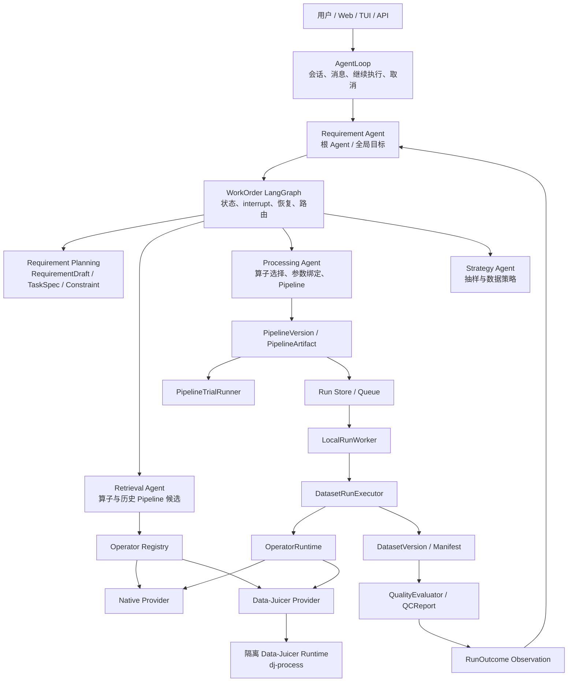

# DataAgent 当前框架、历史踩坑与 Pipeline 编排阻塞总结

> 日期：2026-07-30  
> 用途：对外请教、架构评审和下一阶段开发决策。  
> 范围：当前仓库代码、历史 PRD/架构文档/交接文档/问题台账、当前工作区变更、自动化测试、Data-Juicer Provider 注册信息和既有真实 CPU Golden 记录。  
> 注意：当前分支是 `codex/agent-runtime-refactor`，HEAD 为 `0fde1a9`，工作区正在进行 Requirement Root Agent 重构且有大量未提交修改。本文描述的是“2026-07-30 当前工作区”，不等于 HEAD 的干净版本，也不等于已经发布的稳定版本。

## 0. 一页结论

### 0.1 目前已经有什么

DataAgent 已经不是一个只会根据关键词拼脚本的 Demo。当前仓库已经形成以下骨架：

- 以 `Requirement Agent` 为根 Agent，配合 Retrieval、Processing、Strategy 三类专业 Agent；
- `AgentLoop` 负责会话、消息串行化、继续执行、取消和最终 Turn；
- LangGraph 负责 WorkOrder 的任务状态、专业 Agent 调度、HITL interrupt 和恢复；
- `TaskSpecVersion`、`ConstraintContract`、`OperatorPlanVersion`、`PipelineVersion`、`Run`、`DatasetVersion`、`QCReport` 等对象均走结构化和版本化；
- Operator、Provider、Runtime 三层分离；
- 已有 Native Provider、Data-Juicer Provider、Operator Registry、候选检索和 Pipeline 编译骨架；
- 已有 Pipeline 小样本 Trial、正式 Worker、断点、暂停/恢复/取消、逐资产结果、Repair、QC、Manifest 和 Export；
- 已有独立的 Data-Juicer 运行环境和 `dj-process` 接入；
- 已有 API、TUI、Web 适配器以及一定程度的过程事件展示。

### 0.2 为什么到现在仍不能顺利编排 Pipeline

当前最核心的问题不是“没有 LangGraph”“没有 Agent”“没有算子”或“没有执行引擎”，而是：

> 从用户约束到可执行证据的整条契约链仍未收敛，且新旧架构正在迁移中。模型驱动的新契约、旧兼容调用方、旧测试和部分确定性编译逻辑同时存在，导致每一层单看都有对象，但层与层之间不能稳定闭合。

理想链路应为：

```text
用户原文
  -> RequirementDraft / ClauseTrace
  -> TaskSpecVersion / ConstraintContract
  -> Operator Retrieval Query
  -> CandidateSet / Sufficiency
  -> OperatorPlanVersion
  -> Constraint-to-Operator 参数绑定
  -> PipelineVersion
  -> Pipeline 语义完整性校验
  -> Trial Observation
  -> 正式 Run
  -> Constraint-level Evidence
  -> QC / Replan
```

当前主要断点是：

1. Requirement Planner 已取消关键词 fallback，但很多入口和测试仍在无模型条件下直接调用，导致任务在生成 TaskSpec 前失败。
2. Constraint 到 capability/operator 的语义匹配仍不可靠，例如视觉属性被错误映射成 object detection。
3. “检索命中”“候选可执行”“覆盖约束”“参数正确绑定”“Pipeline 可生产”仍是五个不同事实，当前实现尚未在所有路径严格区分。
4. Retrieval/Processing 的模型循环次数、完成条件和工具协议仍在变化，出现重复调用、脚本化 planner 步骤耗尽等问题。
5. Pipeline Trial 和正式执行引擎已经存在，但上游计划不稳定时，执行层只能忠实执行一条错误或不完整的 Pipeline。
6. 当前 342 个自动化测试中有 42 个失败、300 个未失败。失败横跨 API、AgentLoop、WorkOrder Graph、Retrieval、正式 Worker 和旧 CLI 流程，说明迁移尚未闭环，不能把局部通过描述成系统已完成。

### 0.3 Data-Juicer / DJProcess 的直接答案

- Data-Juicer 是当前 Operator Provider 之一，不是 DataAgent 本身。
- `dj-process` 是 Data-Juicer 的 recipe 执行 CLI，不是整个 Agent 的唯一执行引擎。
- DataAgent 自己已经有：
  - `OperatorRuntime`
  - `PipelineTrialRunner`
  - `DatasetRunExecutor`
  - `LocalRunWorker`
- 执行 Native Operator 不需要 `dj-process`。
- 执行 Data-Juicer 原生 Operator/recipe 时，需要 Data-Juicer 的执行后端；当前实现选择调用隔离环境中的 `dj-process`。
- 当前机器实际上有 `dj-process`。Provider Registry 指向：

```text
D:\DataAgent\data-juicer-agents\.venv\Scripts\dj-process.exe
```

该文件真实存在，`--help` 可运行。也就是说，“你没有执行引擎”这个判断不成立。更准确的说法是：

> 你有 DataAgent 自己的编排执行器，也有 DJ provider 所需的 `dj-process`，但 DJ 算子适配覆盖、准入、输出归一化、性能和跨机器安装还没有全部完成。

### 0.4 “缺算子时去网上找并加入编排”是否可行

技术上可行，但必须拆成两种模式：

1. **发现已有可信算子**：从 Data-Juicer 官方目录、内部 Registry、公共 Registry 或固定代码仓库检索元数据，验证后生成受治理 Candidate。
2. **引入或生成新算子代码**：下载/生成源码，构建隔离环境，执行静态检查、依赖和许可证检查、Golden Set、资源评测和人工审批，再发布为可编排 Operator。

不能安全地实现为：

```text
LLM 搜网页 -> 下载任意 Python -> 当前 Worker 直接执行 -> 加入生产 Pipeline
```

当前仓库尚未实现这条完整供应链。已有 Operator/Provider/版本/许可证/哈希等领域模型和 Data-Juicer 安装治理，可作为基础；但还缺网络检索 Tool、可信来源策略、Custom Package Provider、代码沙箱、构建产物签名、自动 Golden/安全测试、准入审批和回滚机制。

---

## 1. 当前 Agent 框架

### 1.1 总体分层



### 1.2 四类 Agent 的职责

#### Requirement Agent（根 Agent）

当前定位不是“前置需求解析器”，而是整个 WorkOrder 的任务级 Owner：

- 持有用户目标和对话上下文；
- 组织 RequirementDraft、TaskSpec 和 Constraint；
- 决定何时调用 Retrieval、Processing、Strategy；
- 读取结构化 Observation 后决定重新检索、重新编译、重跑、修复、询问用户或完成；
- 不直接执行 Operator；
- 不直接写任意 Pipeline YAML；
- 不凭空回答 Run、路径和产物事实。

#### Retrieval Agent

- 根据 TaskSpec/Constraint 构造检索计划；
- 查询 Operator Registry、Provider Catalog 和历史 Pipeline Experience；
- 返回候选、版本、能力、参数 Schema、Runtime、成本、风险和充分性；
- 不决定最终 Pipeline；
- 不应该用“需求关键词到算子名”的隐藏映射充当检索权威。

#### Processing Agent

- 从已检索且可执行的候选中选择 Operator；
- 把 Constraint 绑定到 Operator 参数；
- 编译 Pipeline 及变体；
- 读取 Validator、Trial、Run 和质量 Observation 后重新编排；
- 不允许使用检索结果之外的虚构 Operator；
- 不应该自己宣布 Pipeline 通过。

#### Strategy Agent

- 负责抽样、分布、配额等数据策略；
- 不修改 TaskSpec；
- 不修改处理 Pipeline；
- 当前实现相对较薄，尚未成为本轮主要阻塞点。

### 1.3 三种“循环”不能混淆

| 循环 | 职责 | 不负责 |
|---|---|---|
| AgentLoop | 会话 Turn、消息、继续执行、取消、Session | 数据处理 Run |
| LangGraph WorkOrder | 任务状态、专业 Agent 路由、interrupt、恢复 | 逐图片执行 |
| Worker / DatasetRunExecutor | 正式 Pipeline 执行、断点、并行、失败和产物 | 语义规划 |

过去多次出现的问题，就是把其中一层当成另一层：

- 把 Conversation 当业务 Planner；
- 把 LangGraph 固定节点顺序当 Agent 自主规划；
- 把 Worker retry 当 Agent replan；
- 把 Tool 当 Operator；
- 把 Operator 当可直接暴露给 LLM 的 Tool。

### 1.4 当前关键领域对象

| 对象 | 作用 |
|---|---|
| `RequirementDraft` | 实现无关的需求解释、约束、Gap、假设和验收意图 |
| `RequirementGap` | 基于来源的真实语义缺口，问题由模型生成，不是固定问句 |
| `ConstraintContract` | 原子目标、比较符、值、单位、scope、hardness、证据要求 |
| `TaskSpecVersion` | 用户确认的版本化任务契约 |
| `OperatorSpecVersion` | 算子能力、Schema、Provider、Runtime、版本、状态和限制 |
| `OperatorPlanVersion` | 本次任务使用的候选、覆盖和风险计划 |
| `PipelineVersion` | 可验证和可执行的 DAG、节点、参数、PromptBinding 和覆盖 |
| `PipelineTrialObservation` | 小样本执行、逐约束结果、失败、Artifact 和成本 |
| `DatasetVersion` | 不可变、可审计、带 lineage 的逻辑数据版本 |
| `QCReport` | 对交付版本的质量判定，不等同于“文件写完了” |

---

## 2. 当前可复现状态

### 2.1 完整测试

2026-07-30 在当前工作区执行：

```powershell
.\.venv\Scripts\python.exe -m pytest -q
```

结果：

```text
342 tests collected
42 failed
300 passed or otherwise non-failed
```

主要失败区域：

- Agent API 和跨端会话；
- Requirement Planner 未配置时的入口；
- AgentLoop/WorkOrder 的用户边界；
- Capability Resolution；
- Dataset Worker 和正式结果回流；
- WorkOrder 持久化和重启恢复；
- Retrieval/Processing ReAct 流程；
- WorkOrder Graph interrupt/revision；
- 旧 CLI 和旧完整 Flow；
- Constraint 到 capability 的映射；
- VLM Provider 选择预期；
- 模型路由和 Requirement Gap 修订。

### 2.2 选定规划链路测试

执行：

```powershell
.\.venv\Scripts\python.exe -m pytest `
  tests/unit/test_provider_smoke.py `
  tests/unit/test_operator_library.py `
  tests/integration/test_capability_resolution.py `
  tests/integration/test_pipeline_trial_runner.py `
  tests/integration/test_react_agent_planning_flow.py -q
```

可稳定看到 12 个失败，典型现象包括：

1. 结构化约束没有全部得到 `covered`；
2. “主体衣服颜色”被映射成 `object_detection`，而不是通用视觉语义判断；
3. 没有 Requirement Planner/Agent Planner 时，正式路径抛出：

```text
REQUIREMENT_PLANNER_UNAVAILABLE
```

4. Retrieval Agent 被重复进入，脚本化 Planner 的预设步骤耗尽，产生 `StopIteration`；
5. 旧测试期望的 VLM Operator 与当前 Provider 选择不一致。

### 2.3 单一总根因假设

针对“为什么系统整体还不能顺利编排”的单一总根因假设是：

> Agent Runtime 的契约重构尚未完成：正式语义权威已经从关键词兼容层迁移到模型生成的 Requirement/Constraint/OperatorPlan，但所有入口、状态完成条件、检索匹配、处理编译、测试替身和旧 CLI 尚未同时迁移到同一版本的契约。

支持证据：

- 当前工作区有约 50 个文件正在修改，集中在 Requirement、Retrieval、Graph、Gateway、Conversation、API、Web 和测试；
- 旧的 `constraints.py`、固定 clarification 等文件正在删除；
- 正式 Requirement 路径已主动拒绝无模型关键词 fallback；
- 但多条 API/CLI/测试路径仍默认创建无模型 `WorkOrderRuntime()`；
- Retrieval 引入新的 `OperatorPlanVersion` 和确认边界后，旧脚本化 Planner 的步数与新循环不再一致；
- Constraint 语义匹配仍含启发式判断，尚未成为稳定的能力本体/Schema 推理；
- 全量测试失败横跨从入口到正式 Run，而不是集中在单一算子。

该假设并不表示所有 42 个测试只有一个代码 bug，而是说明它们共享同一个架构阶段问题：**迁移中的跨层契约不一致**。

---

## 3. 为什么 Pipeline 编排仍不顺：按数据流分层

### 3.1 需求解析层

已经改进：

- 不再允许用猫狗、黑衣等案例关键词生成固定 Pipeline；
- 使用 RequirementDraft、ClauseTrace、RequirementGap；
- 用户原文与 Constraint 有来源追踪；
- Gap 问题由模型生成，不用固定澄清模板；
- 结构校验只报告错误，不替模型偷偷补业务含义。

尚未稳定：

- 自然语言任务现在依赖可用的模型 Planner；
- 无模型入口没有统一的显式产品策略：是只支持结构化 TaskSpec，还是返回友好配置错误，还是测试注入 Planner；
- Requirement 的“定义、上下文、偏好、约束”分类仍依赖模型质量；
- Gap 解决后的新 Draft、版本和确认边界仍在重构；
- 旧 CLI 和旧测试仍假设可以无模型完成自然语言规划。

### 3.2 TaskSpec / Constraint 层

已经有 `ConstraintContract`，但“有模型”不等于“已形成可靠领域契约”。

当前风险：

- 字段名仍可能是开放字符串，如 `image.main_subject_clothing_color`；
- `required_evidence_type` 也是开放语义，容易出现同义词漂移；
- Constraint 如何映射到通用 capability 仍可能靠启发式；
- scope、operator、unit、evidence 和参数 Schema 之间缺少统一可推导规则；
- classification、semantic predicate、dataset operation、output action 的边界仍有历史兼容字段；
- TaskSpec 完整性 Validator 能验证结构，不一定能证明原始需求无遗漏。

### 3.3 算子检索层

历史上最典型的误区：

```text
Retriever 找到了算子
≠ 算子覆盖了 Constraint
≠ 算子可在当前机器执行
≠ 算子参数已正确绑定
≠ Pipeline 可生产
```

当前仍存在：

- 语义属性误匹配到 object detection；
- Catalog 标签和描述不足以精确证明一个 Operator 支持某个 Constraint；
- Data-Juicer 的 provider type/tag 不能直接等同于 DataAgent capability；
- Candidate Pool、Capability Coverage 和 OperatorPlan 的职责刚在重新拆分；
- 检索 Agent 的充分性完成条件与调用预算尚不稳定；
- Provider Catalog 未加载、Runtime 不可用和“模型不会检索”容易被混为一谈。

### 3.4 Pipeline 规划层

过去的问题：

- 三条 Pipeline 只是三套话术；
- 模型虚构不存在的节点；
- 模型直接写 YAML；
- Compiler 只消费被选中的 capability，用户约束在更早阶段丢失后无法被发现；
- 为当前案例硬编码标签、节点、默认值和算子。

当前改进：

- Pipeline 节点使用真实 OperatorVersion；
- PipelineArtifact 可确定性序列化；
- PromptBinding 版本化和哈希化；
- 只允许使用检索候选；
- 引入 OperatorPlan 确认边界；
- 有 Constraint Coverage 和参数绑定模型；
- 有静态校验和小样本 Trial。

当前未收敛：

- Processing 模块仍含较多视觉/分类专用编译分支，通用深模块边界不够清晰；
- Constraint 到 capability/operator 的错误会直接传入 Compiler；
- 三策略差异与 hard constraint 的边界需要更严格；
- 模型修订和确定性 Compiler 各自拥有多少决策权仍需明确；
- OperatorPlan、PipelineVersion 和用户审批的版本联动仍在迁移。

### 3.5 Plan 校验层

正确的校验至少要分别回答：

1. DAG 结构是否合法；
2. 节点是否存在且可执行；
3. 参数是否通过 Schema；
4. 每个 required Constraint 是否有节点；
5. 参数值是否忠实绑定用户阈值；
6. asset/dataset scope 是否正确；
7. hard constraint 是否被策略变体修改；
8. 不可见条件是否错误交给 VLM；
9. 每个 Constraint 是否声明可产生的 Evidence；
10. 当前 Runtime、权限、许可证和成本是否允许。

历史上系统主要完成前 1～3 项，却把结果称为“完整 Pipeline”。当前正在补 4～10，但测试表明还没有在所有路径稳定生效。

### 3.6 Trial / 执行层

当前已有两套层次：

- `PipelineTrialRunner`：有界样本、逐 Constraint 结果、失败 Observation；
- `DatasetRunExecutor`：正式 Run、逐资产执行、断点、发布、QC。

它们不是当前最大的“缺失”，但仍有问题：

- Trial 对不同 evidence shape 的解析仍不够通用；
- 不同 Data-Juicer Operator 不能共享一个万能输出解析器；
- Dataset-level Operator 会影响全 Pipeline 的并行策略；
- 当前是整条 Pipeline 的并行安全判断，理想上应按 stage 切分；
- Provider 子进程启动成本高；
- Remote VLM 单资产超时、重试和费用预算还需细化；
- 正式执行失败回到 Agent 的循环已有骨架，但相关测试正在失败。

### 3.7 结果评估层

历史上最危险的误判：

```text
文件写出来了 -> Run 成功
hard violations = 0 -> 用户要求全部满足
Catalog 找到算子 -> Pipeline 已覆盖
Mock 测试通过 -> 真实模型可用
```

当前已引入 PARTIAL、Repair、DatasetVersion、QC 和 Evidence，但最终仍需要做到：

```text
每个 required Constraint
  -> evaluated / passed / failed / missing
  -> 对应 OperatorVersion、参数、Prompt、资产、时间和证据
```

如果某条 required Constraint 根本没有执行，结果必须是 `missing`，不能因为“没有检测到 violation”而算通过。

---

## 4. 过去讨论和开发中踩过的坑

### 4.1 对话与状态机

| 坑 | 根因 | 结论 |
|---|---|---|
| 普通聊天误触发建工单 | 状态优先、关键词路由、静默 fallback | 普通对话与任务控制必须分层 |
| 硬编码“好/继续/确认”等词表 | 把语义理解降为字符串匹配 | 自然语言由模型转结构化 Action，状态由 Policy 校验 |
| 模型 JSON 损坏导致整轮无操作 | 缺少修复和 Schema 门禁 | JSON repair 只修语法，不能补业务事实 |
| 修改、批准、提交 Run 混淆 | 多个副作用边界没有分开 | TaskSpec revision、Pipeline recompile、approval、Run submit 必须是不同动作 |
| 固定澄清问题 | 用模板掩盖真正 Requirement Gap | 由模型针对结构化 Gap 生成问题 |
| “继续”被写进业务要求 | 对话控制文本和需求原文未隔离 | 消息类型、来源和版本要明确 |
| 完成后不通知 | Worker 终态没有进入会话 | 终态 Observation 要幂等回流并主动通知 |
| 展示模型思维链 | Tool trace 与隐式推理混淆 | 展示受治理动作、参数、耗时和证据，不展示隐藏思维链 |

### 4.2 TaskSpec 与规划

| 坑 | 根因 | 结论 |
|---|---|---|
| `operators/planning.py` 同时做需求解析、能力规划和算子选择 | 模块职责不清 | Requirement、Capability/Constraint、Operator Selection 分层 |
| 关键词规则漏掉尺寸、宽高比、文件大小、人脸数 | 用有限词表承担开放语义 | 结构化 Constraint 才是权威 |
| 多目标需求只拆出部分能力 | 没有逐子句追踪和完整性验证 | ClauseTrace + Constraint completeness |
| Retriever 找到正确算子但 Compiler 丢掉 | 召回与 Coverage 混淆 | Constraint→Candidate→Selected→Node 全链 |
| `sufficient=true` 但用户要求未覆盖 | 只对贫化后的 capability 求完整 | 充分性必须以原始 required Constraint 为根 |
| 三条 Pipeline 只换名字 | 策略没有落在真实参数 | 变体只能调整允许变化的软策略 |
| 猫狗标签或任务专用 Operator | 用 Golden Case 污染生产逻辑 | 标签来自 TaskSpec，生产代码不含案例实体 |
| LLM 编造 Operator 或 YAML | LLM 被赋予确定性事实权 | LLM 提案，Compiler/Registry/Validator 决定可执行事实 |
| 成功历史 Pipeline 被直接复用 | 忽略数据和约束漂移 | Experience 只作证据，新任务仍需 Trial |

### 4.3 Prompt、模型与视觉判断

| 坑 | 根因 | 结论 |
|---|---|---|
| Prompt 没绑定本次任务 | 使用通用提示但缺少 Constraint/标签 | PromptBinding 必须记录解析后变量与哈希 |
| VLM 判断文件大小、精确尺寸、去重 | 没按可观测性分配 evaluator | 确定性事实交给代码/元数据，语义事实交给模型 |
| 一个粗标签代表多个条件 | Evidence 粒度不足 | 逐 Constraint 输出判定和理由 |
| 所有 DJ 算子共用一个输出解析器 | 假设所有 Provider 输出同形 | 按 Operator family/type 建 Output Adapter |
| 空输出或解析失败降级成 unknown | 把执行错误伪装成业务不确定性 | 协议错误必须失败并进入 Observation |
| 简单视觉任务耗费过多 reasoning token | 模型路由与任务复杂度不匹配 | 以质量、延迟、成本共同选择模型 |
| 每个 Agent 配一个模型 | 把组织结构当模型路由依据 | 模型路由按任务能力和风险，不按 Agent 名称机械拆分 |

### 4.4 Operator 与 Provider

| 坑 | 根因 | 结论 |
|---|---|---|
| 为每个任务创建复合 Operator | TaskSpec、Prompt、Operator 边界不清 | Operator 保持原子，任务语义在契约和参数中 |
| 217 个 discoverable 被说成 217 个 released | 生命周期混淆 | Discoverable ≠ installed ≠ runtime-ready ≠ admitted ≠ released |
| GPU 算子简单标为“不能用”或偷偷 CPU 回退 | Runtime 能力表达不足 | 返回结构化 Resolution，不承诺未验证回退 |
| DJ 路径依赖另一仓库 | 安装和 Registry 不可移植 | 独立 Provider 安装、版本和 registry |
| Worker 运行时偷偷下载大模型 | 缺少模型资产治理 | 固定 revision/SHA256/license，显式准备 |
| Provider type 机械映射 DataAgent category | 外部分类体系与领域能力不等价 | Provider 只给建议，DataAgent 做归一化和准入 |
| Catalog 目录覆盖人工选择的 adapter | 自动发现覆盖治理决策 | 自动发现不能覆盖已准入实现 |

### 4.5 Worker、并发与运行环境

| 坑 | 根因 | 结论 |
|---|---|---|
| 旧 Worker 抢新任务 | 没有实例身份和租约 | Worker lease + protocol version |
| 关掉 TUI 误以为 API/Worker 已更新 | 三进程生命周期混淆 | 明确 start/status/stop/revision |
| 端口被旧实例占用 | 无托管启动和身份检查 | 启动器应验证并管理实例 |
| 单图卡住拖死整批 | 缺少单资产 timeout 和失败隔离 | PARTIAL + Repair + retry policy |
| Dataset 算子关闭全 Pipeline 并行 | 并行安全按整条 Pipeline 一票否决 | 按 stage 切分 asset/dataset/asset |
| 盲目增加并发 | 忽略 Operator/Provider 上限 | 并发取多层上限最小值 |
| DJ 子进程每次启动开销高 | 重型 Provider 用进程级调用 | 批处理、常驻 Worker 或阶段级执行 |
| PowerShell 中文变成 `?` | 终端编码污染真实输入 | 中文测试用 UTF-8 文件/JSON，不用易损内联文本 |

### 4.6 Run、Dataset、QC 与审计

| 坑 | 根因 | 结论 |
|---|---|---|
| Agent 声称目录存在但物理文件不存在 | 模型根据计划猜事实 | 路径和计数只读控制面事实 |
| Logical DatasetVersion 与交付目录混淆 | 版本和物化概念未分开 | Export 只从成功版本生成 |
| Provider artifacts 重复塞进每个资产 Manifest | Run 级和资产级证据未分层 | Delivery manifest 与 provider evidence 分层 |
| 只能看 Run 汇总，不能追到单图单节点 | 缺少逐资产 trace | 保存 node decision、reason、error、evidence |
| 空 Dataset 或语义未执行仍成功 | “执行结束”等同于“目标满足” | QC 必须检查 missing evidence 和失败资产 |
| `hard violations=0` 被当成完全满足 | 没执行的约束未计入 | required constraint 必须有 evaluated 状态 |
| Repair 重跑全部资产 | 没有 repair scope 和 lineage | 只处理失败/缺失资产，复用成功资产 |
| PARTIAL 被直接交付 | 状态语义不严 | Repair 或显式 exclude 后重新 QC |

### 4.7 工程流程

| 坑 | 根因 | 结论 |
|---|---|---|
| 文档、Commit、Push、运行进程混为一谈 | 缺少状态分层 | 汇报必须分别说明工作区、HEAD、远端和进程 revision |
| 自动测试通过被描述成真实验收 | 测试层级未区分 | Unit、Integration、Provider Smoke、Golden、Acceptance 分开 |
| Mock VLM 被说成真实模型可用 | 测试替身身份未暴露 | Mock 不具备生产准入资格 |
| 为修当前案例直接加默认值 | 以症状修补替代根因 | 先复现、分层、单一根因、通用设计、用户确认 |
| 在脏工作区重置或覆盖 | 忽略用户未提交修改 | 不使用破坏性 Git 操作 |
| 一次重写过多层 | 跨层契约同时变化，测试难定位 | 小批次、单一 seam、迁移矩阵和兼容期 |

---

## 5. Data-Juicer Provider 当前到底做到哪一步

### 5.1 当前事实

当前 Registry 记录：

```text
provider_id: datajuicer
provider_version: 1.5.3
catalog_count: 217
profile: auto
platform: Windows / Python 3.13.9
linux_gpu_worker_available: false
ffmpeg.available: false
remote_api_credentials_configured: true
python: D:\DataAgent\data-juicer-agents\.venv\python.exe
process_bin: D:\DataAgent\data-juicer-agents\.venv\Scripts\dj-process.exe
```

已有能力：

- 通过隔离 Python 环境发现 Data-Juicer Catalog；
- 把 Provider Descriptor 转换成版本化 DataAgent Proxy；
- 区分 Draft、Provider Available、正式 Release 等状态；
- 区分 CPU、Remote、Linux GPU 等 Runtime；
- 生成 Data-Juicer JSONL 和 recipe；
- 调用 `dj-process`；
- 支持多资产一次批处理调用；
- 保留 asset id，解析 output/stats；
- 有离线策略，默认阻止执行时偷偷安装依赖；
- 有 Provider 健康、安装、校验和 capability report；
- 有 3 个已准入的 CPU 图片算子基线：
  - `image_shape_filter`
  - `image_aspect_ratio_filter`
  - `image_deduplicator`

已有真实基线文件显示，2026-07-17 三个 case、六个资产全部通过：

```text
shape-boundary          28.72s
aspect-boundary         28.62s
perceptual-duplicate    20.90s
total                   78.24s
throughput              0.0767 assets/s
```

这证明至少当时的本机真实 DJ CPU 路径能运行，但不证明 217 个算子都已适配，也不证明当前工作区的端到端 Agent 流程通过。

### 5.2 DJ Agent 是否使用了“DJProcess”

在本地 `data-juicer-agents` 中，主要模式是：

```text
Agent 生成/修改 plan
  -> 物化 Data-Juicer recipe
  -> apply_recipe
  -> dj-process --config recipe.yaml
```

更准确的名称是 `dj-process` CLI，而不是一个决定 Agent 架构的 `DJProcess` 类。Data-Juicer 官方文档也把 `dj-process --config ...` 作为 recipe 执行入口。

Data-Juicer Agents 的优势是它与 Data-Juicer recipe 格式高度贴合，所以可以把规划结果直接交给 DJ 执行。DataAgent 的目标更大：还要管理 TaskSpec、权限、版本、审批、Trial、正式 Run、DatasetVersion、QC、Repair 和多 Provider，因此不能只复制 `apply_recipe` 就认为执行闭环完成。

### 5.3 `dj-process` 是否必须

分场景回答：

| 场景 | 是否必须使用 `dj-process` |
|---|---|
| 运行 Native Python Operator | 否 |
| 运行 Native Remote VLM | 否 |
| 只浏览 Data-Juicer Catalog | 否，可用 catalog-only 环境 |
| 使用当前 DataAgent 的 Data-Juicer Proxy 执行原生 DJ 算子 | 是，当前实现依赖它 |
| 未来改为直接调用 Data-Juicer Python API | 不一定，但仍需一个 DJ 执行适配器 |
| 使用 Ray/分布式 Data-Juicer | 需要相应 DJ executor/runtime，不是仅有 Agent 就行 |

真正必须的是“与 Provider 匹配的执行适配器”，不一定永远是 CLI 形式。当前选择 `dj-process` 的好处是进程隔离、与官方 recipe 一致、重依赖不污染控制面；代价是启动慢、输入输出转换复杂、取消和进度粒度较粗。

### 5.4 当前 DJ Provider 没开发好的地方

1. **Catalog 发现不等于完整适配**  
   217 个算子能被列出，但大量算子没有逐一完成输入、输出、参数、scope 和 Evidence 适配。

2. **准入覆盖有限**  
   真正有 Golden 和明确发布身份的 CPU 图片算子数量很少。

3. **Output Adapter 不完整**  
   Filter、Mapper、Deduplicator、Aggregator、Pipeline 的输出语义不同，不能用统一 JSON 解析假设。

4. **多模态输入协议不完整**  
   文本、音频、视频、复合 record、衍生图片和标注输出虽有部分代码路径，但没有完整真实验收矩阵。

5. **Dataset-level 和 stage 执行仍粗糙**  
   Dataset 算子会影响全 Pipeline 并行；需要 stage-aware planner/executor。

6. **性能较差**  
   既有基线中两个图片 filter 各耗时约 28 秒，说明子进程和 DJ 初始化开销很明显。

7. **常驻 Provider Worker 尚未形成稳定主路径**  
   当前主要通过进程调用；可以考虑受控常驻服务、批次复用或 stage 级 recipe。

8. **Runtime 组合尚未完整验证**  
   当前 Windows 无 Linux GPU Worker，FFmpeg 也不可用；许多 GPU/视频算子只能被发现，不能在本机执行。

9. **依赖和模型资产治理仍需扩展**  
   包版本、Catalog digest 已有，但每个模型的 revision、权重 SHA256、许可证、资源和回滚仍需严格准入。

10. **跨机器可移植性没有完成验收**  
    安装器主路径已开发，但干净 Windows、Linux CPU、Linux GPU、离线 wheelhouse、升级/修复/卸载矩阵尚未全部证明。

11. **当前 Registry 仍引用另一仓库的 venv**  
    虽然不再是代码内硬编码，但本机记录仍指向 `D:\DataAgent\data-juicer-agents\.venv`。这能运行，不代表部署独立性已经完成。

12. **Provider 能力元数据不足以承担任务语义**  
    DJ tags 适合发现，不能单独证明“该算子满足本 Constraint 且产生所需 Evidence”。

---

## 6. 联网寻找缺失算子并加入编排

### 6.1 技术上可行，但需要受治理的供应链

推荐的完整流程：

```mermaid
flowchart LR
    GAP["Capability Gap"] --> Q["生成结构化检索请求"]
    Q --> SRC["可信来源检索<br/>官方目录/内部仓库/白名单代码仓"]
    SRC --> META["提取元数据<br/>能力/Schema/版本/许可证/资源"]
    META --> CAND["External Operator Candidate"]
    CAND --> FETCH["固定 revision 下载到隔离构建区"]
    FETCH --> SCAN["静态扫描/依赖锁/SBOM/许可证/哈希"]
    SCAN --> BUILD["构建容器或隔离 Provider 环境"]
    BUILD --> TEST["契约测试 + Golden Set + 性能/资源测试"]
    TEST --> REVIEW["人工审批或组织策略审批"]
    REVIEW --> REG["发布到 Personal/Public Registry"]
    REG --> RET["重新进入 Retrieval Agent"]
    RET --> PIPE["编排 Pipeline + Trial"]
```



### 6.2 应先实现的两级能力

#### A. 在线发现已有算子

风险较低，优先实现：

- 查询 Data-Juicer 官方 Operator Schema；
- 查询固定 GitHub 组织/仓库；
- 查询内部 Operator Registry；
- 查询已批准的公共 Registry；
- 返回元数据和来源链接，不自动执行；
- 生成 `ExternalOperatorCandidate`，状态只能是 discoverable/draft；
- 由用户或管理员选择是否进入准入。

#### B. 自动引入或生成算子

风险高，后实现：

- 固定源码 commit/release；
- 检查许可证和依赖；
- 禁止任意 setup hook 直接在主环境运行；
- 在无密钥、最小权限、无宿主写权限的沙箱构建；
- 生成 SBOM、依赖锁和源码摘要；
- 用结构相同、语义不同的 Golden Cases 验证；
- 验证输出 Schema、幂等、超时、资源上限和副作用；
- 人工批准后才发布；
- 发布后由 Retrieval Agent 重新检索，不能把下载结果直接插入正在执行的 Pipeline。

### 6.3 当前仓库已有的基础

- `OperatorSpecVersion`；
- `ProviderRef` 和 `ImplementationSpec`；
- Runtime profile；
- Operator status 生命周期；
- Provider discover/describe/validate/execute 协议；
- 版本、source digest、dependency lock digest；
- 模型 revision/SHA256/license 字段；
- Data-Juicer Installer 和隔离运行时；
- Golden Set 和 benchmark 基础；
- Draft/Mock 拒绝生产提交；
- Pipeline/Run/Dataset 的版本与审计。

### 6.4 当前尚缺

- 面向 Agent 的 Web/Registry Search Control Tool；
- 可信来源白名单和来源信誉模型；
- `ExternalOperatorCandidate` 的正式领域对象；
- Custom Package Provider 的可运行实现；
- 容器/微虚拟机级沙箱；
- 构建队列和构建 Worker；
- 代码扫描、恶意包和供应链攻击防护；
- SBOM、签名和可重复构建；
- 自动生成契约测试与 Golden Set 的流程；
- 许可证策略引擎；
- 密钥隔离和网络 egress policy；
- 人工审批 UI；
- 新算子失败后的回滚、隔离和撤销；
- 新增 Operator 后重新检索/重新规划的正式 Observation；
- 对“网上没找到”和“找到但不可准入”的不同 Resolution。

### 6.5 推荐产品行为

当算子库缺算子时，Agent 不应直接失败，也不应偷偷下载。建议返回：

```text
CapabilityGap
  code: NO_GOVERNED_OPERATOR
  constraint_ids: [...]
  searched_registries: [...]
  options:
    - search_trusted_external_catalogs
    - request_custom_operator_build
    - revise_task_spec
    - use_human_review
    - stop
```

如果用户批准外部检索：

```text
External candidates found
  -> 只展示来源、能力、版本、许可证、资源和风险
  -> 不进入生产 Pipeline
  -> 用户批准准入试验
  -> 沙箱测试
  -> 发布新 OperatorVersion
  -> Retrieval Agent 重新检索
```

### 6.6 为什么不能用关键词或当前任务特例实现

如果实现成：

```python
if "某种对象" in requirement:
    search("某某 detector")
```

那么换实体、属性、数据模态或语言后就失效，仍是任务硬编码。通用实现必须由以下结构驱动：

- Constraint 的 observable target；
- 所需 Evidence type；
- input/output Schema；
- modality；
- execution scope；
- runtime/resource；
- side effects；
- 许可证和权限；
- Operator 能力描述与评测证据。

这符合本项目的泛化要求：替换实体、属性、类别和路径后，只更换 TaskSpec 或 Operator 元数据，不修改生产代码。

---

## 7. 建议下一阶段的修复顺序

### P0：先把当前迁移收口

1. 冻结一版跨层 Schema：
   - RequirementDraft
   - ConstraintContract
   - RetrievalRequest/CandidateSet
   - OperatorPlanVersion
   - ConstraintBinding
   - PipelineVersion
   - Trial/Run Observation

2. 明确无模型模式：
   - 自然语言任务是否明确拒绝；
   - 结构化 TaskSpec 是否可用；
   - 测试如何注入 Planner；
   - 不保留隐式关键词 fallback。

3. 建立入口迁移矩阵：
   - API
   - AgentLoop conversation
   - TUI
   - Web
   - CLI
   - 系统 Observation
   - 测试 fixture

4. 让 42 个失败按同一契约逐批恢复，不在旧路径加静默兼容。

### P1：稳定 Constraint 到 Operator 的语义链

1. 收敛 field/evidence type 的规范化机制；
2. 将开放语义映射与硬 Schema 校验分开；
3. Retrieval 输出逐 Constraint 候选和拒绝原因；
4. OperatorPlan 明确参数绑定；
5. 独立 Validator 验证每条 Constraint 到节点和 Evidence；
6. 使用两个语义不同的泛化案例和一个边界反例。

### P2：闭合 ReAct 与正式反馈

1. 定义 Retrieval/Processing 的完成条件；
2. 定义每轮最大 Tool 调用和 stop reason；
3. 防止同一 Observation 无限重复；
4. 让 Trial failure、Runtime unavailable、QC missing evidence 分别触发不同 replan；
5. 恢复正式 Run Outcome 回流测试。

### P3：深化执行引擎

1. Stage-aware Pipeline：

```text
asset metadata stage
  -> dataset dedup/group stage
  -> asset semantic stage
  -> publication stage
```

2. DJ batch/stage recipe，减少进程启动；
3. 按 Operator family 补 Output Adapter；
4. 完成 text/image/audio/video/dataset scope 验收矩阵；
5. 区分 connect/read/asset/run budget；
6. 完成干净环境安装矩阵。

### P4：再做联网算子供应链

联网检索不应抢在当前 Constraint→Operator→Evidence 主链稳定之前。否则只是把更多不确定候选灌入一个尚不能可靠判定覆盖和准入的 Planner。

---

## 8. 建议拿去请教大佬的问题

1. Requirement Agent 应直接输出开放的 `field/evidence_type`，还是应先输出更抽象的 observable predicate，再由 ontology/schema service 规范化？
2. Constraint 到 Operator 的匹配，应该主要靠 LLM、embedding、规则化 Schema 推理，还是三者组合？各自的权威边界是什么？
3. `OperatorPlanVersion` 是否值得作为用户确认边界，还是 TaskSpec 确认后只需要 Pipeline approval？
4. Retrieval Agent 的“充分性”应由 Agent 自评，还是必须由独立 Coverage Validator 决定？
5. Processing Agent 应输出完整 Pipeline，还是只输出 Operator selection/parameter proposals，由确定性 Compiler 生成 DAG？
6. 如何设计一个既不硬编码业务词、又能稳定区分视觉属性、目标检测、分类、OCR 和确定性元数据的能力本体？
7. Requirement/Processing 的模型失败时，产品应该 fail closed，还是提供有限的结构化手工模式？
8. LangGraph 中根 Agent 每次回到 supervisor 的完成条件如何设计，避免重复 Retrieval 和模型空转？
9. Trial Observation 应保留多细的逐资产 Evidence，才能支持 replan，又不会让模型上下文爆炸？
10. Data-Juicer 更适合作为：
    - Operator Provider；
    - 整段 recipe 执行后端；
    - 独立数据处理平台；
    - 还是三种模式并存？
11. 对 DJ 算子，是每个 Operator 做独立 Adapter，还是按 Filter/Mapper/Deduplicator/Pipeline family 做协议层？
12. 当前通过 `dj-process` 子进程隔离是否合理？何时值得改为常驻 Provider Service？
13. Stage-aware executor 应由 Pipeline Compiler 预先分 stage，还是由 Runtime 根据 scope 和 dependency 动态调度？
14. 联网发现算子后，怎样定义“可暂时用于一次 Trial”和“可进入正式 Registry”的不同准入等级？
15. 自动生成新算子时，最低可接受的 sandbox、供应链、许可证和 Golden Set 门槛是什么？
16. 是否应该先收缩产品到单模态/少数 Operator family，把跨模态 Provider 和在线扩展放到主链稳定之后？
17. 如何设计架构契约测试，使 Agent/Graph/Tool/Worker 任一层变更时能立刻发现跨层协议漂移？
18. 旧 CLI 和新 Agent 平台是否应继续共用同一入口和领域对象，还是应明确结束兼容期？

---

## 9. 建议给专家演示的最小材料

不要只演示 UI。建议准备以下四组：

### A. 当前失败案例

一个包含多类 Constraint 的任务：

- 确定性 metadata 范围；
- 一个视觉语义属性；
- 一个 dataset-level 去重条件；
- 一个输出动作。

展示：

```text
原文 -> Constraint -> Retrieval -> OperatorPlan -> Pipeline -> Trial
```

指出语义属性可能误匹配、覆盖可能不完整或循环可能重复。

### B. 两个结构相同、语义不同的泛化案例

保持 Constraint 结构相同，只替换：

- 实体；
- 属性；
- 阈值；
- 数据路径；
- 分类标签。

验证生产代码无需修改，只改变 TaskSpec 和 Operator 元数据。

### C. 一个反例

构造：

- Catalog 能找到名称相似 Operator；
- 但 output/evidence type 不满足；
- 或 Runtime/许可证不可用。

系统必须报告 Gap，不能把“检索命中”判成“可生产”。

### D. 执行证据

- 当前 `342 collected / 42 failed / 300 non-failed`；
- Data-Juicer CPU Golden 基线；
- Provider Registry；
- 一个 PipelineTrialObservation；
- 一个正式 Run/DatasetVersion/QCReport；
- 一个失败 Observation 回到 Requirement Agent 的 trace。

---

## 10. 外部参考

- Data-Juicer 官方仓库说明其提供 200+ Operators，并把 Data-Juicer Agents、Hub 和 Sandbox 作为生态扩展：[datajuicer/data-juicer](https://github.com/datajuicer/data-juicer)
- Data-Juicer 官方 Operator Schema 将算子分为 aggregator、deduplicator、filter、formatter、grouper、mapper、pipeline 和 selector，并区分 modality、CPU/GPU、成熟度及模型标签：[Operator Schemas](https://datajuicer.github.io/data-juicer/en/main/docs/Operators.html)
- Data-Juicer 官方 Quick Start 使用 `dj-process --config ...` 执行 recipe，也提供 Python API；这支持“`dj-process` 是一种 DJ 执行入口，而不是 Agent 框架本身”的判断：[Quick Start](https://datajuicer.github.io/data-juicer/en/v1.4.1/docs/tutorial/QuickStart.html)
- Data-Juicer Agents 官方页面：[Data-Juicer Agents](https://datajuicer.github.io/data-juicer-agents/zh_CN/main/index_ZH.html)

## 11. 仓库内主要证据

- `CONTEXT.md`：当前领域术语和新 Agent Runtime 语言；
- `DataAgent-development-handoff-2026-07-28-v10.md`：最近一版完整交接；
- `docs/DataAgent-problem-ledger-2026-07-26.md`：历史问题总台账；
- `docs/DataAgent-generalized-agent-planning-refactor-plan-2026-07-27.md`：通用规划重构；
- `docs/DataAgent-main-agent-runtime-refactor-plan-2026-07-27.md`：根 Agent 与四 Agent Runtime；
- `docs/DataAgent-requirement-root-agent-refactor-plan-2026-07-29.md`：当前正在进行的 Requirement Root Agent 重构；
- `docs/dja-reference-analysis.md`：Data-Juicer Agents 对比分析；
- `DataAgent-operator-provider-runtime-design-v1.0.md`：Operator/Provider/Runtime 设计；
- `DataAgent-DataJuicer-Provider-implementation-v1.2.md`：DJ Provider 已实现范围；
- `benchmarks/datajuicer-cpu-baseline-v1.json`：真实 DJ CPU Golden 基线；
- `.dataagent/providers/registry.json`：当前机器 Provider 注册事实。

---

## 12. 最终判断

DataAgent 目前的方向没有卡在“要不要用 Agent”或“要不要用 Data-Juicer”，而是卡在更基础也更关键的地方：

> 如何把开放自然语言中的每条要求，稳定地变成可追踪 Constraint；如何证明某个 Operator 的能力、参数和 Runtime 真能覆盖它；如何把这种覆盖编译为 Pipeline；如何在执行后产出逐 Constraint Evidence；以及失败后如何让模型基于 Observation 重新规划，而不是靠关键词和任务特例修补。

`dj-process` 已经存在，也能执行已准入的少数 DJ 算子。继续扩充算子库或增加联网搜索，无法单独解决 Pipeline 编排失败。主链没有收敛时，更多算子只会增加候选和适配复杂度。

因此最值得请教专家的不是“怎样再接一个算子”，而是：

1. Constraint/Capability/Operator/Evidence 的领域模型应如何定型；
2. Agent 决策与确定性 Compiler/Validator 的权威边界应如何划分；
3. LangGraph 中的完成条件和反馈循环如何避免空转；
4. Data-Juicer 应以算子级还是阶段级执行后端接入；
5. 外部算子供应链需要什么最低治理门槛。

这些问题解决后，“缺算子时联网发现、准入、重新检索并加入 Pipeline”是可行的；在此之前直接开放联网下载和执行，会把当前的规划不确定性升级为安全、供应链和生产事故风险。
