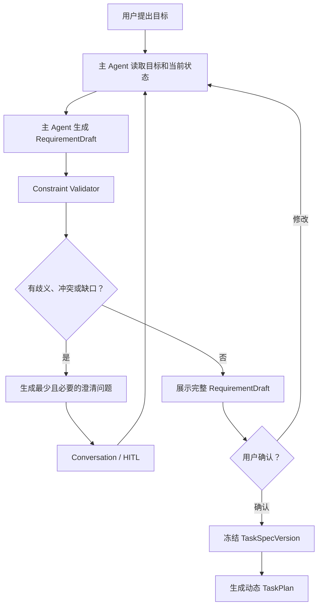
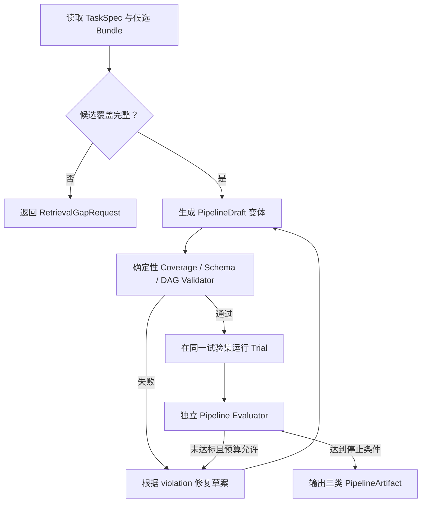

# DataAgent 通用 Agent 规划能力后续改造方案

> 日期：2026-07-27  
> 状态：后续开发基线  
> 触发原因：`yifu` Golden Task 虽被跑通，但生产实现包含场景硬编码，且现有
> 人脸 Evidence 未经过独立可信性验证  
> 本文范围：改造方案与测试计划，不修改产品代码

## 0. 结论

当前实现不能称为已经具备“泛化到任意数据处理需求的 Agent 规划能力”。

它完成的是：

```text
针对 yifu 的需求规则
-> 固定 Constraint
-> 固定 capability 顺序
-> 固定字段到 Pipeline 节点映射
-> 真实执行
```

目标必须改为：

```text
任意用户目标
-> 主 Agent 多轮澄清
-> 通用 ConstraintContract
-> 检索 Agent 动态找候选
-> 数据处理 Agent 动态选择、编排、试验和修复
-> 独立 Evaluator 验证 Evidence 正确性
```

`yifu` 只能作为未知于生产规划代码的 Golden Task。生产代码中不得存在：

- 固定的 `C01-C11` 业务组合；
- 针对“黑色衣服”的专用分支；
- 针对宽高、比例、大小、人脸、去重组合的固定 Pipeline；
- 通过需求关键词直接决定算子、节点或参数的逻辑；
- 把 Operator 返回了字段等同于 Evidence 已经正确的判断。

本轮新的 `yifu` 人脸条件统一表达为：

```text
face_count <= 2
```

边界 1 和 2 必须通过。按“两张及以下”的通常含义，0 也通过；主 Agent 在正式
任务确认时仍应显式询问用户是否要求画面中至少有一张人脸。如果用户要求至少
一张，则应形成两个独立 Constraint：

```text
face_count >= 1
face_count <= 2
```

---

## 1. 本次失败说明了什么

### 1.1 人脸 Evidence 不能由文件名或固定答案产生

人脸数量必须由运行时选中的人脸检测 Operator 实际分析图片后产生。产品代码和
Pipeline 不得根据文件名、测试目录或预置答案返回 `face_count`。

在修改后的 `face_count <= 2` 条件下，最终决定必须直接使用本次执行产生的
`face_count` Evidence。即使最终 keep/reject 碰巧符合人工直觉，也不能据此证明
检测器计数质量已经通过。

必须区分：

```text
Operator 有输出
!= Evidence 正确

筛选决定碰巧符合要求
!= Pipeline 质量合格
```

因此测试不能只检查最终 keep/reject，还必须证明计数来自实际 Operator，并检查
通用边界、运行来源和漏删风险。

### 1.2 规划泛化失败

当前 `dataagent/domain/specs/constraints.py`：

- 使用面向当前中文句式的正则；
- 按固定顺序生成 C01-C11；
- 写死黑色衣服分类；
- 写死 capability 集合和顺序。

当前 `dataagent/agents/processing/nodes.py`：

- 写死 capability 到 node ID；
- 写死 Constraint field 到 node ID；
- 写死尺寸、比例、文件大小和人脸参数绑定方法；
- 用代码固定排序代替数据处理 Agent 编排。

当前 `dataagent/agents/main/runtime.py`：

- 根据是否存在某个状态字段用固定 `if/else` 选择下一步；
- 有主图回环和计划记录，但没有通用的模型决策、Observation 解释、决定校验和
  重规划。

这些确定性逻辑可以承担安全门禁，却不应承担开放需求理解、能力选择和 Pipeline
设计。

---

## 2. 改造原则

### 2.1 Agent 决策，规则校验

正确分工：

| 决策 | 负责人 |
|---|---|
| 用户到底要什么、还缺什么信息 | 数据任务规划 Agent |
| 原始需求如何原子化 | 数据任务规划 Agent |
| 去哪里检索哪些候选 | 检索 Agent |
| 哪些算子和历史 Pipeline 可作为候选 | 检索 Agent |
| 最终使用哪些候选、如何排序和绑定参数 | 数据处理 Agent |
| 三种 Pipeline 如何形成和修复 | 数据处理 Agent |
| 是否需要采样、配额和拆分 | 数据策略 Agent |
| Schema、权限、预算、覆盖是否满足 | 确定性 Validator |
| 算子如何真正处理数据 | Engine |
| Evidence 是否正确、数据能否发布 | 独立 Evaluator |

确定性代码只保留：

- Schema 校验；
- 单位换算；
- 比较运算符语义；
- 权限与确认门禁；
- DAG 合法性；
- 参数 Schema 校验；
- Constraint Coverage；
- Evidence 完整性；
- 循环、成本和重试预算；
- 发布资格。

### 2.2 Golden Task 与生产实现隔离

`yifu` 相关内容只允许存在于：

```text
tests/fixtures/golden_tasks/yifu/
tests/acceptance/test_yifu_generalized_agent.py
```

生产模块不得导入 Golden Task，不得读取其预期 Pipeline，也不得按其文件名、
约束编号或关键词选择逻辑。

CI 增加静态防回归检查，禁止生产代码出现：

- `yifu`；
- `C01-C11` 的整体固定生成；
- `black_clothing` 专用任务分支；
- `_CONSTRAINT_NODE_IDS` 形式的业务字段固定映射表。

单个通用字段名可以存在于 Operator 自己的能力和 Schema 中，但不能以全局
`if capability == ...` 方式编排完整任务。

### 2.3 Evidence Claim 不等于 Validated Evidence

Operator 输出统一先成为 `EvidenceClaim`，记录：

```text
claim_id
constraint_id
asset_id / dataset_id
value
unit
producer
operator_version
model_version
parameters
confidence
artifact_refs
created_at
```

这里必须分开两个层次：

```text
任务运行时：
Operator 产生 face_count=<本次运行测得的整数>
-> QC 检查该 Evidence 是否存在
-> QC 检查 2 是否满足 TaskSpec 中的 <=2

算子/Pipeline 准入与试验时：
在 Golden Set 上比较 Operator 计数和人工真值
-> 判断该 Operator/Pipeline 是否有资格用于正式任务
```

`golden_set_compare` 不放进用户 TaskSpec，也不要求每次正式 Run 都重跑 Golden
Set。它属于 Operator/Pipeline 的评测和准入阶段。

正式 QC 通过至少要求：

```text
Evidence 由已通过准入评测的 Operator/Pipeline 产生
AND Evidence 的类型、值、单位和来源完整
AND Evidence 满足 TaskSpec 中的比较条件
AND 当前样本没有触发低置信、冲突或人工复核
```

对于尺寸、文件大小、SHA 等确定性 Evidence，可以直接重算验证。对于人脸数、
黑色衣服等模型 Evidence，必须先有 Golden Set、人工复核或其他独立评测证明
对应 Operator/Pipeline 达到了所需质量门槛。

---

## 3. TaskSpec 通用数据结构（领域模型，不是 AI 模型）

## 3.1 ConstraintContract v2

这里的“领域模型”是 TaskSpec 内部的数据结构，不是 AI 模型、人脸检测模型，
也不是一个新的执行步骤。

用户原始文本仍然完整保存在 TaskSpec 中。主 Agent 经过澄清后，再把用户确认的
条件保存成通用结构，供检索、Pipeline Coverage 和 QC 使用：

```yaml
task_spec:
  original_requirement: "筛选图片，图片中的人脸数量两张及以下……"
  constraints:
    - id: constraint_<generated-id>
      source_text: "图片中的人脸数量两张及以下"
      scope: asset
      target: image.face_count
      operator: lte
      value: 2
      unit: count
      hardness: hard
      required_evidence: face_count
```

Constraint ID 由系统生成，只用于追踪，不携带业务顺序含义。

支持的比较运算是通用语法：

```text
eq, neq, lt, lte, gt, gte, between, in, not_in, contains, excludes
```

TaskSpec 在这个阶段只表达：

- 用户要检查什么；
- 比较关系和边界是什么；
- 结果需要提供什么 Evidence。

TaskSpec 不表达：

- 使用 OpenCV、Data-Juicer 还是某个人脸模型；
- 使用哪个具体 Operator；
- Operator 参数名；
- Pipeline 节点和顺序；
- `golden_set_compare` 等算子评测方法。

`image.face_count` 是用户目标的通用可观测量，不等于已经选择了
`face_detection` 实现。具体能力和 Operator 由后续检索 Agent 和数据处理 Agent
决定。

### 3.2 用户约束与系统不变量分离

源文件不可变不是从用户文本“推断”的 C11，而是平台 `SystemInvariant`：

```text
source_assets_immutable = true
```

系统不变量由控制面自动附加并单独展示，不能伪装成用户提出的 Constraint。

### 3.3 RequirementDraft

主 Agent 每轮输出：

```text
RequirementDraft
- objective
- proposed_constraints
- assumptions
- ambiguities
- conflicts
- missing_evidence_requirements
- suggested_defaults
- source_traceability
```

每个 Constraint 必须能追溯到：

- 用户原始文本；
- 用户后续补充；
- 用户批准的默认值；
- 系统不变量。

任何模型自行补出的条件必须标记为 assumption，不能静默进入正式 TaskSpec。

### 3.4 四个阶段的对象不能混用

```text
用户和主 Agent
-> TaskSpec：要什么

检索 Agent
-> RetrievalCandidateBundle：哪些候选可能做到

数据处理 Agent
-> PipelineArtifact：具体用什么、参数是什么、先后顺序是什么

Engine / Evaluator
-> Evidence / QCReport：实际做出了什么、结果是否满足要求
```

TaskSpec 是后续阶段的上下文和正式约束来源，但不是 Pipeline，也不负责指定底层
实现。

---

## 4. 数据任务规划 Agent 的通用需求循环

Conversation 只负责 history、session、HITL 和 events。用户消息直接进入数据任务
规划 Agent。这里使用的是主 Agent 本身的语言理解能力，把任意自然语言整理为
TaskSpec；不是为了人脸数量再增加一个视觉模型。



### 4.1 主 Agent Tools

```text
extract_requirement_draft
normalize_constraint
validate_constraint_set
detect_ambiguities
detect_conflicts
inspect_task_status
read_observation
request_human_input
propose_task_spec_version
update_task_plan
```

`extract_requirement_draft` 由主 Agent 的语言模型完成开放语义结构化；
`normalize_constraint` 和 `validate_constraint_set` 是确定性 Tool。不能再用
场景正则作为主路径，也不能让该语言模型决定具体 OpenCV/模型/Operator。

### 4.2 澄清策略

主 Agent 只问会改变执行或验收结果的问题，并集中提问。例如当前需求至少需要
确认：

1. “两张及以下”是否接受 0 张人脸，还是要求 1–2 张？
2. “主体穿黑色衣服”中，多人画面如何定义主体？
3. 两人中只有一人穿黑色，是否保留？
4. 黑色上衣、黑色下装、黑白混色分别如何处理？
5. “重复”只去除完全相同，还是也去除视觉近似图片？
6. 输出是复制图片、逻辑 Manifest，还是两者都要？

主 Agent 不需要为每个任务机械询问全部问题。它应根据当前 Constraint 的
可执行性、歧义和已有用户偏好动态选择。

### 4.3 确认门禁

进入检索前必须满足：

```text
所有用户要求均有 Constraint 或明确记录为非目标
AND 每条 hard Constraint 有比较语义
AND 每条 hard Constraint 声明需要的 Evidence
AND 所有影响结果的 ambiguity 已解决
AND 用户确认的是即将持久化的同一 RequirementDraft
```

---

## 5. 检索 Agent：动态候选，不做最终选择

检索 Agent 接收通用 `RetrievalRequest`：

```text
task_spec_ref
constraint_refs
requested_scopes
runtime_constraints
evidence_requirements
cost_budget
latency_budget
```

当前先支持：

- Operator Candidate；
- 历史 Pipeline；
- 参数和成功/失败实验。

后续同事的数据检索通过同一 Interface 增加 Data Candidate，不改变主 Agent 和
数据处理 Agent 的 Interface。

### 5.1 检索 Agent Tools

```text
search_operator_registry
inspect_operator_contract
search_pipeline_experiences
search_failure_experiences
expand_capability_query
assess_candidate_sufficiency
search_external_capability
```

### 5.2 RetrievalCandidateBundle

每个 Constraint 返回零到多个候选：

```text
constraint_ref
candidate_operator_refs
supported_measurements
parameter_schema
output_evidence_schema
runtime_profiles
provider_status
evaluation_metrics
known_failure_slices
cost
latency
license
confidence
```

检索充分性必须逐 Constraint 计算。没有候选时返回 Gap，不允许根据关键词
“猜一个看起来接近的 Operator”。

---

## 6. 数据处理 Agent：动态选择、编排、试验和修复

数据处理 Agent 只消费：

- 已确认 TaskSpec；
- `RetrievalCandidateBundle`；
- CandidatePool Profiling；
- Golden Set / ReviewSet；
- 成本和时延约束。

它不直接读取 Registry，不通过全局映射表决定节点。

### 6.1 数据处理 Agent Tools

```text
inspect_candidate_bundle
select_operator_candidate
bind_constraint_to_parameter
compose_pipeline_graph
validate_pipeline_coverage
validate_operator_parameters
estimate_pipeline_cost
run_pipeline_trial
evaluate_pipeline_trial
compare_pipeline_trials
repair_pipeline_draft
publish_pipeline_artifact
```

### 6.2 动态参数绑定

每个 Operator 必须声明机器可读的 `OperatorContract`：

```text
capabilities
measurements
input_schema
parameter_schema
output_evidence_schema
preconditions
postconditions
runtime_profiles
cost_model
known_limitations
```

数据处理 Agent 根据 TaskSpec Constraint、检索 Agent 返回的候选和
OperatorContract 生成绑定草案：

```text
Constraint(face_count lte 2)
+ Operator(max_face_count, inclusive)
-> parameter max_face_count = 2
```

Validator 再确定性验证比较语义是否等价。这样：

- `face_count < 2` 绑定 `max_face_count=1`；
- `face_count <= 2` 绑定 `max_face_count=2`；
- 不需要在生产代码中为人脸任务写专用分支。

对于本次任务，如果数据处理 Agent最终选中了一个 OpenCV 人脸检测 Operator，
实际执行才会进入 OpenCV：

```text
TaskSpec: image.face_count <= 2
-> 检索 Agent找到可输出 face_count 的候选
-> 数据处理 Agent选择 OpenCV-based face Operator
-> 数据处理 Agent绑定 max_face_count=2
-> Engine 执行该 Operator
-> Operator 输出 face_count Evidence
-> QC 检查 face_count <= 2
```

如果检索结果显示另一个 Detector 在 Golden Set 上更准，数据处理 Agent也可以
选择它。TaskSpec 不需要随底层实现变化。

单位换算也由通用 Type/Unit Module 完成：

```text
1 KB -> 1024 bytes
20 MB -> 20971520 bytes
```

### 6.3 动态 Pipeline 编排

数据处理 Agent 根据：

- 数据依赖；
- Operator 前置条件和后置条件；
- 低成本过滤优先；
- dataset/asset execution scope；
- 串并行安全；
- Evidence 依赖；
- 预算和时延；
- 历史成功/失败经验；

生成 DAG。Validator 只判断 DAG 是否合法和完整，不决定业务顺序。

三类 Pipeline 必须来自真实优化目标：

| 类型 | 优化目标 |
|---|---|
| 保留优先 | 降低误删，允许更多 Review |
| 均衡 | 在误删、漏删、成本之间平衡 |
| 质量优先 | 降低漏删，接受更低保留率和更高成本 |

三类方案不能只是改一个固定阈值。每类都应允许不同 Operator、顺序、复核策略和
fallback。

### 6.4 数据处理 Agent Loop



---

## 7. 人脸计数的专项可信性改造

### 7.1 修改后的测试要求

`yifu` 人脸 Constraint：

```yaml
measurement: face_count
operator: lte
value: 2
unit: count
```

必须覆盖边界：

| 人工真实人脸数 | 预期 |
|---:|---|
| 0 | 通过，除非用户确认至少一人 |
| 1 | 通过 |
| 2 | 通过 |
| 3 | 拒绝 |
| 4+ | 拒绝 |

任何真实图片都必须走同一个 Operator Interface：

```text
image bytes
-> OpenCV-based detector / 其他已注册 detector
-> OperatorResult.metrics.face_count
-> 通用比较器执行 face_count <= 2
```

测试不得建立 `filename -> face_count` 映射。确定性边界测试使用注入的
FaceDetector Adapter 输出 0/1/2/3，以验证 Pipeline 确实消费运行时结果；真实
集成测试则运行实际 OpenCV-based Operator，并检查结果来源、类型、范围、参数和
决策一致性。

### 7.2 FaceCount Golden Set

为 19 张 `yifu` 图片建立独立人工标注：

```text
asset_sha256
visible_face_count
occluded_face_count
tiny_face_count
accepted_face_definition
reviewer
second_reviewer
adjudication
```

“人脸”的定义需冻结：

- 是否计入侧脸；
- 是否计入部分遮挡；
- 是否计入海报、屏幕和照片中的脸；
- 最小可见尺寸；
- 是否计入模糊或极小人脸。

至少报告：

```text
exact_count_accuracy
mean_absolute_error
under_count_rate
over_count_rate
boundary_false_keep_rate
boundary_false_reject_rate
```

### 7.3 候选与 fallback

检索 Agent 应返回多个可评测的人脸候选，数据处理 Agent通过 Golden Set 选择：

- 当前 Data-Juicer face Operator；
- 其他已注册 detector；
- 视觉模型计数；
- detector + VLM 复核组合；
- 边界或低置信样本人工 Review。

推荐规则不是固定写死模型名称，而是：

```text
当候选在 Golden Set 上未达到任务所需的 face_count 质量门槛
-> 数据处理 Agent 返回不足
-> 主 Agent 调用检索 Agent扩展候选
-> 用户批准外部能力后再注册、评测和编排
```

---

## 8. 统一 Agent Runtime

需要建立一个深 Module：

```text
AgentRuntime.run_turn(AgentContext) -> AgentTurnResult
```

该小 Interface 隐藏：

- 模型调用；
- Tool Schema；
- Tool 权限；
- Observation 转换；
- 决定校验；
- 循环预算；
- 重试；
- checkpoint；
- 事件；
- 脱敏和审计。

### 8.1 正式对象

```text
AgentContext
AgentDecision
ToolAction
Observation
AgentTurnResult
LoopBudget
CompletionGate
```

每轮 Agent 只返回一个结构化决定。

主 Agent允许任务级 Action；专业 Agent只允许自己的 Tool 和正式返回动作。所有
决定先通过确定性 Validator，再由 LangGraph 执行。

### 8.2 Observation 驱动

专业 Agent、Tool、Engine 和 Evaluator 的结果统一为 Observation：

```text
source
status
summary
artifact_refs
evidence_refs
violations
retryable
suggested_scope
```

Agent 只能根据 Observation 更新计划，不能修改既有 Evidence。

### 8.3 真实进度展示

界面展示：

- 当前 TaskPlan；
- 已完成、进行中、待处理步骤；
- 当前 Agent；
- 正在调用的 Tool；
- Tool 的真实 started/progress/completed/failed；
- Observation 摘要；
- 阻断原因和待用户决定事项。

不展示或伪造模型私有思维链。用户看到的是可审计的计划、行动、依据和进度，与
最终正式输出分开。

---

## 9. 代码改造范围

### 9.1 删除或降级的实现

| 当前实现 | 后续处理 |
|---|---|
| `domain/specs/constraints.py` 场景正则 | 从生产主路径删除；仅保留通用 unit/operator normalizer |
| 固定 C01-C11 | 移入 `yifu` 测试 fixture |
| 固定黑色衣服 classification | 由主 Agent根据用户确认动态生成 |
| `_CONSTRAINT_NODE_IDS` | 删除，改由 Constraint-to-Operator binding Artifact |
| `_parameters_for_capability` 业务分支 | 改为通用 OperatorContract 参数绑定 |
| 固定 capability priority | 改由依赖、成本、scope 和 Evidence 生成 DAG |
| `main/runtime.py` 状态 if/else 大脑 | 保留安全路由部分；开放规划迁入统一 Agent Runtime |

### 9.2 新建或深化的 Module

```text
dataagent/agent_runtime/
  models.py
  runtime.py
  decision_validator.py
  observation_adapter.py
  budgets.py

dataagent/domain/specs/
  constraint_contract.py
  requirement_draft.py
  normalizer.py
  validator.py

dataagent/domain/retrieval/
  request.py
  candidate_bundle.py
  gap.py

dataagent/domain/evidence/
  claims.py
  validation.py
  acceptance.py

dataagent/domain/operators/
  contract.py
  binding.py
```

这些路径是建议的 Module seam，不要求为了目录整齐拆成大量浅文件。最终应以
小 Interface、深实现和可替换 Adapter 为准。

---

## 10. 测试策略

## 10.1 禁止只围绕 `yifu` 开发

测试分四层：

1. 通用 Schema 和 Validator 单元测试；
2. Agent Tool/Observation/repair 循环测试；
3. 未见需求泛化测试；
4. `yifu` 等 Golden Task 端到端验收。

### 10.2 未见需求集

生产 Prompt 和代码冻结后，使用未参与开发的需求评测：

- 音频时长、采样率、静音比例筛选；
- 视频分辨率、时长、镜头切换和字幕要求；
- 文本语言、长度、敏感词和重复段落；
- 图片包含安全帽但排除反光衣；
- 多人图片中至少两人且至多五人；
- 按已有标签重命名并生成标注文件；
- 先裁剪主体，再分类，再按簇去重；
- 只有元数据条件、完全不需要视觉模型的任务。

这些需求不能新增生产分支后再算通过。

### 10.3 变形测试

同一语义的以下变化必须得到等价 Constraint：

- 顺序改变；
- 中文、英文或混合表达；
- “不超过 2”“至多 2”“<=2”；
- 单位变化；
- 多轮补充；
- 用户撤销或修改某条条件；
- 条件冲突；
- 缺少主体定义；
- 同一句包含多个比较条件。

### 10.4 反硬编码测试

必须证明：

- 删除 `yifu` fixture 后生产 Agent 仍可启动和规划；
- 将“黑色衣服”换为“红色安全帽”无需修改生产代码；
- 将“人脸”换为“车辆数量”只需 Registry 中存在相应 OperatorContract；
- Operator 参数名变化由 Adapter 处理，不修改数据处理 Agent；
- 候选缺失时返回 Gap，不生成假 Pipeline；
- 历史 Pipeline 不适配当前 Constraint 时不会被直接复用。

### 10.5 Pipeline 验收

每条 Pipeline 都要验证：

```text
Constraint recall = 100%
Constraint-to-Operator coverage = 100%
Parameter semantic equivalence = 100%
Required Evidence declaration = 100%
Trial Golden Set acceptance = passed
```

### 10.6 Evidence 验收

同时检查：

- 字段存在；
- 类型与单位正确；
- 值与 Golden Label 一致；
- Operator/模型/参数可追溯；
- 边界决策正确；
- 缺 Evidence 必须失败；
- 错 Evidence 不能因最终决定碰巧正确而通过。

---

## 11. 实施顺序

### Phase 0：冻结失败与隔离硬编码

- 把当前 `yifu` 规则标记为临时兼容实现；
- 新增“文件名不能决定 face_count”的失败测试；
- 新增注入 FaceDetector Adapter 的 0/1/2/3 通用边界测试；
- 将测试条件改为 `face_count <= 2`；
- 新增错误 Evidence 即失败的测试；
- 新增 CI 反硬编码扫描；
- 本阶段不改变算子和 Pipeline。

完成门禁：

```text
旧实现必须明确红在“计数 Evidence 错误”和“未见需求无法规划”。
```

### Phase 1：通用 ConstraintContract v2

- 建立 RequirementDraft、通用约束结构、required Evidence 和 source trace；
- 拆分 User Constraint 与 System Invariant；
- 单位和比较语义由确定性 normalizer 处理；
- 移除固定 C 编号和场景字段组合。

完成门禁：

- 未见需求结构化评测达到预设准确率；
- 多轮修改不会丢失或幽灵新增 Constraint；
- 用户确认对象与持久化对象完全一致。

### Phase 2：数据任务规划 Agent Runtime

- 引入统一 AgentContext、AgentDecision、Observation 和 Validator；
- 将需求抽取、歧义判断、提问、确认和 TaskPlan 迁入主 Agent Loop；
- Conversation 只保留交互职责；
- 主 Agent根据 Observation 选择专业 Agent，不使用固定业务流程判断。

完成门禁：

- 需求不完整时会提问；
- 用户修改后会重新规划；
- 模型不能绕过确认和完成门禁；
- 计划和真实事件可在界面持续展示。

### Phase 3：检索 Agent 候选契约

- 建立统一 RetrievalRequest/Bundle/Gap；
- Operator 和历史 Pipeline 接入；
- 数据库部分通过同事实现的 Adapter 后接入；
- 充分性按 Constraint 和 Evidence 要求判断。

完成门禁：

- 检索 Agent只提供候选；
- 数据处理 Agent不直接读 Registry；
- 缺候选明确返回 Gap。

### Phase 4：数据处理 Agent 动态 Tool Loop

- 建立 OperatorContract；
- 动态选择 Operator；
- 通用参数绑定；
- 动态 DAG；
- 三类 Pipeline trial；
- Validator violation 和误删/漏删 Observation 驱动修复。

完成门禁：

- 生产代码没有任务专用编排映射；
- 未见任务在 Registry 能力足够时可以编排；
- 参数边界和 Pipeline Coverage 100%；
- 三条方案是可解释的真实差异。

### Phase 5：Evidence 与独立评测

- 建立 EvidenceClaim/ValidatedEvidence；
- 建设 FaceCount Golden Set；
- Golden Set 用于 Operator/Pipeline 准入与 trial，不写入用户 TaskSpec；
- 加入 Operator 级和 Pipeline 级精度门槛；
- 错误值、缺失值、uncertain 和人工 Review 分开处理。

完成门禁：

- 所有真实图片的人脸数均由实际 Operator 在运行时计算；
- 不存在文件名、路径或 Golden Task 专用计数分支；
- 0/1/2/3 人脸边界全部正确；
- 人脸欠计数不能产生假通过；
- QC 不再只验证字段存在。

### Phase 6：体验与外部能力闭环

- 统一 Agent/Tool/Engine/Evaluator 生命周期事件；
- UI 分开展示 TaskPlan、活动、Artifact 和最终输出；
- 能力缺口触发受控外部检索、许可/安全检查和用户批准；
- 下载或注册后重新进入检索与处理循环。

---

## 12. Definition of Done

只有同时满足以下条件，才可以宣称具备通用 Agent 规划能力。

### 需求

- 任意支持范围内的新需求由主 Agent结构化，不依赖任务专用正则；
- 主 Agent会主动识别歧义、冲突、缺失比较边界和缺失 Evidence 要求；
- 用户确认完整 TaskSpec 后才进入检索；
- 多轮修改、撤销和追加不会丢失约束；
- TaskSpec 只描述“要什么”和所需 Evidence，不包含具体 OpenCV、模型或 Operator
  选择；

### 检索与处理

- 检索 Agent逐 Constraint 返回 Operator/历史 Pipeline 候选和充分性；
- 数据处理 Agent根据候选动态选择、绑定、编排、试验和修复；
- 生产代码没有 `yifu` 固定 Pipeline 或 C01-C11；
- 能力不足时返回 Gap 并进入受控外部发现。

### Evidence 与质量

- 每个 required Constraint 都有 Evidence Claim；
- 每个 hard Constraint 都能用运行 Evidence 做确定性比较；
- 非确定性 Operator/Pipeline 已在 Golden Set 或独立评测中通过准入；
- Evidence 值错误时即使最终决定碰巧正确也不能通过；
- Golden Set 独立于生产预测产生；
- QC 与 Pipeline 生成者分离。

### `yifu` 回归

- 人脸条件为 `face_count <= 2`；
- 1 张和 2 张人脸均通过；
- face_count Evidence 来自实际人脸检测 Operator；
- 运行决策与本次产生的 `face_count <= 2` 比较结果一致；
- 尺寸、比例、大小、黑色衣服和去重仍通过；
- 源文件不变；
- Pipeline 是 Agent 动态产生，不读取 Golden Pipeline。

### 泛化

- 至少三种未见模态或任务类型无需修改生产代码即可完成规划；
- 同义改写产生等价 Constraint；
- 替换 Operator 或参数名只需新 Adapter/Contract；
- 固定规则只能作为 Validator 或显式 fallback，不能拥有业务规划权。

---

## 13. 下一步第一批开发任务

建议下一次开发严格从以下五项开始：

1. 新增“禁止文件名决定 face_count”和 FaceDetector Adapter 边界失败测试；
2. 将 `yifu` 人脸条件改为通用 `lte 2`，由实际 Operator 运行时计算人脸数；
3. 建立 `ConstraintContract v2 + RequirementDraft`，先覆盖比较、单位、来源和
   required Evidence；
4. 用模型结构化输出替代 `parse_requirement_contract()` 的场景正则主路径；
5. 建立两组开发时未见需求，要求不修改生产代码完成 Constraint 和 Retrieval
   计划。

第一批开发结束时不要求立即跑完所有图片，但必须证明：

> 换一条此前没有写过的需求，主 Agent仍能提问、确认、形成通用 Constraint，
> 检索 Agent能返回对应候选或明确 Gap，而不是依靠新增 `if/regex` 通过测试。

## 14. 2026-07-27 首轮实施记录

本轮已落地以下通用能力：

- 新增 `RequirementPlanner` 端口，主 Agent 通过该端口获得
  `RequirementDraft`，不再要求需求节点自身知道某个具体任务；
- 新增模型规划适配器。模型只解释目标、原子约束、边界、单位、歧义与所需
  Evidence，不允许输出算子、模型、参数和 Pipeline；
- 模型输出增加原文 Grounding 与逐子句 Coverage 门禁：`source_text` 必须来自
  原始需求，每个分号/编号子句必须至少产生一个 Constraint；漏项或臆造会携带
  Validator Observation 进入有界修复，连续失败则停止，不能进入用户确认；
- API 在模型可用时注入模型规划器；未配置模型的调用暂时保留旧解析器作为
  兼容路径，该路径不代表目标架构，后续应删除；
- 检索 Agent 可直接用结构化约束的 `field + required_evidence_type +
  source_text` 检索 Operator Registry，并按每条约束报告候选覆盖；
- 数据处理 Agent 新增通用参数绑定器。它根据 Operator 参数 Schema 中的
  `min_* / max_*` 语义绑定 `gt/gte/lt/lte`，因此新注册的
  `min_vehicle_count` 等参数无需新增业务 `if/else`；
- 离散整数的严格边界由比较语义转换，例如 `< 2` 绑定为最大值 `1`；
  `<= 2` 原样绑定为最大值 `2`；
- Pipeline 的 Constraint Coverage 优先根据实际参数绑定生成，不再只依赖
  yifu 字段映射表。

人脸计数继续由 Data-Juicer `image_face_count_filter` 在运行时调用 OpenCV
分类器处理图片像素。DataAgent 只接收该次运行返回的 `face_counts`，适配为
`OperatorResult.metrics.face_count`。测试只验证证据来源、类型、边界和最终
比较一致性，不断言某个文件名必然等于某个固定人数。OpenCV 的检测值可能与
人工目测不同，这属于 Operator 质量评估和 Golden Set 门禁问题，不能通过
在 Agent 或测试中覆盖答案解决。

## 15. 2026-07-28 第二批实施记录：真实 Pipeline Trial Observation

本批只实现已确认的纵向切片，没有扩展检索数据库职责，也没有进入正式执行、
QC 和主 Agent 全局返工：

```text
数据处理 Agent 编排三个 Pipeline
  -> trial_pipeline_variants Tool
  -> PipelineTrialRunner 在隔离目录执行同一有界样本
  -> 按 Constraint 汇总 Evidence/失败
  -> Trial Observation 返回模型
  -> 模型决定重新编排或结束
```

正式公开边界为：

```text
PipelineTrialRunner.run(PipelineTrialRequest)
  -> PipelineTrialObservation
```

`PipelineTrialRunner` 隐藏样本发现、源文件复制、DAG 执行、Operator
Observation 汇总、Constraint 比较、dataset-level Evidence 和 Artifact
位置。它不选择算子、不重排节点、不自动修复 Pipeline。修复决定仍由数据处理
Agent 的模型循环产生。

当前已经实现：

- 从确认后的 `TaskSpec` 本地数据源发现确定性有界样本，也可显式传入样本；
- 在独立 Trial 目录复制输入，真实 Operator 不接触原文件；
- 使用正式 `OperatorRuntime` 按 Pipeline 顺序执行；
- 对每个资产和 Constraint 返回 `passed`、`failed`、
  `missing_evidence` 或 `not_evaluated`；
- 上游已正确拒绝的资产不会被下游误报为缺 Evidence；
- Operator 虽执行成功但没有硬约束 Evidence 时，Trial 必须失败；
- 支持 dataset-level 重复组“一组只保留一个代表”的 Evidence 判断；
- 三条 Pipeline 全部 Trial 通过后才允许数据处理 Agent 结束；
- 任一 Trial 失败时，完整 Observation 回到模型，模型可以重新调用编译 Tool；
- API 在模型配置可用时启用真实 Trial；无模型兼容路径明确标记为
  `pre_execution_validation`，不能冒充真实试跑。

Data-Juicer Provider 增加了通用输出适配：

- `image_shape_filter` 输出 `width`、`height`；
- `image_aspect_ratio_filter` 输出 `aspect_ratio`；
- `image_size_filter` 输出 `file_size_bytes`；
- 已有 `image_face_count_filter` 继续输出实际运行得到的 `face_count`。

这些 Adapter 只转换 Provider 的固定输出协议，不包含用户语句、任务实体、
路径或 Pipeline 选择规则。

本批自动化测试覆盖：

- 当前失败机制：Pipeline 节点存在但没有产生 required Evidence；
- 泛化案例 A：`image.vehicle_count <= 3`；
- 泛化案例 B：`document.character_count >= 10`；
- 反例：Operator 成功但 Evidence 缺失；
- 边界：正确拒绝、错误拒绝、上游拒绝、数据集去重和源文件隔离；
- Agent 修复：首次错误覆盖返回 `MISSING_EVIDENCE`，模型看到 Observation
  后重新编排，第二次 Trial 通过。

当前边界必须如实保留：

- Trial 使用小样本，不等于全量正式执行；
- 尚未计算误删率、漏删率、成本和三个策略的统计显著差异；
- 真实 Operator 能力仍受 Registry 和 Provider 可用性约束；
- 正式执行后的 QC 与主 Agent 全局返工属于第三批；
- `parse_requirement_contract()` 场景正则仍是无模型兼容路径，正式模型配置
  模式不以它作为规划权威；彻底删除属于单独兼容清理批次。

真实 `D:\data\yifu` 冒烟验证已使用当前模型规划器和完整补充定义执行。该次
验证没有进入 Retrieval/Processing/Trial：Requirement Planner 的逐子句
Grounding 门禁把“黑色衣服判定定义”和“默认可见人脸定义”判定为“没有原子
约束”，并在 TaskSpec 生成阶段终止。这是需求规划层的独立泛化缺陷，不是
PipelineTrialRunner 执行失败；不得通过给 yifu 增加正则、跳过 Grounding 或
直接注入 TaskSpec 来伪造第二批端到端成功。
