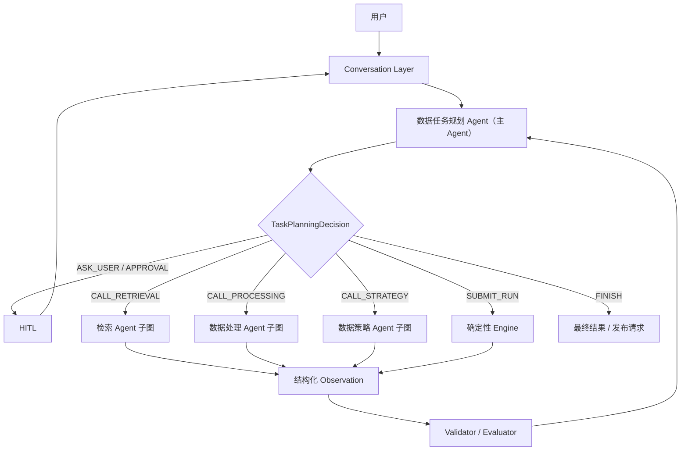

# DataAgent 主 Agent 与四 Agent Runtime 改造方案

> 日期：2026-07-27  
> 状态：架构方案，尚未修改产品代码  
> 产品职责基线：`DataAgent-final-PRD-v1.1.md` 第 4、5、6、7、9、11、13、20、22 节  
> 问题依据：`DataAgent-agent-framework-audit-and-test-plan-2026-07-27.md`、`DataAgent-problem-ledger-2026-07-26.md`、当前代码与 `D:\data\yifu` 失败案例

## 0. 最终决策

综合当前实现、PRD 和前期讨论，采用：

```text
Conversation Layer
-> 数据任务规划 Agent（主 Agent）
-> 检索 Agent / 数据处理 Agent / 数据策略 Agent
-> Engine / Evaluator
```

这仍然是四 Agent 架构，不增加第五个自主 Agent：

1. 原“需求规划 Agent”升级为“数据任务规划 Agent（主 Agent）”；
2. 主 Agent 既负责 TaskSpec，也负责整个 WorkOrder 的任务级计划、专业 Agent 调度、结果汇总和重新规划；
3. 检索 Agent、数据处理 Agent和数据策略 Agent保留各自专业决策权；
4. Conversation 降为纯交互运行层，只管理 history、session、HITL 和 events；
5. LangGraph 承载主 Agent Loop、三个专业 Agent 子图、checkpoint、interrupt 和恢复；
6. Loop Supervisor 保留为规则化安全路由模块，不与主 Agent争夺开放语义决策；
7. 检索 Agent 当前检索算子和历史 Pipeline 经验，未来接入数据库后同时承担数据检索和 CandidatePool 构建；
8. 数据处理 Agent 保留名称，负责 Pipeline 设计、算子需求、受控实验和处理问题返工。

这是一项产品架构升级，不是对现有 PRD 的逐字实现。后续应将 `DataAgent-final-PRD-v1.1.md` 升版，明确：

- 原需求规划 Agent升级为数据任务规划主 Agent；
- Conversation 只承担交互运行职责；
- 主 Agent和 LangGraph 的决策权划分；
- 主 Agent与三个专业 Agent 的调用协议；
- Loop Supervisor 只做标准原因码强制路由。

## 1. 最终架构判断

DataAgent 需要一个持续持有用户目标的主 Agent，但它不是四 Agent 之外的新角色，而是由需求规划 Agent 演进而来。

```text
User
-> Conversation Layer
-> 数据任务规划 Agent（主 Agent）
   -> 需求理解、TaskSpec、TaskPlan
   -> 调用检索 Agent
   -> 调用数据处理 Agent
   -> 调用数据策略 Agent
   -> 观察 Validator / Engine / Evaluator 结果
   -> 重新规划、请求用户或完成
```

各层决策权：

- 主 Agent负责“当前任务还缺什么、下一步应调用谁、是否需要用户、是否完成”；
- 三个专业 Agent负责各自领域中的“具体怎么做”；
- LangGraph 负责执行主 Agent 的受控决策并保存运行状态；
- 控制面负责正式事实、权限和版本；
- Engine 负责确定性执行；
- Evaluator 负责独立验收；
- Loop Supervisor 负责强制执行标准失败原因的安全路由。

当前真正缺少的是：

```text
Conversation 中的业务智能没有迁移到主 Agent；
需求规划 Agent 只生成 TaskSpec，没有持续持有全局目标；
每个专业 Agent 内部缺少自己的有界决策循环；
四个 Agent 之间缺少完整、不会丢失用户目标的正式 Artifact；
当前主图只有固定顺序，缺少由主 Agent 根据 Observation 驱动的重新规划。
```

## 2. 四个 Agent 的正式职责

## 2.1 数据任务规划 Agent（主 Agent）

### 使命

持续持有用户的数据任务目标：先把训练目标和自然语言需求转换为可观测、可执行、可验收的 TaskSpec，再根据当前正式状态决定调用哪个专业 Agent、是否需要用户、是否需要重新规划以及任务是否可以结束。

### 输入

- 用户自然语言需求和附件；
- 模型任务、基线、目标指标和关键失败切片；
- 历史同类 TaskSpec 和已验证判定手册；
- 权限、预算、时限和合规约束；
- 后续闭环中的 ModelFeedback 和失败证据。
- 当前 RetrievalPlan、CandidatePool、Pipeline、SamplingPlan、Run 和 QC 的版本摘要；
- 各专业 Agent 的结构化结果、Validator 结论和待处理缺口；
- 当前 TaskPlan、预算、循环次数和待处理 HITL。

### 输出

- `TaskSpecDraft`；
- `ConstraintContract[]`；
- `AmbiguityList`；
- `AcceptancePlan`；
- 用户确认后的 `TaskSpecVersion`；
- 目标变化时的 `TaskSpecRevisionProposal`。
- 可展示、可恢复的 `TaskPlanArtifact`；
- 下一步受控动作 `TaskPlanningDecision`；
- 专业 Agent 调用请求；
- 面向用户的澄清、确认、批准和完成请求。

### 内部 Agent Loop

```text
读取用户目标和当前正式状态
-> 原子化拆解 Constraint
-> 检查完整性、冲突、可观测性和合规
-> 生成澄清问题或建议默认值
-> 用户补充 / 确认
-> 重新验证
-> 冻结 TaskSpec 草案并提交控制面创建版本
-> 建立 TaskPlan
-> 选择一个任务级动作
-> 调用检索 / 数据处理 / 数据策略 Agent
-> 观察结构化结果和 Validator
-> 更新计划
-> 继续、请求用户或完成
```

### 需求阶段完成条件

```text
所有原始要求均映射到原子 Constraint
AND 所有 required Constraint 均可执行或有明确验收方法
AND 所有歧义已解决或由用户批准默认值
AND TaskSpec Schema 与完整性校验通过
AND 用户确认当前版本
```

### 全局完成条件

主 Agent不能根据模型自己的文字判断“已经完成”，必须同时满足确定性门禁：

```text
TaskSpec 已确认且所有 required Constraint 均完整
AND 所需 RetrievalPlan / CandidatePool 已达到充分性要求
AND 所选 Pipeline 通过逐约束 Coverage、Schema、权限和 runtime 校验
AND SamplingPlan 已通过配额、多样性和拆分校验
AND Run 达到允许的终态
AND 每条 required Constraint 均有 Evidence
AND 独立 Evaluator 通过
AND 所需人工审批均已完成
```

### 不负责

- 选择具体数据源 Query；
- 选择具体算子；
- 编排 Pipeline；
- 决定训练/验证/测试集配比；
- 自行修改正式 TaskSpec。
- 绕过 Validator、权限、预算和审批；
- 代替 Evaluator 宣布质量通过；
- 直接执行图片级任务。

### 名称结论

推荐升级名称：

```text
数据任务规划 Agent（主 Agent）
Data Task Planning Agent
```

如果为了兼容现有 PRD 和界面，迁移期可以显示：

```text
需求规划 Agent（主 Agent）
```

但最终建议使用“数据任务规划 Agent”，因为它在 TaskSpec 确认后仍负责整个任务的计划和调度。“需求规划 Agent”容易继续被实现成只做自然语言到 TaskSpec 的前置解析器。

它不替代检索、处理和策略 Agent。主 Agent选择“下一步需要哪个专业 Agent”，专业 Agent决定领域内部的具体方案。

## 2.2 检索 Agent

### 使命

根据主 Agent给出的检索目标，从数据源、Operator Registry 和 Pipeline/Experiment 历史中高召回查找候选，完成权限过滤、排序、证据整理和充分性判断，再把候选交给对应专业 Agent 决策。

检索 Agent统一负责三类检索：

```text
数据候选检索
算子候选检索
历史 Pipeline / 参数 / 成功失败实验检索
```

它负责“找到哪些候选可用”，不负责“最终选哪个、怎样组合”。

### 输入

- 已冻结 TaskSpec、Constraint Contract 和主 Agent的检索请求；
- 数据源目录、数据库、向量库、标签库、元数据与访问权限；
- 个人和公共 Operator Registry；
- 历史 Pipeline、参数、成功实验、失败实验和当前发布状态；
- 历史成功 Query、误检、漏检、失败样本和 ModelFeedback；
- CandidatePool Profiling；
- runtime、许可证、预算、时延和候选规模限制。

### 输出

- 统一的 `RetrievalCandidateBundle`；
- 数据检索时的 `RetrievalPlan`、`CandidatePoolVersion` 和 `CandidateSufficiencyReport`；
- 算子检索时的 `OperatorCandidateSet` 和逐约束 Coverage；
- 历史经验检索时的 `PipelineExperienceMatches`、参数与成功/失败证据；
- 未满足检索目标时的 `RetrievalGapReport`；
- 每个候选的来源、权限、版本、指标、成本、风险和证据引用。

### 内部 Agent Loop

```text
读取 RetrievalRequest
-> 判断检索 scope
-> 选择对应 Registry / 数据源 / 历史库
-> 生成多路检索 Query
-> 调用检索工具
-> 权限、状态和硬约束过滤
-> 排序并检查候选充分性
-> 不足则扩展 Query 或检索源
-> 达到预算、规模或次数上限时返回 Gap
-> 输出候选 Bundle 给主 Agent
```

### 当前与后续阶段

当前尚未接入数据库，已实现的主要是：

- Operator Catalog 中的算子候选；
- 历史 Pipeline 经验；
- 与能力和 Pipeline 相关的已有资产。

后续数据库检索接入后，在同一个检索 Agent中增加数据候选检索、RetrievalPlan 和 CandidatePool，不另建一套平行 Agent。

### 建议统一的检索请求类型

检索 Agent 可以在同一个小接口后支持不同检索范围：

```text
retrieve(RetrievalRequest) -> RetrievalCandidateBundle
```

`RetrievalRequest.scope` 可包括：

```text
DATA_CANDIDATES
OPERATOR_CANDIDATES
PIPELINE_EXPERIENCES
HISTORICAL_FAILURES
```

不同范围返回不同的正式结果：

| Scope | 主要结果 |
|---|---|
| `DATA_CANDIDATES` | RetrievalPlan、CandidatePool、CandidateSufficiencyReport |
| `OPERATOR_CANDIDATES` | OperatorCandidateSet |
| `PIPELINE_EXPERIENCES` | PipelineExperienceMatches |
| `HISTORICAL_FAILURES` | FailureExperienceMatches |

该接口隐藏数据库、向量库、本地 Catalog 和历史资产库之间的差异，使调用者只声明“要检索什么”，不需要了解每一种存储实现。

### 与其他同事的数据检索开发如何衔接

数据库和数据候选检索由其他同事开发时，应接入检索 Agent 的 `DATA_CANDIDATES` 路径，不应另建一套绕过 WorkOrder、TaskSpec 和 CandidatePool 的平行流程。

建议提前冻结以下 seam：

- 输入：已冻结 TaskSpec、数据权限、查询预算和目标规模；
- 输出：版本化 RetrievalPlan、CandidatePool 引用、Profiling 和充分性报告；
- 运行：通过 Retrieval Engine 异步执行；
- 状态：Run 事实由控制面保存，LangGraph 只保存引用；
- 失败：统一返回 `RETRIEVAL_GAP`、预算、受影响切片和证据；
- 血缘：每个候选保留全部召回路径和原始资产定位信息。

数据源适配可以在这一 seam 后扩展本地目录、Milvus、数据库、标签库和对象存储 Adapter，不需要修改四 Agent 之间的正式接口。

### 与数据处理 Agent 的职责分工

检索 Agent 负责查找数据、算子和历史 Pipeline，但它只负责：

- 接收检索目标；
- 高召回找到候选；
- 排序、过滤权限和返回证据；
- 报告候选充分性。

它不负责：

- 决定最终 Pipeline 结构；
- 决定算子顺序和参数；
- 宣布某个历史 Pipeline 可直接复用；
- 代替当前任务的小样本复验；
- 修改处理 Agent 的评测门槛。

## 2.3 数据处理 Agent

### 名称结论

保留：

```text
数据处理 Agent
Data Processing Agent
```

不改为 `Pipeline Engineering Agent`。

原因是它的职责不止 Pipeline 编排，还包括：

- 清洗；
- 过滤；
- 分类；
- 去重；
- 标注；
- 轻量富化；
- 深度加工；
- 参数或结构返工；
- 处理和标签问题闭环。

“Pipeline Engineering Agent”会把产品职责缩窄成技术编排，反而丢失 PRD 中的业务含义。

### 使命

根据 TaskSpec、CandidatePool Profiling 和算子能力设计清洗、过滤、分类、去重、标注与加工 Pipeline，并通过受控实验寻找当前约束下的近似最优方案。

### 输入

- TaskSpec；
- CandidatePool Profiling；
- 检索 Agent 输出的 `OperatorCandidateSet`；
- 检索 Agent 输出的 `PipelineExperienceMatches`；
- 检索 Agent 输出的候选参数、成功/失败实验摘要和证据；
- Golden Set；
- 资源、成本和时延限制；
- ModelFeedback 中的处理和标签问题。

### 输出

- `OperatorRequirement`；
- 保留优先、均衡、质量优先三类候选；
- 每类内部 `PipelineVariant[]`；
- `CurationPlan`；
- 失败时的参数或结构 Revision；
- 通过评测后可发布的 `PipelineRelease`。

### 与检索 Agent 的协作

PRD 中“数据处理 Agent 优先检索历史 Pipeline、个人算子库和公共算子库”应解释为它必须优先利用这些候选，而不是由数据处理 Agent直接读取 Registry 或历史库。检索动作和候选充分性属于检索 Agent，使用候选的决策属于数据处理 Agent。

推荐协作方式：

```text
数据任务规划 Agent
-> 根据 TaskSpec 调用检索 Agent
-> 检索 Agent 输出 OperatorCandidateSet / PipelineExperienceMatches
-> 主 Agent将候选 Bundle 交给数据处理 Agent
-> 数据处理 Agent检查候选是否满足处理需要
-> 数据处理 Agent 决定如何受限复用、修改和组合
-> 当前任务小样本复验
```

因此：

- 检索 Agent 拥有“查找、过滤、排序候选并判断充分性”的检索能力；
- 数据处理 Agent 拥有“如何使用候选”的处理决策权。
- 主 Agent负责两个专业 Agent之间的调用和结果交接。

如果数据处理 Agent在编排中发现新的依赖或能力缺口，不直接调用检索 Agent，而是返回：

```text
RetrievalGapRequest
```

主 Agent读取缺口后再次调用检索 Agent。这样三个专业 Agent彼此不形成隐式调用链，所有调度、重试和进度仍由主 Agent统一掌握。

### 内部 Agent Loop

```text
读取 TaskSpec 和 CandidatePool Profiling
-> 读取 OperatorCandidateSet 和 PipelineExperienceMatches
-> 检查 Constraint Coverage
-> 候选不足时返回 RetrievalGapRequest
-> 形成三类 Pipeline 的内部变体
-> 调用 Experiment Manager
-> 由独立 Pipeline Evaluator 评分
-> 根据误删、漏删、成本和失败原因修正相关节点
-> 收益不足或预算耗尽时停止
-> 输出三类代表方案和 CurationPlan
```

### 能力不足时

数据处理 Agent 负责识别：

```text
当前处理目标没有可用算子覆盖
```

然后触发受控算子发现流程。

检索 Agent 可以负责搜索外部候选；治理模块负责许可证、安全扫描、隔离测试和人工准入；数据处理 Agent 在候选正式发布到 Registry 后重新编排。

### 不负责

- 修改 TaskSpec；
- 扩大数据召回范围；
- 自行评价并宣布 Pipeline 通过；
- 修改 Golden Set、Evaluator 门槛或结果；
- 绕过准入使用互联网代码；
- 直接修改生产数据。

## 2.4 数据策略 Agent

### 使命

从 EnrichedCandidatePool 中决定哪些数据进入训练、验证和测试集，在配额、质量、多样性、难例、成本和模型收益之间进行受约束优化。

### 输入

- TaskSpec 和目标配额；
- EnrichedCandidatePool；
- 质量、场景、标签、向量、置信度和来源；
- Golden Set 和 ReviewSet；
- ModelFeedback、失败样本、不确定样本和困难样本近邻；
- 训练/验证/测试隔离要求。

### 输出

- `SamplingPlan`；
- 数据配额和优先级权重；
- 多样性、去重和簇上限；
- 训练/验证/测试拆分计划；
- `DistributionReport`；
- 分布问题 Revision。

### 内部 Agent Loop

```text
读取富化候选池画像
-> 生成配额、权重、多样性和拆分方案
-> 确定性模拟或小样本检查
-> 检查配额、泄漏、单一来源主导和难例覆盖
-> 修正 SamplingPlan
-> 候选不足时生成具体缺失切片
-> 级联检索 Agent 做增量召回
-> 达到约束或进入 HITL
```

### 不负责

- 修改 TaskSpec；
- 自行扩大召回范围；
- 修改处理 Pipeline；
- 代替检索 Agent 检索数据；
- 代替 Evaluator 宣布数据集通过。

## 3. 全局编排：主 Agent 决策，LangGraph 执行

LangGraph 不是大脑，也不只是固定 DAG。它是主 Agent 和专业 Agent 的有状态运行时。



主 Agent 允许的任务级动作应收敛为固定 Schema：

```text
ASK_USER
PROPOSE_TASK_SPEC
CALL_RETRIEVAL_AGENT
CALL_PROCESSING_AGENT
CALL_STRATEGY_AGENT
REQUEST_CAPABILITY_APPROVAL
REQUEST_PIPELINE_SELECTION
REQUEST_RUN_APPROVAL
SUBMIT_RUN
WAIT_FOR_RUN
REPLAN
FINISH
FAIL_WITH_ACTIONABLE_GAP
```

主 Agent产生动作，Action Policy 根据当前正式状态验证是否合法，LangGraph 再路由到对应子图或 HITL。模型不能自由指定任意节点名、数据库操作或执行命令。

当前尚未接入数据库时：

```text
数据任务规划 Agent
-> 确认 TaskSpec
-> 调用检索 Agent：算子与历史 Pipeline 经验
-> 调用数据处理 Agent：生成三类 Pipeline
-> 调用数据策略 Agent
-> 观察结果并决定下一步
```

数据库检索合入后：

```text
数据任务规划 Agent
-> 调用检索 Agent：数据 RetrievalPlan / CandidatePool
-> 调用检索 Agent：算子候选和历史 Pipeline 经验
-> 将 RetrievalCandidateBundle 交给数据处理 Agent
-> 数据处理 Agent选择、组合并优化 Pipeline
-> 如发现能力缺口，返回主 Agent重新调用检索 Agent
-> 调用数据策略 Agent
-> 观察 Run / QC / ModelFeedback
-> 重新规划或完成
```

## 4. Loop Supervisor 的准确定位

Loop Supervisor 保留为规则化路由模块，不是第五个自主 Agent，也不是全局大脑。它与主 Agent 的关系是：

```text
主 Agent：根据完整上下文做开放语义规划
Loop Supervisor：根据标准原因码施加强制路由和安全约束
```

例如，主 Agent可以解释 `PROCESSING_FALSE_NEG` 的含义、汇总证据并更新 TaskPlan，但 Loop Supervisor 必须保证返工目标是数据处理 Agent，不能让模型把它错误路由到数据策略 Agent。

Supervisor 输出受控的 `RequiredRoute`，主 Agent据此形成下一轮任务计划；两者不做同一件事。

它的输入是独立 Evaluator、训练评测和运行系统产生的标准原因码：

| 原因码 | 路由 |
|---|---|
| `RETRIEVAL_GAP` | 检索 Agent |
| `PROCESSING_FALSE_NEG` | 数据处理 Agent |
| `PROCESSING_FALSE_POS` | 数据处理 Agent |
| `LABEL_QUALITY_ISSUE` | 数据处理 Agent |
| `DISTRIBUTION_GAP` | 数据策略 Agent |
| `HARD_SAMPLE_GAP` | 数据策略 Agent，必要时级联检索 Agent |
| `TARGET_CONFLICT` | 数据任务规划 Agent + HITL |
| `COMPLIANCE_RISK` | HITL |
| `TARGET_MET` | 人工终验与发布 |

每次路由必须附带：

- 失败指标；
- 阈值差距；
- 受影响切片；
- 代表样本；
- 证据和置信度；
- 推荐修改对象；
- 预计重跑节点；
- 成本；
- 停止条件。

## 5. Conversation 的定位

Conversation 保留为 `Conversation Layer` / `Conversation Session Runtime`，它不是 Agent，也不承担业务推理。

它负责：

- ConversationThread 和消息历史；
- WorkOrder、LangGraph thread 和当前 Run 关联；
- 用户消息、HITL 请求与回复的关联；
- 流式事件；
- 断线重连和幂等；
- owner 权限；
- 正式事实展示。
- 将用户自由文本和 HITL 回复交给主 Agent；
- 将主 Agent、工具、Run 和 Evaluator 事件流式传递给界面。

它不负责：

- 代替数据任务规划 Agent理解需求、生成 TaskSpec 或决定下一步；
- 代替检索 Agent 生成 RetrievalPlan；
- 代替数据处理 Agent 生成 Pipeline；
- 自己判断最终任务完成。

当前集中在 `ConversationService -> ModelGateway.conversation_turn()` 的业务语义决策，应迁移到数据任务规划 Agent；专业领域内的具体决策再由主 Agent委派给相应专业 Agent。

Conversation 的小接口可以保持为：

```text
receive_message(thread_id, message)
stream_events(thread_id)
resume_interrupt(thread_id, response)
```

它不需要暴露 `parse_requirement`、`select_agent`、`compile_pipeline` 等业务方法。

## 6. Constraint Contract 是第一优先级

无论 Agent 如何分工，主链路都必须以不会丢失用户目标的原子约束为基础。

建议每条约束至少包含：

```text
id
source_message_id
source_text_span
kind
subject
operator
value
unit
hard_or_soft
evaluator_type
evidence_requirement
ambiguity
status
```

`yifu` 任务应至少形成：

```text
C1 width >= 64 px
C2 height >= 64 px
C3 0.3 <= aspect_ratio <= 3.5
C4 1 KB <= file_size <= 20 MB
C5 0 <= face_count <= 2
C6 main_subject_clothing_color == black
C7 deduplicate
C8 publish manifest with evidence
```

此后所有正式对象都引用 Constraint ID：

```text
Constraint
-> Retrieval Query / Candidate Coverage
-> OperatorRequirement
-> OperatorVersion
-> Pipeline Node / Parameter
-> Asset Evidence
-> QC Assertion
```

缺少任一 required Constraint 的映射时，系统不能确认 TaskSpec、批准 Pipeline 或宣布 Dataset 通过。

## 7. 每个 Agent 的统一 Runtime

不建议先设计宽泛的：

```text
BaseAgent.plan()
BaseAgent.think()
BaseAgent.act()
BaseAgent.reflect()
BaseAgent.finish()
```

建议共享一个深的 Agent Runtime 模块，对外只提供小接口：

```text
run_agent_turn(AgentContext) -> AgentDecision
```

共享 Runtime 的实现负责：

- 模型调用；
- 工具注册和权限；
- Schema 校验；
- trace 和 evidence；
- 重试、预算和无进展检测；
- checkpoint；
- 进度事件；
- 错误标准化。

每个专业 Agent 只配置：

- 专业目标；
- 裁剪后的输入上下文；
- 允许的工具；
- 输出 Schema；
- Validator；
- 完成和停止条件。

每个子图遵循 PRD 的节点协议：

```text
load_context
-> analyze
-> generate_plan
-> validate_schema
-> validate_constraints
-> persist_draft
-> request_approval_or_submit_run
-> collect_result
-> decide_next
```

子图不能直接修改正式对象，控制面负责权限检查、版本创建和合法状态迁移。

## 7.1 每个 Agent 是否都需要 Tools

需要。只要一个模块被称为自主 Agent，它就应该拥有与职责匹配的受治理工具集合，并能根据当前目标和 Observation 决定下一次工具调用。

但这不表示：

- 每个 Agent 都拥有所有工具；
- 所有普通函数都包装成 Tool；
- Agent 可以绕过 LangGraph、控制面和 Engine；
- Validator 的最终门禁交给模型；
- Agent 必须为了“看起来智能”而强行调用工具。

正确结构是：

```text
Agent Goal
-> 选择允许的 Tool 或任务级 Action
-> Tool Runtime 执行
-> 返回结构化 Observation 和 Evidence
-> 确定性 Validator
-> Agent 修正计划或结束
```

工具是 Agent 获取事实和产生受控草案/运行请求的接口；领域内部的纯计算函数如果不需要 Agent 选择，不必暴露为 Tool。

## 7.2 主 Agent 的工具和任务级 Action

数据任务规划 Agent需要的是任务管理和事实读取工具，不应拥有算子执行工具。

建议 Tools：

```text
read_work_order_facts
read_version_summary
inspect_constraint_status
validate_task_spec_draft
inspect_retrieval_result
inspect_processing_result
inspect_strategy_result
inspect_run_and_qc
persist_task_plan_draft
```

建议任务级 Actions：

```text
ASK_USER
PROPOSE_TASK_SPEC
CALL_RETRIEVAL_AGENT
CALL_PROCESSING_AGENT
CALL_STRATEGY_AGENT
REQUEST_PIPELINE_SELECTION
REQUEST_RUN_APPROVAL
SUBMIT_RUN
WAIT_FOR_RUN
REPLAN
FINISH
```

`CALL_*_AGENT` 更适合作为由 LangGraph 路由的任务级 Action，而不是允许模型任意调用的普通 Tool。这样主 Agent只能通过正式子图调用专业 Agent。

主 Agent禁止使用：

- Operator Registry 直接搜索；
- Pipeline 编译；
- 图片处理算子；
- Sampling 参数计算；
- 数据库自由查询；
- 绕过审批提交生产运行。

## 7.3 检索 Agent Tools

建议 Tools：

```text
search_operator_registry
inspect_operator_version
search_pipeline_experiences
inspect_pipeline_experiment
search_historical_failures
check_candidate_permissions
check_runtime_and_license
rank_retrieval_candidates
assess_candidate_sufficiency
search_data_sources              # 数据库接入后
submit_retrieval_plan            # 数据库接入后
profile_candidate_pool           # 数据库接入后
search_external_capability       # 受控发现阶段
```

输出必须统一映射成 `RetrievalCandidateBundle`，不能把 Registry 或数据库原始返回直接交给数据处理 Agent。

检索 Agent禁止：

- 编排最终 Pipeline；
- 修改算子参数；
- 宣布历史 Pipeline 可直接复用；
- 下载或发布未经批准的外部代码；
- 修改 TaskSpec；
- 直接加工生产数据。

## 7.4 数据处理 Agent Tools

建议 Tools：

```text
inspect_retrieval_candidate_bundle
derive_operator_requirements
compile_pipeline_artifact
validate_pipeline_schema
validate_constraint_node_coverage
validate_parameter_bindings
estimate_pipeline_cost
submit_sample_trial
inspect_trial_result
compare_pipeline_variants
propose_pipeline_repair
persist_pipeline_draft
```

数据处理 Agent不拥有：

```text
search_operator_registry
search_pipeline_history
query_database
modify_evaluator_threshold
publish_unapproved_operator
```

如果编排时发现新依赖，它输出 `RetrievalGapRequest`，由主 Agent再次调用检索 Agent。

## 7.5 数据策略 Agent Tools

建议 Tools：

```text
inspect_enriched_candidate_profile
inspect_quota_and_slice_targets
simulate_sampling_plan
validate_quota_coverage
validate_diversity
validate_near_duplicate_leakage
validate_train_eval_isolation
estimate_sampling_yield_and_cost
persist_sampling_plan_draft
```

数据策略 Agent发现候选不足时输出缺失切片和 `RetrievalGapRequest`，不能自行扩大数据召回范围。

## 7.6 不属于 Agent 的模块

以下模块不需要为了形式统一而拥有 LLM Tool Loop：

| 模块 | 原因 |
|---|---|
| Conversation Layer | 只管理 history、session、HITL 和 events |
| Loop Supervisor | 按标准原因码执行确定性路由 |
| Validator | 确定性检查 Schema、Coverage、权限和状态 |
| Evaluator | 独立计算质量指标和门禁 |
| Engine / Worker | 按批准的 Artifact 确定性执行 |
| Control Plane | 保存正式事实、版本、权限和审计 |

Agent 可以通过受治理工具读取这些模块的结果或提交草案/运行请求，但不能控制它们的判定逻辑。

## 7.7 Tool Contract

每个 Tool 必须声明：

```text
name
version
description
input_schema
output_schema
allowed_agents
required_permissions
side_effect_class
idempotency_key
timeout
retry_policy
cost_policy
preconditions
postconditions
evidence_schema
event_schema
```

`side_effect_class` 至少区分：

```text
READ
DRAFT_WRITE
APPROVAL_REQUIRED
RUN_SUBMISSION
EXTERNAL_INSTALL
```

Tool Runtime 必须在执行前后发送真实事件：

```text
started
progress
completed
failed
```

不能等工具执行完成后再一次性生成“正在检索”“正在校验”等伪实时摘要。

## 7.8 与审计问题的对应关系

新架构是解决审计问题的必要条件，但不是充分条件：

| 审计问题 | 主要解决机制 | 仅有 Agent + Tools 是否足够 |
|---|---|---|
| 智能集中在 Conversation | 主 Agent承接业务智能，Conversation 降为交互层 | 基本可以 |
| 四个子图是固定函数 | 每个 Agent 的 Tool/Observation/Validator Loop | 可以，但必须真实循环 |
| 需求关键词拆解、约束丢失 | Constraint Contract、需求完整性 Validator | 不够 |
| Retriever 找到算子但 Coverage 丢弃 | Constraint 根对象、RetrievalCandidateBundle、Coverage Matrix | 不够 |
| 不完整 Pipeline 仍 production eligible | 独立语义完整性 Validator 和发布门禁 | 不够 |
| metadata 条件进入 VLM Prompt | evaluator_type 和 Prompt Binding 校验 | 不够 |
| QC 无法逐约束自证 | Constraint-to-Evidence-to-QC 链路 | 不够 |
| Pipeline 结果不符合用户要求 | Golden Task、小样本试跑、独立 Evaluator、人工语义标注 | 不够 |
| 用户看不到实时计划与进度 | TaskPlanArtifact 和统一 Tool/Agent/Engine 事件 | 可以 |
| 整条 Pipeline 串行 | Engine 的 stage-aware 并行 | 不够 |
| 外部能力缺口无法闭环 | 检索 Tool、治理准入、用户批准和重新编排 | 部分可以 |

因此验收标准不能写成“每个 Agent 已经有 Tools”。必须证明：

```text
Agent 根据 Observation 改变了下一步
AND 所有 required Constraint 全链路可追踪
AND Validator 能阻断错误方案
AND Evidence/QC 能证明结果
AND 真实 Golden Task 达标
```

## 8. 分阶段改造顺序

## Phase 0：冻结 `yifu` 失败并阻止假成功

- 固化八个原子约束；
- 增加约束丢失、Coverage 丢失和 Pipeline 漏节点测试；
- 任一 required Constraint 无完整映射时阻止 `production_eligible`；
- 不可由 VLM 判断的约束禁止进入 VLM Prompt。

## Phase 1：数据任务规划主 Agent + Constraint Contract

这是第一个需要真正改造的 Agent。它既要先修复 TaskSpec 地基，又要承接从 Conversation 迁出的业务智能。

- 建立原子 Constraint 模型；
- 实现需求分析、澄清、确认的有界循环；
- 建立 TaskSpec 完整性、可观测性和验收方法 Validator；
- 需求修改后使受影响的 RetrievalPlan、Pipeline 和实验失效。
- 定义 `TaskPlanArtifact` 和 `TaskPlanningDecision`；
- 将主图改成“主 Agent -> 专业 Agent/HITL -> Observation -> 主 Agent”；
- 将 Conversation 中的 TaskSpec 语义理解和任务级路由逐步迁入主 Agent；
- 建立全局完成条件、预算和无进展检测。

## Phase 2：检索 Agent 的统一候选接口

- 保留当前算子与历史 Pipeline 检索；
- 将 Operator Registry、Pipeline 历史、参数和成功/失败实验明确收归检索 Agent输入；
- 将结果正式化为 `RetrievalCandidateBundle`、`OperatorCandidateSet` 和 `PipelineExperienceMatches`；
- 定义 `DATA_CANDIDATES` 的输入、输出和运行契约；
- 为数据库检索同事预留并冻结 CandidatePool seam；
- 数据处理 Agent不再直接读取 Registry 或历史库；
- 避免数据库实现侵入主 Agent和数据处理 Agent。

## Phase 3：数据处理 Agent Loop

- 接收主 Agent转交的算子与历史 Pipeline 候选；
- 检查逐约束 `OperatorRequirement` 是否得到覆盖；
- 缺少候选时返回 `RetrievalGapRequest`，由主 Agent重新调用检索 Agent；
- 生成保留优先、均衡、质量优先三类 Pipeline；
- 每类内部允许多个结构和参数变体；
- 调用 Experiment Manager 和独立 Evaluator；
- 根据误删、漏删、成本和失败原因局部修复；
- 输出真实、持久化、可复验的 Pipeline 文件和 CurationPlan。

## Phase 4：数据检索正式接入

与其他同事的数据库开发合流：

- 数据源 Adapter 接入 Retrieval Engine；
- 检索 Agent 生成 RetrievalPlan；
- 构建 CandidatePoolVersion 和 Profiling；
- 实现充分性检查、增量 Query 和预算停止条件；
- 数据处理 Agent 改为读取真实 CandidatePool Profiling。

## Phase 5：数据策略 Agent Loop

- 基于 EnrichedCandidatePool 生成 SamplingPlan；
- 配额、多样性、难例和拆分泄漏校验；
- 候选不足时返回具体缺失切片；
- 级联检索 Agent 做定向增量召回；
- 固定种子保证复现。

## Phase 6：独立 Evaluator 与 Loop Supervisor

- 建立逐约束 Evidence 和 QC；
- 规则化失败原因码；
- 定向返回正确 Agent；
- 只重跑受影响切片和节点；
- 每轮生成新的正式 Revision。

## Phase 7：进度体验与外部能力发现

向用户展示真实计划和进度事件：

```text
需求规划：8/8 条约束已结构化
数据检索：3/5 条召回路径已完成
处理方案：A 校验通过，B 修复中，C 正在试跑
数据策略：训练/验证/测试拆分检查中
```

不展示模型私有思维链，只展示：

- 当前计划；
- 任务分解；
- 工具动作；
- Observation 摘要；
- Validator 结果；
- 已完成、进行中和待处理；
- 风险、成本和待用户决定事项。

## 9. 首批实现切片

### PR 1：Golden Failure 与完整性阻断

- `yifu` Golden Case；
- Constraint 丢失测试；
- Coverage 和 Pipeline 完整性阻断；
- 不改变 Agent 名称。

### PR 2：Constraint Contract 与数据任务规划 Agent

- 领域模型；
- 原始需求映射；
- 澄清和确认；
- 完整性 Validator；
- TaskSpec Revision 失效传播。
- TaskPlanArtifact 和 TaskPlanningDecision；
- Conversation 业务智能迁移；
- 主 Agent中心路由和停止条件。

### PR 3：检索 Agent 结果契约

- `RetrievalRequest.scope`；
- RetrievalCandidateBundle；
- OperatorCandidateSet；
- PipelineExperienceMatches；
- DATA_CANDIDATES seam；
- 保持当前 Catalog 和历史经验功能可用。

### PR 4：数据处理 Agent Loop

- OperatorRequirement；
- 三类 Pipeline；
- Experiment / Evaluator；
- 修复循环；
- 逐约束 Coverage。

### PR 5：数据库检索合流

- RetrievalPlan；
- CandidatePoolVersion；
- Candidate Profiling；
- CandidateSufficiencyReport；
- 增量召回。

### PR 6：数据策略、Evaluator 与返工闭环

- SamplingPlan；
- 独立 QC；
- Loop Supervisor 原因码；
- 局部返工。

### PR 7：计划和进度事件

- 四 Agent 的真实状态；
- TUI/API 展示；
- HITL、重连和终态通知。

## 10. `yifu` 验收要求

系统必须证明：

- 八个原子约束全部进入 TaskSpec；
- 每项都有明确 evaluator；
- metadata 条件不交给 VLM；
- face count 使用可执行的人脸能力；
- 黑色衣服口径经过用户确认；
- dedup 策略明确；
- 数据处理 Agent 获得覆盖全部约束的算子候选；
- 三类 Pipeline 全部覆盖 required Constraint；
- 每个 Pipeline 经过同样本、同模型、同资源口径的试跑；
- 输出 Manifest 保存逐约束 Evidence；
- 任一缺项都不能显示成功或可生产。

数据库检索接入前，`D:\data\yifu` 可以作为用户已明确指定的数据源直接建立初始 CandidatePool；检索 Agent 仍需记录数据源和资产血缘，但不必伪造数据库 Query。

## 11. 不建议的改法

### 11.1 不把“主 Agent”实现成全能 Agent

数据任务规划 Agent负责任务级目标、计划、委派和完成判断，但不直接生成检索 Query、选择具体算子、编排 Pipeline 或决定 Sampling 参数。

### 11.2 不把检索能力拆散到各专业 Agent

算子、历史 Pipeline、参数、成功/失败实验和数据候选都由检索 Agent统一检索。数据处理 Agent不直接访问 Registry 或历史库；未来数据检索也不另建平行 Agent。

### 11.3 不改名数据处理 Agent

它不只做 Pipeline 工程，还负责清洗、过滤、分类、去重、标注、加工和处理问题返工。

### 11.4 不让检索 Agent 决定 Pipeline

检索 Agent 找候选，数据处理 Agent决定如何选择、组合、修改和复验。

### 11.5 不增加第五个自主 Supervisor

Loop Supervisor 是规则化路由器；主 Agent负责开放语义规划。两者不能同时拥有无约束的下一步决策权。

### 11.6 不用进度文案伪装 Agent Loop

UI 状态必须来自真实计划、工具动作、Run、Observation 和 Validator。

## 12. 最终职责表

| 模块 | 对什么负责 | 当前实现重点 | 最终产物 |
|---|---|---|---|
| 数据任务规划 Agent（主 Agent） | 用户目标、TaskSpec、TaskPlan、专业 Agent 委派、重新规划和完成判断 | Constraint Contract、Conversation 智能迁移和主循环 | TaskSpecVersion、TaskPlanArtifact、TaskPlanningDecision |
| 检索 Agent | 数据、算子、历史 Pipeline/实验的候选检索与充分性 | 当前检索算子和历史 Pipeline；后续增加数据检索 | RetrievalCandidateBundle、RetrievalPlan、CandidatePool |
| 数据处理 Agent | 使用候选完成清洗、过滤、标注、加工 Pipeline 和优化 | 三类 Pipeline、逐约束 Coverage 和 RetrievalGapRequest | CurationPlan、PipelineRelease |
| 数据策略 Agent | 配额、多样性、难例和数据拆分 | SamplingPlan 与确定性校验 | SamplingPlan、DistributionReport |
| LangGraph 主图 | 执行主 Agent决策、专业子图、HITL、checkpoint 和恢复 | 固定 DAG 升级为主 Agent中心闭环 | 决策状态与引用 |
| Loop Supervisor | 标准失败原因定向返工 | 原因码和局部重跑路由 | Revision 路由 |
| Engine | 确定性执行 | 数据、算子、采样、训练任务 | Run、NodeRun、Dataset |
| Evaluator | 独立验收 | 逐约束 Evidence 与质量门禁 | QCReport、ModelFeedback |

本方案仍然是四 Agent 架构：一个数据任务规划主 Agent加三个专业 Agent。关键不是只改名字，而是把 Conversation 中的业务大脑迁入主 Agent，并让检索、处理和策略职责真正落到独立上下文、工具权限、输出 Schema、正式 Artifact、Validator 和有界循环上。
