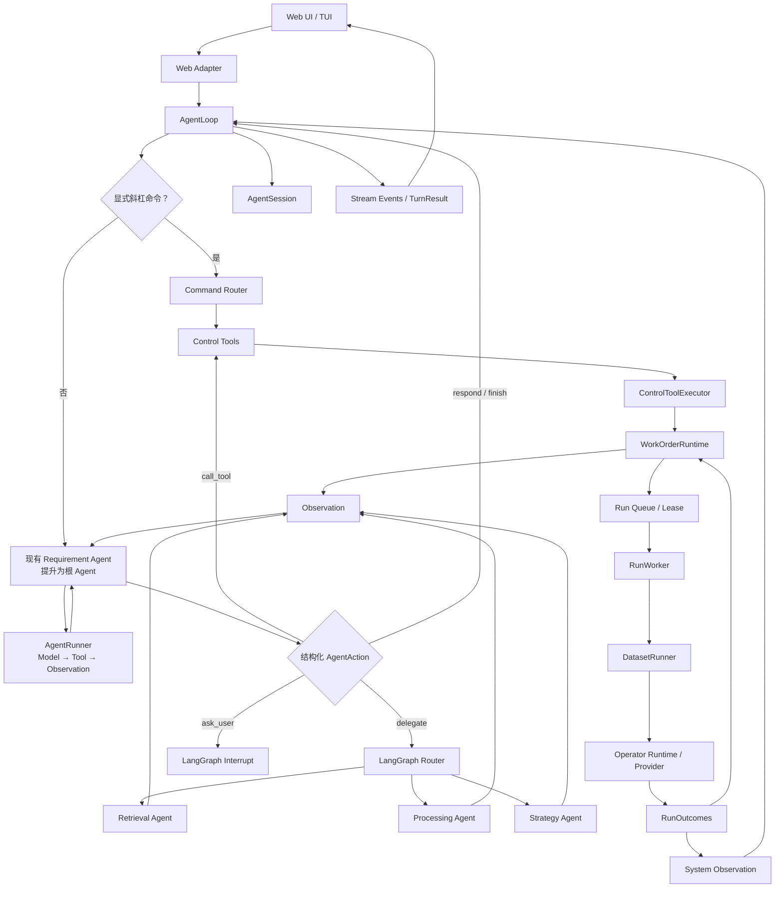

# DataAgent Requirement Agent 顶层化与对话执行架构重构方案

> 日期：2026-07-29
> 状态：阶段 0–4 已实施；阶段 5 及以后尚未实施
> 范围：对话入口、Agent 推理循环、LangGraph 编排、WorkOrder 运行时和数据 Run 执行之间的职责重构

## 1. 结论

DataAgent 应采用以下主路径：

```text
Web
→ AgentLoop
→ 现有 Requirement Agent（提升为根 Agent）
→ LangGraph 委派 Retrieval / Processing / Strategy Agent
→ Control Tool
→ WorkOrderRuntime
→ RunWorker
→ DatasetRunner
```

核心调整不是新增一个 Requirement Agent，也不是增加一个顶层 `workflow/`，而是：

1. 将现有 Requirement Agent 从“需求解析子 Agent”提升为唯一的用户侧根 Agent。
2. 新增通用 `AgentLoop`，管理消息、会话、流式输出、取消、续跑和唤醒。
3. 将现有 `AgentDecisionLoop` 演进为通用 `AgentRunner`，负责模型—工具—Observation 循环。
4. 继续使用 LangGraph 做 Agent 间委派、interrupt、checkpoint 和状态路由。
5. 将 `ConversationService` 降级为临时兼容 Adapter，最终删除它的自然语言决策职责。
6. 保留 WorkOrder、Pipeline、Run、Worker、DatasetRunner 和算子运行时；这些不是多余的 Agent 零件，而是 DataAgent 的领域执行能力。

最终必须只有一个模块有权根据“用户目标 + WorkOrder 状态 + Observation”决定下一步：Requirement Agent。

### 1.1 实施进度

截至 2026-07-29：

- 阶段 0 已完成：稳定复现双动作协议冲突并建立测试基线。
- 阶段 1 已完成：加入统一 Turn、AgentAction、TurnResult 和 WorkOrder Liveness 类型。
- 阶段 2 已完成：现有 Requirement Agent 已成为 LangGraph 根 Agent；原需求生成子图改为 `requirement_planning_agent`；原 Main Agent 仅保留 checkpoint 兼容 Adapter。
- 阶段 3 已完成：`AgentDecisionLoop` 已演进为支持同步/异步、流式事件、消息、取消和明确停止原因的 `AgentRunner`；旧名称仅作兼容 Adapter。
- 阶段 4 已完成：实现 `AgentLoop.handle_message()`、AgentSession Interface、内存与 ConversationStore Adapter、显式斜杠命令、自动 continuation、同 session 串行化、活动 Turn 取消和 system observation 入口。
- 阶段 5–7 未实施：Control Tool 统一、ConversationService/Web 切换和旧代码删除仍在后续范围。

---

## 2. 当前问题与根因

### 2.1 已复现的失败状态

当前 WorkOrder 已处于机器可以继续推进的状态：

```text
next_action = generate_pipeline_candidates
main_agent_action = run_processing_agent
compile_pipelines = in_progress
waiting = null
```

用户发送“继续”或“继续生成 Pipeline”后，系统没有执行 Processing Agent，而是返回：

```text
当前还没有已编译或已批准的 Pipeline。
```

### 2.2 完整数据流中的冲突

当前普通 Web 消息仍经过：

```text
Web
→ /api/conversations/{id}/messages/stream
→ ConversationService.send()
→ ConversationIntent / ConversationAction
→ conversation policy
→ AgentRuntime / Main Graph
```

与此同时，Main Graph 和 Main Agent 也在判断下一步动作。

因此当前存在两个决策协议：

| 决策位置 | 当前职责 |
|---|---|
| ConversationService | 将自然语言解释成查询、确认、继续、选择 Pipeline、提交 Run 等动作 |
| Main Agent / Main Graph | 根据 WorkOrder 状态决定 Requirement、Retrieval、Processing、Strategy 或执行动作 |

在失败案例中，Main Graph 认为应该继续，但 Conversation policy 不允许 `CONTINUE_EXECUTION`，最终将用户输入误处理成状态查询。

### 2.3 单一根因

根因不是缺少“继续”关键词，也不是 Processing Agent 不会生成 Pipeline，而是：

> ConversationService 和主 Agent 同时拥有下一步决策权，且两者维护的动作集合与状态转换规则不一致。

问题所属层次是控制与 Agent 编排层，不是：

- 需求解析；
- TaskSpec Schema；
- 算子检索；
- Pipeline 规划；
- Plan 校验；
- 数据执行；
- 结果评估。

### 2.4 为什么不能增加关键词修复

不能增加：

```python
if "继续" in message:
    run_processing_agent()
```

原因是：

1. 换一种表达后仍会失败。
2. 换一个 WorkOrder 状态后可能调用错误 Agent。
3. 用户不应该知道内部下一节点。
4. 无法解决两套决策协议继续分叉的问题。
5. 违反项目“不根据用户原句、关键词和具体任务类别增加 if/else”的原则。

通用修复必须让结构化状态和 Agent 规划决定下一步。

---

## 3. 目标架构



### 3.1 三种不同含义的“执行”

当前文件多，是因为系统中实际上有三种执行周期。它们不能合并成一个 `run()`。

| 执行周期 | 编排者 | 执行者 | 结果 |
|---|---|---|---|
| 一次对话 Turn | `AgentLoop` | Requirement Agent + `AgentRunner` | 回复、interrupt、调度或完成 |
| 一次 WorkOrder 推进 | Requirement Agent + LangGraph | 各子 Agent、Control Tools、`WorkOrderRuntime` | TaskSpec、候选 Pipeline、批准状态、Run 请求 |
| 一次数据 Run | `RunWorker` | `DatasetRunner` + Operator Runtime/Provider | 数据版本、产物、指标、失败 Observation |

所以：

- `AgentLoop` 编排一次对话何时开始、继续和结束。
- Requirement Agent 规划整个用户目标下一步做什么。
- LangGraph 执行 Agent 之间的结构化路由。
- `WorkOrderRuntime` 持久化并推进领域状态。
- `RunWorker` 调度后台数据任务。
- `DatasetRunner` 真正执行 Pipeline。

---

## 4. 一个任务到来的完整流程

下面使用不依赖具体实体或关键词的抽象任务说明全流程。

### 4.1 用户提出目标

```text
用户：请根据约束 C 处理数据集 D，并产出满足验收指标 M 的结果。
```

处理流程：

```text
Web Adapter
→ AgentLoop.handle_message()
→ 加载 AgentSession 和当前 WorkOrder
→ 普通自然语言原样交给 Requirement Agent
```

这里：

- Web Adapter 只转换 HTTP/SSE，不理解业务意图。
- AgentLoop 管理这次 Turn，但不替 Requirement Agent 做规划。
- ConversationService 不再判断这是“创建需求”还是“继续任务”。

### 4.2 Requirement Agent 建立需求

Requirement Agent 通过 AgentRunner：

1. 读取用户消息和已有上下文。
2. 生成或更新 Requirement Draft。
3. 将实现无关的目标、约束和验收条件整理成 TaskSpec。
4. 通过 Control Tool 保存草稿和 TaskSpec。
5. 如果存在必须由用户决定的内容，发出 LangGraph interrupt。

输出可能是：

```text
status = waiting_for_user
waiting = task_spec_confirmation
```

此时 AgentLoop 停止是正确的，因为存在显式等待状态。

### 4.3 用户确认 TaskSpec

用户可以点击按钮或明确回复确认。

两种入口最终都执行同一个领域动作：

```text
confirm_task_spec
→ ControlToolExecutor
→ WorkOrderRuntime
→ TaskSpec version 状态变更
→ Observation 返回 Requirement Agent
```

按钮不是另一套业务逻辑，只是同一 Interface 的另一个 Adapter。

### 4.4 Requirement Agent 规划下一步

确认后，Requirement Agent 读取 WorkOrder snapshot：

```text
TaskSpec = confirmed
operator candidates = insufficient
waiting = null
```

它输出结构化委派动作：

```text
kind = delegate
target = retrieval_agent
objective = 根据 TaskSpec 和能力描述检索候选算子
```

LangGraph 根据结构化动作路由到 Retrieval Agent。这里不是把 Agent 委派伪装成工具调用。

### 4.5 Retrieval Agent 检索能力

Retrieval Agent：

1. 根据 TaskSpec、Constraint Contract 和算子元数据检索。
2. 评估能力匹配和证据。
3. 返回候选算子及 Observation。

它不能使用“需求关键词 → 算子名称”的硬编码映射。

Observation 回到 Requirement Agent 后，Requirement Agent 再规划：

```text
候选能力充分
→ delegate processing_agent
```

### 4.6 Processing Agent 规划 Pipeline

Processing Agent：

1. 根据 TaskSpec 和候选能力生成 Pipeline candidates。
2. 绑定约束参数。
3. 调用 Plan 校验。
4. 保存候选 Pipeline artifact。
5. 返回成功、缺口或冲突 Observation。

如果失败，Requirement Agent 根据 Observation 决定：

- 重新检索；
- 调整规划；
- 请求必要的用户信息；
- 明确失败。

它不能为当前案例写固定 Pipeline 或静默增加默认值。

### 4.7 Strategy Agent 规划验证策略

当候选 Pipeline 可验证时，Requirement Agent 委派 Strategy Agent：

- 决定 preview、trial、采样或完整运行策略；
- 生成可审查的执行计划；
- 不直接执行数据处理。

如果策略要求人工批准，LangGraph 创建 interrupt。

### 4.8 提交数据 Run

批准后：

```text
Requirement Agent
→ submit_run Control Tool
→ WorkOrderRuntime 创建 Run 记录
→ Run queue / worker lease
```

到这里，Agent 负责的“规划”完成，后台执行开始。

### 4.9 RunWorker 和 DatasetRunner 执行

`RunWorker`：

1. 领取 Run。
2. 获得 lease，防止多个 worker 重复执行。
3. 调用 `DatasetRunner`。
4. 续租、记录进度、处理取消和超时。

`DatasetRunner`：

1. 读取已批准 Pipeline。
2. 解析每个 operator 的 runtime/provider。
3. 按依赖顺序执行节点。
4. 生成中间结果、产物、指标和 lineage。

Operator Runtime / Provider：

- 执行本地算子；
- 调用 DataJuicer 或其他 provider；
- 统一 provider 输入输出；
- 返回结构化执行结果。

### 4.10 结果回到 Agent

`RunOutcomes` 将 worker 的底层结果归一化为领域结果：

```text
Run succeeded
Run failed with retryable observation
Run failed with planning-relevant observation
Run cancelled
```

然后：

```text
RunOutcomes
→ WorkOrderRuntime 更新状态和数据版本
→ 产生 System Observation
→ 唤醒 AgentLoop
→ Requirement Agent 评估结果
```

Requirement Agent 可以：

- 判断验收指标已满足并完成任务；
- 根据 Observation 重新规划 Pipeline；
- 再次委派 Retrieval/Processing/Strategy Agent；
- 在确实需要用户决策时发出 interrupt。

因此整个闭环是：

```text
用户目标
→ 需求建模
→ 能力检索
→ Pipeline 规划
→ 策略与审批
→ 数据执行
→ 结果评估
→ 重新规划或完成
```

---

## 5. 核心模块职责

### 5.1 AgentLoop

建议只暴露一个主要 Interface：

```python
await agent_loop.handle_message(turn_input, event_sink) -> TurnResult
```

内部隐藏：

- AgentSession 加载和保存；
- 普通消息与斜杠命令分流；
- 流式事件；
- Turn 并发保护；
- cancellation；
- 模型和工具步数预算；
- interrupt/resume；
- system observation 唤醒；
- 可运行状态自动续跑；
- 最终停止原因。

`AgentLoop` 不理解 Pipeline 细节，也不决定该调用哪个业务 Agent。

### 5.2 Requirement Agent（根 Agent）

现有 Requirement Agent 提升后负责：

- 理解用户目标；
- 维护 Requirement Draft 和 TaskSpec；
- 读取 WorkOrder 事实；
- 决定下一步；
- 通过 LangGraph 委派子 Agent；
- 调用领域 Control Tool；
- 根据 Observation 重新规划；
- 决定回复、等待、失败或完成。

它成为唯一的 LLM 规划者。现有 Main Agent 不再作为第二个 LLM 决策中心。

### 5.3 AgentRunner

由现有 `dataagent/agents/runtime.py` 中的 `AgentDecisionLoop` 演进而来，负责单次推理循环：

```text
Model Decision
→ Tool Call / Structured Action
→ Observation
→ Model Decision
→ ...
```

需要补齐：

- async；
- message history；
- streaming；
- cancellation；
- system observation；
- checkpoint-friendly result；
- 明确的 stop reason；
- 工具错误反馈；
- 有界步数和 token 预算。

它不保存 WorkOrder，也不调度 Dataset Run。

### 5.4 LangGraph

LangGraph 负责：

- Requirement Agent 作为根节点；
- Retrieval、Processing、Strategy Agent 的条件路由；
- `Command(goto=...)` 或等价结构化委派；
- interrupt；
- checkpoint；
- Observation 回流；
- 可恢复状态转换。

Agent 委派使用 LangGraph，不做成 typed tool。

### 5.5 ControlToolExecutor

当前 `dataagent/tools/loop.py` 实际只是执行一次受治理工具调用，不是 Agent loop。

建议将其改名或合并为 `ControlToolExecutor`，负责：

- Schema 校验；
- 权限与安全约束；
- trace；
- 敏感字段脱敏；
- 幂等性；
- 将异常转换为结构化 Observation。

Control Tools 用于查询或改变领域状态，例如：

```text
get_work_order_snapshot
save_task_spec
confirm_task_spec
save_pipeline_candidate
approve_pipeline
submit_run
cancel_run
inspect_run
```

### 5.6 WorkOrderRuntime

这是当前 `dataagent/application/agent_runtime.py` 的更准确概念名称。

它负责：

- 创建和加载 WorkOrder；
- 驱动、恢复 LangGraph；
- 保存 checkpoint；
- 管理 TaskSpec/Pipeline/Run 的版本关联；
- 执行确定性的领域状态转换；
- 维护 interrupt；
- 提供当前 snapshot；
- 接收 Run outcome。

它不是自然语言 AgentRunner，也不应决定用户意图。

---

## 6. `application/` 目录到底做什么

`application/` 是用例协调层。它连接 Agent 决策、领域对象、持久化和后台执行，但不承担自然语言理解，也不实际处理数据。

### 6.1 `work_order_runtime.py`

来源：当前 `application/agent_runtime.py`。

职责：

- WorkOrder 生命周期；
- LangGraph start/resume；
- checkpoint；
- TaskSpec、Pipeline 和 Run 的关联；
- 领域版本推进；
- interrupt 恢复；
- 将 Control Tool 动作应用到领域状态。

为什么保留：

如果删掉它，上述持久化和恢复逻辑会散落到 Web、Agent、Tool 和 Worker 中。它是一个应当加深而不是删除的 Module。

### 6.2 `agent_sessions.py`

来源：现有 ConversationStore 中真正有价值的会话能力。

职责：

- 消息历史；
- 当前活动 WorkOrder；
- Turn 状态；
- 最后消费的 system observation；
- 客户端断线重连所需位置；
- session 与 owner 的关联。

它不做：

- 意图识别；
- 下一动作规划；
- Conversation policy；
- Pipeline 选择。

### 6.3 `run_worker.py`

职责：

- 从队列或数据库领取 Run；
- 获得和续约 worker lease；
- 调用 DatasetRunner；
- 处理取消、超时、重试和进程崩溃；
- 记录执行进度。

为什么不能并入 AgentLoop：

AgentLoop 生命周期通常是秒级对话 Turn，RunWorker 可能运行数分钟或更久。将它们合并会导致 Web 断线影响数据执行，也会使 Agent 进程承担 worker 并发职责。

### 6.4 `run_outcomes.py`

职责：

- 将 DatasetRunner/provider 的结果转成统一领域结果；
- 更新 Run 状态；
- 记录错误类别、指标、产物和 lineage；
- 判断结果是否可重试或需要重新规划；
- 生成给 Requirement Agent 的 System Observation。

为什么需要独立：

底层 provider 错误不能直接暴露给根 Agent。根 Agent需要的是稳定、结构化、可用于规划的 Observation。

### 6.5 之前目录中没有列出的现有模块

上次目录只是主链路示意，并不表示删除以下模块：

```text
application/
├── dataset_exports.py
├── dataset_versions.py
├── pipeline_artifacts.py
└── ports/
    └── repositories.py
```

这些模块继续负责数据版本、导出、Pipeline artifact 和持久化 Interface。

---

## 7. 完整的相关目标目录

下面列的是与本次重构相关的目标结构，不代表删除未展示的领域、provider、基础设施和验收模块。

```text
dataagent/
├── agents/
│   ├── loop.py                         # 新增：顶层 Turn 生命周期
│   ├── runner.py                       # 从 agents/runtime.py 演进
│   ├── events.py                       # Turn/stream/system observation 类型
│   ├── shared/
│   │   └── state.py
│   ├── requirement/
│   │   ├── agent.py                    # 现有 Requirement Agent 提升后的入口
│   │   ├── graph.py                    # 根 Agent 图
│   │   ├── actions.py                  # 结构化 respond/delegate/tool/wait/finish
│   │   ├── guards.py                   # 确定性安全与活性约束
│   │   ├── tools.py                    # 根 Agent 可见的 Control Tool 集
│   │   ├── planner.py
│   │   ├── clarification.py
│   │   └── nodes.py
│   ├── retrieval/
│   │   ├── graph.py
│   │   └── nodes.py
│   ├── processing/
│   │   ├── graph.py
│   │   ├── nodes.py
│   │   └── constraint_binding.py
│   └── strategy/
│       ├── graph.py
│       └── nodes.py
│
├── application/
│   ├── work_order_runtime.py            # 当前 agent_runtime.py 的目标名称
│   ├── agent_sessions.py                # ConversationStore 的有效会话能力
│   ├── run_worker.py
│   ├── run_outcomes.py
│   ├── dataset_exports.py
│   ├── dataset_versions.py
│   ├── pipeline_artifacts.py
│   └── ports/
│       └── repositories.py
│
├── graph/
│   ├── main_graph.py                    # 迁移期兼容入口，最终可收窄
│   ├── interrupts.py
│   ├── routing.py
│   └── state_migrations.py
│
├── tools/
│   ├── registry.py
│   ├── executor.py                      # 当前 tools/loop.py 的目标职责
│   ├── control.py
│   ├── inspection.py
│   ├── planning.py
│   ├── observations.py
│   ├── artifacts.py
│   └── spec.py
│
├── execution/
│   ├── dataset_runner.py
│   ├── pipeline_trial.py
│   └── preview.py
│
├── operators/
│   ├── runtime.py
│   ├── runtime_resolution.py
│   ├── validation.py
│   ├── registry.py
│   ├── planning.py
│   ├── evaluation.py
│   └── providers/
│       ├── registry.py
│       ├── protocol.py
│       ├── native.py
│       ├── proxy.py
│       ├── datajuicer.py
│       ├── datajuicer_executor.py
│       ├── datajuicer_worker.py
│       └── output_adapters.py
│
├── evaluation/
│   └── quality.py
│
├── domain/
│   ├── specs/
│   ├── plans/
│   ├── pipelines/
│   ├── runs/
│   ├── operators/
│   ├── evaluations/
│   └── experiences/
│
├── infrastructure/
│   └── database.py
│
└── worker_lease.py

apps/
├── api/
│   ├── main.py
│   └── runner.py
├── web/
├── tui/
└── worker/
    └── runner.py
```

这个结构没有减少实际数据执行能力。真正计划移除的是重复决策模块，而不是执行模块。

---

## 8. ConversationService 的迁移

### 8.1 第一阶段：兼容 Adapter

暂时保留原 endpoint：

```text
POST /api/conversations/{conversation_id}/messages/stream
```

内部改为：

```python
ConversationService.send(...)
    -> AgentLoop.handle_message(...)
```

ConversationService 只负责：

- 将旧请求转换为 `TurnInput`；
- 将 AgentLoop event 转换为旧 SSE 格式；
- 兼容旧 conversation id。

它不再：

- 调 LLM 判断 ConversationIntent；
- 维护 `allowed_conversation_actions`；
- 根据自然语言选择 Pipeline；
- 决定是否调用某个 Agent；
- 使用 `_apply()` 修改领域状态；
- 维护自己的 ReAct loop。

### 8.2 第二阶段：Web 切换

Web Adapter 直接调用 AgentLoop Interface。

显式斜杠命令可包括：

```text
/status
/cancel
/new
/help
```

普通自然语言直接交给 Requirement Agent。

不建议提供：

```text
/continue
/generate-pipeline
/run-processing-agent
```

因为这些是内部领域规划动作，不应要求用户理解。

### 8.3 第三阶段：删除旧决策层

确认所有入口切换后，删除：

- `conversation_actions.py`
- `conversation_policy.py`
- Conversation intent LLM
- Conversation ReAct loop
- Conversation `_apply()`

有价值的 ConversationStore 能力迁移到 `AgentSessionRepository`。

---

## 9. 统一活性约束

每次 Agent Turn 只能以以下状态之一结束：

```text
COMPLETED
WAITING_FOR_USER
SCHEDULED
FAILED_WITH_EXPLICIT_ERROR
CANCELLED
```

必须满足以下不变量：

```text
terminal = false
waiting = null
存在合法下一动作
→ 不得只返回状态说明后停止
```

Requirement Agent 必须继续推进，或者 AgentLoop 明确创建 continuation。

例如：

```text
next_action = generate_pipeline_candidates
waiting = null
```

应当：

```text
Requirement Agent
→ delegate processing_agent
```

而不是依赖用户再次说“继续”。

如果达到单轮预算：

```text
status = SCHEDULED
continuation_reason = turn_budget_exhausted
```

如果存在人工审批：

```text
status = WAITING_FOR_USER
waiting = task_spec_confirmation
```

这时不能因为用户说了含糊的“继续”而静默批准。

---

## 10. 建议的核心数据契约

### 10.1 TurnInput

```python
@dataclass
class TurnInput:
    session_id: str
    owner_id: str
    content: str
    source: Literal["user", "system"]
    metadata: dict[str, object]
```

### 10.2 AgentAction

```python
@dataclass
class AgentAction:
    kind: Literal[
        "respond",
        "delegate",
        "call_tool",
        "ask_user",
        "finish",
    ]
    target: str | None
    objective: str | None
    arguments: dict[str, object]
    reason: str
```

`target` 的合法值由 LangGraph 的 Agent registry 校验，不通过关键词匹配。

### 10.3 TurnResult

```python
@dataclass
class TurnResult:
    status: Literal[
        "completed",
        "waiting_for_user",
        "scheduled",
        "failed",
        "cancelled",
    ]
    reply: str | None
    work_order_id: str | None
    stop_reason: str
```

调用方只需要学习这一小组 Interface。模型调用、Graph 路由、checkpoint 和工具 trace 隐藏在内部，从而形成较深的 Module。

---

## 11. 文件级修改计划

### 11.1 新增

| 文件 | 职责 |
|---|---|
| `dataagent/agents/loop.py` | Agent Turn 生命周期、续跑、取消、事件 |
| `dataagent/agents/runner.py` | 通用 Model—Tool—Observation 循环 |
| `dataagent/agents/events.py` | Turn、stream、system observation 类型 |
| `dataagent/agents/requirement/actions.py` | 根 Agent 的结构化动作 |
| `dataagent/agents/requirement/guards.py` | 安全、审批、活性不变量 |
| `dataagent/agents/requirement/tools.py` | 根 Agent 可调用的领域工具集合 |
| `dataagent/application/agent_sessions.py` | 会话历史和活动 WorkOrder |
| `dataagent/graph/state_migrations.py` | 旧 checkpoint 到新状态的显式迁移 |
| `dataagent/tools/executor.py` | Control Tool 统一执行 |

### 11.2 修改

| 文件 | 修改 |
|---|---|
| `dataagent/agents/runtime.py` | 将可复用部分迁入 AgentRunner，暂留兼容导出 |
| `dataagent/agents/requirement/graph.py` | Requirement Agent 成为根图 |
| `dataagent/agents/requirement/nodes.py` | 接收用户消息、WorkOrder snapshot 和 Observation |
| `dataagent/agents/requirement/planner.py` | 输出通用结构化 AgentAction |
| `dataagent/agents/main/runtime.py` | 移除第二个 LLM 决策者，迁出可复用 guard |
| `dataagent/graph/main_graph.py` | 改为兼容入口或转发到 Requirement 根图 |
| `dataagent/application/agent_runtime.py` | 收窄为 WorkOrderRuntime，并暂留兼容导出 |
| `dataagent/application/conversation.py` | 降级为 AgentLoop Adapter |
| `dataagent/tools/loop.py` | 迁移 trace/脱敏逻辑到 executor |
| `apps/api/main.py` | 消息入口接入 AgentLoop |
| `apps/tui/api_client.py` | 使用统一 Turn/stream 协议 |
| Web 请求层 | 普通消息接入统一 AgentLoop endpoint |

### 11.3 最终删除

完成兼容期和测试后再删除：

| 文件或职责 | 原因 |
|---|---|
| `conversation_actions.py` | 与根 Agent 动作协议重复 |
| `conversation_policy.py` | 与 LangGraph guard/领域约束重复 |
| Conversation intent LLM | 与 Requirement Agent 决策重复 |
| Conversation ReAct loop | 与 AgentRunner 重复 |
| 旧 Main Agent LLM runtime | 与根 Requirement Agent 重复 |
| `tools/loop.py` 名称和壳层 | 它不是循环，只是单次工具执行 |

---

## 12. 分阶段实施

### 阶段 0：复现和锁定当前行为

1. 固化当前死局状态。
2. 证明 `CONTINUE_EXECUTION` 被 Conversation policy 拒绝。
3. 证明 Web 普通消息实际经过 ConversationService。
4. 记录现有完整测试基线。

此阶段不修改生产行为。

### 阶段 1：定义统一状态与活性规则

1. 引入 `TurnInput`、`AgentAction`、`TurnResult`。
2. 定义 terminal/waiting/runnable。
3. 定义单轮停止原因。
4. 增加 continuation budget。
5. 增加活性不变量测试。

### 阶段 2：提升现有 Requirement Agent

1. 接收用户消息和 WorkOrder snapshot。
2. 迁入 Main Agent 的有效规划职责。
3. 保留确定性 guard，删除第二个 LLM 决策中心。
4. 让 Requirement Agent 成为 LangGraph 根节点。
5. 使用结构化动作委派子 Agent。

### 阶段 3：形成 AgentRunner

1. 复用 `AgentDecisionLoop` 的 Plan—Tool—Observation 核心。
2. 增加 async、streaming、history 和 cancellation。
3. 增加 system observation。
4. 增加明确 stop reason 和预算。
5. 保持工具错误可观察，禁止静默兜底。

### 阶段 4：形成 AgentLoop

1. 实现 session。
2. 实现显式 slash command。
3. 普通消息直达 Requirement Agent。
4. 实现 interrupt/resume。
5. 实现自动续跑和后台唤醒。
6. 实现同一 WorkOrder 的并发保护。

### 阶段 5：统一 Control Tool

1. 将工具执行集中到 `ControlToolExecutor`。
2. 统一 Schema、权限、trace、脱敏和幂等性。
3. UI 按钮和 Agent 调用相同领域 Interface。

### 阶段 6：ConversationService 兼容切换

1. 旧 endpoint 转发至 AgentLoop。
2. Web/TUI 切换新协议。
3. 对比新旧结果。
4. 禁止旧逻辑在新逻辑失败时静默接管。

### 阶段 7：清理和状态迁移

1. 删除旧 Conversation 决策协议。
2. 删除旧 Main Agent LLM 决策层。
3. 完成文件重命名。
4. 增加 checkpoint state version。
5. 显式迁移旧的 `main_agent_action` 等字段。

---

## 13. 测试方案

### 13.1 当前失败案例

```text
TaskSpec 已确认
compile_pipelines = in_progress
waiting = null
next_action = generate_pipeline_candidates
用户发送普通自然语言，请求继续处理当前任务
```

修改前：

```text
返回“当前还没有已编译或已批准的 Pipeline”
```

修改后：

```text
Requirement Agent 委派 Processing Agent
生成候选 Pipeline 或返回可规划的失败 Observation
```

### 13.2 泛化案例一

替换任务中的全部实体、属性、类别和路径：

```text
TaskSpec 已确认
候选算子证据不足
waiting = null
```

预期：

```text
Requirement Agent 根据状态和能力描述委派 Retrieval Agent
```

### 13.3 泛化案例二

再次替换任务语义：

```text
Pipeline 已批准
尚未形成满足约束的执行策略
waiting = null
```

预期：

```text
Requirement Agent 委派 Strategy Agent
```

### 13.4 反例或边界案例

```text
waiting = task_spec_confirmation
用户只说“继续”
```

预期：

```text
不得静默批准
保持 WAITING_FOR_USER
要求明确确认或修改
```

### 13.5 自动化测试范围

至少包括：

- slash command 不进入 LLM；
- 普通自然语言不进入 ConversationIntent；
- AgentRunner 在工具失败后收到 Observation 并可重新规划；
- runnable 状态不能以普通说明文本结束；
- 达到预算后返回 `SCHEDULED`；
- worker outcome 能唤醒 AgentLoop；
- checkpoint 恢复后继续正确节点；
- terminal WorkOrder 不重复执行；
- Web SSE 事件顺序稳定；
- UI 按钮与自然语言使用相同 Control Tool；
- 同一 WorkOrder 的并发 Turn 不会重复推进；
- 当前已有相关测试保持通过；
- 完整测试套件通过。

---

## 14. 验收标准

重构完成后必须满足：

1. 用户侧只有 Requirement Agent 一个 LLM 决策者。
2. 普通 Web 自然语言不经过 ConversationIntent 分类。
3. 只有显式斜杠命令在进入 Agent 前被确定性识别。
4. Agent-to-Agent 委派全部通过 LangGraph。
5. Control Tool 不承担 Agent 委派。
6. 未完成、未等待且存在合法下一步的 WorkOrder 会自动推进。
7. 安全、权限、Schema 和人工审批继续由确定性规则强制执行。
8. Worker 结果能作为 Observation 触发评估或重新规划。
9. 替换任务实体、属性、类别和路径后无需修改编排代码。
10. Planner 能根据 TaskSpec、能力描述和运行反馈重新生成 Plan。
11. 不存在“需求关键词 → Agent/算子/Pipeline”的硬编码映射。
12. Web、TUI 和按钮不再拥有不同的业务状态机。

---

## 15. 为什么这样修改

### 15.1 消除双重决策

Requirement Agent 成为唯一规划者，ConversationService 不再与它竞争下一步控制权。

### 15.2 让系统根据状态继续，而不是依赖“继续”二字

活性由 WorkOrder 的结构化状态决定，因此任何自然语言表达都不会成为流程推进的必要条件。

### 15.3 保留 DataAgent 相比 nanobot 必需的能力

DataAgent 不只是聊天 Agent。它还必须处理：

- TaskSpec 和 Constraint Contract；
- Pipeline 候选与审批；
- 数据版本；
- 长时间 Run；
- worker lease；
- operator provider；
- 产物和 lineage；
- 质量评估；
- 执行失败后的重新规划。

因此可以学习 nanobot 的 AgentLoop/AgentRunner 主干，但不能删除领域运行时和数据执行层。

### 15.4 减少零件，不破坏职责

应合并或删除的是：

- 重复的自然语言意图分类；
- 重复的下一步动作协议；
- 第二个主 LLM 决策者；
- 名为 loop、实际只转发一次调用的浅 Module。

应保留的是：

- Agent 推理；
- LangGraph 路由；
- WorkOrder 持久化；
- Pipeline 和 Run 生命周期；
- 后台 worker；
- 实际数据执行；
- provider 和算子运行时。

### 15.5 提高可测试性和可维护性

外部调用者主要面对：

```python
AgentLoop.handle_message(...)
```

大量复杂实现隐藏在该 Interface 后：

- session；
- streaming；
- cancellation；
- continuation；
- AgentRunner；
- LangGraph；
- Control Tools；
- checkpoint。

这会提高调用方的 Leverage，并让对话推进问题集中在一个位置修复，获得更好的 Locality。

---

## 16. 风险与控制措施

| 风险 | 控制措施 |
|---|---|
| 根 Agent 上下文变大 | WorkOrder snapshot 只提供结构化事实和必要 Observation |
| Agent 自主推进绕过审批 | 审批作为确定性 interrupt/guard，不交给模型决定 |
| 单轮无限循环 | step、token、wall-time 三重预算 |
| 后台任务重复执行 | Run idempotency + worker lease |
| 旧 checkpoint 不兼容 | state version + 显式 migration |
| 新旧入口结果不一致 | 兼容期共用 AgentLoop，不维护两套实现 |
| 模型或工具失败被误认为完成 | 强制 stop reason，失败不得静默转为普通回复 |
| 文件重命名影响过大 | 先改变职责，保留兼容导出，最后再清理路径 |

---

## 17. 设计决策摘要

| 问题 | 决策 |
|---|---|
| 谁是主 Agent？ | 现有 Requirement Agent，提升为根 Agent |
| 谁接收 Web 普通消息？ | AgentLoop |
| 谁管理单次模型工具循环？ | AgentRunner |
| 谁规划下一步？ | Requirement Agent |
| 谁委派子 Agent？ | Requirement Agent 输出动作，LangGraph 执行路由 |
| 谁修改领域状态？ | Control Tools → WorkOrderRuntime |
| 谁编排长时间数据任务？ | RunWorker |
| 谁真正执行 Pipeline？ | DatasetRunner + Operator Runtime/Provider |
| ConversationService 是否保留？ | 迁移期仅作兼容 Adapter，最终删除决策职责 |
| 是否需要多个 Channel？ | Web-only 场景不需要，只保留 Web Adapter |
| 是否删除 execution 模块？ | 不删除；它是实际数据执行层 |
| 是否增加关键词规则？ | 不增加 |

---

## 18. 实施前确认点

按照项目开发原则，本文件只完成设计，不修改生产代码。

开始实施前需要确认以下设计决策：

1. 现有 Requirement Agent 正式成为唯一根 Agent。
2. 现有 Main Agent 不再保留独立 LLM 决策角色。
3. ConversationService 采用“先兼容转发、后删除决策职责”的迁移方式。
4. Web 普通消息进入 AgentLoop；只有显式斜杠命令预路由。
5. LangGraph 负责 Agent 委派，Control Tools 只操作领域状态。
6. WorkOrderRuntime、RunWorker、DatasetRunner 和 Operator Runtime 保持分层，不并入 AgentLoop。

确认后才进入阶段 0 的失败复现、测试基线和实施工作。
